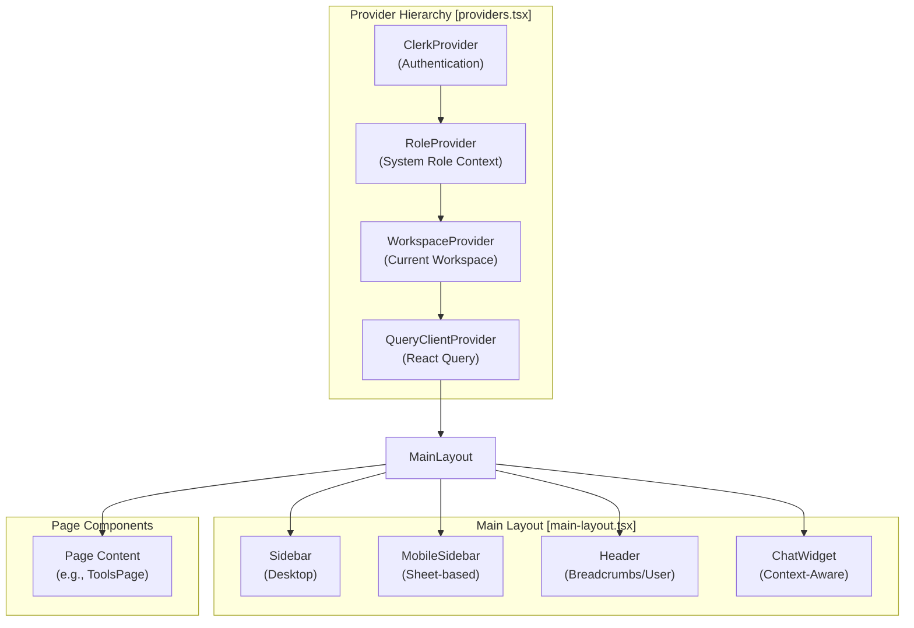
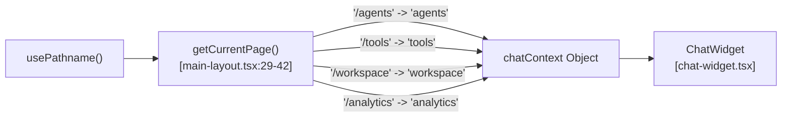
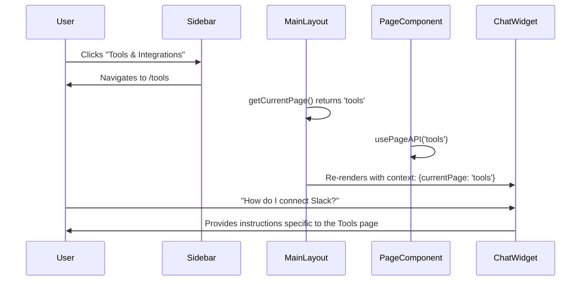

# Navigation & Layout

<details>
<summary>Relevant source files</summary>

The following files were used as context for generating this wiki page:

- [frontend/app/tools/page.tsx](frontend/app/tools/page.tsx)
- [frontend/components/layout/main-layout.tsx](frontend/components/layout/main-layout.tsx)
- [frontend/components/layout/mobile-sidebar.tsx](frontend/components/layout/mobile-sidebar.tsx)
- [frontend/components/layout/sidebar.tsx](frontend/components/layout/sidebar.tsx)
- [frontend/components/marketplace/marketplace-app-details-modal.tsx](frontend/components/marketplace/marketplace-app-details-modal.tsx)
- [frontend/components/tools/my-tools-dashboard.tsx](frontend/components/tools/my-tools-dashboard.tsx)
- [orchestrator/alembic/versions/board_blocked_sla.py](orchestrator/alembic/versions/board_blocked_sla.py)
- [orchestrator/core/services/analytics_engine.py](orchestrator/core/services/analytics_engine.py)
- [orchestrator/core/services/monitoring_service.py](orchestrator/core/services/monitoring_service.py)

</details>


## Purpose

This document covers the frontend navigation system and page layout architecture, including the collapsible sidebar, role-based menu filtering, page context tracking, and the integration of global UI components like tooltips and onboarding tours.

---

## Navigation Architecture Overview

The navigation system consists of a provider hierarchy that establishes authentication and workspace context, a root layout that wraps all pages, and a dynamic sidebar that filters navigation items based on user roles.

### Global Layout Hierarchy

The application uses a nested layout pattern where the root layout establishes global providers, and individual pages opt into the `MainLayout` wrapper [frontend/components/layout/main-layout.tsx:19-115](). The `MainLayout` manages the responsive state of the sidebar and injects the global `ChatWidget` (Pilot Helper) [frontend/components/layout/main-layout.tsx:110-113]().

**Layout Component Hierarchy Diagram**


**Sources:** [frontend/components/layout/main-layout.tsx:19-115](), [frontend/components/layout/sidebar.tsx:126-175](), [frontend/app/tools/page.tsx:7-15]()

---

## Sidebar & Navigation Logic

The `Sidebar` component implements a collapsible navigation menu with role-based filtering and premium icon support.

### Navigation Items Configuration
The sidebar defines navigation items in a central array `navigationItems` [frontend/components/layout/sidebar.tsx:33-124](), each mapped to specific routes and required roles.

| Item Name | Route | Icon Key | Required Role | Description |
|-----------|-------|----------|---------------|-------------|
| Chat | `/chat` | `nav_chat` | None | Your AI workspace |
| Workspace | `/workspace` | `nav_workspace` | None | Files, code & agent output |
| Activity | `/activity` | `nav_activity` | None | Your AI workforce at a glance |
| Agent Management | `/agents` | `nav_agents` | None | Manage AI agents and skills |
| Tools & Integrations | `/tools` | `nav_tools` | None | Development and utility tools |
| Community Marketplace| `/marketplace`| `nav_marketplace`| None | Discover agents, recipes & tools |
| Knowledge Bases | `/documents` | `nav_knowledge` | None | Documents, databases & code-graph |
| Team Management | `/team` | `nav_team` | `admin` | Manage workspace members |
| Context Engineering | `/context` | `nav_context` | `admin` | RAG system and field theory |
| Dashboard | `/dashboard` | `nav_dashboard` | None | System metrics & health |
| Analytics | `/analytics` | `nav_analytics` | None | Performance, costs & insights |

**Sources:** [frontend/components/layout/sidebar.tsx:33-124]()

### Role-Based Filtering
Filtering is performed using the `useSystemRole` hook [frontend/components/layout/sidebar.tsx:129](). Items with `requiredRole: 'admin'` are only rendered if `isAdmin` is true [frontend/components/layout/sidebar.tsx:133-136]().

```typescript
// sidebar.tsx:133-136
const filteredNavItems = navigationItems.filter(item => {
  if (!item.requiredRole) return true  // No role required, show to everyone
  return item.requiredRole === 'admin' && isAdmin
})
```

**Sources:** [frontend/components/layout/sidebar.tsx:126-137](), [frontend/components/layout/mobile-sidebar.tsx:128-131]()

---

## Page Context Tracking

The system tracks the current page context to inform the `ChatWidget` (Pilot Helper) and telemetry.

### Context Resolution
The `MainLayout` resolves the current page from the `pathname` using `getCurrentPage()` and passes it to the `ChatWidget` [frontend/components/layout/main-layout.tsx:29-49](). This allows the AI assistant to provide page-specific help based on the user's location in the app.

**Navigation Context Logic Diagram**


**Implementation:**
The `usePageAPI` hook is used at the page level (e.g., in `ToolsPage`) to synchronize the global application state and potentially trigger page-specific data fetching or analytics tracking [frontend/app/tools/page.tsx:8]().

**Sources:** [frontend/components/layout/main-layout.tsx:29-50](), [frontend/app/tools/page.tsx:1-15]()

---

## Component Layout Patterns

### Responsive Layout Handling
The `MainLayout` uses the `useIsTabletOrBelow` hook to switch between a persistent desktop `Sidebar` and a `Sheet`-based `MobileSidebar` [frontend/components/layout/main-layout.tsx:22]().

| Screen Size | Navigation Element | Behavior |
|-------------|--------------------|----------|
| Desktop | `Sidebar` | Collapsible via `onToggle`, fixed width (64px or 256px) [frontend/components/layout/sidebar.tsx:141-147](). Includes a backdrop scrim when expanded [frontend/components/layout/main-layout.tsx:67-73](). |
| Mobile/Tablet| `MobileSidebar` | Drawer (`Sheet`) triggered by `Header` menu click [frontend/components/layout/main-layout.tsx:78-87](). Uses `onNavigate` callback to close the drawer [frontend/components/layout/mobile-sidebar.tsx:164](). |

**Sources:** [frontend/components/layout/main-layout.tsx:61-94](), [frontend/components/layout/sidebar.tsx:141-147](), [frontend/components/layout/mobile-sidebar.tsx:123-132]()

### Navigation Animation
Navigation items in both `Sidebar` and `MobileSidebar` use `framer-motion` for staggered entrance animations [frontend/components/layout/sidebar.tsx:222-227](), [frontend/components/layout/mobile-sidebar.tsx:156-161]().

---

## Tooltips & Onboarding

### Tooltip System
In the collapsed sidebar state, the system automatically renders tooltips for navigation items using absolute positioning and `group-hover` transitions to ensure usability when labels are hidden [frontend/components/layout/sidebar.tsx:206-211]().

**Sources:** [frontend/components/layout/sidebar.tsx:206-211]()

### Page Tours
The `usePageTour` hook is integrated into the `MainLayout` to auto-launch page-specific interactive tours on the user's first visit [frontend/components/layout/main-layout.tsx:26](). Navigation items use `data-tour` attributes as anchors for the tour steps (e.g., `data-tour="sidebar"`) [frontend/components/layout/sidebar.tsx:140]().

**Sources:** [frontend/components/layout/main-layout.tsx:26](), [frontend/components/layout/sidebar.tsx:140]()

---

## Navigation Data Flow

**Page Transition Sequence Diagram**


**Sources:** [frontend/components/layout/main-layout.tsx:29-50](), [frontend/app/tools/page.tsx:1-15](), [frontend/components/layout/sidebar.tsx:67-73]()

---