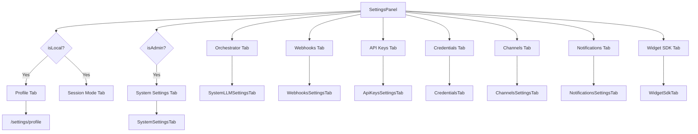

# Settings UI

<details>
<summary>Relevant source files</summary>

The following files were used as context for generating this wiki page:

- [docs/PRDS/136-LLM-CONTEXT-BUDGET-SETTINGS.md](docs/PRDS/136-LLM-CONTEXT-BUDGET-SETTINGS.md)
- [frontend/components/settings/LLMModelsSettingsTab.tsx](frontend/components/settings/LLMModelsSettingsTab.tsx)
- [frontend/components/settings/SettingsPanel.tsx](frontend/components/settings/SettingsPanel.tsx)
- [frontend/components/settings/SystemLLMSettingsTab.tsx](frontend/components/settings/SystemLLMSettingsTab.tsx)
- [frontend/components/settings/SystemSettingsTab.tsx](frontend/components/settings/SystemSettingsTab.tsx)
- [frontend/tsconfig.tsbuildinfo](frontend/tsconfig.tsbuildinfo)
- [orchestrator/alembic/versions/prd136_collapse_llm_tiers.py](orchestrator/alembic/versions/prd136_collapse_llm_tiers.py)
- [orchestrator/api/workspaces.py](orchestrator/api/workspaces.py)
- [orchestrator/core/seeds/platform-management-skill.md](orchestrator/core/seeds/platform-management-skill.md)
- [orchestrator/core/seeds/seed_auto_agent.py](orchestrator/core/seeds/seed_auto_agent.py)
- [orchestrator/tests/test_prd226_doctrine.py](orchestrator/tests/test_prd226_doctrine.py)
- [scripts/sync-auto-skill.py](scripts/sync-auto-skill.py)

</details>


This page details the implementation and functionality of the `SettingsPanel` component in the Automatos AI frontend. The `SettingsPanel` serves as a central hub for managing various system-wide and workspace-specific configurations, organized into several distinct tabs. It allows users to configure aspects such as LLM models, system behavior, credentials, communication channels, webhooks, notifications, API keys, session mode, and widget SDK settings.

The settings UI is designed to replace environment variables for many configurations, providing a database-backed management interface [frontend/components/settings/SystemSettingsTab.tsx:5-7](). It also distinguishes between settings available in the local edition versus the SaaS (hosted) edition, with certain features like Webhooks, Channels, and Widget SDK being exclusive to the hosted environment due to their reliance on public URLs and hosted infrastructure [frontend/components/settings/SettingsPanel.tsx:21-26]().

## SettingsPanel Overview

The `SettingsPanel` component is the main entry point for all settings management in the frontend. It uses a tabbed interface to categorize different settings, making them easier to navigate and manage. The tabs displayed can vary based on the deployment edition (local vs. SaaS) and the user's role (admin vs. regular user) [frontend/components/settings/SettingsPanel.tsx:38-55]().

### Key Components

*   `SettingsPanel`: The top-level component that orchestrates the display of various setting tabs [frontend/components/settings/SettingsPanel.tsx:38-146]().
*   `FilterTabs`: A shared UI component used for rendering the tab navigation [frontend/components/settings/SettingsPanel.tsx:67-70]().
*   `TabsContent`: Renders the content for the currently active tab [frontend/components/settings/SettingsPanel.tsx:73-142]().

### Tab Structure and Conditional Rendering

The `allTabs` array defines the complete set of available tabs, each with a `value`, `label`, and `icon` [frontend/components/settings/SettingsPanel.tsx:43-53](). The `tabs` array is then dynamically filtered based on `isLocal` (whether the application is running in local edition) and `isAdmin` (whether the current user has administrative privileges) [frontend/components/settings/SettingsPanel.tsx:54]().

For instance, the "Profile" and "Session mode" tabs are only visible in the local edition [frontend/components/settings/SettingsPanel.tsx:73-92, frontend/components/settings/SettingsPanel.tsx:104-108](), while the "System Settings" tab is exclusively for administrators [frontend/components/settings/SettingsPanel.tsx:96-100]().


**SettingsPanel Tab Flow**

Sources:
* [frontend/components/settings/SettingsPanel.tsx:21-26]()
* [frontend/components/settings/SettingsPanel.tsx:38-55]()
* [frontend/components/settings/SettingsPanel.tsx:38-146]()
* [frontend/components/settings/SettingsPanel.tsx:43-53]()
* [frontend/components/settings/SettingsPanel.tsx:54]()
* [frontend/components/settings/SettingsPanel.tsx:73-92]()
* [frontend/components/settings/SettingsPanel.tsx:96-100]()
* [frontend/components/settings/SettingsPanel.tsx:104-108]()

## System Settings Tab

The `SystemSettingsTab` component provides an interface for managing system-wide configuration settings. These settings are database-backed and replace traditional environment variables for many configurations [frontend/components/settings/SystemSettingsTab.tsx:5-7]().

### Functionality

*   **Loading Settings**: Fetches settings categorized by `getSettingsByCategory()` and statistics by `getSettingsStats()` [frontend/components/settings/SystemSettingsTab.tsx:56-60]().
*   **Saving Settings**: Allows bulk updates to settings within a specific category using `bulkUpdateSettings()` [frontend/components/settings/SystemSettingsTab.tsx:73-107]().
*   **Resetting to Defaults**: Provides an option to reset settings for a category or all settings to their default values using `resetSettingsToDefaults()` [frontend/components/settings/SystemSettingsTab.tsx:110-125]().
*   **Tabbed Navigation**: Contains sub-tabs for different system setting categories like General, LLM Models, System Logging, API Rate Limiting, Backend API Keys, Credential Audit, System Prompts, System Icons, and Voice Live Arming [frontend/components/settings/SystemSettingsTab.tsx:28-37, frontend/components/settings/SystemSettingsTab.tsx:193-196]().

### Data Flow

```mermaid
graph TD
    A[SystemSettingsTab] --> B{loadSettings}
    B --> C[getSettingsByCategory()]
    B --> D[getSettingsStats()]
    C --> E[settingsByCategory State]
    D --> F[stats State]
    A --> G{saveCategorySettings(category, updates)}
    G --> H[bulkUpdateSettings(bulkUpdates)]
    H --> B
    A --> I{resetToDefaults(category?)}
    I --> J[resetSettingsToDefaults(category?)]
    J --> B
```
**System Settings Data Flow**

Sources:
* [frontend/components/settings/SystemSettingsTab.tsx:5-7]()
* [frontend/components/settings/SystemSettingsTab.tsx:28-37]()
* [frontend/components/settings/SystemSettingsTab.tsx:56-60]()
* [frontend/components/settings/SystemSettingsTab.tsx:73-107]()
* [frontend/components/settings/SystemSettingsTab.tsx:110-125]()
* [frontend/components/settings/SystemSettingsTab.tsx:193-196]()

## LLM Models Settings Tab

The `LLMModelsSettingsTab` focuses on configuring the LLM models used across the platform. It categorizes LLM usage into three main tiers: Auto, System, and Embeddings [frontend/components/settings/LLMModelsSettingsTab.tsx:1-8]().

### LLM Tiers

This tab implements the PRD-136 specification, which consolidates 12 LLM configuration silos into three canonical tiers:

1.  **Auto (`orchestrator_llm`)**: The "brain" for chat, user-facing reasoning, and planning. Configured in the top-level Orchestrator tab [frontend/components/settings/LLMModelsSettingsTab.tsx:40-41]().
2.  **System (`system_llm`)**: Used for all internal background workers, including codegraph, coordination, complexity routing, memory, document processing, RAG synthesis, NL2SQL, knowledge graph extraction, and chatbot scaffolding [frontend/components/settings/LLMModelsSettingsTab.tsx:39-40]().
3.  **Embeddings (`embeddings`)**: Dedicated to vectorization for RAG, memory, and semantic search [frontend/components/settings/LLMModelsSettingsTab.tsx:41]().

Each tier shares a canonical schema for configuration parameters like `provider`, `model`, `temperature`, `max_tokens`, `top_p`, `frequency_penalty`, `presence_penalty`, `timeout_seconds`, and `max_retries` [docs/PRDS/136-LLM-CONTEXT-BUDGET-SETTINGS.md:86-97](). The Embeddings tier has additional specific parameters like `dimensions`, `batch_size`, `cache_dir`, and `max_seq_length` [docs/PRDS/136-LLM-CONTEXT-BUDGET-SETTINGS.md:99]().

### Implementation Details

The `LLMModelsSettingsTab` renders two `LLMTierCard` components, one for "System LLM" and one for "Embeddings" [frontend/components/settings/LLMModelsSettingsTab.tsx:45-65](). The "Auto" tier is configured in the `SystemLLMSettingsTab` (Orchestrator tab) [frontend/components/settings/LLMModelsSettingsTab.tsx:40-41]().

The backend migration `prd136_collapse_llm_tiers.py` handles the consolidation of legacy LLM settings into these three tiers, preserving user-customized values and deleting orphaned rows [orchestrator/alembic/versions/prd136_collapse_llm_tiers.py:1-27]().

Sources:
* [frontend/components/settings/LLMModelsSettingsTab.tsx:1-8]()
* [frontend/components/settings/LLMModelsSettingsTab.tsx:39-41]()
* [frontend/components/settings/LLMModelsSettingsTab.tsx:45-65]()
* [docs/PRDS/136-LLM-CONTEXT-BUDGET-SETTINGS.md:86-97]()
* [docs/PRDS/136-LLM-CONTEXT-BUDGET-SETTINGS.md:99]()
* [orchestrator/alembic/versions/prd136_collapse_llm_tiers.py:1-27]()

## System LLM (Orchestrator) Tab

The `SystemLLMSettingsTab` (labeled "Orchestrator" in the UI) is a comprehensive configuration panel for the core orchestrator's behavior, expanding beyond just LLM settings to include "Soul & Personality," "Heartbeat," and "HARNESS" settings [frontend/components/settings/SystemLLMSettingsTab.tsx:1-11](). This tab configures the "Auto" agent, which is the default chat agent for each workspace and the single source of truth for the workspace's orchestrator LLM config, persona, and configuration [orchestrator/core/seeds/seed_auto_agent.py:5-8]().

### Sections

1.  **LLM Configuration**: Configures the LLM used by the orchestrator, including provider, model, temperature, and other parameters [frontend/components/settings/SystemLLMSettingsTab.tsx:6-7, frontend/components/settings/SystemLLMSettingsTab.tsx:46-57](). It leverages `useWorkspaceModels` to fetch available models and `useProviderRegistry` for LLM provider options [frontend/components/settings/SystemLLMSettingsTab.tsx:148-155]().
2.  **Soul & Personality**: Defines the orchestrator's persona, including `personality_mode`, `custom_soul`, and `communication_style` [frontend/components/settings/SystemLLMSettingsTab.tsx:8-9, frontend/components/settings/SystemLLMSettingsTab.tsx:60-62]().
    *   `PERSONALITY_PRESETS`: Predefined personality modes like "Friendly," "Professional," "Technical," and "Custom" [frontend/components/settings/SystemLLMSettingsTab.tsx:84-89]().
    *   `COMMUNICATION_STYLES`: Options like "Concise," "Balanced," and "Detailed" [frontend/components/settings/SystemLLMSettingsTab.tsx:91-95]().
    *   The persona includes the "Manager's Doctrine," a compact set of principles for agent management, which is composed with the base personality voice [orchestrator/core/seeds/seed_auto_agent.py:63-80, orchestrator/core/seeds/seed_auto_agent.py:83-96](). This doctrine is tested to ensure it remains consistent across different parts of the codebase [orchestrator/tests/test_prd226_doctrine.py:106-125]().
3.  **Heartbeat**: Configures the orchestrator's proactive monitoring, including `enabled` status, `interval_minutes`, `active_hours`, `timezone`, `checklist`, and `notification_channel` [frontend/components/settings/SystemLLMSettingsTab.tsx:9-10, frontend/components/settings/SystemLLMSettingsTab.tsx:67-76]().
    *   `PROACTIVE_LEVELS`: Defines how proactive the heartbeat is, from "Silent" to "Fully Autonomous" [frontend/components/settings/SystemLLMSettingsTab.tsx:97-102]().
4.  **HARNESS — Self-Optimizing Organization Loop**: Configures the HARNESS system, including `enabled` status, `schedule`, and `mode` [frontend/components/settings/SystemLLMSettingsTab.tsx:10-11, frontend/components/settings/SystemLLMSettingsTab.tsx:77-80]().

### Orchestrator Configuration Data Flow

The orchestrator's configuration (`orchConfig`) is loaded from `workspace.settings.orchestrator` and the "Auto" agent's settings. Changes are saved back to these locations [frontend/components/settings/SystemLLMSettingsTab.tsx:131-133](). The `_PERSONALITY_BASE_VOICES` are defined in `seed_auto_agent.py` to avoid import cycles and ensure a single source of truth for personality presets [orchestrator/core/seeds/seed_auto_agent.py:117-128]().

```mermaid
graph TD
    A[SystemLLMSettingsTab (Orchestrator)] --> B[LLM Configuration]
    A --> C[Soul & Personality]
    A --> D[Heartbeat]
    A --> E[HARNESS]

    B --> F[useWorkspaceModels]
    B --> G[useProviderRegistry]
    C --> H[PERSONALITY_PRESETS]
    C --> I[COMMUNICATION_STYLES]
    C --> J[compose_persona_with_doctrine]
    D --> K[PROACTIVE_LEVELS]

    subgraph Backend
        J --> L[seed_auto_agent.py]
        L --> M[Auto Agent (DB)]
        M --> N[workspace.settings.orchestrator]
    end

    A -- Loads --> N
    A -- Saves --> N
```
**Orchestrator Settings Data Flow**

Sources:
* [frontend/components/settings/SystemLLMSettingsTab.tsx:1-11]()
* [frontend/components/settings/SystemLLMSettingsTab.tsx:6-7]()
* [frontend/components/settings/SystemLLMSettingsTab.tsx:8-9]()
* [frontend/components/settings/SystemLLMSettingsTab.tsx:9-10]()
* [frontend/components/settings/SystemLLMSettingsTab.tsx:10-11]()
* [frontend/components/settings/SystemLLMSettingsTab.tsx:46-57]()
* [frontend/components/settings/SystemLLMSettingsTab.tsx:60-62]()
* [frontend/components/settings/SystemLLMSettingsTab.tsx:67-76]()
* [frontend/components/settings/SystemLLMSettingsTab.tsx:77-80]()
* [frontend/components/settings/SystemLLMSettingsTab.tsx:84-89]()
* [frontend/components/settings/SystemLLMSettingsTab.tsx:91-95]()
* [frontend/components/settings/SystemLLMSettingsTab.tsx:97-102]()
* [frontend/components/settings/SystemLLMSettingsTab.tsx:131-133]()
* [frontend/components/settings/SystemLLMSettingsTab.tsx:148-155]()
* [orchestrator/core/seeds/seed_auto_agent.py:5-8]()
* [orchestrator/core/seeds/seed_auto_agent.py:63-80]()
* [orchestrator/core/seeds/seed_auto_agent.py:83-96]()
* [orchestrator/core/seeds/seed_auto_agent.py:117-128]()
* [orchestrator/tests/test_prd226_doctrine.py:106-125]()

## Credentials Tab

The `CredentialsTab` (implemented by `CredentialsTab` component) provides an interface for managing various credentials required by the platform. This includes API keys for external services, database connection strings, and other sensitive information.

### Implementation Details

The `CredentialsTab` component is responsible for displaying, adding, editing, and deleting credentials. It interacts with backend APIs to securely store and retrieve these sensitive values. The system supports a 3-tier API key resolution mechanism: BYOK (Bring Your Own Key), credential store, and environment variables [5.6. LLM Provider Management]().

Sources:
* [frontend/components/settings/SettingsPanel.tsx:49]()

## Channels Tab

The `ChannelsSettingsTab` component allows users to configure and manage various communication channels through which the Automatos AI platform can interact. This includes integrations with platforms like Telegram, Slack, Discord, WhatsApp, and Google Chat.

### Functionality

*   **Channel Management**: Users can add, edit, and remove channel connections.
*   **Configuration**: Each channel requires specific configuration details (e.g., bot tokens, default chat IDs, trigger modes).
*   **Trust Mode**: For legacy bots, `_TRIGGER_MODE_INTEGRATION_KEYS` define integration keys whose values are trust trigger modes, validated upon saving [orchestrator/api/workspaces.py:53-54](). These modes (`telegram_trigger_mode`, `slack_trigger_mode`) allow operators to opt-out to `allow_all` or `communication_only` for ingress trust [orchestrator/api/workspaces.py:46-50]().

### Implementation Details

The `ChannelsSettingsTab` interacts with the backend's channel management APIs. The `integrations` field within `workspace.settings` stores channel-specific configurations. Sensitive tokens are masked when retrieved via the `GET /api/workspaces/current` endpoint for security [orchestrator/api/workspaces.py:86-94]().

Sources:
* [frontend/components/settings/SettingsPanel.tsx:50]()
* [orchestrator/api/workspaces.py:46-50]()
* [orchestrator/api/workspaces.py:53-54]()
* [orchestrator/api/workspaces.py:86-94]()

## Webhooks Tab

The `WebhooksSettingsTab` component allows users to configure webhooks for their workspace. Webhooks enable external systems to receive real-time notifications or trigger actions within the Automatos AI platform.

### Functionality

*   **Webhook URL Display**: Displays the unique webhook URL for the workspace. This URL is constructed using the `BACKEND_URL` and the workspace's `webhook_key` [orchestrator/api/workspaces.py:82-83]().
*   **Webhook Key Management**: The `webhook_key` is automatically generated if missing for older workspaces [orchestrator/api/workspaces.py:77-79]().
*   **Integration Settings**: The `_ALLOWED_INTEGRATION_KEYS` set defines which keys are permitted within `workspace.settings.integrations`, including various channel-related tokens and trigger modes [orchestrator/api/workspaces.py:38-51]().

### Implementation Details

The `WebhooksSettingsTab` interacts with the `/api/workspaces/current` endpoint to retrieve and potentially update webhook-related settings. The `webhook_key` is a crucial identifier for secure webhook communication [orchestrator/api/workspaces.py:82-83]().

Sources:
* [frontend/components/settings/SettingsPanel.tsx:48]()
* [orchestrator/api/workspaces.py:38-51]()
* [orchestrator/api/workspaces.py:77-79]()
* [orchestrator/api/workspaces.py:82-83]()

## Notifications Tab

The `NotificationsSettingsTab` component allows users to manage their notification preferences. This includes configuring how and where they receive alerts and updates from the Automatos AI platform.

### Functionality

*   **Preference Management**: Users can set preferences for different types of notifications (e.g., in-app, email, external channels).
*   **Channel Selection**: Integration with configured communication channels for notification delivery.

### Implementation Details

The `NotificationsSettingsTab` interacts with the backend's notification API endpoints to fetch and update user-specific notification preferences.

Sources:
* [frontend/components/settings/SettingsPanel.tsx:51]()

## API Keys Tab

The `ApiKeysSettingsTab` component provides an interface for managing API keys. This includes both API keys generated by the platform for external access and "Bring Your Own Key" (BYOK) options for integrating with third-party services.

### Functionality

*   **Platform API Keys**: Management of API keys used to authenticate external applications or services interacting with the Automatos AI platform.
*   **BYOK Management**: Configuration of API keys for external LLM providers or other services, allowing users to use their own accounts.

### Implementation Details

The `ApiKeysSettingsTab` interacts with backend API key management services. It likely distinguishes between different types of API keys and handles their secure storage and retrieval.

Sources:
* [frontend/components/settings/SettingsPanel.tsx:49]()

## Session Mode Tab

The `SessionModeTab` is a local-edition-only feature that provides status and pairing information for the CLI host lane [frontend/components/settings/SettingsPanel.tsx:36, frontend/components/settings/SettingsPanel.tsx:104-108]().

### Functionality

*   **Status Display**: Shows the current status of the CLI host service.
*   **Pairing Information**: Guides users through the process of pairing their local CLI with the Automatos AI platform.

### Implementation Details

This tab is specifically designed for local deployments where users might interact with the platform via a command-line interface. It provides necessary information for establishing and maintaining that connection.

Sources:
* [frontend/components/settings/SettingsPanel.tsx:36]()
* [frontend/components/settings/SettingsPanel.tsx:104-108]()

## Widget SDK Tab

The `WidgetSdkTab` component provides tools and information for embedding Automatos AI widgets into external websites or applications.

### Functionality

*   **Embedding Instructions**: Provides code snippets and guidelines for integrating the widget SDK.
*   **Configuration**: Allows customization of widget behavior, appearance, and data sources.
*   **API Key Management**: Potentially manages API keys specifically for widget authentication and usage tracking.

### Implementation Details

The `WidgetSdkTab` interacts with the backend's widget API (`api/widgets` router) which handles chat, authentication, session management, configuration resolution, document access, and data schemas. It also enforces CORS and rate limiting for widget interactions [28.1. Widget API & Session Model]().

Sources:
* [frontend/components/settings/SettingsPanel.tsx:52]()

## Icons

The `SystemIconsSettingsTab` (accessed via the System Settings tab) allows for the management of system icons. This likely involves uploading, selecting, or configuring icons used throughout the application UI.

### Implementation Details

This tab would interact with backend services responsible for storing and serving icon assets, potentially allowing for custom branding or visual adjustments.

Sources:
* [frontend/components/settings/SystemSettingsTab.tsx:35]()

---