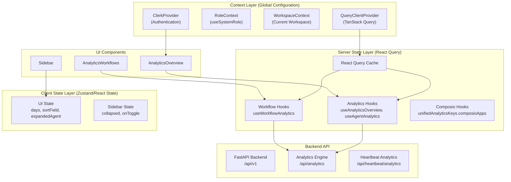
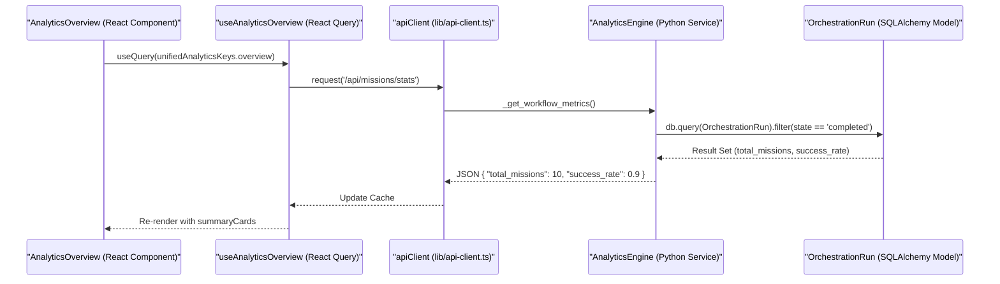

# State Management

<details>
<summary>Relevant source files</summary>

The following files were used as context for generating this wiki page:

- [docs/PRDS/52-UNIFIED-ANALYTICS.md](docs/PRDS/52-UNIFIED-ANALYTICS.md)
- [frontend/app/analytics/page.tsx](frontend/app/analytics/page.tsx)
- [frontend/app/tools/page.tsx](frontend/app/tools/page.tsx)
- [frontend/components/analytics/analytics-admin.tsx](frontend/components/analytics/analytics-admin.tsx)
- [frontend/components/analytics/analytics-agents.tsx](frontend/components/analytics/analytics-agents.tsx)
- [frontend/components/analytics/analytics-documents.tsx](frontend/components/analytics/analytics-documents.tsx)
- [frontend/components/analytics/analytics-memory.tsx](frontend/components/analytics/analytics-memory.tsx)
- [frontend/components/analytics/analytics-overview.tsx](frontend/components/analytics/analytics-overview.tsx)
- [frontend/components/analytics/analytics-plan-usage.tsx](frontend/components/analytics/analytics-plan-usage.tsx)
- [frontend/components/analytics/analytics-recommendations.tsx](frontend/components/analytics/analytics-recommendations.tsx)
- [frontend/components/analytics/analytics-workflows.tsx](frontend/components/analytics/analytics-workflows.tsx)
- [frontend/components/layout/main-layout.tsx](frontend/components/layout/main-layout.tsx)
- [frontend/components/layout/mobile-sidebar.tsx](frontend/components/layout/mobile-sidebar.tsx)
- [frontend/components/layout/sidebar.tsx](frontend/components/layout/sidebar.tsx)
- [frontend/components/marketplace/marketplace-app-details-modal.tsx](frontend/components/marketplace/marketplace-app-details-modal.tsx)
- [frontend/components/tools/my-tools-dashboard.tsx](frontend/components/tools/my-tools-dashboard.tsx)
- [frontend/hooks/use-unified-analytics.ts](frontend/hooks/use-unified-analytics.ts)
- [frontend/tsconfig.tsbuildinfo](frontend/tsconfig.tsbuildinfo)
- [orchestrator/alembic/versions/board_blocked_sla.py](orchestrator/alembic/versions/board_blocked_sla.py)
- [orchestrator/core/services/analytics_engine.py](orchestrator/core/services/analytics_engine.py)
- [orchestrator/core/services/monitoring_service.py](orchestrator/core/services/monitoring_service.py)

</details>


## Purpose and Scope

This document describes the frontend state management architecture in Automatos AI, covering the hybrid approach using **React Query** for server state, **Zustand** for client state, and **React Context** for global configuration. The architecture is designed for multi-tenancy, ensuring data isolation through workspace-scoped cache keys (`wsScope`) and centralized API request handling via a singleton `apiClient`.

**Sources**: [frontend/hooks/use-unified-analytics.ts:1-15](), [frontend/hooks/use-unified-analytics.ts:12-14]()

---

## State Management Architecture

The frontend employs a three-layer state management strategy to handle different types of application state:

### Architecture Diagram: State Management Layers



**Sources**: [frontend/hooks/use-unified-analytics.ts:7-43](), [frontend/components/analytics/analytics-overview.tsx:32-37](), [frontend/components/layout/sidebar.tsx:126-136]()

---

## Server State Management (React Query)

React Query (`@tanstack/react-query`) manages all server-side data fetching, caching, and synchronization.

### Workspace-Scoped Caching (wsScope)

To ensure strict multi-tenancy, all query keys are scoped by a `wsScope()` function. This prevents data from one workspace (e.g., Workspace A) from bleeding into another (e.g., Workspace B) when an admin switches context.

```typescript
function wsScope() {
  return getAdminWorkspaceOverride() || 'own'
}

export const unifiedAnalyticsKeys = {
  overview: (days: number) => ['unified-analytics', wsScope(), 'overview', days] as const,
  agents: (days: number) => ['unified-analytics', wsScope(), 'agents', days] as const,
  workflows: (days: number) => ['unified-analytics', wsScope(), 'workflows', days] as const,
}
```

**Sources**: [frontend/hooks/use-unified-analytics.ts:12-21]()

### Query Patterns and Implementation

The application uses custom hooks that wrap `useQuery`. A key pattern is the use of a `safeRequest` helper within `queryFn` to prevent a single failing API endpoint from breaking an entire dashboard view.

| Hook | Primary Data Fetching Logic | Data Source |
|------|-----------------------------|-------------|
| `useAnalyticsOverview` | `Promise.all` across `getAgents`, `llm/summary`, and `missions/stats` | [frontend/hooks/use-unified-analytics.ts:46-66]() |
| `useAgentAnalytics` | Merges `getAgents()` with `/api/v1/memory/stats/agents` | [frontend/hooks/use-unified-analytics.ts:120-134]() |
| `useWorkflowAnalytics` | Aggregates `getWorkflowStatsDashboard` and recipe stats | [frontend/hooks/use-unified-analytics.ts:21-23]() |
| `useAdminDashboard` | Fetches platform-wide metrics for admins | [frontend/hooks/use-unified-analytics.ts:42-43]() |

**Sources**: [frontend/hooks/use-unified-analytics.ts:46-134]()

---

## Client State Management

### Local Component State
For transient UI states such as the active sort field in the analytics tables or the expanded state of an agent row, the application uses standard React `useState`.

**Sources**: [frontend/components/analytics/analytics-agents.tsx:163-167](), [frontend/components/analytics/analytics-workflows.tsx:38-40]()

### Sorting and Filtering Logic
Sorting of complex tables (Agents, Workflows) is handled client-side using `useMemo` to ensure performance. This avoids unnecessary network requests when the user re-orders existing data.

```typescript
const sortedWorkflows = useMemo(() => {
  if (!data?.workflows) return []
  return [...data.workflows].sort((a: any, b: any) => {
    const aVal = a[sortField] ?? 0
    const bVal = b[sortField] ?? 0
    // ... logic for durations and strings ...
    return sortDir === 'asc' ? (aVal as number) - (bVal as number) : (bVal as number) - (aVal as number)
  })
}, [data?.workflows, sortField, sortDir])
```

**Sources**: [frontend/components/analytics/analytics-workflows.tsx:78-93](), [frontend/components/analytics/analytics-agents.tsx:162-170]()

---

## Data Flow: Analytics Retrieval

The following diagram bridges the Natural Language space (User Request) to the Code Entity Space (API and Database).



**Sources**: [orchestrator/core/services/analytics_engine.py:145-174](), [frontend/hooks/use-unified-analytics.ts:59-66](), [frontend/components/analytics/analytics-overview.tsx:63-101]()

---

## Performance and Optimization

### Parallel Request Aggregation
In the `useAnalyticsOverview` hook, multiple backend calls are executed in parallel using `Promise.all`. This significantly reduces the "Time to Interactive" for the dashboard by fetching agent, LLM, workflow, and document stats concurrently.

**Sources**: [frontend/hooks/use-unified-analytics.ts:59-66]()

### Table: Key State Symbols

| Symbol | Location | Role |
|--------|----------|------|
| `unifiedAnalyticsKeys` | [frontend/hooks/use-unified-analytics.ts:18]() | Key factory for React Query cache isolation |
| `wsScope` | [frontend/hooks/use-unified-analytics.ts:12]() | Injects workspace context into every cache key |
| `apiClient` | [frontend/hooks/use-unified-analytics.ts:8]() | Singleton handling JWT injection and workspace headers |
| `AnalyticsEngine` | [orchestrator/core/services/analytics_engine.py:25]() | Backend service calculating real-time dashboard metrics |
| `useSystemRole` | [frontend/components/layout/sidebar.tsx:26]() | Context hook for RBAC-based UI state (isAdmin) |

**Sources**: [frontend/hooks/use-unified-analytics.ts:8-18](), [orchestrator/core/services/analytics_engine.py:25-47](), [frontend/components/layout/sidebar.tsx:129-136]()

---