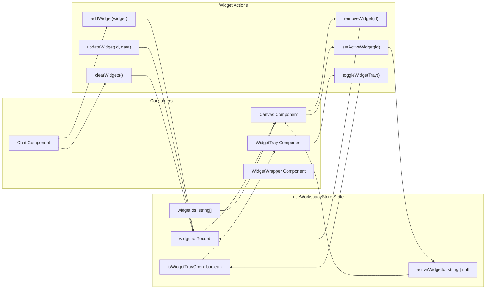
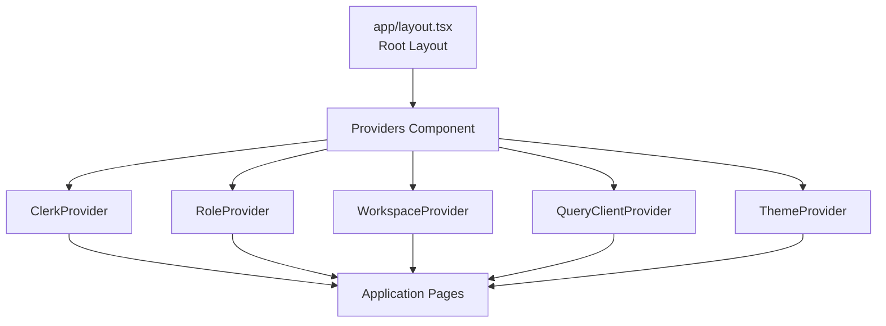
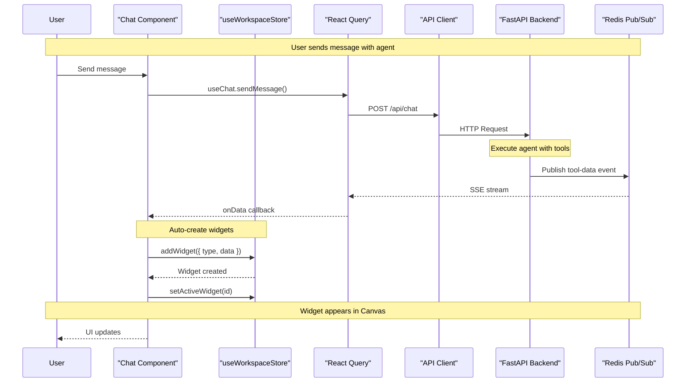
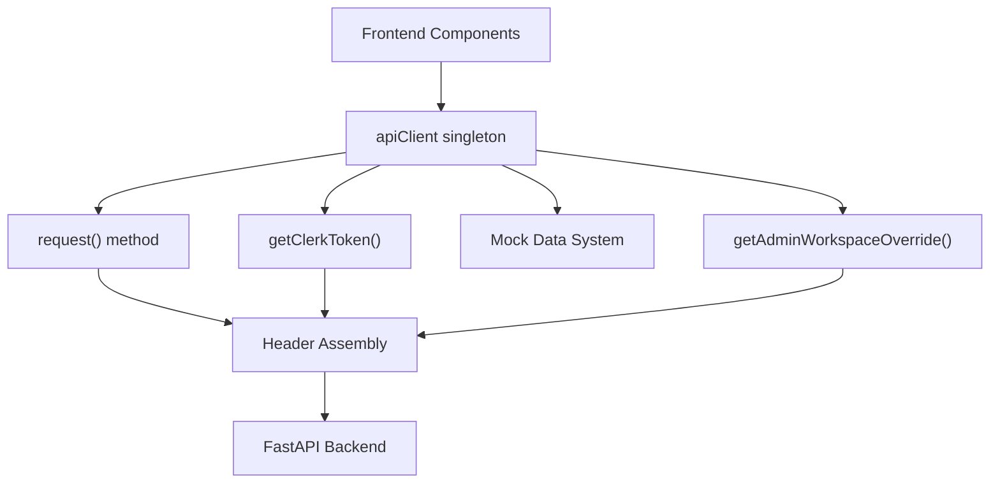

# State Management

<details>
<summary>Relevant source files</summary>

The following files were used as context for generating this wiki page:

- [frontend/components/chatbot/chat-widget.tsx](frontend/components/chatbot/chat-widget.tsx)
- [frontend/components/chatbot/chat.tsx](frontend/components/chatbot/chat.tsx)
- [frontend/components/chatbot/multimodal-input.tsx](frontend/components/chatbot/multimodal-input.tsx)
- [frontend/public/brand/jira-logo.svg](frontend/public/brand/jira-logo.svg)
- [orchestrator/modules/documents/generation_service.py](orchestrator/modules/documents/generation_service.py)
- [orchestrator/modules/tools/discovery/platform_actions.py](orchestrator/modules/tools/discovery/platform_actions.py)
- [orchestrator/modules/tools/discovery/platform_executor.py](orchestrator/modules/tools/discovery/platform_executor.py)

</details>


## Purpose and Scope

This document describes the frontend state management architecture in Automatos AI, covering the hybrid approach using React Query for server state, Zustand for client state, and React Context for global configuration. For backend API structure, see [API Router Organization](#10.2). For real-time updates via WebSocket/SSE, see [Real-Time Updates](#10.5).

**Sources**: [frontend/package.json:43,70,138]()

---

## State Management Architecture

The frontend employs a three-layer state management strategy to handle different types of application state:

### Architecture Diagram: State Management Layers

```mermaid
graph TB
    subgraph "Context Layer (Global Configuration)"
        ClerkProvider["ClerkProvider<br/>(Authentication)"]
        RoleProvider["RoleProvider<br/>(System Role)"]
        WorkspaceProvider["WorkspaceProvider<br/>(Current Workspace)"]
        QueryClientProvider["QueryClientProvider<br/>(TanStack Query)"]
        ThemeProvider["ThemeProvider<br/>(Dark/Light Mode)"]
    end
    
    subgraph "Server State Layer (React Query)"
        QueryCache["React Query Cache"]
        AgentQueries["Agent Queries<br/>useAgents, useAgent"]
        RecipeQueries["Recipe Queries<br/>useRecipes, useRecipe"]
        MarketQueries["Marketplace Queries<br/>useMarketplace"]
        ChatQueries["Chat Queries<br/>useChat, useChatHistory"]
        Mutations["Mutations<br/>create/update/delete"]
    end
    
    subgraph "Client State Layer (Zustand)"
        WorkspaceStore["useWorkspaceStore"]
        WidgetState["Widget State<br/>widgets, widgetIds, activeWidgetId"]
        CanvasState["Canvas State<br/>isWidgetTrayOpen"]
        WidgetMethods["Widget Methods<br/>addWidget, removeWidget, setActiveWidget"]
    end
    
    subgraph "Backend API"
        FastAPI["FastAPI Backend<br/>:8000"]
        PostgreSQL["PostgreSQL Database"]
        Redis["Redis Cache/PubSub"]
    end
    
    subgraph "UI Components"
        Chat["Chat Component"]
        Canvas["Canvas Component"]
        AgentMgmt["Agent Management"]
        Marketplace["Marketplace"]
    end
    
    ClerkProvider --> UI Components
    WorkspaceProvider --> UI Components
    QueryClientProvider --> QueryCache
    QueryCache --> AgentQueries
    QueryCache --> RecipeQueries
    QueryCache --> MarketQueries
    QueryCache --> ChatQueries
    
    AgentQueries --> FastAPI
    RecipeQueries --> FastAPI
    MarketQueries --> FastAPI
    ChatQueries --> FastAPI
    Mutations --> FastAPI
    
    FastAPI --> PostgreSQL
    FastAPI --> Redis
    
    Chat --> WorkspaceStore
    Canvas --> WorkspaceStore
    WorkspaceStore --> WidgetState
    WorkspaceStore --> CanvasState
    
    Chat --> ChatQueries
    AgentMgmt --> AgentQueries
    Marketplace --> MarketQueries
    
    WidgetMethods --> WidgetState
```

**Sources**: [frontend/components/chatbot/chat.tsx:1-100](), [frontend/package.json:43,70,138]()

---

## Server State Management (React Query)

React Query (`@tanstack/react-query`) manages all server-side data fetching, caching, and synchronization. The query client is configured at the application root via `QueryClientProvider`.

### Query Client Configuration

The query client is provided at the top level of the application in the provider hierarchy:

```
Providers Component
  └─ QueryClientProvider
      └─ Query Cache (in-memory)
```

**Key characteristics**:
- Automatic background refetching with 60-second stale time
- Workspace-scoped cache keys for multi-tenant isolation
- Request deduplication
- Optimistic updates for mutations
- Admin workspace override support

**Sources**: [frontend/hooks/use-unified-analytics.ts:1-10]()

### Workspace-Scoped Caching

All queries include workspace context in their cache keys to prevent data leakage between workspaces. The `wsScope()` function provides this scoping:

```typescript
// wsScope() returns workspace context for cache keys
function wsScope() {
  return getAdminWorkspaceOverride() || 'own'
}

// All query keys include workspace scope
export const unifiedAnalyticsKeys = {
  overview: (days: number) => ['unified-analytics', wsScope(), 'overview', days] as const,
  agents: (days: number) => ['unified-analytics', wsScope(), 'agents', days] as const,
  costs: (days: number) => ['unified-analytics', wsScope(), 'costs', days] as const,
  adminDashboard: (period: string) => ['unified-analytics', wsScope(), 'admin', 'dashboard', period] as const,
}
```

**Cache key structure**:
- First element: Feature namespace (e.g., `'unified-analytics'`)
- Second element: Workspace scope (e.g., `'own'`, `'__all__'`, or specific workspace ID)
- Remaining elements: Resource type and parameters

This ensures that when an admin switches workspaces, the cache correctly refetches data for the new workspace context.

**Sources**: [frontend/hooks/use-unified-analytics.ts:12-38](), [frontend/lib/api-client.ts:83-91]()

### Admin Workspace Override

The system supports admin users viewing analytics for specific workspaces or all workspaces via a module-level override:

```typescript
// Module-level override variable
let _adminWorkspaceOverride: string | null = null

export function setAdminWorkspaceOverride(wsId: string | null) {
  _adminWorkspaceOverride = wsId
}

export function getAdminWorkspaceOverride(): string | null {
  return _adminWorkspaceOverride
}
```

**Admin workspace switcher pattern** [frontend/components/analytics/admin-workspace-switcher.tsx:14-35]():
1. Admin selects workspace from dropdown
2. Calls `setAdminWorkspaceOverride(workspaceId)` or `setAdminWorkspaceOverride('__all__')` 
3. Invalidates all analytics queries: `queryClient.invalidateQueries({ queryKey: ['unified-analytics'] })`
4. Queries refetch with new workspace context
5. Override is cleared on component unmount

The `'__all__'` sentinel value instructs backend endpoints to skip workspace filtering and return platform-wide data.

**Sources**: [frontend/lib/api-client.ts:83-91](), [frontend/components/analytics/admin-workspace-switcher.tsx:1-48]()

### Query Patterns

Server state is accessed through custom hooks that wrap React Query. Analytics hooks follow a consistent pattern:

| Hook | Return Type | Cache Key | Stale Time |
|------|-------------|-----------|------------|
| `useAnalyticsOverview(days)` | Overview stats | `['unified-analytics', wsScope(), 'overview', days]` | 60s |
| `useAgentAnalytics(days)` | Agent stats + memory | `['unified-analytics', wsScope(), 'agents', days]` | 60s |
| `useWorkflowAnalytics(days)` | Workflow + recipe stats | `['unified-analytics', wsScope(), 'workflows', days]` | 60s |
| `useCostAnalyticsUnified(days)` | Cost breakdown | `['unified-analytics', wsScope(), 'costs', days]` | 60s |
| `useModelComparison(ids, period)` | Model comparison | `['unified-analytics', wsScope(), 'llm', 'comparison', ids, period]` | 60s |
| `useAdminDashboard(period)` | Platform-wide stats | `['unified-analytics', wsScope(), 'admin', 'dashboard', period]` | 60s |

**Sources**: [frontend/hooks/use-unified-analytics.ts:18-38,41-91,105-237]()

### Query Implementation Pattern

Unified analytics queries use a safe request wrapper to prevent cascading failures:

```typescript
const safeRequest = <T,>(fn: () => Promise<T>, fallback: T): Promise<T> =>
  Promise.resolve().then(fn).catch((err) => {
    console.warn('[Analytics] API call failed:', err?.message || err)
    return fallback
  })

export function useAnalyticsOverview(days: number = 30) {
  return useQuery({
    queryKey: unifiedAnalyticsKeys.overview(days),
    queryFn: async () => {
      const period = days <= 1 ? '24h' : days <= 7 ? '7d' : days <= 30 ? '30d' : '90d'

      const [agents, llmSummary, workflowStats, docStats] = await Promise.all([
        safeRequest(() => apiClient.getAgents(), []),
        safeRequest(() => apiClient.request<any>(`/api/analytics/llm/summary?period=${period}`), null),
        safeRequest(() => apiClient.getWorkflowStatsDashboard(), null),
        safeRequest(() => apiClient.getAnalyticsOverview(), null),
      ])

      return {
        agents: { total: agents.length, active: agents.filter(a => a.status === 'active').length },
        workflows: { total: workflowStats?.overview?.total_workflows || 0 },
        cost: { currentPeriod: llmSummary?.total_cost || 0 },
        // ...
      }
    },
    staleTime: 60000,
  })
}
```

This pattern:
- Wraps each API call in `safeRequest()` to isolate failures
- Falls back to sensible defaults if endpoints fail
- Aggregates data from multiple backend endpoints
- Uses workspace-scoped cache keys

**Sources**: [frontend/hooks/use-unified-analytics.ts:41-91]()

### Cache Invalidation

Mutations invalidate related queries using query key prefixes:

```typescript
export function useTriggerOpenRouterSync() {
  const queryClient = useQueryClient()
  return useMutation<OpenRouterSyncResult, Error>({
    mutationFn: async () => {
      return apiClient.request<OpenRouterSyncResult>(
        '/api/analytics/llm/openrouter/sync',
        { method: 'POST' }
      )
    },
    onSuccess: () => {
      // Invalidate multiple related queries
      queryClient.invalidateQueries({ queryKey: unifiedAnalyticsKeys.openrouterCredits() })
      queryClient.invalidateQueries({ queryKey: unifiedAnalyticsKeys.openrouterKeyInfo() })
      queryClient.invalidateQueries({ queryKey: ['unified-analytics', 'costs'] })
    },
  })
}
```

**Common invalidation patterns**:
- Specific query: `invalidateQueries({ queryKey: ['unified-analytics', wsScope(), 'agents', 30] })`
- Feature namespace: `invalidateQueries({ queryKey: ['unified-analytics'] })`
- Prefix match: `invalidateQueries({ queryKey: ['unified-analytics', 'costs'] })`

**Sources**: [frontend/hooks/use-unified-analytics.ts:624-640](), [frontend/components/analytics/admin-workspace-switcher.tsx:28-35]()

---

## Client State Management (Zustand)

Zustand manages transient UI state that doesn't need server persistence. The primary store is `useWorkspaceStore`, which manages the widget architecture.

### Workspace Store Architecture

**Store location**: `frontend/stores/workspace-store.ts` (inferred from usage)



**Sources**: [frontend/components/chatbot/chat.tsx:20,53-56](), [frontend/components/workspace/Canvas.tsx:10-14]()

### Widget State Structure

The workspace store maintains widget state as shown in usage patterns:

**Widget State Properties** (from [frontend/components/chatbot/chat.tsx:53-56]()):
- `widgetIds: string[]` - Ordered list of widget IDs
- `widgets: Record<string, Widget>` - Widget data by ID
- `activeWidgetId: string | null` - Currently selected widget
- `isWidgetTrayOpen: boolean` - Tray visibility state

**Widget Actions** (from [frontend/components/chatbot/chat.tsx:54-55,59-63]()):
- `addWidget(widgetData)` - Create new widget
- `removeWidget(id)` - Delete widget
- `updateWidget(id, updates)` - Modify widget data
- `setActiveWidget(id)` - Switch active widget
- `clearWidgets()` - Remove all widgets
- `toggleWidgetTray()` - Show/hide widget tray

### Widget Creation Example

From the Chat component's tool-data handler ([frontend/components/chatbot/chat.tsx:108-149]()):

```typescript
// Auto-create widgets when tool-data arrives
if (dataPart.type === 'tool-data' && dataPart.data) {
  const toolData = dataPart.data

  // Database results → DataWidget
  if (toolData.database_results && Array.isArray(toolData.database_results)) {
    toolData.database_results.forEach((dbResult: any) => {
      addWidget({
        type: 'data',
        title: `${dbResult.database || 'Query'} Result`,
        data: {
          columns: dbResult.columns,
          rows: dbResult.data || [],
          sql: dbResult.sql,
          database: dbResult.database,
          // ...additional fields
        },
        metadata: {
          source: { type: 'tool', name: 'smart_query_database', provider: 'nl2sql' },
          createdAt: new Date(),
          conversationId: id,
        },
        state: 'ready',
        createdAt: new Date().toISOString(),
      })
    })
  }
}
```

**Sources**: [frontend/components/chatbot/chat.tsx:108-149]()

---

## Context Providers

React Context provides global configuration and authentication state throughout the application.

### Provider Hierarchy

The provider tree structure:



**Sources**: [frontend/middleware.ts:1-18]()

### Authentication Context (Clerk)

**Provider**: `ClerkProvider` from `@clerk/nextjs`

Provides authentication state and user information. The API client uses Clerk tokens for backend authentication:

```typescript
import { useUser } from '@clerk/nextjs'

const { user } = useUser()
// Access: user.id, user.email, user.primaryEmailAddress
```

**API client integration** [frontend/lib/api-client.ts:98-163]():

```typescript
class ApiClient {
  private getClerkToken: (() => Promise<string | null>) | null = null

  public setClerkTokenGetter(getter: () => Promise<string | null>) {
    this.getClerkToken = getter
  }

  async request<T>(endpoint: string, options?: RequestInit): Promise<T> {
    const token = this.getClerkToken ? await this.getClerkToken() : null
    const headers = {
      ...this.defaultHeaders,
      ...(token && { Authorization: `Bearer ${token}` }),
      ...options?.headers,
    }
    // ...
  }
}
```

Token is automatically injected into all backend requests as `Authorization: Bearer <token>` header.

**Middleware integration** [frontend/middleware.ts:1-18]():
- Route protection via `clerkMiddleware`
- Public routes: `/sign-in`, `/sign-up`, `/sso-callback`, `/api/webhooks`
- Protected routes require authentication

**Sources**: [frontend/middleware.ts:1-18](), [frontend/lib/api-client.ts:98-163]()

### Workspace Context

**Provider**: `WorkspaceProvider`

Provides current workspace information:
- Workspace ID
- Workspace name
- Member role
- Workspace settings

The workspace ID is sent to the backend via the `X-Workspace-ID` header in all API requests. The backend's `get_request_context_hybrid()` dependency resolves this header to create the `RequestContext`:

```python
@dataclass(frozen=True)
class RequestContext:
    workspace_id: UUID
    user: UserContext
    auth_type: str = "anonymous"
    admin_all_workspaces: bool = False
```

All database queries are scoped to `workspace_id` unless `admin_all_workspaces=True` (set when admin uses `X-Workspace-ID: __all__` header).

**Sources**: [orchestrator/core/auth/dependencies.py:29-42](), [orchestrator/core/auth/hybrid.py:1-40]()

### Theme Context

**Provider**: `ThemeProvider` from `next-themes`

Manages dark/light mode preferences:
- Persisted to localStorage
- System preference detection
- CSS variable updates

**Sources**: [frontend/package.json:106]()

---

## State Synchronization Patterns

The system coordinates state between server, client, and UI layers using several patterns.

### State Flow Diagram



**Sources**: [frontend/components/chatbot/chat.tsx:98-149]()

### Real-Time Updates

The system uses Server-Sent Events (SSE) for streaming updates from the backend:

**Event types** (from [frontend/components/chatbot/chat.tsx:103-300]()):
- `text-delta` - Streaming text content
- `tool-data` - Tool execution results
- `data-usage` - Token usage updates
- `routing-decision` - Agent routing information

**Handler pattern**:
```typescript
const { messages, sendMessage } = useChat({
  id: chatId,
  onData: (dataPart) => {
    if (dataPart.type === 'data-usage') {
      setUsage(dataPart.data)
    }
    
    if (dataPart.type === 'tool-data') {
      // Auto-create widgets from tool results
      if (dataPart.data.database_results) {
        dataPart.data.database_results.forEach(dbResult => {
          addWidget({ type: 'data', data: dbResult })
        })
      }
    }
  }
})
```

**Sources**: [frontend/components/chatbot/chat.tsx:98-300]()

### Cache Invalidation Events

React Query cache is invalidated on specific events:

| Event | Invalidated Queries | Trigger |
|-------|---------------------|---------|
| Agent created | `['agents']` | Mutation success |
| Recipe executed | `['recipes', recipeId]`, `['executions']` | Execution complete |
| Plugin installed | `['marketplace']`, `['workspace-plugins']` | Installation success |
| Chat deleted | `['chats']` | Delete mutation |

**Sources**: Architecture diagrams

---

## Usage Patterns and Examples

### Pattern 1: Widget Management in Chat

The Chat component demonstrates coordinated state management ([frontend/components/chatbot/chat.tsx:52-64,108-212]()):

```typescript
// 1. Access Zustand store
const widgetIds = useWorkspaceStore((s) => s.widgetIds)
const addWidget = useWorkspaceStore((s) => s.addWidget)
const clearWidgets = useWorkspaceStore((s) => s.clearWidgets)
const hasWidgets = widgetIds.length > 0

// 2. Handle close canvas
const handleCloseCanvas = useCallback(() => {
  clearWidgets()
  setIsArtifactViewerVisible(false)
  setSelectedArtifact(null)
}, [clearWidgets])

// 3. Auto-create widgets from streaming data
const { messages, sendMessage } = useChat({
  id: activeChatId,
  onData: (dataPart) => {
    if (dataPart.type === 'tool-data' && dataPart.data) {
      // Create widgets for database results
      if (toolData.database_results) {
        toolData.database_results.forEach((dbResult) => {
          addWidget({
            type: 'data',
            title: `${dbResult.database} Result`,
            data: { /* ... */ },
            state: 'ready',
          })
        })
      }
    }
  }
})
```

**Sources**: [frontend/components/chatbot/chat.tsx:52-212]()

### Pattern 2: Canvas Widget Display

The Canvas component reads from the workspace store ([frontend/components/workspace/Canvas.tsx:38-61]()):

```typescript
// Access store state
const widgets = useWorkspaceStore((s) => s.widgets)
const widgetIds = useWorkspaceStore((s) => s.widgetIds)
const activeWidgetId = useWorkspaceStore((s) => s.activeWidgetId)
const setActiveWidget = useWorkspaceStore((s) => s.setActiveWidget)
const removeWidget = useWorkspaceStore((s) => s.removeWidget)

// Get active widget with fallback
const effectiveActiveId = activeWidgetId && widgets[activeWidgetId]
  ? activeWidgetId
  : widgetIds[0] || null
const activeWidget = effectiveActiveId ? widgets[effectiveActiveId] : null

// Handle tab close
const handleCloseTab = useCallback((e: React.MouseEvent, id: string) => {
  e.stopPropagation()
  removeWidget(id)
  
  // Switch to another tab if closing active
  if (id === effectiveActiveId) {
    const currentIndex = widgetIds.indexOf(id)
    const nextId = widgetIds[currentIndex + 1] || widgetIds[currentIndex - 1] || null
    setActiveWidget(nextId)
  }
}, [effectiveActiveId, widgetIds, removeWidget, setActiveWidget])
```

**Sources**: [frontend/components/workspace/Canvas.tsx:38-61]()

### Pattern 3: Server State with Authentication

Components use React Query with Clerk authentication context ([frontend/components/chatbot/chat-widget.tsx:118-233]()):

```typescript
import { useUser } from '@clerk/nextjs'
import { useSubmitBugReport } from '@/hooks/use-bug-report-api'

const { user } = useUser()
const submitBugReport = useSubmitBugReport()

const handleSubmit = async (e: React.FormEvent) => {
  e.preventDefault()
  
  const payload = {
    title: title.trim(),
    description: description.trim(),
    context: {
      user_email: user?.primaryEmailAddress?.emailAddress,
      user_name: user?.fullName || undefined,
      // ...
    }
  }
  
  // React Query mutation
  submitBugReport.mutate(payload, {
    onSuccess: (data) => {
      if (data.success) {
        setFormState('success')
      }
    },
    onError: (err) => {
      setFormState('error')
      setErrorMessage(err?.message)
    }
  })
}
```

**Sources**: [frontend/components/chatbot/chat-widget.tsx:118-233]()

### Pattern 4: Tool Suggestions with Analytics

Dynamic tool suggestions combine server state and analytics tracking ([frontend/components/chatbot/chat.tsx:410-462]()):

```typescript
import { analytics } from '@/lib/analytics'
import { apiClient } from '@/lib/api-client'

// State for suggestions
const [activeTool, setActiveTool] = useState<string | null>(null)
const [toolSuggestions, setToolSuggestions] = useState<string[]>([])

const handleToolIconClick = useCallback(async (appName: string) => {
  // Track interaction
  analytics.track('tool_icon_clicked', {
    app: appName,
    location: 'chat',
  })
  
  // Toggle off if same tool
  if (activeTool === appName) {
    setActiveTool(null)
    setToolSuggestions([])
    return
  }
  
  setActiveTool(appName)
  setIsLoadingSuggestions(true)
  
  try {
    // Fetch suggestions with user context
    const userId = user?.id
    const sessionId = activeChatId || id
    const url = `/api/tools/${appName}/suggestions?user_id=${userId}&session_id=${sessionId}`
    
    const data = await apiClient.request<SuggestionResponse>(url)
    setToolSuggestions(data.suggestions || [])
    
    // Track load success
    analytics.track('suggestions_loaded', {
      app: appName,
      count: data.suggestions.length,
      has_context: data.has_context || false,
    })
  } catch (error) {
    console.error('Failed to fetch tool suggestions:', error)
    toast.error(`Failed to load suggestions for ${appName}`)
  } finally {
    setIsLoadingSuggestions(false)
  }
}, [activeTool, user, activeChatId, id])
```

**Sources**: [frontend/components/chatbot/chat.tsx:410-462](), [frontend/lib/analytics.ts:1-26]()

---

## State Persistence

### Local Storage

Certain UI preferences are persisted to browser localStorage:

| Key | Data | Managed By |
|-----|------|------------|
| `theme` | `'dark' \| 'light' \| 'system'` | ThemeProvider |
| `clerk_*` | Authentication tokens | ClerkProvider |
| Widget preferences | Canvas layout | (Future enhancement) |

### Session Storage

Ephemeral session data:
- Active chat ID
- Draft messages
- Temporary widget state

### Server-Side Persistence

Server state persisted via PostgreSQL:
- User profiles
- Agents and configurations
- Workflow recipes
- Chat history
- Marketplace items

**Sources**: Architecture diagrams

---

## API Client Architecture

The `apiClient` singleton handles all HTTP communication with the backend, including authentication, workspace headers, and mock data support.

### API Client Structure



**Sources**: [frontend/lib/api-client.ts:93-300]()

### Request Header Assembly

Every request includes workspace and authentication headers:

```typescript
async request<T>(endpoint: string, options?: RequestInit): Promise<T> {
  // 1. Get Clerk JWT token
  const token = this.getClerkToken ? await this.getClerkToken() : null
  
  // 2. Get workspace override (admin feature)
  const workspaceOverride = getAdminWorkspaceOverride()
  
  // 3. Assemble headers
  const headers = {
    'Content-Type': 'application/json',
    ...(token && { 'Authorization': `Bearer ${token}` }),
    ...(workspaceOverride && { 'X-Workspace-ID': workspaceOverride }),
    ...options?.headers,
  }
  
  // 4. Make request
  const response = await fetch(`${this.baseUrl}${endpoint}`, {
    ...options,
    headers,
  })
  
  return response.json()
}
```

**Header flow**:
- `Authorization: Bearer <jwt>` → Backend validates with Clerk JWKS
- `X-Workspace-ID: <uuid>` → Backend filters data to specific workspace
- `X-Workspace-ID: __all__` → Backend skips workspace filter (admin only)

**Sources**: [frontend/lib/api-client.ts:93-300](), [orchestrator/core/auth/hybrid.py:20-70]()

### Mock Data System

The API client includes a development-only mock system that falls back to mock data when real APIs fail:

```typescript
private shouldUseMock(endpoint: string): boolean {
  // Never use mocks in production
  if (process.env.NODE_ENV === 'production') return false

  // Check page-level configuration
  if (this.currentPage && this.currentPage in PAGE_MOCK_CONFIG) {
    return PAGE_MOCK_CONFIG[this.currentPage]
  }

  // Check global configuration
  return this.mockConfig.enabled
}
```

**Page-level mock configuration** [frontend/lib/api-client.ts:55-78]():
```typescript
const PAGE_MOCK_CONFIG: Record<string, boolean> = {
  'dashboard': false,   // Use real APIs
  'agents': false,      // Use real APIs
  'analytics': false,   // Use real APIs
  'test': true,         // Always mock for testing
}
```

Components set their page context using:
```typescript
import { apiClient } from '@/lib/api-client'

useEffect(() => {
  apiClient.setCurrentPage('analytics')
  return () => apiClient.setCurrentPage('')
}, [])
```

**Sources**: [frontend/lib/api-client.ts:55-300]()

### Base URL Configuration

The API client resolves the backend URL from multiple sources:

```typescript
this.baseUrl =
  (typeof window !== 'undefined' && (window as any).__NEXT_PUBLIC_API_URL__) ||
  process.env.NEXT_PUBLIC_API_URL ||
  (typeof window !== 'undefined' && (window as any).NEXT_PUBLIC_API_URL) ||
  ''
```

**Priority order**:
1. Runtime injection via `window.__NEXT_PUBLIC_API_URL__`
2. Build-time environment variable `NEXT_PUBLIC_API_URL`
3. Runtime fallback
4. Empty string (relative URLs)

**Sources**: [frontend/lib/api-client.ts:101-117]()

---

## State Management Code Symbols

### Key Imports

```typescript
// React Query
import { useQuery, useMutation, useQueryClient } from '@tanstack/react-query'

// Zustand
import { useWorkspaceStore } from '@/stores/workspace-store'

// Clerk Auth
import { useUser } from '@clerk/nextjs'

// API Client
import { apiClient, setAdminWorkspaceOverride, getAdminWorkspaceOverride } from '@/lib/api-client'

// Unified Analytics Hooks
import {
  useAnalyticsOverview,
  useAgentAnalytics,
  useCostAnalyticsUnified,
  useAdminDashboard,
  unifiedAnalyticsKeys,
} from '@/hooks/use-unified-analytics'
```

**Sources**: [frontend/hooks/use-unified-analytics.ts:1-10](), [frontend/lib/api-client.ts:1-100]()

### Store Selectors

Zustand store selectors follow this pattern:

```typescript
// Single property
const widgetIds = useWorkspaceStore((s) => s.widgetIds)

// Multiple properties (avoid - causes unnecessary re-renders)
const { widgets, activeWidgetId } = useWorkspaceStore()

// Actions
const addWidget = useWorkspaceStore((s) => s.addWidget)
const removeWidget = useWorkspaceStore((s) => s.removeWidget)
```

**Sources**: [frontend/components/chatbot/chat.tsx:53-56](), [frontend/components/workspace/Canvas.tsx:38-42]()

---

## Performance Considerations

### React Query Optimizations

Analytics queries use consistent stale time configuration:

```typescript
export function useAnalyticsOverview(days: number = 30) {
  return useQuery({
    queryKey: unifiedAnalyticsKeys.overview(days),
    queryFn: async () => { /* ... */ },
    staleTime: 60000, // 60 seconds
  })
}
```

**Optimizations**:
- **Stale time**: 60 seconds for analytics queries, prevents excessive refetching
- **Workspace-scoped keys**: Cache isolated per workspace, no cross-tenant pollution
- **Request deduplication**: Multiple components requesting same data share single request
- **Parallel requests**: `Promise.all()` with `safeRequest()` wrapper for fault tolerance

**Sources**: [frontend/hooks/use-unified-analytics.ts:41-91]()

### Safe Request Pattern

The `safeRequest()` wrapper isolates API failures to prevent cascading errors:

```typescript
const safeRequest = <T,>(fn: () => Promise<T>, fallback: T): Promise<T> =>
  Promise.resolve().then(fn).catch((err) => {
    console.warn('[Analytics] API call failed:', err?.message || err)
    return fallback
  })

// Usage: Fetch multiple endpoints in parallel
const [agents, llmSummary, workflowStats] = await Promise.all([
  safeRequest(() => apiClient.getAgents(), []),
  safeRequest(() => apiClient.request<any>(`/api/analytics/llm/summary?period=${period}`), null),
  safeRequest(() => apiClient.getWorkflowStatsDashboard(), null),
])
```

If any endpoint fails, the query returns partial data instead of failing completely.

**Sources**: [frontend/hooks/use-unified-analytics.ts:48-59]()

### Zustand Optimizations

- **Selector-based subscriptions**: Components only re-render when selected state changes
- **Immer integration**: Immutable state updates with mutable syntax
- **No provider overhead**: Direct store access without context

### Widget State Optimization

Widget data is stored as a map (`Record<string, Widget>`) for O(1) lookups:

```typescript
// Fast lookup by ID
const widget = widgets[widgetId]

// Ordered display via separate array
widgetIds.map(id => widgets[id])
```

**Sources**: [frontend/components/workspace/Canvas.tsx:38-49]()

### Admin Dashboard Optimization

The admin analytics page uses period-based queries with selective invalidation:

```typescript
const [period, setPeriod] = useState('30d')
const { data: dashboard } = useAdminDashboard(period)

const handlePeriodChange = (newPeriod: string) => {
  setPeriod(newPeriod)
  // Query automatically refetches with new period
}
```

The `wsScope()` in cache keys ensures that switching workspaces invalidates only the relevant queries, not the entire cache.

**Sources**: [frontend/components/analytics/analytics-admin.tsx:165-296]()

---

## Debugging State

### React Query Devtools

Enable React Query Devtools in development:

```typescript
import { ReactQueryDevtools } from '@tanstack/react-query-devtools'

<QueryClientProvider client={queryClient}>
  <App />
  <ReactQueryDevtools initialIsOpen={false} />
</QueryClientProvider>
```

### Zustand Devtools

Zustand stores can integrate with Redux DevTools:

```typescript
import { devtools } from 'zustand/middleware'

const useWorkspaceStore = create(
  devtools((set) => ({
    // store implementation
  }), { name: 'WorkspaceStore' })
)
```

### State Inspection

Browser console commands:

```javascript
// Inspect Zustand store
window.useWorkspaceStore.getState()

// Inspect React Query cache
window.queryClient.getQueryCache().getAll()
```

**Sources**: [frontend/package.json:43,138]()

---