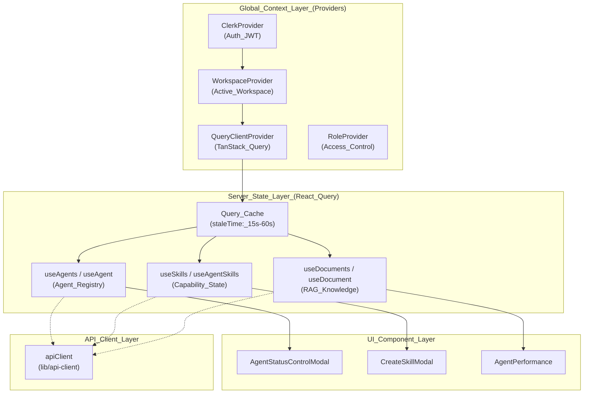
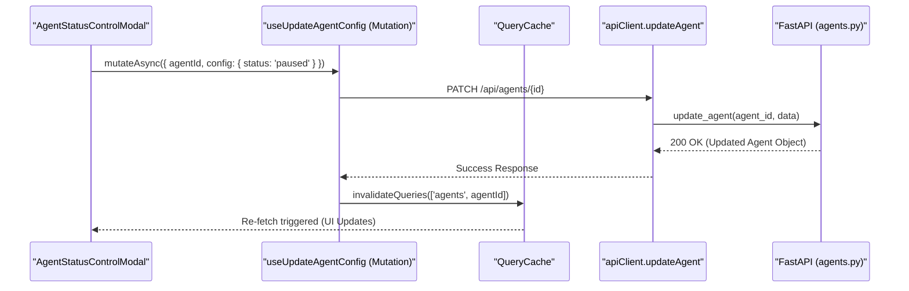

# State Management

Relevant source files

The following files were used as context for generating this wiki page:

- [frontend/components/agents/agent-performance.tsx](frontend/components/agents/agent-performance.tsx)
- [frontend/components/agents/agent-skills.tsx](frontend/components/agents/agent-skills.tsx)
- [frontend/components/agents/agent-status-control-modal.tsx](frontend/components/agents/agent-status-control-modal.tsx)
- [frontend/components/agents/create-skill-modal.tsx](frontend/components/agents/create-skill-modal.tsx)
- [frontend/components/agents/skill-configuration-modal.tsx](frontend/components/agents/skill-configuration-modal.tsx)
- [frontend/hooks/use-agent-api.ts](frontend/hooks/use-agent-api.ts)
- [frontend/hooks/use-document-api.ts](frontend/hooks/use-document-api.ts)

## Purpose and Scope

This document describes the frontend state management architecture in Automatos AI. The system utilizes a hybrid approach: **React Query** (TanStack Query) for server-side state synchronization, **React Context** for global configuration (workspaces, roles, and themes), and standard React state for transient UI logic. Central to this architecture is the `wsScope` pattern (implicit in the `apiClient`), which ensures strict multi-tenancy by scoping all cached data to the active workspace.

**Sources**: [frontend/hooks/use-agent-api.ts:5-10](), [frontend/hooks/use-document-api.ts:1-7]()

---

## State Management Architecture

The frontend state is organized into three primary layers that handle authentication, global application context, and asynchronous server data.

### Architecture Diagram: State Management Layers

**Sources**: [frontend/hooks/use-agent-api.ts:89-112](), [frontend/hooks/use-document-api.ts:84-93](), [frontend/components/agents/agent-status-control-modal.tsx:103-106]()

---

## Server State Management (React Query)

Automatos AI uses `@tanstack/react-query` to manage the lifecycle of data fetched from the FastAPI backend. Hooks are configured with specific `staleTime` and `refetchInterval` settings based on the volatility of the underlying data.

### Workspace-Scoped Query Keys

To maintain data isolation, query keys are structured as arrays. While workspace context is often handled at the request level by the `apiClient`, query keys ensure the cache is partitioned correctly.

| Query Key Factory | File | Purpose |
|-------------------|------|---------|
| `agentQueryKeys` | [frontend/hooks/use-agent-api.ts:62-82]() | Scopes agents, stats, logs, metrics, and skills |
| `documentQueryKeys` | [frontend/hooks/use-document-api.ts:12-26]() | Scopes RAG documents, processing queues, and analytics |

**Sources**: [frontend/hooks/use-agent-api.ts:62-82](), [frontend/hooks/use-document-api.ts:12-26]()

### Implementation Patterns

The application follows a "Hook-per-Resource" pattern. Hooks encapsulate fetching logic, normalization, and icon mapping.

1.  **Normalization and Enrichment**: The `useAgents` hook injects icon mappings based on categories by merging data from `useSystemIcons` [frontend/hooks/use-agent-api.ts:90-107]().
2.  **Polling Strategy**:
    *   **Document Processing**: `useProcessingStatus` polls every 5 seconds [frontend/hooks/use-document-api.ts:144-144]().
    *   **Agent Status**: `useAgent` polls every 10 seconds to reflect backend state changes [frontend/hooks/use-agent-api.ts:131-131]().
    *   **Performance**: `useAgentPerformance` and `useAgentStats` use 30-second intervals [frontend/hooks/use-agent-api.ts:140-141](), [frontend/hooks/use-agent-api.ts:200-200]().
3.  **Fallback/Placeholder Data**: `useDocuments` and `useDocumentStats` use `FALLBACK_DATA` to provide a "warm" UI experience if the API is slow [frontend/hooks/use-document-api.ts:84-92](), [frontend/hooks/use-document-api.ts:111-119]().

---

## Mutation and Optimistic Updates

State changes (POST/PUT/DELETE) are handled via `useMutation`. These mutations trigger cache invalidation to ensure the UI stays in sync with the backend.

### Sequence Diagram: Agent Status Mutation

This diagram shows how a status change request flows from the `AgentStatusControlModal` through the mutation layer to the backend.

**Sources**: [frontend/components/agents/agent-status-control-modal.tsx:200-216](), [frontend/hooks/use-agent-api.ts:28-28](), [frontend/hooks/use-agent-api.ts:65-65]()

### Skill Management Mutations
Skill operations utilize specialized hooks that wrap the `apiClient`:
*   `useCreateSkill`: Used in `CreateSkillModal` to provision new capabilities [frontend/components/agents/create-skill-modal.tsx:58-87]().
*   `useAddSkillToAgent`: Facilitates the association between agents and skills [frontend/components/agents/agent-skills.tsx:218-232]().
*   `useUpdateSkill`: Handles configuration updates for existing skills [frontend/components/agents/skill-configuration-modal.tsx:58-104]().

---

## Client State Management

### Local Component State
For transient UI logic, such as filtering and searching within a list, standard React `useState` and `useMemo` are preferred over global state to minimize re-renders.

*   **Skill Filtering**: The `AgentSkills` component uses `useMemo` to filter the `allSkills` array based on `searchTerm`, `categoryFilter`, and `difficultyFilter` [frontend/components/agents/agent-skills.tsx:193-204]().
*   **Performance Metrics**: `AgentPerformance` uses `useMemo` to calculate `overallScore` and `successRate` from raw performance data [frontend/components/agents/agent-performance.tsx:84-103]().

### Complex UI Modals
Modals like `AgentStatusControlModal` manage complex internal states, such as impact analysis and confirmation checklists, before committing changes to the server [frontend/components/agents/agent-status-control-modal.tsx:99-101](), [frontend/components/agents/agent-status-control-modal.tsx:163-169]().

---

## Summary of State Entities

| Code Entity | File | Role |
| :--- | :--- | :--- |
| `QueryClient` | `frontend/components/providers.tsx` | Central coordinator for all server-state caching |
| `agentQueryKeys` | [frontend/hooks/use-agent-api.ts:62]() | Cache key definitions for agent-related data |
| `documentQueryKeys` | [frontend/hooks/use-document-api.ts:12]() | Cache key definitions for knowledge base data |
| `apiClient` | [frontend/hooks/use-agent-api.ts:18]() | Singleton API wrapper for backend interaction |
| `useAgents` | [frontend/hooks/use-agent-api.ts:90]() | Hook for fetching and normalizing the agent registry |
| `useAgentSkills` | [frontend/hooks/use-agent-api.ts:173]() | Hook for managing agent-specific capabilities |

**Sources**: [frontend/hooks/use-agent-api.ts:18-173](), [frontend/hooks/use-document-api.ts:12-26]()

---