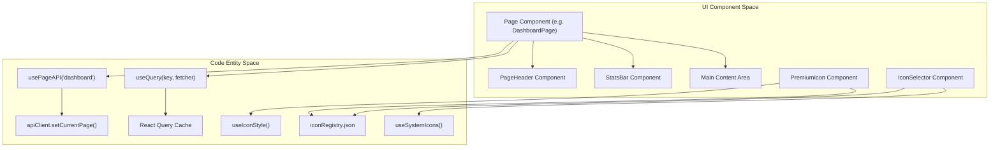
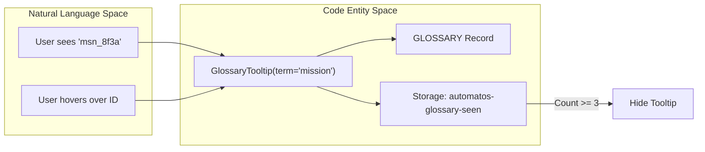

# UI Component Patterns & Design System

Relevant source files

The following files were used as context for generating this wiki page:

- [frontend/DESIGN_SYSTEM.md](frontend/DESIGN_SYSTEM.md)
- [frontend/components/agents/skills/skill-browser.tsx](frontend/components/agents/skills/skill-browser.tsx)
- [frontend/components/marketplace/WidgetCard.tsx](frontend/components/marketplace/WidgetCard.tsx)
- [frontend/components/marketplace/WidgetGrid.tsx](frontend/components/marketplace/WidgetGrid.tsx)
- [frontend/components/providers.tsx](frontend/components/providers.tsx)
- [frontend/components/settings/SystemIconsSettingsTab.tsx](frontend/components/settings/SystemIconsSettingsTab.tsx)
- [frontend/components/shared/empty-state.tsx](frontend/components/shared/empty-state.tsx)
- [frontend/components/shared/icon-selector.tsx](frontend/components/shared/icon-selector.tsx)
- [frontend/components/shared/index.ts](frontend/components/shared/index.ts)
- [frontend/components/shared/page-header.tsx](frontend/components/shared/page-header.tsx)
- [frontend/components/shared/premium-icon.tsx](frontend/components/shared/premium-icon.tsx)
- [frontend/components/ui/dialog.tsx](frontend/components/ui/dialog.tsx)
- [frontend/components/ui/glossary-tooltip.tsx](frontend/components/ui/glossary-tooltip.tsx)
- [frontend/components/ui/input.tsx](frontend/components/ui/input.tsx)
- [frontend/components/ui/select.tsx](frontend/components/ui/select.tsx)
- [frontend/components/ui/tabs.tsx](frontend/components/ui/tabs.tsx)
- [frontend/components/ui/theme-toggle.tsx](frontend/components/ui/theme-toggle.tsx)
- [frontend/config/iconRegistry.json](frontend/config/iconRegistry.json)
- [frontend/hooks/use-studio-theme.ts](frontend/hooks/use-studio-theme.ts)
- [frontend/hooks/use-system-config-api.ts](frontend/hooks/use-system-config-api.ts)
- [frontend/lib/design-utils.ts](frontend/lib/design-utils.ts)
- [frontend/lib/glossary.ts](frontend/lib/glossary.ts)
- [frontend/lib/studio-menu.ts](frontend/lib/studio-menu.ts)
- [frontend/public/assets/icons/connection-integration-plugin.svg](frontend/public/assets/icons/connection-integration-plugin.svg)
- [frontend/public/assets/icons/recipe-cooking.svg](frontend/public/assets/icons/recipe-cooking.svg)
- [frontend/tailwind.config.ts](frontend/tailwind.config.ts)

This document describes the reusable UI component patterns used throughout the Automatos AI frontend. These patterns provide consistent layouts, interactions, and visual design across all pages while maintaining code reusability and adhering to the authoritative **Design System** [frontend/DESIGN_SYSTEM.md:1-4]().

For state management patterns and React Query usage, see [19.2 State Management](). For API client patterns, see [19.3 API Client]().

---

## Design System & Theming

Automatos AI uses a unified design language that emphasizes sophistication through dark surfaces, glass effects, and orange accents [frontend/DESIGN_SYSTEM.md:38-42]().

### Theme Configuration
The system supports multiple themes: `light`, `dark`, `matte`, and `studio` [frontend/components/providers.tsx:94-94]().
- **Dark & Matte**: Both triggers Tailwind's `dark:` variant [frontend/tailwind.config.ts:6-6]().
- **Studio Theme**: An editorial-first rebrand direction featuring serif headlines and mono detail surfaces [frontend/tailwind.config.ts:14-30](). It is activated via the `?theme=studio-preview` URL parameter and persisted via `useStudioThemeFlag` [frontend/hooks/use-studio-theme.ts:16-26]().
- **Clerk Theming**: Clerk authentication surfaces are themed to align with the Studio palette, ensuring brand consistency even in classic mode [frontend/components/providers.tsx:36-69]().

### Color Tokens
All colors must use CSS variables defined in HSL. Hardcoded hex values are ESLint-blocked for app chrome [frontend/DESIGN_SYSTEM.md:52-95]().

| Token | Usage | HSL (Dark) |
|-------|-------|------------|
| `--primary` | Brand orange / CTAs | `16 100% 60%` |
| `--background` | Page background | `0 0% 6%` |
| `--card` | Surface background | `0 0% 8%` |
| `--destructive` | Errors / Deletion | `0 84% 60%` |

**Sources:** [frontend/DESIGN_SYSTEM.md:52-80](), [frontend/tailwind.config.ts:43-100](), [frontend/components/providers.tsx:89-97](), [frontend/components/providers.tsx:36-69]()

---

## Shared Component Library

The frontend uses a library of shared components to ensure consistency. These components handle common UI patterns like page headers, statistics displays, and technical tooltips.

**Core Shared Components:**

| Component | Purpose | Implementation Details |
|-----------|---------|------------------------|
| `PageHeader` | Editorial-first page lede | Supports `titleAccent` for gradients and `lede` for Studio-specific paragraphs [frontend/components/shared/page-header.tsx:38-46]() |
| `GlossaryTooltip` | Technical term education | Surfaces plain-English definitions; suppresses after 3 sightings [frontend/components/ui/glossary-tooltip.tsx:57-63]() |
| `ThemeToggle` | Visual mode switcher | Manages transitions between Light, Dark, Matte, and Studio [frontend/components/ui/theme-toggle.tsx:14-43]() |
| `StatsBar` | Metric visualization | Uses `framer-motion` for staggered entrance [frontend/components/shared/stats-bar.tsx:10-84]() |
| `PremiumIcon` | Dynamic SVG icon rendering | Renders icons from the icon registry, supporting different styles and fallbacks [frontend/components/shared/premium-icon.tsx:23-55]() |
| `IconSelector` | UI for choosing icons | Provides search and preview for `PremiumIcon`s [frontend/components/shared/icon-selector.tsx:34-43]() |
| `EmptyState` | Placeholder for empty data | Provides a consistent UI for when no data is available [frontend/components/shared/empty-state.tsx:1-30]() |
| `ItemCard` | Generic display card | Used for marketplace items, agents, etc. [frontend/components/marketplace/WidgetCard.tsx:1-100]() |

### Implementation Pattern: PageHeader
The `PageHeader` component adapts to the active theme. In the **Studio** theme, it renders a serif headline with an optional mono uppercase `eyebrow` [frontend/components/shared/page-header.tsx:34-37](). It uses Framer Motion to animate into view with a `y: 20` offset [frontend/components/shared/page-header.tsx:48-51]().

**Sources:** [frontend/components/shared/page-header.tsx:7-46](), [frontend/components/ui/glossary-tooltip.tsx:47-56](), [frontend/hooks/use-studio-theme.ts:32-43](), [frontend/components/shared/premium-icon.tsx:8-14](), [frontend/components/shared/icon-selector.tsx:23-29](), [frontend/components/shared/empty-state.tsx:1-30](), [frontend/components/marketplace/WidgetCard.tsx:1-100]()

---

## Component Architecture & Data Flow

All major dashboard pages follow a standardized pattern for data fetching and rendering.

### Standard Dashboard Data Flow

**Sources:** [frontend/hooks/use-page-api.ts:25-34](), [frontend/components/shared/page-header.tsx:48-85](), [frontend/components/providers.tsx:78-85](), [frontend/components/shared/premium-icon.tsx:23-28](), [frontend/hooks/use-system-config-api.ts:95-109](), [frontend/config/iconRegistry.json:1-7336](), [frontend/components/shared/icon-selector.tsx:34-43](), [frontend/hooks/use-system-config-api.ts:112-133]()

---

## Shadcn/ui & Glass Integration

The codebase integrates `Shadcn/ui` components built on `Radix UI` primitives, customized with the Automatos "Glass" aesthetic and specific border-radius requirements.

### Border Radius Pattern
Automatos enforces rounded corners for all elements [frontend/DESIGN_SYSTEM.md:165-178]().

| Element | Tailwind Class | Value |
|---------|----------------|-------|
| Cards / Modals | `rounded-2xl` | `1rem` |
| Buttons / Inputs | `rounded-2xl` | `1rem` |
| Tabs / Pills | `rounded-full` | `9999px` |

### Custom UI Primitives
- **Input**: Customized with `backdrop-blur` and a specific focus shadow `0 0 12px hsla(var(--primary)/0.15)` [frontend/components/ui/input.tsx:14-14]().
- **Tabs**: The `TabsList` uses a `rounded-full` pill shape with `bg-secondary/40` and `backdrop-blur` [frontend/components/ui/tabs.tsx:16-17]().
- **Dialog (Modals)**: Supports multiple sizes (`sm` to `full`) and implements the `glass-card` and `card-glow` styles for elevated surfaces [frontend/components/ui/dialog.tsx:32-57]().

**Sources:** [frontend/components/ui/input.tsx:8-23](), [frontend/components/ui/tabs.tsx:10-23](), [frontend/components/ui/dialog.tsx:43-67]()

---

## Premium Icons and Icon Registry

The system uses a custom icon system for premium, multi-style icons.

### Icon Registry
The `iconRegistry.json` file serves as the central catalog for all available icons [frontend/config/iconRegistry.json:1-7336](). Each entry includes an `id`, `filename`, `path`, `tags`, and `name`. This registry is used by the `IconSelector` for searching and displaying icons [frontend/components/shared/icon-selector.tsx:35-43]().

### PremiumIcon Component
The `PremiumIcon` component [frontend/components/shared/premium-icon.tsx:8-14]() is responsible for rendering these icons.
- It takes an `iconName` and `size` as props.
- It dynamically resolves the icon source based on the `active_icon_style` system configuration, fetched via `useIconStyle` [frontend/components/shared/premium-icon.tsx:23-28]().
- It supports different icon styles (e.g., `default`, `core-line-orange`) by constructing the image path `/assets/icons/{style}/{iconFilename}` [frontend/components/shared/premium-icon.tsx:16-20]().
- If a styled icon fails to load, it falls back to the default style [frontend/components/shared/premium-icon.tsx:38-40]().

### Icon Style Management
The `SystemIconsSettingsTab` [frontend/components/settings/SystemIconsSettingsTab.tsx:1-396]() allows administrators to configure system-wide icon mappings and the active icon style.
- It defines `ICON_STYLES` [frontend/components/settings/SystemIconsSettingsTab.tsx:37-86]() which are available for selection.
- It also defines `ICON_SECTIONS` [frontend/components/settings/SystemIconsSettingsTab.tsx:88-166]() for categorizing icon mappings (e.g., "Sidebar Navigation", "Platform Entities", "Agent Categories").
- The `useSystemIcons` hook [frontend/hooks/use-system-config-api.ts:112-133]() fetches the current icon mappings, and `useUpdateSystemConfigKey` [frontend/hooks/use-system-config-api.ts:400-419]() is used to persist changes.

**Sources:** [frontend/config/iconRegistry.json:1-7336](), [frontend/components/shared/premium-icon.tsx:8-55](), [frontend/components/shared/icon-selector.tsx:35-43](), [frontend/components/settings/SystemIconsSettingsTab.tsx:37-166](), [frontend/hooks/use-system-config-api.ts:95-133](), [frontend/hooks/use-system-config-api.ts:400-419]()

---

## Glossary & Education Pattern

To soften technical surfaces for non-technical users, the platform uses a **Glossary System** to define core concepts like "Mission", "Agent", and "T2.5" [frontend/lib/glossary.ts:29-75]().

### Education Flow

**Sources:** [frontend/components/ui/glossary-tooltip.tsx:57-126](), [frontend/lib/glossary.ts:1-18]()

### Implementation Details:
1. **Suppression Logic**: The `GlossaryTooltip` reads from `localStorage`. After a term is seen 3 times (`SUPPRESS_AFTER`), the tooltip and dotted underline affordance are removed [frontend/components/ui/glossary-tooltip.tsx:7-9](), [frontend/components/ui/glossary-tooltip.tsx:91-93]().
2. **Definitions**: Definitions are restricted to one-sentence plain English to match the brand voice [frontend/lib/glossary.ts:6-8]().

---

## Animation & Transition Patterns

Framer Motion is the primary engine for animations, supplemented by Tailwind CSS animations for simple states.

### Key Animation Behaviors:
- **Page Transitions**: Handled via `motion.div` in components like `PageHeader` with a 0.5s duration [frontend/components/shared/page-header.tsx:48-51]().
- **Modal Entrance**: `DialogContent` uses `animate-in` and `zoom-in-95` for smooth opening [frontend/components/ui/dialog.tsx:54-54]().
- **Tailwind Keyframes**: Custom animations like `pulse-glow` and `glow-pulse` are defined for interactive elements [frontend/tailwind.config.ts:138-162]().
- **Theme Transitions**: `disableTransitionOnChange` is used in the `ThemeProvider` to prevent flickering during theme swaps [frontend/components/providers.tsx:96-96]().

**Sources:** [frontend/tailwind.config.ts:101-162](), [frontend/components/shared/page-header.tsx:48-51](), [frontend/components/ui/dialog.tsx:54-54]()

---