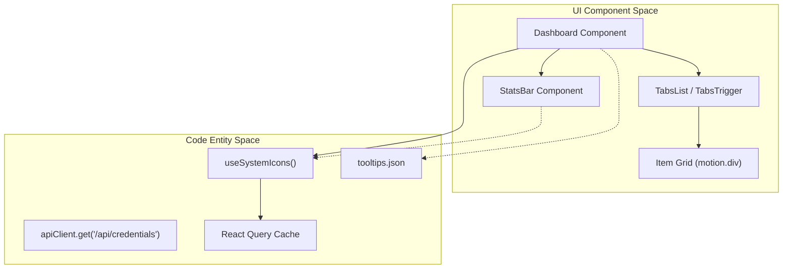
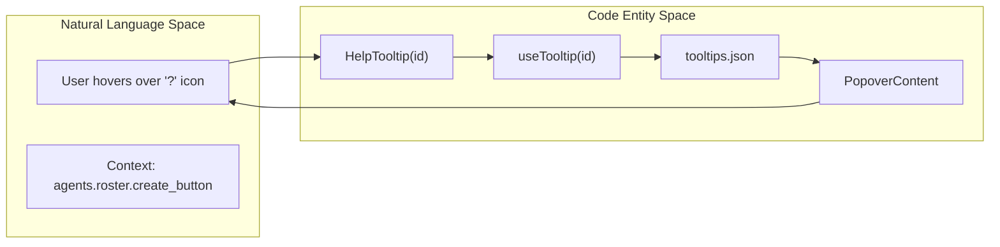

# UI Component Patterns

Relevant source files

The following files were used as context for generating this wiki page:

- [frontend/components/settings/CredentialTypesTab.tsx](frontend/components/settings/CredentialTypesTab.tsx)
- [frontend/components/settings/CredentialsTab.tsx](frontend/components/settings/CredentialsTab.tsx)
- [frontend/components/shared/empty-state.tsx](frontend/components/shared/empty-state.tsx)
- [frontend/components/shared/index.ts](frontend/components/shared/index.ts)
- [frontend/components/shared/page-header.tsx](frontend/components/shared/page-header.tsx)
- [frontend/components/shared/stats-bar.tsx](frontend/components/shared/stats-bar.tsx)
- [frontend/components/ui/dialog.tsx](frontend/components/ui/dialog.tsx)
- [frontend/components/ui/help-tooltip.tsx](frontend/components/ui/help-tooltip.tsx)
- [frontend/components/ui/input.tsx](frontend/components/ui/input.tsx)
- [frontend/components/ui/select.tsx](frontend/components/ui/select.tsx)
- [frontend/components/ui/tabs.tsx](frontend/components/ui/tabs.tsx)
- [frontend/lib/design-utils.ts](frontend/lib/design-utils.ts)
- [frontend/lib/tooltips.json](frontend/lib/tooltips.json)
- [frontend/lib/use-tooltips.ts](frontend/lib/use-tooltips.ts)
- [frontend/tailwind.config.ts](frontend/tailwind.config.ts)

This document describes the reusable UI component patterns used throughout the Automatos AI frontend. These patterns provide consistent layouts, interactions, and visual design across all pages while maintaining code reusability and maintainability.

For state management patterns and React Query usage, see [19.2 State Management](). For API client patterns, see [19.3 API Client]().

---

## Shared Component Library

The frontend uses a library of shared components located in `frontend/components/shared/` and `frontend/components/ui/` (Shadcn/ui integration) to ensure consistency. These components handle common UI patterns like page headers, statistics displays, search inputs, and tabbed navigation.

**Core Shared Components:**

| Component | Purpose | Implementation Details |
|-----------|---------|------------------------|
| `PageHeader` | Page title, subtitle, and action buttons | Supports `titleAccent` for gradient text and `actions` slot for buttons [frontend/components/shared/page-header.tsx:15-40]() |
| `StatsBar` | Statistics cards with icons and metrics | Uses `framer-motion` for staggered entrance and supports `PremiumIcon` [frontend/components/shared/stats-bar.tsx:34-84]() |
| `EmptyState` | Fallback UI for empty data lists | Standardized icon, title, description, and action button [frontend/components/shared/empty-state.tsx:15-32]() |
| `HelpTooltip` | Contextual documentation tooltips | Resolves content from `tooltips.json` using the `useTooltip` hook [frontend/components/ui/help-tooltip.tsx:61-175]() |
| `PremiumIcon` | Themed system icons | Renders custom SVG icons based on backend configuration mappings [frontend/components/shared/index.ts:8-8]() |
| `StatusBadge` | Standardized status indicators | Maps string statuses to color variants (success, active, error, etc.) [frontend/lib/design-utils.ts:85-88]() |

**Sources:** [frontend/components/shared/stats-bar.tsx:10-84](), [frontend/components/shared/page-header.tsx:7-40](), [frontend/components/ui/help-tooltip.tsx:16-35](), [frontend/lib/design-utils.ts:3-88]()

---

## Dashboard Layout Pattern

All major pages (Agents, Tools, Activity, Analytics, Marketplace) follow a standardized dashboard layout pattern built on Tailwind CSS and Framer Motion. This pattern ensures that users have a consistent experience when navigating different functional areas of the platform.

### Standard Dashboard Data Flow

**Sources:** [frontend/components/shared/stats-bar.tsx:35-40](), [frontend/components/settings/CredentialsTab.tsx:106-147](), [frontend/lib/tooltips.json:1-52]()

### Implementation Pattern: StatsBar
The `StatsBar` component dynamically renders a row of metric cards. It uses `framer-motion` to provide a staggered entrance animation with a duration of `0.6s` [frontend/components/shared/stats-bar.tsx:43-47](). It integrates with `useSystemIcons` to allow the backend to override standard Lucide icons with branded "Premium" icons via the `globalIconKey` [frontend/components/shared/stats-bar.tsx:35-54]().

---

## Shadcn/ui & Glass Integration

The codebase integrates `Shadcn/ui` components built on `Radix UI` primitives, customized with the Automatos "Glass" aesthetic.

### Glass Styling (Tailwind)
The `tailwind.config.ts` file defines custom animations and color extensions to support the glass theme.

| Class | Properties | Purpose |
|-------|------------|---------|
| `.glass-card` | Custom backdrop blur and border | Primary container for dialogs and cards [frontend/components/ui/dialog.tsx:54-54]() |
| `.card-glow` | `glow-pulse` animation | Hover effect or active state for interactive elements [frontend/components/ui/dialog.tsx:54-54]() |
| `bg-background/50` | `backdrop-blur` | Semi-transparent backgrounds for inputs and popovers [frontend/components/ui/input.tsx:14-14]() |

**Sources:** [frontend/tailwind.config.ts:121-145](), [frontend/components/ui/input.tsx:13-16](), [frontend/components/ui/dialog.tsx:51-57]()

### Component Customizations
- **Dialogs**: The `DialogContent` component supports multiple sizes (`sm`, `md`, `lg`, `xl`, `full`) and includes a standardized `glass-card` styling [frontend/components/ui/dialog.tsx:32-57]().
- **Tabs**: `TabsList` is customized with a `rounded-full` border and `secondary/40` background to create a "pill" navigation look [frontend/components/ui/tabs.tsx:10-22]().
- **Inputs**: Standard `Input` components use `rounded-2xl` and include a `focus-visible` shadow using the primary color [frontend/components/ui/input.tsx:13-16]().

---

## Tooltip & Documentation Pattern

The `HelpTooltip` component provides a unified way to show documentation and contextual help. It uses a JSON-driven approach to decouple UI labels from help text.

### Tooltip Resolution Flow

**Sources:** [frontend/components/ui/help-tooltip.tsx:61-93](), [frontend/lib/use-tooltips.ts:1-10](), [frontend/lib/tooltips.json:87-91]()

### Usage Variants:
1. **ID-Based**: Looks up text and links from `tooltips.json` (e.g., `<HelpTooltip id="agents.roster.create_button" />`) [frontend/components/ui/help-tooltip.tsx:47-47]().
2. **Inline**: Used inside form labels via the `InlineHelp` or `FieldHelp` wrappers [frontend/components/ui/help-tooltip.tsx:180-197]().
3. **Direct**: Accepts `text` and `docLink` props directly for one-off tooltips [frontend/components/ui/help-tooltip.tsx:50-53]().

---

## Animation Patterns

Automatos AI uses `framer-motion` and Tailwind animations to create a fluid, "living" interface.

### Key Animation Behaviors:
- **Staggered Entrance**: Used in `StatsBar` to animate metrics sequentially [frontend/components/shared/stats-bar.tsx:43-47]().
- **Transitions**: A standard transition duration of `220ms` is used for most interactive state changes [frontend/lib/design-utils.ts:90-90]().
- **Glow Effects**: The `pulse-glow` and `glow-pulse` keyframes create breathing effects on primary elements [frontend/tailwind.config.ts:121-136]().
- **Page Transitions**: `PageHeader` uses a `fade-in` and `slide-up` (y: 20 to 0) motion on mount [frontend/components/shared/page-header.tsx:23-26]().

**Sources:** [frontend/components/shared/stats-bar.tsx:43-47](), [frontend/tailwind.config.ts:121-145](), [frontend/components/shared/page-header.tsx:23-26]()

---