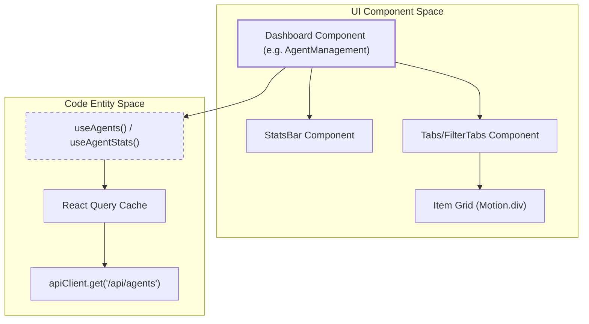
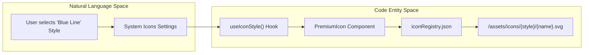

# UI Component Patterns

Relevant source files

The following files were used as context for generating this wiki page:

- [frontend/app/globals.css](frontend/app/globals.css)
- [frontend/app/layout.tsx](frontend/app/layout.tsx)
- [frontend/components/activity/widgets/command-centre-dashboard.tsx](frontend/components/activity/widgets/command-centre-dashboard.tsx)
- [frontend/components/agents/skills/skill-browser.tsx](frontend/components/agents/skills/skill-browser.tsx)
- [frontend/components/marketplace/WidgetCard.tsx](frontend/components/marketplace/WidgetCard.tsx)
- [frontend/components/marketplace/WidgetGrid.tsx](frontend/components/marketplace/WidgetGrid.tsx)
- [frontend/components/providers.tsx](frontend/components/providers.tsx)
- [frontend/components/settings/SystemIconsSettingsTab.tsx](frontend/components/settings/SystemIconsSettingsTab.tsx)
- [frontend/components/shared/icon-selector.tsx](frontend/components/shared/icon-selector.tsx)
- [frontend/components/shared/page-header.tsx](frontend/components/shared/page-header.tsx)
- [frontend/components/shared/premium-icon.tsx](frontend/components/shared/premium-icon.tsx)
- [frontend/components/ui/dialog.tsx](frontend/components/ui/dialog.tsx)
- [frontend/components/ui/input.tsx](frontend/components/ui/input.tsx)
- [frontend/components/ui/select.tsx](frontend/components/ui/select.tsx)
- [frontend/components/ui/tabs.tsx](frontend/components/ui/tabs.tsx)
- [frontend/config/iconRegistry.json](frontend/config/iconRegistry.json)
- [frontend/hooks/use-system-config-api.ts](frontend/hooks/use-system-config-api.ts)
- [frontend/public/assets/icons/connection-integration-plugin.svg](frontend/public/assets/icons/connection-integration-plugin.svg)
- [frontend/public/assets/icons/recipe-cooking.svg](frontend/public/assets/icons/recipe-cooking.svg)
- [frontend/tailwind.config.ts](frontend/tailwind.config.ts)

This document describes the reusable UI component patterns used throughout the Automatos AI frontend. These patterns provide consistent layouts, interactions, and visual design across all pages while maintaining code reusability and maintainability.

For state management patterns and React Query usage, see [19.2 State Management](). For API client patterns, see [19.3 API Client]().

---

## Shared Component Library

The frontend uses a library of shared components located in `frontend/components/shared/` and `frontend/components/ui/` (Shadcn/ui integration) to ensure consistency. These components handle common UI patterns like page headers, statistics displays, search inputs, and tabbed navigation.

**Core Shared Components:**

| Component | Purpose | Implementation Details |
|-----------|---------|------------------------|
| `PageHeader` | Page title, subtitle, and action buttons | Supports `titleAccent` for gradient text and `actions` slot for buttons [frontend/components/shared/page-header.tsx:1-50]() |
| `StatsBar` | Statistics cards with icons and metrics | Uses `framer-motion` for staggered entrance and supports `PremiumIcon` [frontend/components/shared/stats-bar.tsx:10-85]() |
| `SearchInput` | Search field with icon | Standardized search styling used in Marketplace and Agents [frontend/components/shared/search-input.tsx:1-40]() |
| `IconSelector` | Popover-based SVG selector | Filters `iconRegistry.json` by name/tags and provides a search interface [frontend/components/shared/icon-selector.tsx:23-137]() |
| `PremiumIcon` | Icon system with fallback | Resolves custom SVG assets based on system configuration and active style [frontend/components/shared/premium-icon.tsx:8-55]() |

Sources: [frontend/components/shared/stats-bar.tsx:34-84](), [frontend/components/shared/icon-selector.tsx:34-43](), [frontend/components/shared/premium-icon.tsx:23-55]()

---

## Dashboard Layout Pattern

All major pages (Agents, Tools, Documents, Marketplace) follow a standardized dashboard layout pattern built on Tailwind CSS and Framer Motion. This pattern ensures that users have a consistent experience when navigating different functional areas of the platform.

### Standard Dashboard Data Flow

**Sources:** [frontend/components/agents/agent-management.tsx:51-116](), [frontend/components/marketplace/marketplace-homepage.tsx:58-91]()

### Implementation Pattern: StatsBar
The `StatsBar` component dynamically renders a row of metric cards. In the `AgentManagement` view, it displays "Total Agents", "Active Agents", and "Avg Performance" [frontend/components/agents/agent-management.tsx:80-116](). It uses `globalIconKey` to allow the backend to override standard Lucide icons with branded "Premium" icons [frontend/components/shared/stats-bar.tsx:17-40]().

---

## Shadcn/ui & Glass Integration

The codebase integrates `Shadcn/ui` components built on `Radix UI` primitives, customized with the Automatos "Glass" aesthetic defined in `globals.css`.

### Glass Styling (Tailwind)
Global styles in `globals.css` define the "Glass" look using CSS variables for alpha transparency and backdrop filters.

| Class | Properties | Purpose |
|-------|------------|---------|
| `.glass-card` | `backdrop-filter: blur(18px)`, `border: 1px solid` | Primary container for agents, tools, and documents [frontend/app/globals.css:184-197]() |
| `.card-glow` | `box-shadow` with primary color accent | Hover effect for interactive cards [frontend/app/globals.css:169-181]() |
| `.glass-panel` | `background: hsla(var(--card) / 0.92)` | High-opacity background for sidebars and complex panels [frontend/app/globals.css:209-217]() |

**Sources:** [frontend/app/globals.css:184-217]()

### Component Customizations
- **Tabs**: The `TabsList` is customized to be `rounded-full` with a `backdrop-blur` and `secondary/40` background [frontend/components/ui/tabs.tsx:10-22]().
- **Dialogs**: `DialogContent` uses the `glass-card` and `card-glow` classes for consistent overlay appearances [frontend/components/ui/dialog.tsx:35-51]().
- **Inputs**: Standard `Input` components use `rounded-2xl`, `backdrop-blur`, and a primary-colored ring on focus [frontend/components/ui/input.tsx:8-22]().

---

## Iconography and Theming System

Automatos AI implements a dynamic iconography system that allows for global style changes (e.g., switching from "Core Gradient" to "Core Line Blue") without modifying individual components.

### Icon Resolution Flow

**Sources:** [frontend/components/shared/premium-icon.tsx:16-21](), [frontend/hooks/use-system-config-api.ts:95-109](), [frontend/components/settings/SystemIconsSettingsTab.tsx:36-86]()

### Implementation Details:
1. **System Icon Settings**: The `SystemIconsSettingsTab` allows administrators to map specific platform entities (e.g., `nav_chat`, `global_agent`) to SVG IDs in the registry [frontend/components/settings/SystemIconsSettingsTab.tsx:88-166]().
2. **Dynamic Styling**: The `PremiumIcon` component checks the `active_icon_style` config via the `useIconStyle` hook [frontend/hooks/use-system-config-api.ts:95-109](). It then resolves the asset path to a specific subdirectory (e.g., `/assets/icons/core-line-blue/brain.svg`) [frontend/components/shared/premium-icon.tsx:16-21]().
3. **Fallbacks**: If a styled icon fails to load, the component catches the error and falls back to the default gradient icon [frontend/components/shared/premium-icon.tsx:37-41]().

---

## Widget and Dashboard Patterns

The "Command Centre" and Marketplace use a widget-based architecture allowing for customization and persistence.

### Command Centre Widgets
The `CommandCentreDashboard` manages a collection of widgets defined in a `WIDGET_REGISTRY` [frontend/components/activity/widgets/command-centre-dashboard.tsx:37-51]().
- **Persistence**: Dashboard state (order and visibility) is persisted to `localStorage` under the key `automatos:command-centre-v3` [frontend/components/activity/widgets/command-centre-dashboard.tsx:59-82]().
- **Interactivity**: Supports drag-and-drop reordering using native `onDragOver` and `onDragStart` events [frontend/components/activity/widgets/command-centre-dashboard.tsx:140-157]().

### Marketplace Item Cards
Assets in the marketplace are rendered using specialized card components like `WidgetCard`. These cards handle installation flows, display versioning, and use `AnimatePresence` for smooth entry/exit when filtering [frontend/components/marketplace/WidgetCard.tsx:1-100]().

**Sources:** [frontend/components/activity/widgets/command-centre-dashboard.tsx:93-137](), [frontend/components/marketplace/WidgetGrid.tsx:1-50]()

---

## Animation Patterns

Framer Motion is used for layout transitions and interaction feedback to make the UI feel "autonomous" and responsive.

### Key Animation Behaviors:
- **Staggered Lists**: Item grids (Agents, Tools) use `AnimatePresence` and staggered `motion.div` entrance animations [frontend/components/marketplace/marketplace-tools-tab.tsx:11-12]().
- **Status Transitions**: `StatsBar` metrics animate from `opacity: 0, y: 20` to their final position over 0.6 seconds [frontend/components/shared/stats-bar.tsx:43-47]().
- **Theme Transitions**: The `ThemeProvider` manages CSS variable transitions, while `disableTransitionOnChange` prevents flashes during initial load [frontend/components/providers.tsx:57-63]().

**Sources:** [frontend/components/shared/stats-bar.tsx:43-49](), [frontend/components/analytics/analytics-overview.tsx:118-143](), [frontend/app/layout.tsx:15-29]()

---