# UI Component Patterns

<details>
<summary>Relevant source files</summary>

The following files were used as context for generating this wiki page:

- [frontend/app/tools/page.tsx](frontend/app/tools/page.tsx)
- [frontend/components/agents/agent-management.tsx](frontend/components/agents/agent-management.tsx)
- [frontend/components/documents/document-management.tsx](frontend/components/documents/document-management.tsx)
- [frontend/components/layout/main-layout.tsx](frontend/components/layout/main-layout.tsx)
- [frontend/components/layout/sidebar.tsx](frontend/components/layout/sidebar.tsx)
- [frontend/components/settings/SettingsPanel.tsx](frontend/components/settings/SettingsPanel.tsx)
- [frontend/components/tools/my-tools-dashboard.tsx](frontend/components/tools/my-tools-dashboard.tsx)
- [frontend/components/tools/tools-dashboard.tsx](frontend/components/tools/tools-dashboard.tsx)
- [frontend/components/workflows/workflow-management.tsx](frontend/components/workflows/workflow-management.tsx)

</details>


This page documents the reusable component patterns used throughout the Automatos AI frontend. These patterns establish consistency across all major pages (Agents, Workflows, Documents, Tools, etc.) and provide a composable architecture for building complex UIs with minimal code duplication.

For information about the overall frontend architecture and state management, see [14.1](#14.1) and [14.2](#14.2). For specific API integration patterns, see [14.3](#14.3).

---

## Overview

The frontend follows a **shared component composition pattern** where complex pages are assembled from reusable building blocks. All major management pages (Agent Management, Workflow Management, Document Management, Tools Dashboard) use identical structural patterns but compose different content within them.

**Key Design Principles:**
- **Composition over duplication**: Shared components handle layout, animations, and state patterns
- **Consistent user experience**: Same navigation, filtering, and action patterns across all pages
- **Type-safe props**: TypeScript interfaces ensure correct component usage
- **Responsive by default**: Mobile-first design with tablet/desktop enhancements
- **Loading state handling**: Skeleton UIs during data fetching, error displays on failure

Sources: [frontend/components/agents/agent-management.tsx:1-284](), [frontend/components/workflows/workflow-management.tsx:1-750](), [frontend/components/documents/document-management.tsx:1-1247]()

---

## Standard Page Structure Pattern

All management pages follow a five-tier hierarchy:

```mermaid
graph TB
    Page["Page Component<br/>(e.g., AgentManagement)"]
    Header["PageHeader<br/>Title + Actions"]
    Stats["StatsBar<br/>4 Metric Cards"]
    Filters["Search + Filters<br/>SearchInput + ViewToggle"]
    Tabs["FilterTabs<br/>Tab Navigation"]
    Content["TabsContent<br/>Actual Page Content"]
    
    Page --> Header
    Page --> Stats
    Page --> Filters
    Page --> Tabs
    Tabs --> Content
    
    style Page fill:#1a1a1a
    style Header fill:#2a2a2a
    style Stats fill:#2a2a2a
    style Filters fill:#2a2a2a
    style Tabs fill:#2a2a2a
    style Content fill:#3a3a3a
```



**Diagram: Standard Page Hierarchy**

This structure appears in:
- Agent Management: [frontend/components/agents/agent-management.tsx:127-283]()
- Workflow Management: [frontend/components/workflows/workflow-management.tsx:536-748]()
- Document Management: [frontend/components/documents/document-management.tsx:556-1247]()
- Tools Dashboard: [frontend/components/tools/tools-dashboard.tsx:634-1440]()

Sources: [frontend/components/agents/agent-management.tsx:127-283](), [frontend/components/workflows/workflow-management.tsx:536-748]()

---

## Shared Component Library

### PageHeader Component

The `PageHeader` component provides consistent page titles with optional accent text and action buttons.

**Usage Pattern:**
```typescript
<PageHeader
  title="Agent"
  titleAccent="Management"
  subtitle="Manage your AI agents, capabilities, and coordination strategies"
  actions={
    <Button onClick={() => setShowCreateModal(true)}>
      <Plus className="w-4 h-4 mr-2" />
      Create Agent
    </Button>
  }
/>
```

**Props Interface:**
- `title: string` - Primary title text
- `titleAccent?: string` - Gradient-styled accent text
- `subtitle?: string` - Description below title
- `actions?: ReactNode` - Right-aligned action buttons

The gradient styling on `titleAccent` uses the `.gradient-text` CSS class for consistent brand theming across all pages.

Sources: [frontend/components/agents/agent-management.tsx:131-163](), [frontend/components/workflows/workflow-management.tsx:540-555](), [frontend/components/tools/tools-dashboard.tsx:637-649]()

---

### StatsBar Component

The `StatsBar` displays 4 metric cards in a responsive grid, used on every management page.

```mermaid
graph LR
    StatsBar["StatsBar Component"]
    StatItem1["StatItem 1<br/>Icon + Value"]
    StatItem2["StatItem 2<br/>Icon + Value"]
    StatItem3["StatItem 3<br/>Icon + Value"]
    StatItem4["StatItem 4<br/>Icon + Value"]
    
    StatsBar --> StatItem1
    StatsBar --> StatItem2
    StatsBar --> StatItem3
    StatsBar --> StatItem4
    
    style StatsBar fill:#1a1a1a
    style StatItem1 fill:#2a2a2a
    style StatItem2 fill:#2a2a2a
    style StatItem3 fill:#2a2a2a
    style StatItem4 fill:#2a2a2a
```



**Diagram: StatsBar Component Structure**

**StatItem Interface:**
```typescript
interface StatItem {
  label: string           // Stat name (e.g., "Total Agents")
  value: string           // Stat value (e.g., "42")
  change: string          // Context text (e.g., "+5 this month")
  icon: LucideIcon        // Icon component from lucide-react
  iconColor: string       // Tailwind color class
}
```

**Example Usage:**
```typescript
const stats: StatItem[] = [
  {
    label: 'Total Agents',
    value: String(agents.length),
    change: `${agents.length} agents`,
    icon: Bot,
    iconColor: 'text-primary',
  },
  // ... 3 more stats
]

<StatsBar stats={stats} loading={statsLoading} />
```

The component automatically handles:
- Loading skeleton states when `loading={true}`
- Responsive grid: 2 columns on mobile, 4 on desktop
- Consistent card styling with glass morphism effect
- Icon rendering with specified colors

Sources: [frontend/components/agents/agent-management.tsx:78-107](), [frontend/components/agents/agent-management.tsx:182](), [frontend/components/workflows/workflow-management.tsx:558-569]()

---

### SearchInput Component

Provides a consistent search interface with icon and placeholder text.

**Props:**
- `value: string` - Controlled input value
- `onChange: (value: string) => void` - Change handler
- `placeholder?: string` - Search field placeholder
- `className?: string` - Additional styling

The component includes:
- Magnifying glass icon positioned inside input
- Debounced filtering (implementation in parent component)
- Consistent styling matching the design system

Sources: [frontend/components/agents/agent-management.tsx:191-196](), [frontend/components/workflows/workflow-management.tsx:590-597]()

---

### FilterTabs Component

The `FilterTabs` component provides tab navigation with optional trailing elements (like ViewToggle).

```typescript
<FilterTabs 
  tabs={tabDefs} 
  value={activeTab} 
  onValueChange={setActiveTab}
  trailing={<ViewToggle value={viewMode} onChange={setViewMode} />}
>
  <TabsContent value="roster">
    {/* Roster content */}
  </TabsContent>
  <TabsContent value="configuration">
    {/* Configuration content */}
  </TabsContent>
</FilterTabs>
```

**Tab Definition Structure:**
```typescript
const tabDefs = [
  { value: 'roster', label: 'Agent Roster', icon: Users },
  { value: 'configuration', label: 'Configuration', icon: Settings },
  { value: 'coordination', label: 'Coordination', icon: Users }
]
```

Sources: [frontend/components/agents/agent-management.tsx:119-126](), [frontend/components/agents/agent-management.tsx:229-262]()

---

### ViewToggle Component

Switches between grid and list view modes, with state persisted via `useViewMode` hook.

**Usage:**
```typescript
const [viewMode, setViewMode] = useViewMode('agents') // 'agents' is storage key
<ViewToggle value={viewMode} onChange={setViewMode} />
```

The component renders two icon buttons (Grid3x3 and List icons) with active state styling. View mode preference is saved to localStorage and restored on page reload.

Sources: [frontend/components/agents/agent-management.tsx:24-25](), [frontend/components/agents/agent-management.tsx:42](), [frontend/components/agents/agent-management.tsx:229]()

---

## Modal Management Pattern

All pages use a consistent state-driven modal pattern with dedicated state variables and handler functions.

```mermaid
graph TB
    State["Component State"]
    ShowModal["showCreateModal: boolean"]
    SelectedItem["selectedAgentId: string | null"]
    ShowDetails["viewDetailsAgentId: string | null"]
    
    Handler1["handleCreate()<br/>Opens creation modal"]
    Handler2["handleViewDetails(id)<br/>Opens details modal"]
    Handler3["handleDelete(id)<br/>Opens delete confirmation"]
    
    Modal1["CreateAgentModal"]
    Modal2["AgentDetailsModal"]
    Modal3["DeleteConfirmationModal"]
    
    State --> ShowModal
    State --> SelectedItem
    State --> ShowDetails
    
    Handler1 --> ShowModal
    Handler2 --> ShowDetails
    Handler3 --> Modal3
    
    ShowModal --> Modal1
    ShowDetails --> Modal2
    
    style State fill:#1a1a1a
    style Handler1 fill:#2a2a2a
    style Handler2 fill:#2a2a2a
    style Handler3 fill:#2a2a2a
    style Modal1 fill:#3a3a3a
    style Modal2 fill:#3a3a3a
    style Modal3 fill:#3a3a3a
```



**Diagram: Modal State Management Flow**

**Standard Modal State Pattern:**
```typescript
// Modal state
const [showCreateModal, setShowCreateModal] = useState(false)
const [selectedAgentId, setSelectedAgentId] = useState<string | null>(null)
const [viewDetailsAgentId, setViewDetailsAgentId] = useState<string | null>(null)

// Handler to open modal
const handleViewDetails = (agentId: string | null) => {
  if (agentId) {
    setViewDetailsAgentId(agentId)
  }
}

// Modal component with controlled open state
{mounted && viewDetailsAgentId && (
  <AgentDetailsModal
    agentId={Number(viewDetailsAgentId)}
    open={!!viewDetailsAgentId}
    onClose={() => setViewDetailsAgentId(null)}
  />
)}
```

**Common Modal Types:**
1. **Creation Modals**: Create new resources (agents, workflows, recipes)
2. **Details Modals**: View/edit resource details with tabs
3. **Confirmation Modals**: Delete confirmations, destructive actions
4. **Configuration Modals**: Settings and configuration forms

Sources: [frontend/components/agents/agent-management.tsx:44-46](), [frontend/components/agents/agent-management.tsx:113-117](), [frontend/components/agents/agent-management.tsx:264-282]()

---

## Tab-Based Navigation Pattern

Complex pages use nested tabs for organizing related content.

```mermaid
graph TB
    OuterTabs["Outer Tabs<br/>(Main Navigation)"]
    Tab1["Documents Tab"]
    Tab2["Database Tab"]
    Tab3["Templates Tab"]
    
    InnerTabs["Inner Tabs<br/>(Sub-Navigation)"]
    SubTab1["Library"]
    SubTab2["Processing"]
    SubTab3["Search"]
    
    OuterTabs --> Tab1
    OuterTabs --> Tab2
    OuterTabs --> Tab3
    Tab1 --> InnerTabs
    InnerTabs --> SubTab1
    InnerTabs --> SubTab2
    InnerTabs --> SubTab3
    
    style OuterTabs fill:#1a1a1a
    style Tab1 fill:#2a2a2a
    style Tab2 fill:#2a2a2a
    style Tab3 fill:#2a2a2a
    style InnerTabs fill:#3a3a3a
    style SubTab1 fill:#4a4a4a
    style SubTab2 fill:#4a4a4a
    style SubTab3 fill:#4a4a4a
```



**Diagram: Nested Tabs Pattern in Document Management**

**Outer Tabs Structure:**
```typescript
<Tabs defaultValue="documents" className="space-y-6">
  <TabsList>
    <TabsTrigger value="documents">
      <FileText className="w-4 h-4" />
      <span>Documents</span>
    </TabsTrigger>
    <TabsTrigger value="database">
      <Database className="w-4 h-4" />
      <span>Database</span>
    </TabsTrigger>
  </TabsList>
  
  <TabsContent value="documents">
    {/* Inner tabs here */}
  </TabsContent>
</Tabs>
```

**Inner Tabs Structure:**
```typescript
<TabsContent value="documents">
  <Tabs defaultValue="library">
    <TabsList>
      <TabsTrigger value="library">Library</TabsTrigger>
      <TabsTrigger value="processing">Processing</TabsTrigger>
      <TabsTrigger value="search">Search</TabsTrigger>
    </TabsList>
    
    <TabsContent value="library">
      {/* Library content */}
    </TabsContent>
  </Tabs>
</TabsContent>
```

This nested structure is used extensively in:
- Document Management: [frontend/components/documents/document-management.tsx:634-722]()
- Tools Dashboard: [frontend/components/tools/tools-dashboard.tsx:1149-1440]()
- Workflow Management: [frontend/components/workflows/workflow-management.tsx:577-675]()

Sources: [frontend/components/documents/document-management.tsx:634-722](), [frontend/components/tools/tools-dashboard.tsx:1149-1440]()

---

## Loading and Error States

All pages implement skeleton loading states and error displays using a consistent pattern.

### Skeleton Loading Pattern

```typescript
// Check if this is the initial load (no cached data)
const isInitialLoading = toolsLoading && !effectiveToolsData

if (isInitialLoading) {
  return (
    <div className="space-y-6">
      {/* Header skeleton */}
      <div className="h-8 w-48 bg-secondary/50 rounded mb-2" />
      
      {/* Stats skeleton */}
      <div className="grid grid-cols-1 md:grid-cols-4 gap-6">
        {Array.from({ length: 4 }).map((_, i) => (
          <Card key={i}>
            <CardContent className="p-6">
              <div className="h-4 w-24 bg-secondary/50 rounded mb-2" />
              <div className="h-8 w-16 bg-secondary/50 rounded" />
            </CardContent>
          </Card>
        ))}
      </div>
    </div>
  )
}
```

**Key Characteristics:**
- Only shown on **initial load** (not on refetch/pagination)
- Matches the layout of actual content
- Uses `bg-secondary/50` for skeleton elements
- Animates with pulse effect (optional)

Sources: [frontend/components/tools/tools-dashboard.tsx:400-456]()

### Error Display Pattern

```typescript
{!!agentsError && (
  <div className="rounded-2xl border border-[hsl(var(--destructive))]/20 bg-[hsl(var(--destructive))]/5 p-4">
    <div className="text-sm font-semibold text-[hsl(var(--destructive))]">
      Agents failed to load (backend error)
    </div>
    <div className="mt-1 text-sm text-muted-foreground">
      The backend returned an error for the Agents endpoints.
    </div>
    <div className="mt-3 flex gap-2">
      <Button variant="outline" size="sm" onClick={handleRefresh}>
        Retry
      </Button>
    </div>
  </div>
)}
```

**Error Display Features:**
- Styled with destructive color scheme
- Includes descriptive error message
- Provides retry action button
- Positioned below page header, above content

Sources: [frontend/components/agents/agent-management.tsx:165-179](), [frontend/components/workflows/workflow-management.tsx:613-624]()

---

## Card-Based Content Display

Content is displayed using card components with hover effects and consistent styling.

### Grid View Cards

```typescript
<Card className="glass-card card-glow hover:border-primary/20 transition-all">
  <CardHeader>
    <div className="flex items-center justify-between">
      <div className="flex items-center gap-3">
        <div className="w-10 h-10 rounded-2xl bg-black/20 flex items-center justify-center">
          <Icon className="w-5 h-5 text-primary" />
        </div>
        <div>
          <CardTitle className="text-lg">{item.name}</CardTitle>
          <p className="text-sm text-muted-foreground">{item.category}</p>
        </div>
      </div>
      <Badge>{item.status}</Badge>
    </div>
  </CardHeader>
  
  <CardContent>
    <p className="text-sm text-muted-foreground mb-4">
      {item.description}
    </p>
    
    <div className="flex gap-2">
      <Button size="sm" onClick={() => handleAction(item.id)}>
        Action
      </Button>
    </div>
  </CardContent>
</Card>
```

**Styling Classes:**
- `glass-card` - Glass morphism background effect
- `card-glow` - Subtle glow on hover
- `hover:border-primary/20` - Border color transition on hover

Sources: [frontend/components/tools/tools-dashboard.tsx:1260-1320]()

### List View Pattern

List view uses a more compact layout with rows:

```typescript
<Card className="glass-card">
  <CardContent className="p-4">
    <div className="flex items-center justify-between">
      <div className="flex items-center gap-4 flex-1">
        <Icon className="w-8 h-8 text-primary" />
        <div className="flex-1">
          <h3 className="font-semibold">{item.name}</h3>
          <p className="text-sm text-muted-foreground">{item.description}</p>
        </div>
      </div>
      
      <div className="flex items-center gap-2">
        <Badge>{item.status}</Badge>
        <DropdownMenu>
          <DropdownMenuTrigger asChild>
            <Button variant="ghost" size="icon">
              <MoreVertical className="w-4 h-4" />
            </Button>
          </DropdownMenuTrigger>
          <DropdownMenuContent>
            <DropdownMenuItem onClick={() => handleView(item.id)}>
              View Details
            </DropdownMenuItem>
          </DropdownMenuContent>
        </DropdownMenu>
      </div>
    </div>
  </CardContent>
</Card>
```

Sources: [frontend/components/tools/tools-dashboard.tsx:1326-1393]()

---

## Pagination Pattern

Pages with large datasets use the `EnhancedPagination` component.

```mermaid
graph LR
    State["Component State"]
    CurrentPage["currentPage: number"]
    PageSize["pageSize: number"]
    
    APIHook["useTools Hook"]
    Query["skip: (page-1) * pageSize<br/>limit: pageSize"]
    
    Pagination["EnhancedPagination"]
    Response["pagination: {<br/>  total<br/>  pages<br/>  current_page<br/>}"]
    
    State --> CurrentPage
    State --> PageSize
    CurrentPage --> Query
    PageSize --> Query
    Query --> APIHook
    APIHook --> Response
    Response --> Pagination
    Pagination --> CurrentPage
    
    style State fill:#1a1a1a
    style APIHook fill:#2a2a2a
    style Pagination fill:#2a2a2a
```



**Diagram: Pagination Data Flow**

**Implementation:**
```typescript
// State
const [currentPage, setCurrentPage] = useState(1)
const pageSize = viewMode === 'list' ? 60 : 20

// API call with pagination
const { data: toolsData } = useTools({
  skip: (currentPage - 1) * pageSize,
  limit: pageSize,
  search: debouncedSearch || undefined,
  category: categoryParam
})

// Extract pagination info
const paginationData = toolsData?.pagination || { 
  total: 0, 
  pages: 0, 
  current_page: 1 
}

// Pagination component
<EnhancedPagination
  currentPage={paginationData.current_page}
  totalPages={paginationData.pages}
  onPageChange={setCurrentPage}
  totalItems={paginationData.total}
  itemsPerPage={pageSize}
/>
```

**Dynamic Page Size:**
The page size adjusts based on view mode:
- Grid view: 20 items per page (4 columns × 5 rows)
- List view: 60 items per page (3 columns × 20 rows)

This provides optimal scrolling experience in each view mode.

Sources: [frontend/components/tools/tools-dashboard.tsx:126-142](), [frontend/components/tools/tools-dashboard.tsx:153-163](), [frontend/components/tools/tools-dashboard.tsx:1419-1425]()

---

## Responsive Design Patterns

### Mobile-First Layout

All components use responsive Tailwind classes:

```typescript
<div className="grid grid-cols-1 md:grid-cols-2 lg:grid-cols-4 gap-4">
  {/* Content */}
</div>
```

**Breakpoint Strategy:**
- Base (mobile): Single column layouts
- `md:` (tablet, ≥768px): 2-column grids, show more info
- `lg:` (desktop, ≥1024px): 3-4 column grids, full features

### Mobile Sidebar Pattern

The sidebar uses different implementations for mobile vs desktop:

```typescript
// Desktop sidebar (always visible)
{!isMobileLayout && (
  <Sidebar collapsed={sidebarCollapsed} onToggle={setSidebarCollapsed} />
)}

// Mobile sidebar (Sheet component)
{isMobileLayout && (
  <Sheet open={mobileMenuOpen} onOpenChange={setMobileMenuOpen}>
    <SheetContent side="left">
      <MobileSidebar onNavigate={() => setMobileMenuOpen(false)} />
    </SheetContent>
  </Sheet>
)}
```

The `useIsTabletOrBelow()` hook determines which layout to render based on screen size.

Sources: [frontend/components/layout/main-layout.tsx:23](), [frontend/components/layout/main-layout.tsx:63-88]()

### Responsive Text Truncation

Long text fields use truncation with tooltips:

```typescript
<p className="text-sm truncate">{agent.description}</p>
<div className="text-xs text-muted-foreground truncate">
  {document.filename}
</div>
```

The `truncate` class applies:
- `overflow: hidden`
- `text-overflow: ellipsis`
- `white-space: nowrap`

Sources: [frontend/components/agents/agent-management.tsx:229-244]()

---

## Motion and Animation Patterns

All pages use Framer Motion for smooth transitions.

### Page Entry Animation

```typescript
import { motion } from 'framer-motion'
import { useInView } from 'react-intersection-observer'

const [ref, inView] = useInView({
  triggerOnce: true,
  threshold: 0.1,
})

<motion.div
  ref={ref}
  initial={{ opacity: 0, y: 20 }}
  animate={inView ? { opacity: 1, y: 0 } : {}}
  transition={{ duration: 0.8 }}
>
  {/* Content */}
</motion.div>
```

**Animation Characteristics:**
- `initial`: Start invisible and slightly below
- `animate`: Fade in and slide up when in view
- `duration`: 0.8s for smooth, professional feel
- `triggerOnce`: Animation only happens once

### Staggered List Animation

List items animate with stagger delay:

```typescript
{items.map((item, index) => (
  <motion.div
    key={item.id}
    initial={{ opacity: 0, x: -20 }}
    animate={inView ? { opacity: 1, x: 0 } : {}}
    transition={{ duration: 0.6, delay: index * 0.1 }}
  >
    {/* List item */}
  </motion.div>
))}
```

Each item has a `delay: index * 0.1`, creating a cascading effect.

Sources: [frontend/components/agents/agent-management.tsx:72-75](), [frontend/components/agents/agent-management.tsx:185-196](), [frontend/components/layout/sidebar.tsx:199-204]()

---

## Settings Page Pattern

Settings pages use a tab-based layout with dedicated tab components.

```mermaid
graph TB
    SettingsPanel["SettingsPanel Component"]
    TabsList["TabsList<br/>Navigation"]
    
    Tab1["SystemSettingsTab"]
    Tab2["SystemLLMSettingsTab"]
    Tab3["WebhooksSettingsTab"]
    Tab4["ApiKeysSettingsTab"]
    Tab5["CredentialsTab"]
    Tab6["CredentialAuditTab"]
    Tab7["ChannelsSettingsTab"]
    Tab8["SystemPromptsTab"]
    Tab9["ApiKeyManager"]
    
    SettingsPanel --> TabsList
    TabsList --> Tab1
    TabsList --> Tab2
    TabsList --> Tab3
    TabsList --> Tab4
    TabsList --> Tab5
    TabsList --> Tab6
    TabsList --> Tab7
    TabsList --> Tab8
    TabsList --> Tab9
    
    style SettingsPanel fill:#1a1a1a
    style TabsList fill:#2a2a2a
    style Tab1 fill:#3a3a3a
    style Tab2 fill:#3a3a3a
    style Tab3 fill:#3a3a3a
    style Tab4 fill:#3a3a3a
```



**Diagram: Settings Panel Component Structure**

**Tab Structure:**
```typescript
<Tabs defaultValue="system-settings" className="space-y-6">
  <TabsList className="w-full justify-start gap-1">
    <TabsTrigger value="system-settings">
      <Settings className="w-4 h-4 mr-1 shrink-0" />
      <span className="hidden sm:inline">System</span> Settings
    </TabsTrigger>
    <TabsTrigger value="credentials">
      <Key className="w-4 h-4 mr-1 shrink-0" />
      Credentials
    </TabsTrigger>
    {/* More tabs */}
  </TabsList>

  <TabsContent value="system-settings">
    <SystemSettingsTab />
  </TabsContent>
  
  <TabsContent value="credentials">
    <CredentialsTab />
  </TabsContent>
</Tabs>
```

**Key Features:**
- Each tab is a self-contained component
- Tabs handle their own data fetching and state
- Icons use `shrink-0` to prevent flexbox squashing
- Responsive labels hide on small screens: `<span className="hidden sm:inline">`

Sources: [frontend/components/settings/SettingsPanel.tsx:15-113]()

---

## Role-Based UI Filtering

Components filter content based on user roles using the `useSystemRole` hook.

### Sidebar Navigation Filtering

```typescript
const { systemRole, isAdmin } = useSystemRole()

// Filter navigation items based on role
const filteredNavItems = navigationItems.filter(item => {
  if (!item.requiredRole) return true  // No role required, show to everyone
  return item.requiredRole === 'admin' && isAdmin
})
```

**Navigation Item Definition:**
```typescript
const navigationItems = [
  {
    name: 'Chat',
    href: '/chat',
    icon: MessageCircle,
    iconColor: 'text-primary',
    description: 'Your AI workspace'
  },
  {
    name: 'Team Management',
    href: '/team',
    icon: Users,
    iconColor: 'text-[hsl(var(--info))]',
    description: 'Manage workspace members',
    requiredRole: 'admin' as const, // Admin only
  },
  // More items...
]
```

**Conditional Rendering:**
```typescript
{isAdmin && (
  <div className="absolute bottom-4 left-3 right-3">
    <Link href="/settings">
      <Settings className="w-4 h-4" />
      Settings
    </Link>
  </div>
)}
```

This pattern ensures admin-only features are completely hidden from non-admin users, not just disabled.

Sources: [frontend/components/layout/sidebar.tsx:108-114](), [frontend/components/layout/sidebar.tsx:248-276]()

---

## Component Composition Example

Here's how the patterns compose together in a typical page:

```mermaid
graph TB
    Page["AgentManagement<br/>Main Component"]
    
    subgraph "Header Section"
        Header["PageHeader<br/>+ Actions"]
    end
    
    subgraph "Metrics Section"
        Stats["StatsBar<br/>4 StatItems"]
    end
    
    subgraph "Controls Section"
        Search["SearchInput"]
        StatusFilter["Status Filter Buttons"]
    end
    
    subgraph "Content Section"
        FilterTabs["FilterTabs"]
        TabContent1["TabsContent: roster"]
        TabContent2["TabsContent: configuration"]
        ViewToggle["ViewToggle"]
    end
    
    subgraph "Modals"
        CreateModal["CreateAgentModal"]
        DetailsModal["AgentDetailsModal"]
    end
    
    subgraph "Data Layer"
        ReactQuery["React Query Hooks"]
        useAgents["useAgents()"]
        useAgentStats["useAgentStats()"]
    end
    
    Page --> Header
    Page --> Stats
    Page --> Search
    Page --> StatusFilter
    Page --> FilterTabs
    FilterTabs --> TabContent1
    FilterTabs --> TabContent2
    FilterTabs --> ViewToggle
    Page --> CreateModal
    Page --> DetailsModal
    
    Page --> ReactQuery
    ReactQuery --> useAgents
    ReactQuery --> useAgentStats
    useAgents --> TabContent1
    useAgentStats --> Stats
    
    style Page fill:#0a0a0a
    style Header fill:#1a1a1a
    style Stats fill:#1a1a1a
    style Search fill:#1a1a1a
    style FilterTabs fill:#1a1a1a
    style CreateModal fill:#2a2a2a
    style ReactQuery fill:#1a1a1a
```



**Diagram: Complete Page Component Composition**

The data flow:
1. **React Query hooks** fetch data from API
2. **Page component** manages state (search, filters, modals)
3. **Shared components** render consistent UI elements
4. **Tab content components** display filtered/paginated data
5. **Modal components** handle creation/editing actions

Sources: [frontend/components/agents/agent-management.tsx:40-284]()

---

## Key Takeaways

| Pattern | Purpose | Implementation |
|---------|---------|----------------|
| **PageHeader** | Consistent page titles and actions | Reusable component with title/subtitle/actions props |
| **StatsBar** | Display key metrics | 4-card grid with icons, values, and change indicators |
| **FilterTabs** | Tab navigation with trailing controls | Wrapper around shadcn Tabs with ViewToggle support |
| **Modal Management** | Controlled modals for actions | State variables + handler functions + conditional rendering |
| **Skeleton Loading** | Initial load state | Layout-matching skeletons, only on first load |
| **Error Display** | API error handling | Destructive-styled cards with retry buttons |
| **Responsive Grid** | Mobile-first layouts | `grid-cols-1 md:grid-cols-2 lg:grid-cols-4` pattern |
| **Motion Animations** | Smooth page transitions | Framer Motion with `useInView` for scroll-triggered animations |
| **Role Filtering** | Admin-only features | `useSystemRole` hook + conditional rendering |
| **Pagination** | Large dataset navigation | `EnhancedPagination` component with API integration |

All patterns prioritize:
- **Consistency**: Same patterns across all pages
- **Type Safety**: TypeScript interfaces for all props
- **Accessibility**: Proper ARIA labels and keyboard navigation
- **Performance**: Only render what's visible, lazy load modals
- **Developer Experience**: Reusable components reduce boilerplate

Sources: [frontend/components/agents/agent-management.tsx:1-284](), [frontend/components/workflows/workflow-management.tsx:1-750](), [frontend/components/documents/document-management.tsx:1-1247](), [frontend/components/tools/tools-dashboard.tsx:1-1440](), [frontend/components/layout/sidebar.tsx:1-280](), [frontend/components/settings/SettingsPanel.tsx:1-116]()

---