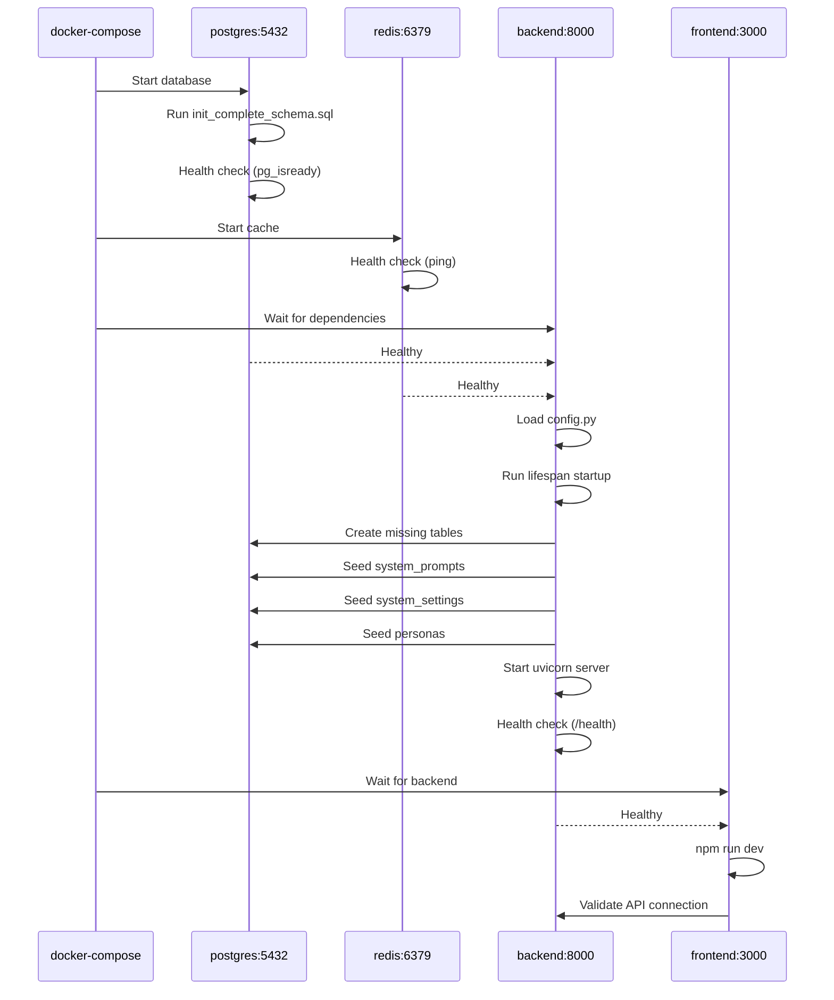
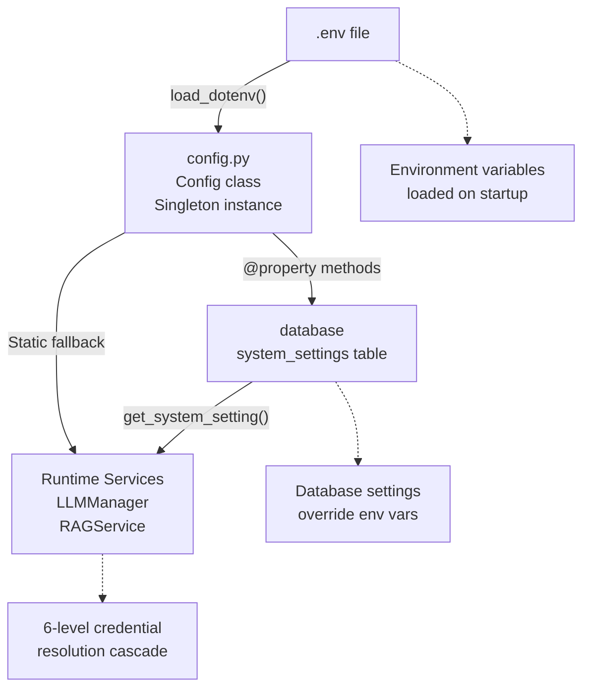

# Getting Started

<details>
<summary>Relevant source files</summary>

The following files were used as context for generating this wiki page:

- [docker-compose.yml](docker-compose.yml)
- [frontend/.dockerignore](frontend/.dockerignore)
- [frontend/Dockerfile](frontend/Dockerfile)
- [frontend/app/admin/plugins/page.tsx](frontend/app/admin/plugins/page.tsx)
- [frontend/lib/api-client.ts](frontend/lib/api-client.ts)
- [orchestrator/.env.example](orchestrator/.env.example)
- [orchestrator/Dockerfile](orchestrator/Dockerfile)
- [orchestrator/api/agent_plugins.py](orchestrator/api/agent_plugins.py)
- [orchestrator/config.py](orchestrator/config.py)
- [orchestrator/core/database/load_seed_data.py](orchestrator/core/database/load_seed_data.py)
- [orchestrator/core/redis/client.py](orchestrator/core/redis/client.py)
- [orchestrator/core/seeds/seed_personas.py](orchestrator/core/seeds/seed_personas.py)
- [orchestrator/core/seeds/seed_plugin_categories.py](orchestrator/core/seeds/seed_plugin_categories.py)
- [orchestrator/core/services/plugin_cache.py](orchestrator/core/services/plugin_cache.py)
- [orchestrator/main.py](orchestrator/main.py)
- [orchestrator/requirements.txt](orchestrator/requirements.txt)
- [scripts/ralph/prd.json](scripts/ralph/prd.json)

</details>


This guide provides a quick start for installing and running Automatos AI locally. It covers the essential prerequisites, environment setup, and first-time configuration needed to get the platform operational.

For detailed installation procedures, see [Installation & Setup](#2.1). For comprehensive configuration options, see [Configuration Guide](#2.2). For hands-on tutorials creating agents and workflows, see [Quick Start Tutorial](#2.3).

---

## Prerequisites

Before installing Automatos AI, ensure you have the following installed on your system:

| Requirement | Version | Purpose |
|------------|---------|---------|
| **Docker** | 20.10+ | Container orchestration |
| **Docker Compose** | 2.0+ | Multi-service management |
| **Git** | Any | Repository cloning |
| **Text Editor** | Any | `.env` file configuration |

**Required API Keys** (obtain before installation):
- **OpenAI API Key** or **Anthropic API Key** - At least one LLM provider required for agent execution
- **Clerk Account** (optional) - For multi-tenant authentication; can be disabled for local development by setting `REQUIRE_AUTH=false`

**System Resources:**
- **RAM:** 4GB minimum, 8GB recommended
- **Disk:** 10GB free space for Docker images and volumes
- **Network:** Internet connection for pulling images and accessing LLM APIs

Sources: [docker-compose.yml:1-280](), [orchestrator/.env.example:1-65](), [orchestrator/requirements.txt:1-108]()

---

## System Architecture Overview

Automatos AI follows a containerized multi-tier architecture with separate services for frontend, backend, database, cache, and workers.

### Docker Services Architecture

```mermaid
graph TB
    subgraph "Development Stack"
        Frontend["frontend:3000<br/>Next.js App Router<br/>Hot-reload enabled"]
        Backend["backend:8000<br/>FastAPI + Uvicorn<br/>--reload flag"]
        
        subgraph "Data Tier"
            PostgreSQL["postgres:5432<br/>pgvector/pgvector:pg16<br/>Volume: postgres_data"]
            Redis["redis:6379<br/>redis:7-alpine<br/>Volume: redis_data"]
        end
        
        subgraph "Workers (Optional)"
            WorkspaceWorker["workspace-worker:8081<br/>Sandboxed Execution<br/>Profile: workers"]
        end
        
        subgraph "Support Services"
            Gotenberg["gotenberg:3000<br/>Document Conversion<br/>Profile: all"]
            Adminer["adminer:8080<br/>DB Admin UI<br/>Profile: all"]
        end
    end
    
    Frontend -->|"HTTP API calls"| Backend
    Backend -->|"SQLAlchemy ORM"| PostgreSQL
    Backend -->|"Pub/Sub + Cache"| Redis
    Backend -->|"Document conversion"| Gotenberg
    WorkspaceWorker -->|"Task queue"| Redis
    WorkspaceWorker -->|"Metadata"| PostgreSQL
    Adminer -->|"Management"| PostgreSQL
    
    style Backend fill:#1a1a1a,stroke:#ff9966,stroke-width:2px
    style Frontend fill:#1a1a1a,stroke:#66ccff,stroke-width:2px
    style PostgreSQL fill:#1a1a1a,stroke:#99ff99,stroke-width:2px
    style Redis fill:#1a1a1a,stroke:#ffcc99,stroke-width:2px
```



**Service Dependencies:**
- `frontend` depends on `backend` being healthy
- `backend` depends on `postgres` + `redis` being healthy  
- `workspace-worker` depends on `postgres` + `redis` being healthy

**Docker Compose Profiles:**
- **default** - Core services only (`postgres`, `redis`, `backend`, `frontend`)
- **workers** - Adds `workspace-worker` for task execution
- **all** - Adds admin tools (`adminer`, `gotenberg`)

Sources: [docker-compose.yml:18-279](), [orchestrator/main.py:219-406]()

---

## Quick Start

### 1. Clone the Repository

```bash
git clone https://github.com/AutomatosAI/automatos-ai.git
cd automatos-ai
```

### 2. Create Environment File

Copy the example environment file and set required values:

```bash
cp orchestrator/.env.example .env
```

**Minimum Required Configuration** (edit `.env`):

```bash
# Database passwords (required)
POSTGRES_PASSWORD=your_secure_password_here
REDIS_PASSWORD=your_redis_password_here

# API security (required)
API_KEY=your_api_key_here

# LLM Provider (at least one required)
OPENAI_API_KEY=sk-...
# OR
ANTHROPIC_API_KEY=sk-ant-...

# Authentication (optional - disable for local dev)
REQUIRE_AUTH=false
```

**Important:** All LLM provider credentials (OpenAI, Anthropic, etc.) can be managed via the Settings UI after installation. Only one provider key is required initially in the `.env` file to bootstrap the system.

Sources: [orchestrator/.env.example:1-65](), [orchestrator/config.py:1-423]()

### 3. Start the Application

**Start core services:**
```bash
docker-compose up --build
```

**Or with workers enabled:**
```bash
docker-compose --profile workers up --build
```

**Or with all services (including admin tools):**
```bash
docker-compose --profile all up --build
```

The `--build` flag rebuilds images if any code has changed. Omit it for faster subsequent starts.

### Application Startup Flow



**Startup Duration:** 30-60 seconds on first run (includes image pulling and database initialization). Subsequent starts: 10-20 seconds.

Sources: [docker-compose.yml:78-138](), [orchestrator/main.py:219-335](), [orchestrator/core/database/load_seed_data.py:25-192]()

---

## Verification Steps

### 1. Check Service Health

All services should show healthy status:

```bash
docker-compose ps
```

Expected output:
```
NAME                      STATUS
automatos_backend         Up (healthy)
automatos_frontend        Up
automatos_postgres        Up (healthy)
automatos_redis           Up (healthy)
```

### 2. Access Health Endpoints

**Backend API health:**
```bash
curl http://localhost:8000/health
```

Expected response:
```json
{
  "status": "healthy",
  "version": "1.0.0",
  "services": {
    "database": "connected",
    "redis": "connected",
    "llm": "connected"
  }
}
```

**Frontend access:**
```bash
curl http://localhost:3000
```

Should return the Next.js HTML page (status 200).

### 3. View Logs

Check for any errors during startup:

```bash
# View all logs
docker-compose logs

# View specific service
docker-compose logs backend
docker-compose logs frontend

# Follow logs in real-time
docker-compose logs -f backend
```

**Expected log patterns:**
- Backend: `"Starting Automotas AI API Server..."` followed by `"Database ready"` and `"Dashboard services initialized successfully"`
- Frontend: `"ready started server on 0.0.0.0:3000"`

Sources: [orchestrator/main.py:200-335](), [docker-compose.yml:131-138]()

---

## Access the Application

### Web Interface

Open your browser and navigate to:

```
http://localhost:3000
```

**Default Access Modes:**

| Mode | Configuration | Access |
|------|---------------|--------|
| **Development (Auth Disabled)** | `REQUIRE_AUTH=false` | Direct access, no login required |
| **Production (Auth Enabled)** | `REQUIRE_AUTH=true` | Clerk authentication required |

### API Documentation

Interactive API documentation is available at:

```
http://localhost:8000/docs        # Swagger UI (default)
http://localhost:8000/redoc       # ReDoc alternative
```

The API docs show all available endpoints organized by tags (Agents, Workflows, Documents, etc.) with example requests and responses.

### Database Admin (Optional)

If started with `--profile all`, access Adminer at:

```
http://localhost:8080
```

**Login credentials:**
- **System:** PostgreSQL
- **Server:** `postgres`
- **Username:** `postgres`
- **Password:** (value from `.env` `POSTGRES_PASSWORD`)
- **Database:** `orchestrator_db`

Sources: [orchestrator/main.py:408-553](), [docker-compose.yml:223-236]()

---

## Initial Configuration

### 1. Configure LLM Providers (Settings UI)

After accessing the web interface, navigate to **Settings → Credentials** to add additional LLM provider keys:

**Supported Providers:**
- OpenAI (GPT-4, GPT-3.5)
- Anthropic (Claude 3 family)
- Google (Gemini)
- OpenRouter (100+ models)
- Azure OpenAI
- Cohere (for reranking)

### Configuration Loading Architecture



**Credential Resolution Order** (highest priority first):
1. User workspace credentials (Settings UI)
2. Workspace-level system settings
3. Global system settings
4. Environment variables from `.env`
5. Agent-specific model configuration
6. System defaults

Sources: [orchestrator/config.py:28-423](), [orchestrator/core/llm/manager.py]()(credential resolution)

### 2. Verify Database Schema

The database is automatically initialized on first startup with:

**Core Tables:**
- `agents` - Agent definitions and configurations
- `workflows` - Workflow templates
- `workflow_recipes` - Step-by-step execution recipes
- `documents` - Knowledge base documents
- `credentials` - Encrypted API keys
- `system_settings` - Platform configuration
- `system_prompts` - Prompt templates
- `personas` - Agent personality presets

**Seed Data Loaded:**
- System settings (LLM defaults, RAG thresholds)
- Credential types (provider schemas)
- Personas (10 predefined: Senior Engineer, Code Reviewer, etc.)
- Plugin categories (19 categories: code-review, testing, etc.)
- LLM models (OpenAI, Anthropic, Google model catalog)

**Verify seed data:**
```bash
docker-compose exec backend python -c "
from core.database.database import SessionLocal
from core.models.personas import Persona
db = SessionLocal()
count = db.query(Persona).count()
print(f'Personas loaded: {count}')
db.close()
"
```

Expected output: `Personas loaded: 10`

Sources: [orchestrator/core/database/load_seed_data.py:25-192](), [orchestrator/core/seeds/seed_personas.py:19-256](), [orchestrator/core/seeds/seed_plugin_categories.py:19-213]()

---

## First Steps

### 1. Create Your First Agent

**Via UI:**
1. Navigate to **Agents** in the sidebar
2. Click **New Agent**
3. Configure:
   - **Name:** "My First Agent"
   - **Description:** Brief description of purpose
   - **Model:** Select from available providers (e.g., `gpt-4o`)
   - **Persona:** Choose from predefined personas or create custom
4. Click **Create Agent**

**Via API:**
```bash
curl -X POST http://localhost:8000/api/agents \
  -H "Content-Type: application/json" \
  -H "X-Workspace-ID: 00000000-0000-0000-0000-000000000000" \
  -d '{
    "name": "My First Agent",
    "description": "Test agent for getting started",
    "model_config": {
      "model_id": "gpt-4o",
      "temperature": 0.7
    }
  }'
```

### 2. Test Agent in Chat

Navigate to **Chat** and select your agent from the dropdown. Send a test message to verify the agent responds correctly.

### 3. Explore Core Features

| Feature | Location | Purpose |
|---------|----------|---------|
| **Agents** | `/agents` | Create and manage AI agents |
| **Workflows** | `/workflows` | Design multi-step automation |
| **Recipes** | `/workflows/recipes` | Step-by-step guided workflows |
| **Documents** | `/documents` | Knowledge base management |
| **Tools** | `/tools` | Browse and connect Composio apps |
| **Analytics** | `/analytics` | Usage tracking and cost analysis |
| **Settings** | `/settings` | Credentials and configuration |

Sources: [orchestrator/api/agents.py](), [orchestrator/api/chat.py](), [frontend/app]() (route structure)

---

## Common Issues

### Port Conflicts

**Symptom:** `Error starting userland proxy: listen tcp4 0.0.0.0:3000: bind: address already in use`

**Solution:** Change ports in `.env`:
```bash
FRONTEND_PORT=3001  # Change from 3000
API_PORT=8001       # Change from 8000
```

Then restart: `docker-compose up`

### Missing API Keys

**Symptom:** Agent creation succeeds but chat fails with `No LLM credentials configured`

**Solution:** 
1. Go to **Settings → Credentials**
2. Add at least one LLM provider key
3. Test by sending a chat message

### Database Connection Errors

**Symptom:** Backend logs show `Failed to connect to database`

**Solution:**
1. Ensure `POSTGRES_PASSWORD` is set in `.env`
2. Check postgres service is healthy: `docker-compose ps postgres`
3. Restart postgres: `docker-compose restart postgres`

### Redis Connection Errors

**Symptom:** Backend logs show `Redis connection test failed`

**Solution:**
1. Ensure `REDIS_PASSWORD` is set in `.env`
2. Check redis service is healthy: `docker-compose ps redis`
3. Redis is optional - disable features by removing `REDIS_URL` from `.env`

Sources: [orchestrator/config.py:36-80](), [orchestrator/core/redis/client.py:149-198]()

---

## Development vs Production

### Development Mode (Default)

Configured in [docker-compose.yml:78-170]() with:
- **Hot-reload enabled** for both frontend and backend
- Source code mounted as volumes
- Development Dockerfile targets
- API docs enabled at `/docs`
- Less strict security headers

**Restart after code changes:**
```bash
# Backend auto-reloads (uvicorn --reload)
# Frontend auto-reloads (npm run dev)
# No restart needed unless changing dependencies
```

### Production Deployment

For production deployment to Railway, Heroku, or other platforms:
1. Use production Dockerfile targets
2. Set `ENVIRONMENT=production` in environment variables
3. Set `REQUIRE_AUTH=true` to enforce Clerk authentication
4. Configure external PostgreSQL and Redis services
5. Set `DATABASE_URL` and `REDIS_URL` for managed databases
6. Disable API docs by removing `NEXTAUTH_URL`

See [Deployment & Infrastructure](#15) for detailed production setup.

Sources: [orchestrator/Dockerfile:87-130](), [frontend/Dockerfile:83-115](), [docker-compose.yml:78-170]()

---

## Next Steps

Now that you have Automatos AI running locally, proceed to:

1. **[Installation & Setup](#2.1)** - Detailed installation procedures, troubleshooting, and advanced configuration
2. **[Configuration Guide](#2.2)** - Comprehensive guide to environment variables, system settings, and credential management
3. **[Quick Start Tutorial](#2.3)** - Step-by-step tutorial for creating agents, workflows, and recipes

**Core Documentation:**
- **[Agents](#3)** - Complete guide to agent creation, configuration, and lifecycle management
- **[Workflows & Recipes](#4)** - Multi-step workflow orchestration and recipe execution
- **[Knowledge Base & RAG](#5)** - Document management and retrieval-augmented generation
- **[Tools & Integrations](#6)** - Composio integration for 880+ external applications
- **[Chat Interface](#7)** - Real-time streaming chat with complexity assessment

**Advanced Topics:**
- **[Universal Router](#8)** - Six-tier intelligent agent routing system
- **[Workspace Execution](#9)** - Sandboxed code execution and GitHub integration
- **[Community Marketplace](#10)** - Plugin discovery and publication

Sources: [orchestrator/main.py:1-1341]() (complete application structure)

---