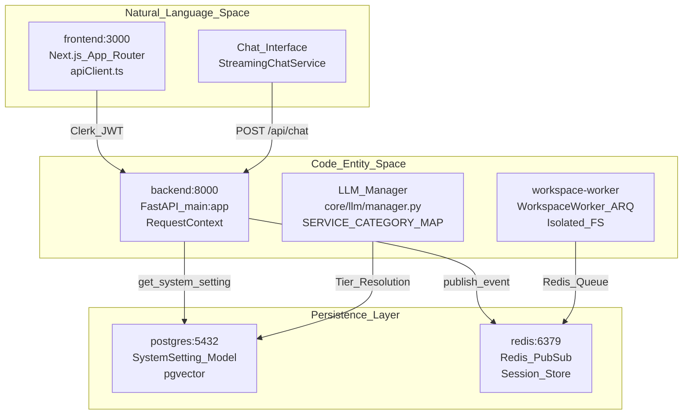
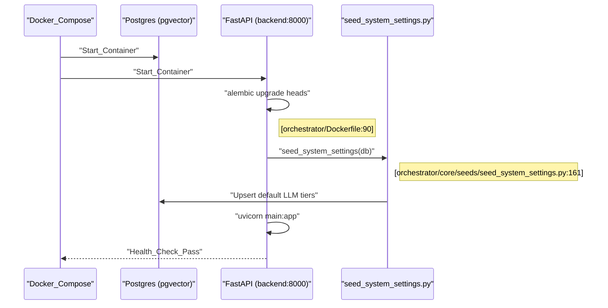

# Getting Started

<details>
<summary>Relevant source files</summary>

The following files were used as context for generating this wiki page:

- [docker-compose.yml](docker-compose.yml)
- [frontend/.dockerignore](frontend/.dockerignore)
- [frontend/Dockerfile](frontend/Dockerfile)
- [frontend/components/settings/GeneralSettingsTab.tsx](frontend/components/settings/GeneralSettingsTab.tsx)
- [frontend/components/settings/OnboardingAgentsTab.tsx](frontend/components/settings/OnboardingAgentsTab.tsx)
- [frontend/components/settings/SettingsPanel.tsx](frontend/components/settings/SettingsPanel.tsx)
- [frontend/components/settings/SystemSettingsTab.tsx](frontend/components/settings/SystemSettingsTab.tsx)
- [orchestrator/Dockerfile](orchestrator/Dockerfile)
- [orchestrator/api/chatbot_llm.py](orchestrator/api/chatbot_llm.py)
- [orchestrator/api/cloud_documents.py](orchestrator/api/cloud_documents.py)
- [orchestrator/api/onboarding_agents.py](orchestrator/api/onboarding_agents.py)
- [orchestrator/core/llm/manager.py](orchestrator/core/llm/manager.py)
- [orchestrator/core/models/system_settings.py](orchestrator/core/models/system_settings.py)
- [orchestrator/core/redis/client.py](orchestrator/core/redis/client.py)
- [orchestrator/core/seeds/seed_system_settings.py](orchestrator/core/seeds/seed_system_settings.py)
- [orchestrator/requirements.txt](orchestrator/requirements.txt)
- [orchestrator/scripts/create_test_workspace.py](orchestrator/scripts/create_test_workspace.py)

</details>


This guide provides a high-level roadmap for installing and running Automatos AI. It covers the essential prerequisites, environment setup, and the **Business Intake Wizard**—the primary entry point for configuring a new workspace and seeding system-level intelligence.

For detailed installation procedures, see [Installation & Setup](#2.1). For comprehensive configuration options, see [Configuration Guide](#2.2). For hands-on tutorials creating agents and workflows, see [Quick Start Tutorial](#2.3). For the automated onboarding flow, see [Business Intake Wizard](#2.4).

---

## Prerequisites

Before installing Automatos AI, ensure you have the following installed on your system:

| Requirement | Version | Purpose |
|------------|---------|---------|
| **Docker** | 20.10+ | Container orchestration |
| **Docker Compose** | 2.0+ | Multi-service management |
| **Node.js** | 20+ | Frontend development (optional) |
| **Python** | 3.11 | Backend development (optional) |

**Required API Keys**:
- **LLM Provider Key**: At least one key (OpenAI, Anthropic, or OpenRouter) is required for agent execution [orchestrator/requirements.txt:71-75]().
- **Clerk Authentication**: Required for multi-tenant identity and workspace isolation [docker-compose.yml:118-121]().
- **Platform API Key**: A secure `API_KEY` must be set for internal service communication [docker-compose.yml:116-116]().

Sources: [docker-compose.yml:4-16](), [orchestrator/Dockerfile:13-13](), [frontend/Dockerfile:14-14](), [orchestrator/requirements.txt:1-117]()

---

## System Architecture Overview

Automatos AI follows a containerized multi-tier architecture. The system bridges user intent to autonomous execution through specialized services including a dedicated `workspace-worker` for file-system isolation and an `agent-opt-worker` for prompt engineering.

### System Entity Map

This diagram maps the high-level system components to their specific code entities and network ports, bridging user-facing views to backend services.



**Service Dependencies:**
- **Backend**: Requires a healthy `postgres` (with `pgvector`) and `redis` instance to initialize connection pools [docker-compose.yml:85-89]().
- **LLM Management**: The `LLMManager` resolves configurations via `SystemSetting` entries, mapping services like `orchestrator` or `chatbot` to specific LLM tiers [orchestrator/core/llm/manager.py:33-53]().
- **Workspace Worker**: Operates as a background consumer for agent tasks, mounted to `workspace_data` for physical file isolation [docker-compose.yml:178-184]().

Sources: [docker-compose.yml:18-200](), [orchestrator/core/llm/manager.py:33-53](), [orchestrator/api/chatbot_llm.py:37-52]()

---

## Quick Start

### 1. Clone and Setup
```bash
git clone https://github.com/AutomatosAI/automatos-ai.git
cd automatos-ai
cp .env.example .env
```

### 2. Configure Environment
Edit the `.env` file. You must set `POSTGRES_PASSWORD`, `REDIS_PASSWORD`, and `API_KEY` [docker-compose.yml:29-116](). 

### 3. Start Services
```bash
# Standard startup (Core services)
docker-compose up --build

# Startup with execution workers (Required for physical workspace tasks)
docker-compose --profile workers up --build
```

### Application Boot Sequence

The sequence below illustrates the transition from container initialization to a ready-to-use system, including the critical `alembic` migration step that prevents schema drift.



Sources: [docker-compose.yml:22-138](), [orchestrator/Dockerfile:90-90](), [orchestrator/core/seeds/seed_system_settings.py:161-175]()

---

## Verification

### 1. Check Service Health
The platform uses Docker health checks to ensure availability across core services [docker-compose.yml:36-41]().
```bash
docker-compose ps
```

### 2. Backend API
- **Health Check**: `http://localhost:8000/health` [orchestrator/Dockerfile:78-79]().
- **Swagger Docs**: `http://localhost:8000/docs`

### 3. Frontend Access
The primary user interface is available at `http://localhost:3000` [docker-compose.yml:162]().

Sources: [docker-compose.yml:131-138](), [frontend/Dockerfile:107-108]()

---

## Initial Configuration Highlights

### 1. System Settings UI
Automatos AI replaces standard environment variables for LLM configuration with a database-backed `SystemSettingsTab` [frontend/components/settings/SystemSettingsTab.tsx:6-7](). This allows admins to configure providers (OpenRouter, OpenAI, Anthropic) and model tiers (Auto, System, Embeddings) without restarting the containers [orchestrator/core/seeds/seed_system_settings.py:29-34]().

### 2. Onboarding Agents
The system seeds "Mission Zero" onboarding agents (e.g., VOYAGER, BLUEPRINT) that drive the initial business intake flow [orchestrator/api/onboarding_agents.py:5-9](). These are managed via the `OnboardingAgentsTab` in the admin settings [frontend/components/settings/OnboardingAgentsTab.tsx:51-52]().

### 3. LLM Tiering (PRD-136)
To optimize cost and performance, the system collapses 12 LLM silos into 3 tiers:
- **Auto**: Premium reasoning for the orchestrator [orchestrator/core/llm/manager.py:35-36]().
- **System**: Cheap-fast models for internal tasks like RAG and CodeGraph [orchestrator/core/llm/manager.py:39-49]().
- **Embeddings**: Dedicated vectorization models [orchestrator/core/llm/manager.py:52-52]().

Sources: [orchestrator/core/llm/manager.py:29-53](), [frontend/components/settings/SystemSettingsTab.tsx:1-50](), [orchestrator/api/onboarding_agents.py:1-45]()

---

## Next Steps

1. **[Installation & Setup](#2.1)** — Detailed Docker configurations and multi-stage build logic.
2. **[Configuration Guide](#2.2)** — Environment variables, Clerk auth, and LLM tier tuning.
3. **[Quick Start Tutorial](#2.3)** — Create your first agent and connect tools via Composio.
4. **[Business Intake Wizard](#2.4)** — Deep dive into the 7-step onboarding flow.

---