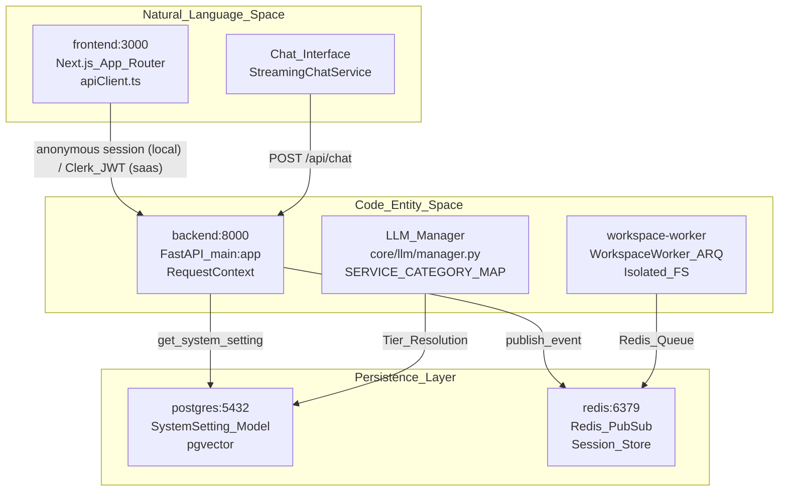

# Getting Started

<details>
<summary>Relevant source files</summary>

The following files were used as context for generating this wiki page:

- [docker-compose.yml](docker-compose.yml)
- [frontend/.dockerignore](frontend/.dockerignore)
- [frontend/Dockerfile](frontend/Dockerfile)
- [frontend/components/settings/GeneralSettingsTab.tsx](frontend/components/settings/GeneralSettingsTab.tsx)
- [frontend/components/settings/OnboardingAgentsTab.tsx](frontend/components/settings/OnboardingAgentsTab.tsx)
- [frontend/components/settings/SettingsPanel.tsx](frontend/components/settings/SettingsPanel.tsx)
- [frontend/components/settings/SystemSettingsTab.tsx](frontend/components/settings/SystemSettingsTab.tsx)
- [orchestrator/Dockerfile](orchestrator/Dockerfile)
- [orchestrator/api/chatbot_llm.py](orchestrator/api/chatbot_llm.py)
- [orchestrator/api/cloud_documents.py](orchestrator/api/cloud_documents.py)
- [orchestrator/api/onboarding_agents.py](orchestrator/api/onboarding_agents.py)
- [orchestrator/core/llm/manager.py](orchestrator/core/llm/manager.py)
- [orchestrator/core/models/system_settings.py](orchestrator/core/models/system_settings.py)
- [orchestrator/core/redis/client.py](orchestrator/core/redis/client.py)
- [orchestrator/core/seeds/seed_system_settings.py](orchestrator/core/seeds/seed_system_settings.py)
- [orchestrator/requirements.txt](orchestrator/requirements.txt)
- [orchestrator/scripts/create_test_workspace.py](orchestrator/scripts/create_test_workspace.py)

</details>


This guide provides a high-level roadmap for installing and running Automatos AI. It covers the essential prerequisites, environment setup, and the **Business Intake Wizard**—the primary entry point for configuring a new workspace and seeding system-level intelligence.

> **The reference for running the platform yourself is [Self-hosting — the local edition](self-hosting.md).** It covers every service and port, the three required secrets, the worker's host-access directory, object storage, the optional Composio key, what the local edition does not include, updating, resetting and troubleshooting. This page and its siblings summarise; the guide is authoritative where they differ.

For detailed installation procedures, see [Installation & Setup](installation-setup.md). For comprehensive configuration options, see [Configuration Guide](configuration-guide.md). For hands-on tutorials creating agents and Playbooks, see [Quick Start Tutorial](quick-start-tutorial.md). For the automated onboarding flow, see [Business Intake Wizard](business-intake-wizard.md).

---

## Prerequisites

| Requirement | Purpose |
|------------|---------|
| **Docker** with the **Compose v2** plugin (`docker compose`) | Runs the whole stack; the compose file uses v2 syntax |
| **Git** | Cloning and updates |
| ~10 GB disk | Images (the workspace-worker image is the largest) and data volumes |

**Required values** (the only ones compose refuses to start without): `POSTGRES_PASSWORD`, `REDIS_PASSWORD`, `API_KEY` in `.env` [docker-compose.yml]().

**Recommended**: one LLM key — `OPENAI_API_KEY`, `ANTHROPIC_API_KEY` or `OPENROUTER_API_KEY` in `.env`, or added later under Settings → API Keys. Agents, chat and embeddings have no model to call until one exists.

**Not required locally**: Clerk. The local edition runs with `AUTH_EDITION=local` (set in `envs/api.defaults`) — no login, one operator, one workspace. Clerk is the hosted edition's identity provider and is only required when `AUTH_EDITION=saas` [orchestrator/config.py]() (`validate_auth_edition`).

Sources: [docker-compose.yml](), [envs/api.defaults](), [orchestrator/config.py]()

---

## System Architecture Overview

Automatos AI follows a containerized multi-tier architecture. The local compose stack runs Postgres (with pgvector), Redis, MinIO (S3-compatible object storage), the FastAPI backend, the Next.js frontend and the `workspace-worker` — the Code Canvas runtime, which acts on files in a host directory (`AUTOMATOS_WORKSPACE_DIR`, default `./workspaces`) bind-mounted into the container. The `agent-opt-worker` (prompt optimisation) is part of the hosted deployment only.

### System Entity Map

This diagram maps the high-level system components to their specific code entities and network ports, bridging user-facing views to backend services.



**Service Dependencies:**
- **Backend**: Requires a healthy `postgres` (with `pgvector`), `redis` and `minio` instance before it starts [docker-compose.yml]().
- **LLM Management**: The `LLMManager` resolves configurations via `SystemSetting` entries, mapping services like `orchestrator` or `chatbot` to specific LLM tiers [orchestrator/core/llm/manager.py:33-53]().
- **Workspace Worker**: Runs in the default compose profile. The host directory `AUTOMATOS_WORKSPACE_DIR` (default `./workspaces`) is bind-mounted at `/workspaces` — read-write in the worker, read-only in the backend; every Code Canvas tool call is confined to the workspace's subdirectory and mutations need approval [docker-compose.yml](), [services/workspace-worker/worker_config.py]().

Sources: [docker-compose.yml](), [orchestrator/core/llm/manager.py:33-53](), [orchestrator/api/chatbot_llm.py:37-52]()

---

## Quick Start

### 1. Clone and Setup
```bash
git clone https://github.com/AutomatosAI/automatos-ai.git
cd automatos-ai
cp .env.example .env
```

### 2. Configure Environment
Edit the `.env` file. You must set `POSTGRES_PASSWORD`, `REDIS_PASSWORD`, and `API_KEY` [docker-compose.yml](); add one LLM key when you want AI features.

### 3. Start Services
```bash
# The default profile: postgres, redis, minio, backend, frontend, workspace-worker
docker compose up

# Add Adminer (database GUI, :8080) and Gotenberg (document conversion, :3001)
docker compose --profile all up
```

There is no separate workers profile any more — the workspace-worker is part of the default stack.

### Application Boot Sequence

The backend entrypoint (`docker-entrypoint.sh`) owns the schema lifecycle: it waits for Postgres, builds the schema on an empty database (`python -m scripts.init_fresh_db`), applies migrations, seeds, ensures the local workspace and operator exist, and only then starts `uvicorn`.

```mermaid
sequenceDiagram
    participant DC as "Docker_Compose"
    participant DB as "Postgres (pgvector)"
    participant BE as "FastAPI (backend:8000)"
    participant Seed as "core.database.load_seed_data"

    DC->>DB: "Start_Container"
    DC->>BE: "Start_Container (after postgres, redis, minio healthy)"
    BE->>DB: "empty? python -m scripts.init_fresh_db (models + migration replay, stamp heads)"
    BE->>DB: "alembic upgrade heads (fail-closed)"
    BE->>Seed: "python -m core.database.load_seed_data (idempotent)"
    Seed->>DB: "system settings, models, skills, personas, catalogue, local first-run content"
    BE->>DB: "ensure local workspace + operator user"
    BE->>BE: "uvicorn main:app"
    BE-->>DC: "Health_Check_Pass (/health); /health/ready 200 after full boot"
```

Sources: [docker-entrypoint.sh](), [orchestrator/scripts/init_fresh_db.py](), [orchestrator/core/database/load_seed_data.py]()

---

## Verification

### 1. Check Service Health
The platform uses Docker health checks to ensure availability across core services [docker-compose.yml]().
```bash
docker compose ps
```

### 2. Backend API
- **Liveness**: `http://localhost:8000/health` — 200 as soon as the API process answers.
- **Readiness**: `http://localhost:8000/health/ready` — 503 until the full boot has finished, then 200 [orchestrator/main.py]().
- **Swagger Docs**: `http://localhost:8000/docs`

### 3. Frontend Access
The primary user interface is available at `http://localhost:3000` [docker-compose.yml](). No login: the local edition lands in its single workspace, seeded with Auto, a starter roster (Researcher, Writer, Analyst), the *Two-minute brief* Playbook and a welcome Deliverable. Set the operator's name under Settings → Profile.

Sources: [docker-compose.yml](), [orchestrator/main.py](), [orchestrator/core/seeds/seed_local_first_run.py]()

---

## Initial Configuration Highlights

### 1. System Settings UI
Automatos AI replaces standard environment variables for LLM configuration with a database-backed `SystemSettingsTab` [frontend/components/settings/SystemSettingsTab.tsx:6-7](). This allows admins to configure providers (OpenRouter, OpenAI, Anthropic) and model tiers (Auto, System, Embeddings) without restarting the containers [orchestrator/core/seeds/seed_system_settings.py:29-34]().

### 2. Onboarding Agents
The system seeds "Mission Zero" onboarding agents (e.g., VOYAGER, BLUEPRINT) that drive the initial business intake flow [orchestrator/api/onboarding_agents.py:5-9](). These are managed via the `OnboardingAgentsTab` in the admin settings [frontend/components/settings/OnboardingAgentsTab.tsx:51-52]().

### 3. LLM Tiering (PRD-136)
To optimize cost and performance, the system collapses 12 LLM silos into 3 tiers:
- **Auto**: Premium reasoning for the orchestrator [orchestrator/core/llm/manager.py:35-36]().
- **System**: Cheap-fast models for internal tasks like RAG and CodeGraph [orchestrator/core/llm/manager.py:39-49]().
- **Embeddings**: Dedicated vectorization models [orchestrator/core/llm/manager.py:52-52]().

Sources: [orchestrator/core/llm/manager.py:29-53](), [frontend/components/settings/SystemSettingsTab.tsx:1-50](), [orchestrator/api/onboarding_agents.py:1-45]()

---

## Next Steps

1. **[Self-hosting — the local edition](self-hosting.md)** — the full reference: services, dials, storage, the worker, Composio, troubleshooting, editions.
2. **[Installation & Setup](installation-setup.md)** — Docker configurations and multi-stage build logic.
3. **[Configuration Guide](configuration-guide.md)** — Where configuration lives, LLM tier tuning, memory parameters.
4. **[Quick Start Tutorial](quick-start-tutorial.md)** — Create your first agent, connect tools, run a Playbook.
5. **[Business Intake Wizard](business-intake-wizard.md)** — Deep dive into the 7-step onboarding flow.

---