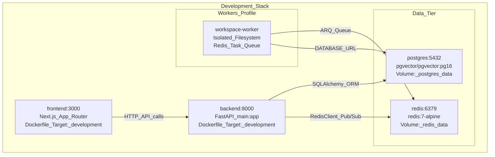
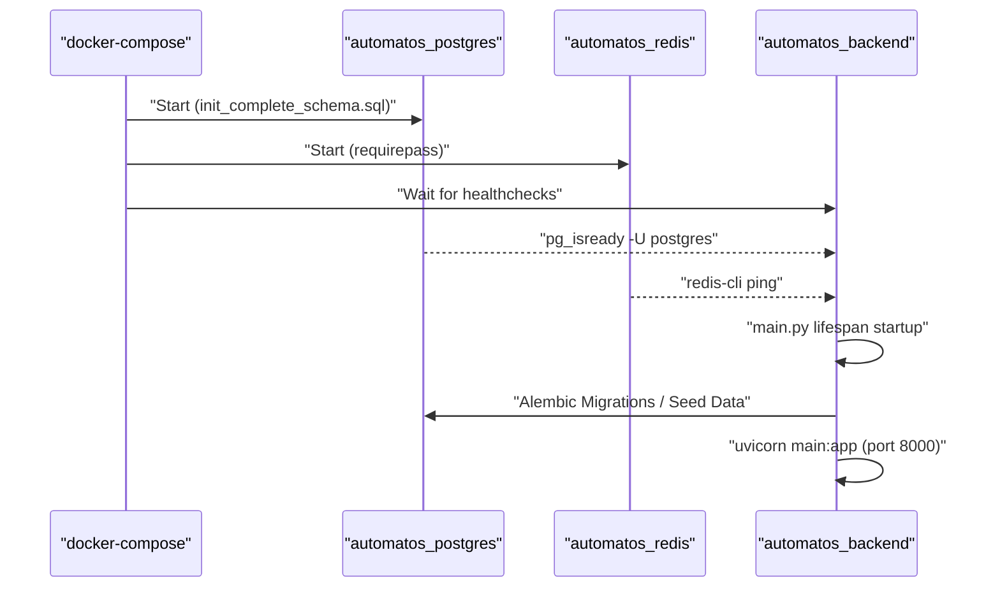

# Getting Started

<details>
<summary>Relevant source files</summary>

The following files were used as context for generating this wiki page:

- [.gitignore](.gitignore)
- [README.md](README.md)
- [docker-compose.yml](docker-compose.yml)
- [docs/PRDS/126-BUSINESS-KNOWLEDGE-GRAPH.md](docs/PRDS/126-BUSINESS-KNOWLEDGE-GRAPH.md)
- [docs/README.md](docs/README.md)
- [frontend/.dockerignore](frontend/.dockerignore)
- [frontend/Dockerfile](frontend/Dockerfile)
- [orchestrator/.env.example](orchestrator/.env.example)
- [orchestrator/Dockerfile](orchestrator/Dockerfile)
- [orchestrator/api/cloud_documents.py](orchestrator/api/cloud_documents.py)
- [orchestrator/core/credentials/service.py](orchestrator/core/credentials/service.py)
- [orchestrator/core/models/credentials.py](orchestrator/core/models/credentials.py)
- [orchestrator/core/redis/client.py](orchestrator/core/redis/client.py)
- [orchestrator/core/services/plugin_cache.py](orchestrator/core/services/plugin_cache.py)
- [orchestrator/modules/tools/services/__init__.py](orchestrator/modules/tools/services/__init__.py)
- [orchestrator/requirements.txt](orchestrator/requirements.txt)

</details>


This guide provides a high-level roadmap for installing and running Automatos AI. It covers the essential prerequisites, environment setup, and first-time configuration needed to get the platform operational.

For detailed installation procedures, see [Installation & Setup](#2.1). For comprehensive configuration options, see [Configuration Guide](#2.2). For hands-on tutorials creating agents and workflows, see [Quick Start Tutorial](#2.3).

---

## Prerequisites

Before installing Automatos AI, ensure you have the following installed on your system:

| Requirement | Version | Purpose |
|------------|---------|---------|
| **Docker** | 20.10+ | Container orchestration |
| **Docker Compose** | 2.0+ | Multi-service management |
| **Git** | Any | Repository cloning |

**Required API Keys**:
- **OpenAI API Key** or **Anthropic API Key** - At least one LLM provider is required for agent execution [orchestrator/.env.example:18-21]().
- **Clerk Account** (optional) - For multi-tenant authentication; can be disabled for local development by setting `REQUIRE_AUTH=false` [orchestrator/.env.example:33]().

Sources: [docker-compose.yml:4-16](), [orchestrator/.env.example:1-65](), [orchestrator/requirements.txt:1-110]()

---

## System Architecture Overview

Automatos AI follows a containerized multi-tier architecture with separate services for frontend, backend, database, cache, and workers.

### Docker Services Architecture



**Service Dependencies:**
- `frontend` depends on `backend` being healthy [docker-compose.yml:153-155]().
- `backend` depends on `postgres` (healthy) and `redis` (healthy) [docker-compose.yml:85-89]().
- `workspace-worker` depends on `postgres` and `redis` [docker-compose.yml:185-189]().

Sources: [docker-compose.yml:18-200](), [orchestrator/Dockerfile:57-86](), [frontend/Dockerfile:31-49]()

---

## Quick Start

### 1. Clone and Setup
```bash
git clone https://github.com/AutomatosAI/automatos-ai.git
cd automatos-ai
cp orchestrator/.env.example .env
```

### 2. Configure Environment
Edit the `.env` file with your credentials. At minimum, set `POSTGRES_PASSWORD`, `REDIS_PASSWORD`, and `API_KEY` [docker-compose.yml:10-11]().

### 3. Start Services
```bash
# Start core services
docker-compose up --build

# Or with worker profiles enabled for code execution
docker-compose --profile workers up --build
```

### Application Startup Flow



Sources: [docker-compose.yml:22-138](), [orchestrator/Dockerfile:121-129](), [orchestrator/core/redis/client.py:121-135]()

---

## Verification

### 1. Check Service Health
Verify all containers are running and healthy:
```bash
docker-compose ps
```

### 2. Backend Health Endpoint
The backend provides a health check at `/health` [orchestrator/Dockerfile:78-79]().
```bash
curl http://localhost:8000/health
```

### 3. Frontend Access
The Next.js frontend is accessible at `http://localhost:3000` [docker-compose.yml:162]().

Sources: [docker-compose.yml:131-138](), [frontend/Dockerfile:107-108]()

---

## Initial Configuration

### 1. Credential Management
Automatos AI uses a centralized `CredentialStore` [orchestrator/core/credentials/service.py:42]() to manage encrypted API keys for LLM providers and third-party tools. Credentials are encrypted using an `EncryptionService` before being stored in the `credentials` table [orchestrator/core/models/credentials.py:65]().

### 2. Cloud Storage & RAG
For RAG capabilities, the platform integrates with S3 via `S3_VECTORS_ENABLED` [orchestrator/.env.example:64](). Users can manage cloud document sync through the `cloud-documents` API router [orchestrator/api/cloud_documents.py:25]().

### 3. Redis Pub/Sub
Real-time updates for workflows and chat are handled via `RedisClient` [orchestrator/core/redis/client.py:14](), which manages a connection pool for publishing events to channels like `workflow:{id}:execution:{id}` [orchestrator/core/redis/client.py:110]().

### 4. Knowledge Graph Integration
The platform includes `GraphifyService` for building relational knowledge graphs from documents and code [docs/PRDS/126-BUSINESS-KNOWLEDGE-GRAPH.md:68](). This provides agents with relational context alongside standard RAG retrieval.

Sources: [orchestrator/core/models/credentials.py:60-90](), [orchestrator/core/redis/client.py:14-32](), [orchestrator/api/cloud_documents.py:1-25](), [docs/PRDS/126-BUSINESS-KNOWLEDGE-GRAPH.md:1-80]()

---

## Next Steps

Now that the platform is running, explore the following child pages for deep-dives:

1. **[Installation & Setup](#2.1)** — Detailed Docker configurations, `requirements.txt` breakdown, and dependency management.
2. **[Configuration Guide](#2.2)** — Environment variables, credential encryption, and service-specific tuning (S3, Redis, Postgres).
3. **[Quick Start Tutorial](#2.3)** — Create your first agent, connect tools via Composio, and execute a multi-agent workflow.

For architectural details, refer to the **[Backend Architecture](#18)** and **[Frontend Architecture](#19)** pages.

Sources: [orchestrator/requirements.txt:1-110](), [README.md:96-107]()

---