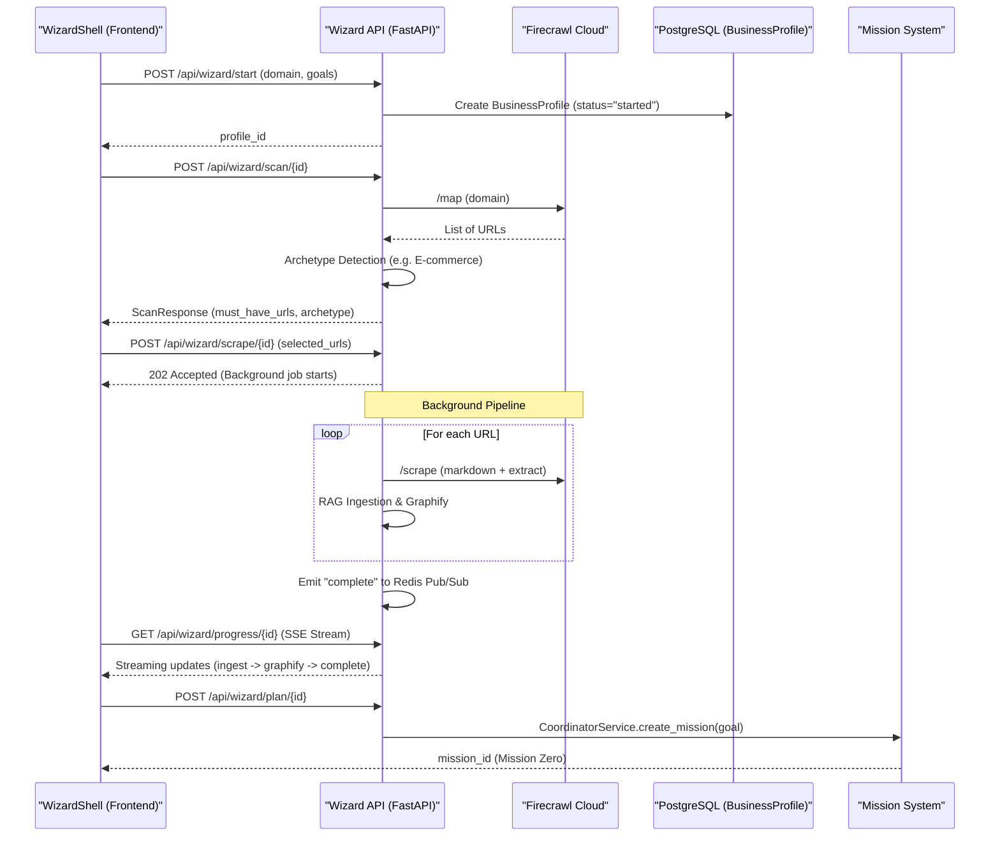
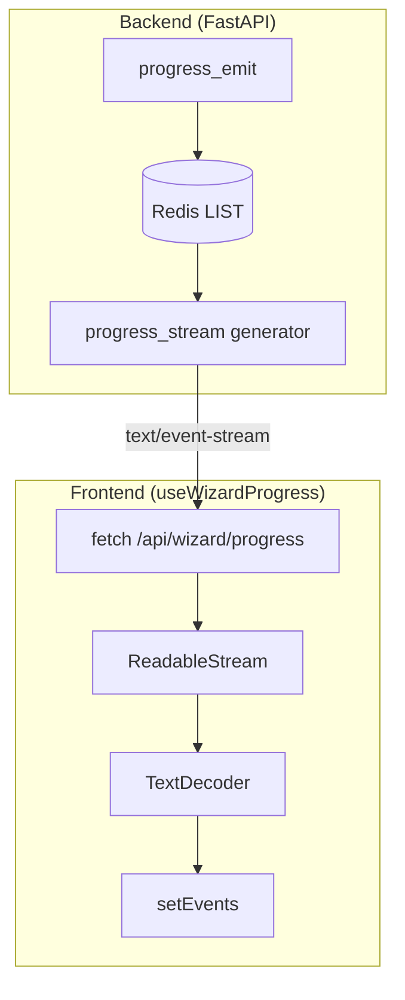

# Business Intake Wizard

Relevant source files

The following files were used as context for generating this wiki page:

- [docs/PRDS/130-BUSINESS-INTAKE-WIZARD-POC.md](docs/PRDS/130-BUSINESS-INTAKE-WIZARD-POC.md)
- [docs/audits/prd-research-status-review-2026-04-11.md](docs/audits/prd-research-status-review-2026-04-11.md)
- [frontend/app/onboarding/wizard/page.tsx](frontend/app/onboarding/wizard/page.tsx)
- [frontend/components/settings/ApiKeysSettingsTab.tsx](frontend/components/settings/ApiKeysSettingsTab.tsx)
- [frontend/components/wizard/step-1-goals.tsx](frontend/components/wizard/step-1-goals.tsx)
- [frontend/components/wizard/step-2-domain.tsx](frontend/components/wizard/step-2-domain.tsx)
- [frontend/components/wizard/step-3-scanning.tsx](frontend/components/wizard/step-3-scanning.tsx)
- [frontend/components/wizard/step-4-page-checklist.tsx](frontend/components/wizard/step-4-page-checklist.tsx)
- [frontend/components/wizard/step-5-intake.tsx](frontend/components/wizard/step-5-intake.tsx)
- [frontend/components/wizard/step-6-profile-editor.tsx](frontend/components/wizard/step-6-profile-editor.tsx)
- [frontend/components/wizard/wizard-progress-feed.tsx](frontend/components/wizard/wizard-progress-feed.tsx)
- [frontend/components/wizard/wizard-shell.tsx](frontend/components/wizard/wizard-shell.tsx)
- [frontend/hooks/use-wizard-api.ts](frontend/hooks/use-wizard-api.ts)
- [frontend/hooks/use-wizard-progress.ts](frontend/hooks/use-wizard-progress.ts)
- [orchestrator/alembic/versions/drop_agents_model_config_default.py](orchestrator/alembic/versions/drop_agents_model_config_default.py)
- [orchestrator/alembic/versions/prd130_business_profile.py](orchestrator/alembic/versions/prd130_business_profile.py)
- [orchestrator/alembic/versions/prd130_workspace_graphs.py](orchestrator/alembic/versions/prd130_workspace_graphs.py)
- [orchestrator/api/user_api_keys.py](orchestrator/api/user_api_keys.py)
- [orchestrator/api/wizard.py](orchestrator/api/wizard.py)
- [orchestrator/core/database/add_missing_agent_columns.sql](orchestrator/core/database/add_missing_agent_columns.sql)
- [orchestrator/core/graph_storage.py](orchestrator/core/graph_storage.py)
- [orchestrator/core/models/business_profiles.py](orchestrator/core/models/business_profiles.py)
- [orchestrator/core/seeds/seed_onboarding_agents.py](orchestrator/core/seeds/seed_onboarding_agents.py)
- [orchestrator/modules/intake/__init__.py](orchestrator/modules/intake/__init__.py)
- [orchestrator/modules/intake/archetypes.py](orchestrator/modules/intake/archetypes.py)
- [orchestrator/modules/intake/firecrawl_client.py](orchestrator/modules/intake/firecrawl_client.py)
- [orchestrator/modules/intake/plan_generator.py](orchestrator/modules/intake/plan_generator.py)
- [orchestrator/modules/intake/progress.py](orchestrator/modules/intake/progress.py)

The **Business Intake Wizard** (PRD-130) is a multi-step onboarding flow designed to bootstrap a new workspace by autonomously researching a business domain, ingesting its public data into RAG and Knowledge Graph layers, and launching "Mission Zero" to configure the initial agent team.

## Overview

The wizard implements a 7-step pipeline that moves from high-level intent to a fully initialized AI environment. To prevent timeout issues during long-running website scrapes (which can take ~15 minutes), the system uses an asynchronous background pipeline that communicates progress to the frontend via a Server-Sent Events (SSE) feed `[orchestrator/api/wizard.py:14-17]()`.

### Key Components
- **WizardShell**: The React container managing step transitions and state `[frontend/components/wizard/wizard-shell.tsx:72-72]()`.
- **BusinessProfile**: The database model storing domain info, extracted sectors, and quality findings `[orchestrator/core/models/business_profiles.py]()`.
- **FirecrawlClient**: A domain-locked crawler for URL discovery (`/map`) and content extraction (`/scrape`) `[orchestrator/modules/intake/firecrawl_client.py:32-32]()`.
- **Plan Generator**: Translates the profile into a "Mission Zero" goal for the coordinator `[orchestrator/modules/intake/plan_generator.py:42-42]()`.
- **DbWorkspaceClient**: A Postgres-backed storage adapter used for Knowledge Graph artifacts when a workspace worker container is not yet provisioned `[orchestrator/core/graph_storage.py:41-41]()`.

---

## Data Flow & Architecture

The wizard bridges the gap between a user's URL and a functional multi-agent workspace.

### Technical Sequence Diagram

"Business Intake Wizard Flow"

Sources: `[orchestrator/api/wizard.py:5-18]()`, `[frontend/components/wizard/wizard-shell.tsx:105-147]()`, `[orchestrator/modules/intake/firecrawl_client.py:79-144]()`

---

## Implementation Details

### 1. The Onboarding Pipeline
The pipeline is divided into logical stages tracked by the `progress.py` module:
- **SCAN**: Discovery of site structure via Firecrawl `[orchestrator/api/wizard.py:57-57]()`.
- **SCRAPE**: Deep extraction of page content `[orchestrator/api/wizard.py:58-58]()`.
- **INGEST**: Vectorization of markdown into RAG storage `[orchestrator/api/wizard.py:54-54]()`.
- **GRAPHIFY**: Building entity relationships in the Knowledge Graph `[orchestrator/api/wizard.py:53-53]()`.
- **PLAN**: Generating the Mission Zero draft `[orchestrator/api/wizard.py:55-55]()`.

### 2. Progress Streaming (SSE)
Because standard `EventSource` does not support custom headers (required for Clerk auth), the frontend uses a `fetch` with a `ReadableStream` to consume the SSE feed. The background pipeline emits progress to Redis, which is then streamed to the client `[frontend/components/wizard/wizard-shell.tsx:13-17]()`.

"Progress Feed Implementation"

Sources: `[frontend/hooks/use-wizard-progress.ts:7-23]()`, `[orchestrator/modules/intake/progress.py]()`, `[frontend/components/wizard/wizard-shell.tsx:85-88]()`

### 3. Mission Zero Generation
Mission Zero is a real mission, not a hardcoded script. The `plan_generator.py` takes the `BusinessProfile` and constructs a natural language goal string `[orchestrator/modules/intake/plan_generator.py:6-9]()`. This goal string mandates the use of four specific onboarding agents:

| Agent | Role | Responsibility |
| :--- | :--- | :--- |
| **VOYAGER** | Researcher | Deep business & market research using web tools `[orchestrator/core/seeds/seed_onboarding_agents.py:27-44]()` |
| **BLUEPRINT** | Architect | Evidence extraction from RAG/Graph and workspace design `[orchestrator/core/seeds/seed_onboarding_agents.py:71-87]()` |
| **SCRIBE** | Writer | Brand voice, SOPs, and onboarding brief synthesis `[orchestrator/core/seeds/seed_onboarding_agents.py:127-130]()` |
| **FORGE** | Builder | Workspace configuration and team proposal `[orchestrator/modules/intake/plan_generator.py:88-88]()` |

Sources: `[orchestrator/modules/intake/plan_generator.py:83-91]()`, `[orchestrator/core/seeds/seed_onboarding_agents.py:25-136]()`

---

## Key Functions and Models

### BusinessProfile Model
Stores the state of the intake and results of the research.
- `domain`: The target business domain `[orchestrator/api/wizard.py:205-205]()`.
- `archetype`: Detected business type (e.g., "SaaS", "Agency") `[orchestrator/api/wizard.py:88-88]()`.
- `quality_findings`: JSONB field containing errors or notes discovered during scraping `[frontend/hooks/use-wizard-api.ts:75-75]()`.

### API Endpoints (`/api/wizard`)
- `POST /start`: Initializes the profile and verifies domain matching against the user's email domain `[orchestrator/api/wizard.py:182-196]()`.
- `POST /scan/{profile_id}`: Runs Firecrawl map and detects the business archetype using matched signals `[orchestrator/api/wizard.py:8-8]()`.
- `POST /scrape/{profile_id}`: Accepts a list of URLs and triggers the background ingestion pipeline `[orchestrator/api/wizard.py:9-9]()`.
- `POST /plan/{profile_id}`: Converts the profile into a Mission Zero goal and launches the coordinator `[orchestrator/api/wizard.py:12-12]()`.

### Bring Your Own Key (BYOK) Integration
During onboarding, users can provide their own LLM API keys. These are encrypted at rest using `EncryptionService` and stored in the `user_api_keys` table `[orchestrator/api/user_api_keys.py:5-7]()`. The wizard uses these keys if `byok_overrides` is enabled for the workspace `[orchestrator/api/user_api_keys.py:120-132]()`.

Sources: `[orchestrator/api/wizard.py:7-17]()`, `[orchestrator/core/models/business_profiles.py]()`, `[orchestrator/api/user_api_keys.py:94-137]()`

---

## Troubleshooting & Constraints
- **Domain Verification**: Checks if the user's email domain matches the target. This can be bypassed by setting `WIZARD_REQUIRE_DOMAIN_VERIFY=False` `[orchestrator/api/wizard.py:146-156]()`.
- **Firecrawl Limits**: Discovery and scraping are capped by `FIRECRAWL_MAX_PAGES_PER_SCAN` (default 20) to control costs `[orchestrator/modules/intake/firecrawl_client.py:46-53]()`.
- **Model Configuration**: To avoid context window issues (e.g., 8K limit on legacy `gpt-4`), hardcoded defaults on `agents.model_config` were dropped in favor of dynamic resolution via `AgentFactory` `[orchestrator/alembic/versions/drop_agents_model_config_default.py:1-18]()`.
- **Graph Persistence**: For new workspaces without an active worker container, `DbWorkspaceClient` ensures Knowledge Graph data is persisted to the `workspace_graphs` table in Postgres `[orchestrator/core/graph_storage.py:11-19]()`.

Sources: `[orchestrator/api/wizard.py:148-156]()`, `[orchestrator/modules/intake/firecrawl_client.py:131-137]()`, `[orchestrator/alembic/versions/drop_agents_model_config_default.py:14-22]()`, `[orchestrator/core/graph_storage.py:11-19]()`

---