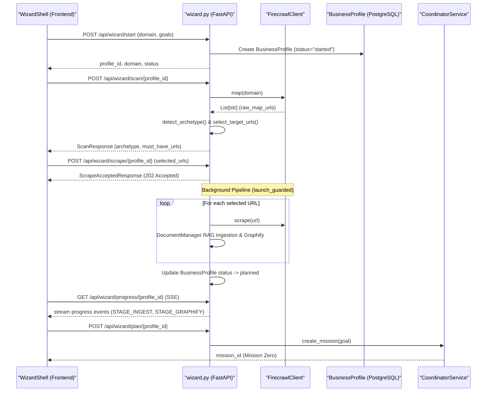
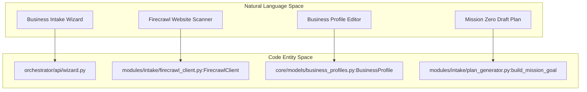

# Business Intake Wizard

<details>
<summary>Relevant source files</summary>

The following files were used as context for generating this wiki page:

- [docs/PRDS/130-BUSINESS-INTAKE-WIZARD-POC.md](docs/PRDS/130-BUSINESS-INTAKE-WIZARD-POC.md)
- [docs/audits/prd-research-status-review-2026-04-11.md](docs/audits/prd-research-status-review-2026-04-11.md)
- [orchestrator/alembic/versions/drop_agents_model_config_default.py](orchestrator/alembic/versions/drop_agents_model_config_default.py)
- [orchestrator/alembic/versions/prd130_business_profile.py](orchestrator/alembic/versions/prd130_business_profile.py)
- [orchestrator/api/wizard.py](orchestrator/api/wizard.py)
- [orchestrator/core/database/add_missing_agent_columns.sql](orchestrator/core/database/add_missing_agent_columns.sql)
- [orchestrator/core/models/business_profiles.py](orchestrator/core/models/business_profiles.py)
- [orchestrator/modules/intake/__init__.py](orchestrator/modules/intake/__init__.py)
- [orchestrator/modules/intake/firecrawl_client.py](orchestrator/modules/intake/firecrawl_client.py)
- [orchestrator/modules/intake/plan_generator.py](orchestrator/modules/intake/plan_generator.py)

</details>


The **Business Intake Wizard** (PRD-130) is a multi-step onboarding flow designed to bootstrap a new workspace by autonomously researching a business domain, ingesting its public data into RAG and Knowledge Graph layers, and launching "Mission Zero" to configure the initial agent team `[docs/PRDS/130-BUSINESS-INTAKE-WIZARD-POC.md:1-8]()`.

## Overview

The wizard implements an onboarding pipeline that moves from high-level user intent to a fully initialized AI workspace. To prevent timeout issues during long-running website scrapes (which can take significant time on medium-to-large sites), the system uses an asynchronous background pipeline that communicates progress to the frontend via a Server-Sent Events (SSE) feed `[orchestrator/api/wizard.py:14-18]()`.

### Key Components
- **WizardShell**: The React container managing step transitions and wizard state `[docs/PRDS/130-BUSINESS-INTAKE-WIZARD-POC.md:58-65]()`.
- **BusinessProfile**: The SQLAlchemy model storing domain info, extracted sectors, brands, standards, and draft plans `[orchestrator/core/models/business_profiles.py:20-54]()`.
- **FirecrawlClient**: A domain-locked crawler wrapper for URL discovery (`/map`) and content extraction (`/scrape`) `[orchestrator/modules/intake/firecrawl_client.py:32-40]()`.
- **Plan Generator (`build_mission_goal`)**: Translates the scraped and profiled business data into a "Mission Zero" goal string for the coordinator `[orchestrator/modules/intake/plan_generator.py:42-50]()`.

Sources: `[orchestrator/api/wizard.py:5-18]`, `[orchestrator/core/models/business_profiles.py:20-61]`, `[orchestrator/modules/intake/firecrawl_client.py:32-55]`, `[orchestrator/modules/intake/plan_generator.py:42-50]`

---

## Data Flow & Architecture

The wizard bridges the gap between a user-supplied URL and a functional multi-agent workspace through distinct FastAPI endpoints and background tasks.

### Technical Sequence Diagram

"Business Intake Wizard Flow"

Sources: `[orchestrator/api/wizard.py:7-12]`, `[orchestrator/modules/intake/firecrawl_client.py:79-191]`, `[orchestrator/core/models/business_profiles.py:20-54]`

### Natural Language to Code Entity Mapping

"Wizard Subsystem Entity Map"

Sources: `[orchestrator/api/wizard.py:68-121]`, `[orchestrator/modules/intake/firecrawl_client.py:32-40]`, `[orchestrator/core/models/business_profiles.py:20-23]`, `[orchestrator/modules/intake/plan_generator.py:42-50]`

---

## Implementation Details & Modules

### 1. API Endpoints (`orchestrator/api/wizard.py`)
The wizard router exposes six core endpoints managing the intake state machine `[orchestrator/api/wizard.py:5-18]`:
- `POST /api/wizard/start`: Verifies domain match against the user's email domain (if enabled) and creates a `BusinessProfile` row `[orchestrator/api/wizard.py:7-7, 147-158]()`.
- `POST /api/wizard/scan/{profile_id}`: Invokes Firecrawl map functionality and detects business archetypes `[orchestrator/api/wizard.py:8-8, 43-47]()`.
- `POST /api/wizard/scrape/{profile_id}`: Accepts selected URLs, returns `202 Accepted`, and launches the background ingestion pipeline `[orchestrator/api/wizard.py:9-17, 98-106]()`.
- `GET /api/wizard/progress/{profile_id}`: Provides an SSE live progress feed via `progress.stream` `[orchestrator/api/wizard.py:10-10, 51-63]()`.
- `PATCH /api/wizard/profile/{profile_id}`: Persists user modifications to the company profile `[orchestrator/api/wizard.py:11-11, 108-115]()`.
- `POST /api/wizard/plan/{profile_id}`: Translates the profile into a Mission Zero goal and dispatches it to the coordination service `[orchestrator/api/wizard.py:12-12, 117-121]()`.

Sources: `[orchestrator/api/wizard.py:5-122]`

### 2. Firecrawl Client (`orchestrator/modules/intake/firecrawl_client.py`)
A domain-locked async wrapper around the cloud Firecrawl API (`https://api.firecrawl.dev/v1`) `[orchestrator/modules/intake/firecrawl_client.py:8-15, 32-48]()`. It restricts operations to a bound domain and enforces a strict page cap (`max_pages`) `[orchestrator/modules/intake/firecrawl_client.py:10-11, 42-54]()`.
- `map(domain)`: Posts to `/map` to discover available URLs while rejecting off-domain links `[orchestrator/modules/intake/firecrawl_client.py:79-138]()`.
- `scrape(url, schema, formats)`: Posts to `/scrape` to retrieve markdown and optional LLM-extracted structured data `[orchestrator/modules/intake/firecrawl_client.py:139-191]()`.

Sources: `[orchestrator/modules/intake/firecrawl_client.py:1-191]`

### 3. Plan Generator (`orchestrator/modules/intake/plan_generator.py`)
Translates a scraped `BusinessProfile` dictionary into a rich natural-language goal string via `build_mission_goal()` `[orchestrator/modules/intake/plan_generator.py:42-50]()`. This goal string explicitly mandates specialist agent roles (`voyager`, `blueprint`, `scribe`, `forge`) for research, profile extraction, synthesis, and workspace configuration `[orchestrator/modules/intake/plan_generator.py:83-92]()`.

Sources: `[orchestrator/modules/intake/plan_generator.py:1-107]`

---

## Data Model

The wizard relies on the `business_profiles` table, mapped by the `BusinessProfile` ORM model `[orchestrator/core/models/business_profiles.py:5-9, 20-23]()`.

```python
class BusinessProfile(Base):
    __tablename__ = "business_profiles"
    
    id = Column(PGUUID(as_uuid=True), primary_key=True, default=uuid4)
    workspace_id = Column(PGUUID(as_uuid=True), ForeignKey("workspaces.id", ondelete="CASCADE"), nullable=False)
    domain = Column(Text, nullable=False)
    archetype = Column(Text, nullable=True)
    company_name = Column(Text, nullable=True)
    sectors = Column(JSONB, nullable=True)
    brands = Column(JSONB, nullable=True)
    standards = Column(JSONB, nullable=True)
    voice_notes = Column(Text, nullable=True)
    goals = Column(JSONB, nullable=True)
    raw_map_urls = Column(JSONB, nullable=True)
    selected_urls = Column(JSONB, nullable=True)
    quality_findings = Column(JSONB, nullable=True)
    draft_plan = Column(JSONB, nullable=True)
    status = Column(Text, nullable=False, server_default="started")
    created_at = Column(DateTime(timezone=True), server_default=func.now(), nullable=False)
    updated_at = Column(DateTime(timezone=True), server_default=func.now(), onupdate=func.now(), nullable=False)
```
Sources: `[orchestrator/core/models/business_profiles.py:20-61]`, `[orchestrator/alembic/versions/prd130_business_profile.py:21-61]`

---

## Troubleshooting & Constraints
- **Domain Verification**: Email-domain matching against the target domain can be toggled via `WIZARD_REQUIRE_DOMAIN_VERIFY=False` in configuration `[orchestrator/api/wizard.py:147-158]()`.
- **Firecrawl Limits**: Page discovery is bounded by `FIRECRAWL_MAX_PAGES_PER_SCAN` to control scraping costs and runtime `[orchestrator/modules/intake/firecrawl_client.py:42-54]()`.
- **Model Configuration**: Alembic migration `drop_agents_model_config_default` removes hardcoded `gpt-4` defaults on agent models, ensuring Mission Zero agents correctly resolve their LLM settings from system configurations `[orchestrator/alembic/versions/drop_agents_model_config_default.py:1-44]()`.

Sources: `[orchestrator/api/wizard.py:147-158]`, `[orchestrator/modules/intake/firecrawl_client.py:42-54]`, `[orchestrator/alembic/versions/drop_agents_model_config_default.py:1-44]`

---