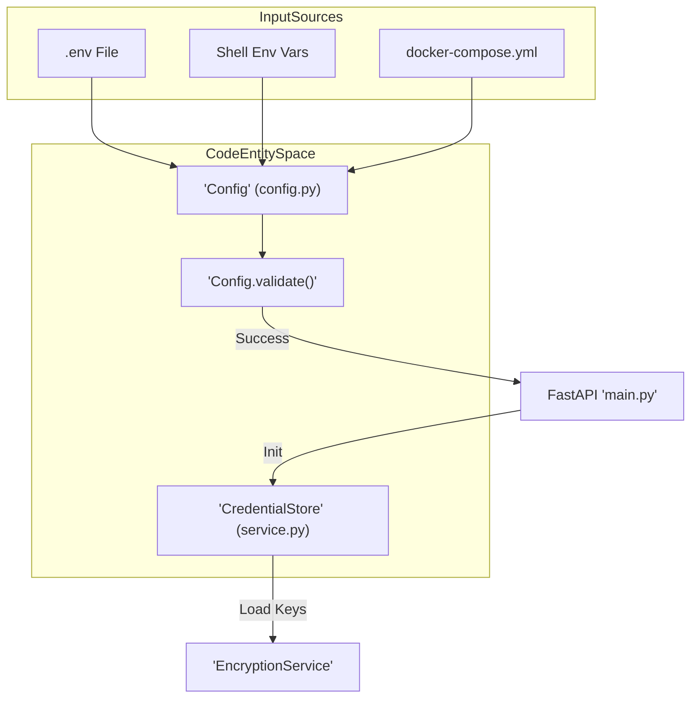
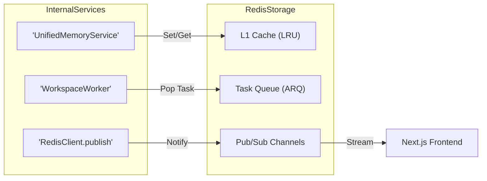
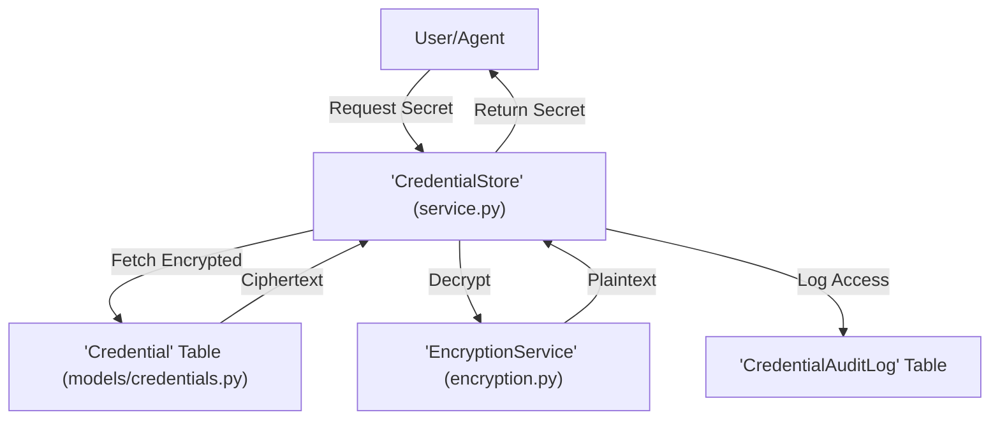

# Configuration Guide

Relevant source files

The following files were used as context for generating this wiki page:

- [.gitignore](.gitignore)
- [README.md](README.md)
- [docker-compose.yml](docker-compose.yml)
- [docs/PRDS/126-BUSINESS-KNOWLEDGE-GRAPH.md](docs/PRDS/126-BUSINESS-KNOWLEDGE-GRAPH.md)
- [docs/README.md](docs/README.md)
- [frontend/.dockerignore](frontend/.dockerignore)
- [frontend/Dockerfile](frontend/Dockerfile)
- [orchestrator/.env.example](orchestrator/.env.example)
- [orchestrator/Dockerfile](orchestrator/Dockerfile)
- [orchestrator/api/cloud_documents.py](orchestrator/api/cloud_documents.py)
- [orchestrator/core/credentials/service.py](orchestrator/core/credentials/service.py)
- [orchestrator/core/models/credentials.py](orchestrator/core/models/credentials.py)
- [orchestrator/core/redis/client.py](orchestrator/core/redis/client.py)
- [orchestrator/core/services/plugin_cache.py](orchestrator/core/services/plugin_cache.py)
- [orchestrator/modules/tools/services/__init__.py](orchestrator/modules/tools/services/__init__.py)
- [orchestrator/requirements.txt](orchestrator/requirements.txt)

This document covers all configuration options for Automatos AI, including environment variables, database settings, LLM providers, Redis, AWS S3, and the credential management system. For initial setup, see [Installation & Setup]().

---

## Configuration Architecture

Automatos AI uses a centralized configuration system where the backend (FastAPI) and various worker services consume environment variables to initialize core services. The configuration is primarily driven by the `.env` file and managed through Docker Compose for containerized environments.

### Configuration Loading Flow

**Sources:** `orchestrator/.env.example:1-65`(), `orchestrator/Dockerfile:85-129`(), `orchestrator/core/credentials/service.py:48-57`()

---

## Database Configuration

### PostgreSQL with pgvector
The system requires PostgreSQL 16 with the `pgvector` extension for storing embeddings used in RAG and memory layers. The schema is initialized via `init_complete_schema.sql` during the first container start.

| Variable | Required | Default | Description |
| :--- | :--- | :--- | :--- |
| `POSTGRES_DB` | **Yes** | `orchestrator_db` | Database name [orchestrator/.env.example:4]() |
| `POSTGRES_USER` | **Yes** | `postgres` | Database username [orchestrator/.env.example:5]() |
| `POSTGRES_PASSWORD` | **Yes** | - | Secure database password [orchestrator/.env.example:6]() |
| `POSTGRES_HOST` | **Yes** | `localhost` | Hostname (use `postgres` in Docker) [docker-compose.yml:95]() |
| `DATABASE_URL` | No | - | Full SQLAlchemy connection string [docker-compose.yml:97]() |

**Sources:** `docker-compose.yml:22-44`(), `orchestrator/.env.example:1-6`(), `orchestrator/requirements.txt:7-11`()

---

## Redis Configuration

Redis is critical for the `UnifiedMemoryService` (L1 memory), real-time workflow updates via Pub/Sub, and task queuing for the `WorkspaceWorker`.

### Connection Parameters
| Variable | Required | Default | Description |
| :--- | :--- | :--- | :--- |
| `REDIS_HOST` | **Yes** | `localhost` | Redis server host [orchestrator/.env.example:9]() |
| `REDIS_PORT` | **Yes** | `6379` | Redis server port [orchestrator/.env.example:10]() |
| `REDIS_PASSWORD` | **Yes** | - | Password for authentication [orchestrator/.env.example:11]() |
| `REDIS_URL` | No | - | Overrides individual vars (e.g., for Railway) [orchestrator/core/redis/client.py:161-162]() |

### Redis Data Flow
The `RedisClient` provides both synchronous and asynchronous connections via `aioredis` for non-blocking WebSocket delivery.

**Sources:** `orchestrator/core/redis/client.py:14-119`(), `docker-compose.yml:48-73`(), `orchestrator/core/redis/client.py:141-197`()

---

## LLM Provider Configuration

Automatos AI supports multiple providers. Credentials can be set via environment variables or managed dynamically through the **Settings > Credentials** UI.

### Provider API Keys
| Variable | Required | Default | Description |
| :--- | :--- | :--- | :--- |
| `OPENAI_API_KEY` | Conditional | - | Required for GPT models [orchestrator/.env.example:19]() |
| `ANTHROPIC_API_KEY` | Conditional | - | Required for Claude models [orchestrator/.env.example:20]() |
| `LLM_PROVIDER` | No | `openai` | Default system provider [orchestrator/.env.example:23]() |

The system uses `tiktoken` for token counting to manage context windows and `pydantic-settings` for robust validation of these parameters.

**Sources:** `orchestrator/requirements.txt:71-75`(), `orchestrator/.env.example:18-27`(), `orchestrator/requirements.txt:16-17`()

---

## Credential Management System

The `CredentialStore` handles sensitive information (API keys, DB passwords) using AES encryption before persisting to the `credentials` table.

### Implementation Details
- **Encryption**: Uses `EncryptionService` to wrap values [orchestrator/core/credentials/service.py:56]().
- **Validation**: `_validate_credential_data` checks inputs against `schema_definition` in `CredentialType` [orchestrator/core/credentials/service.py:128]().
- **Audit Logging**: Every access or modification creates a `CredentialAuditLog` entry [orchestrator/core/models/credentials.py:105-126]().

**Sources:** `orchestrator/core/credentials/service.py:42-185`(), `orchestrator/core/models/credentials.py:60-103`(), `orchestrator/core/models/credentials.py:25-58`()

---

## Cloud Storage & Knowledge Graph (PRD-42/126)

Automatos AI integrates with cloud providers for document synchronization and relational knowledge mapping.

### Cloud Sync & S3
| Variable | Required | Default | Description |
| :--- | :--- | :--- | :--- |
| `S3_VECTORS_ENABLED` | No | `true` | Enable S3-backed vector storage [orchestrator/.env.example:64]() |
| `AWS_ACCESS_KEY_ID` | Conditional | - | AWS credentials [orchestrator/.env.example:49]() |
| `AWS_SECRET_ACCESS_KEY` | Conditional | - | AWS credentials [orchestrator/.env.example:50]() |
| `AWS_REGION` | No | `us-east-1` | S3 bucket region [orchestrator/.env.example:51]() |

### Knowledge Graph Integration
The system uses `graphifyy[leiden]` for building relational knowledge graphs from documents and code.
- **GraphifyService**: Manages per-workspace graphs [docs/PRDS/126-BUSINESS-KNOWLEDGE-GRAPH.md:68]().
- **Source Extraction**: Processes documents (LLM), code (tree-sitter), and DB schemas [docs/PRDS/126-BUSINESS-KNOWLEDGE-GRAPH.md:69]().

**Sources:** `orchestrator/api/cloud_documents.py:185-230`(), `orchestrator/requirements.txt:105-106`(), `docs/PRDS/126-BUSINESS-KNOWLEDGE-GRAPH.md:14-78`(), `orchestrator/requirements.txt:115-117`()

---

## Monitoring & System Health

The backend includes health checks and resource monitoring to ensure platform stability.

- **Health Endpoint**: `GET /health` is used by Docker and Railway to verify service status [orchestrator/Dockerfile:78-79]().
- **System Metrics**: Uses `psutil` to monitor CPU and memory usage for the dashboard [orchestrator/requirements.txt:34-35]().
- **Logging**: Controlled by `LOG_LEVEL` (default `INFO`) and `LOG_FILE` [orchestrator/.env.example:29-30]().

**Sources:** `orchestrator/Dockerfile:78-79`(), `orchestrator/.env.example:29-30`(), `orchestrator/requirements.txt:34-35`()

---