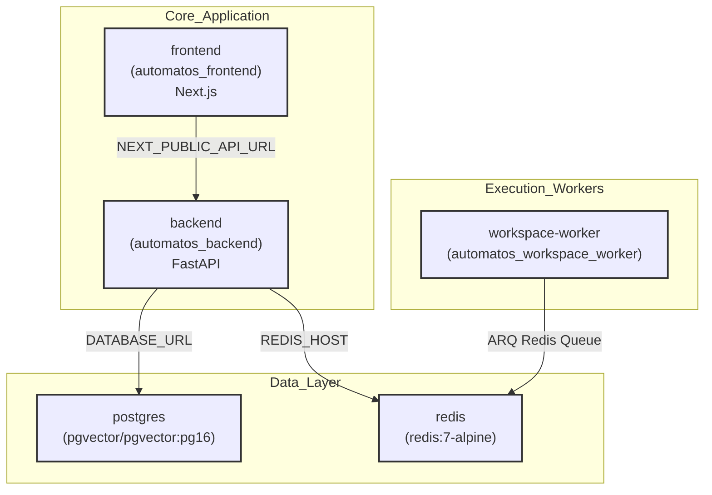
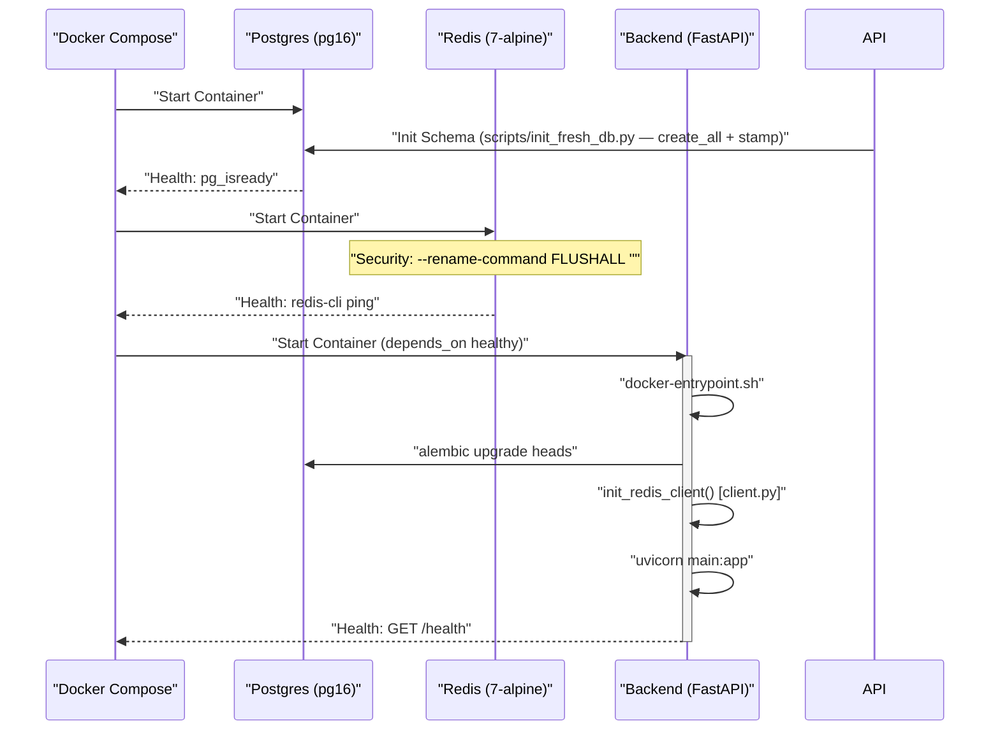

# Installation & Setup

<details>
<summary>Relevant source files</summary>

The following files were used as context for generating this wiki page:

- [docker-compose.yml](docker-compose.yml)
- [frontend/.dockerignore](frontend/.dockerignore)
- [frontend/Dockerfile](frontend/Dockerfile)
- [orchestrator/Dockerfile](orchestrator/Dockerfile)
- [orchestrator/api/cloud_documents.py](orchestrator/api/cloud_documents.py)
- [orchestrator/core/database/boot_lock.py](orchestrator/core/database/boot_lock.py)
- [orchestrator/core/redis/client.py](orchestrator/core/redis/client.py)
- [orchestrator/requirements.txt](orchestrator/requirements.txt)
- [railway.json](railway.json)

</details>


This page guides you through installing and running Automatos AI using Docker Compose. It covers cloning the repository, configuring environment variables, starting services, and verifying the installation. The setup utilizes a multi-tier architecture, including specialized workers for code execution and prompt optimization, and supports both local development and production-ready deployments.

---

## Prerequisites

Before installing Automatos AI, ensure your system has:

- **Docker** (20.10+) and **Docker Compose** (2.0+)
- **Git** for repository cloning
- **Minimum 8GB RAM** (16GB recommended)
- **10GB disk space** for Docker images and persistent volumes
- **Port availability**: 3000 (frontend), 8000 (backend), 5432 (PostgreSQL), 6379 (Redis)

---

## Quick Start

### 1. Clone Repository

```bash
git clone https://github.com/AutomatosAI/automatos-ai.git
cd automatos-ai
```

### 2. Configure Environment Variables

A `.env` file is required for the stack to boot correctly [docker-compose.yml:10](). Copy the example file:

```bash
cp .env.example .env
```

Edit `.env` and set the following **required** variables:

| Variable | Description | Source |
|----------|-------------|--------|
| `POSTGRES_PASSWORD` | PostgreSQL root password | [docker-compose.yml:29]() |
| `REDIS_PASSWORD` | Redis authentication password | [docker-compose.yml:56]() |
| `API_KEY` | Backend API authentication key | [docker-compose.yml:116]() |

**Sources:** [docker-compose.yml:5-11](), [orchestrator/Dockerfile:112-116]()

### 3. Start Services

Automatos AI uses Docker Compose profiles to manage its extensive service list.

```bash
# Start core services (Postgres, Redis, Backend, Frontend)
docker-compose up --build

# Start with sandboxed code execution workers (PRD-56)
docker-compose --profile workers up --build
```

**Sources:** [docker-compose.yml:13-16](), [docker-compose.yml:178-184]()

---

## System Architecture & Component Map

The installation deploys a multi-tier architecture. The diagram below maps the service names to their specific code entities (Docker images, containers, and modules).

### Infrastructure Entity Map



**Sources:** [docker-compose.yml:22-171](), [docker-compose.yml:178-182](), [frontend/Dockerfile:111-115]()

---

## Service Initialization Sequence

The following diagram details the internal function calls and health checks that occur during the `docker-compose up` lifecycle, including database migration handling.

### Startup & Code Logic Flow



**Key Initialization Logic:**
1. **Database Schema**: The backend entrypoint initializes empty databases via `scripts/init_fresh_db.py` (create_all + stamp) — automated table creation [docker-compose.yml:35]().
2. **Migrations**: The backend executes `alembic upgrade heads` before starting `uvicorn` to ensure the schema is current [orchestrator/Dockerfile:90]().
3. **Boot Locking**: On multi-worker startups, `boot_leader_lock` uses PostgreSQL advisory locks to ensure only one worker runs seed operations [orchestrator/core/database/boot_lock.py:25-40]().
4. **Redis Security**: Dangerous commands like `FLUSHDB` and `FLUSHALL` are disabled at the command line [docker-compose.yml:59-60]().
5. **Redis Client**: Initialized via `init_redis_client`, supporting both `REDIS_URL` and discrete host/port variables [orchestrator/core/redis/client.py:141-161]().

**Sources:** [docker-compose.yml:35-90](), [orchestrator/Dockerfile:84-90](), [orchestrator/core/database/boot_lock.py:1-21](), [orchestrator/core/redis/client.py:141-161]()

---

## Environment Variables Reference

### Core Service Variables
| Variable | Default | Purpose |
|----------|---------|---------|
| `DATABASE_URL` | `postgresql://...` | Primary SQLAlchemy connection string [docker-compose.yml:97](). |
| `REDIS_HOST` | `redis` | Hostname for Redis connection [docker-compose.yml:100](). |
| `API_KEY` | **Required** | Secures the FastAPI backend routes [docker-compose.yml:116](). |
| `GOTENBERG_URL` | `http://gotenberg:3000` | PDF generation service for PRD-63 [docker-compose.yml:109](). |

### Frontend Variables
| Variable | Default | Purpose |
|----------|---------|---------|
| `NEXT_PUBLIC_API_URL` | `http://localhost:8000` | Backend API endpoint for the browser [frontend/Dockerfile:58](). |
| `NODE_ENV` | `development` | Sets Next.js optimization level [frontend/Dockerfile:111](). |

**Sources:** [docker-compose.yml:91-121](), [frontend/Dockerfile:53-71]()

---

## Dependency Installation

The backend environment is built using a multi-stage Dockerfile to optimize image size and security.

### Backend Requirements
The `orchestrator/requirements.txt` file defines the core stack:
- **Web Framework**: `fastapi`, `uvicorn`, `websockets` [orchestrator/requirements.txt:2-4]().
- **Database**: `sqlalchemy`, `alembic`, `pgvector` [orchestrator/requirements.txt:7-11]().
- **AI/LLM**: `openai`, `anthropic`, `google-generativeai`, `tiktoken` [orchestrator/requirements.txt:72-75]().
- **Integrations**: `composio` (PRD-36), `boto3` (PRD-42), `graphifyy` (PRD-126) [orchestrator/requirements.txt:105-119]().

### Specialized Build Steps
The `orchestrator/Dockerfile` performs specific initialization:
1. **System Dependencies**: Installs `tesseract-ocr`, `libmagic1`, and `libpango` for document processing [orchestrator/Dockerfile:18-32]().
2. **FutureAGI**: Installed with `--no-deps` to avoid version conflicts with the core stack [orchestrator/Dockerfile:43]().
3. **NLTK Data**: Pre-downloads `punkt` and `stopwords` for memory tokenization [orchestrator/Dockerfile:49-50]().

**Sources:** [orchestrator/requirements.txt:1-120](), [orchestrator/Dockerfile:13-53]()

---

## Verification & Troubleshooting

After deployment, verify the stack is operational:

1. **Service Health**:
   ```bash
   docker compose ps
   ```
2. **Redis Connectivity**:
   The backend logs will show `✅ Redis connection test successful` upon initialization via `test_connection()` [orchestrator/core/redis/client.py:121-145]().
3. **API Connectivity**:
   Navigate to `http://localhost:8000/health`. The container `HEALTHCHECK` uses this endpoint to verify availability [orchestrator/Dockerfile:78-79]().
4. **Cloud Storage**:
   Verify cloud connection discovery via the `GET /api/cloud-documents/connections` endpoint, which checks for active Composio entities [orchestrator/api/cloud_documents.py:185-203]().

**Sources:** [orchestrator/core/redis/client.py:121-145](), [orchestrator/Dockerfile:78-79](), [orchestrator/api/cloud_documents.py:185-203]()

---