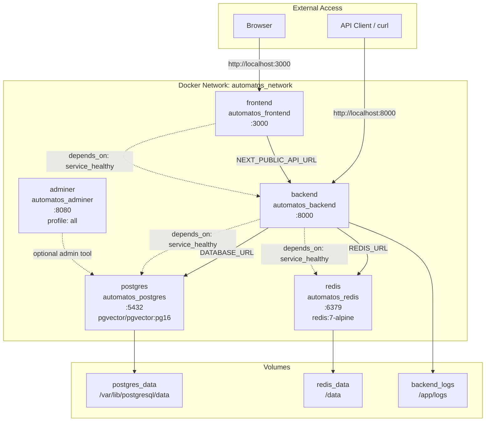
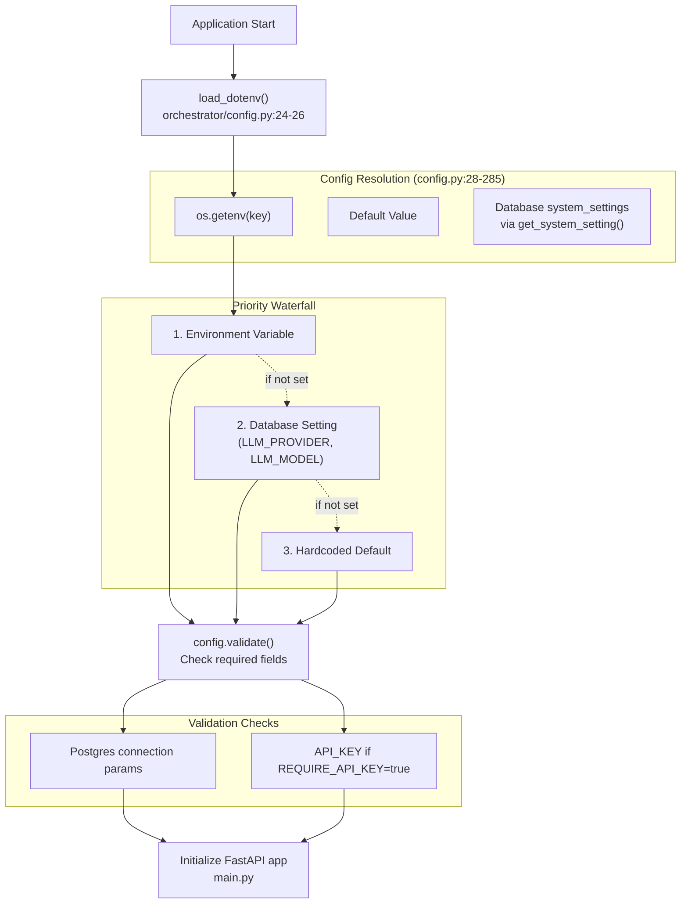
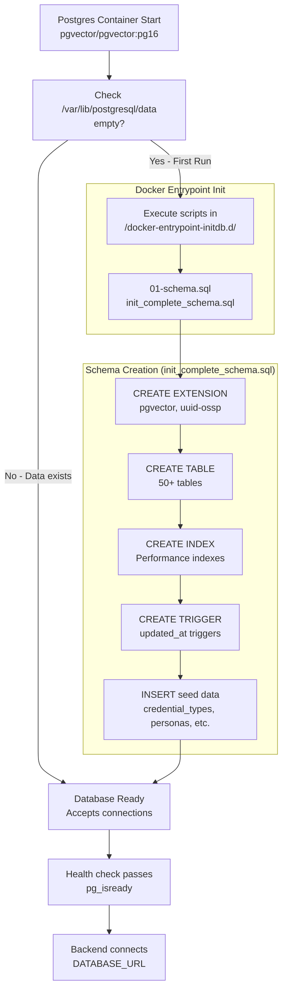

# Installation & Setup

<details>
<summary>Relevant source files</summary>

The following files were used as context for generating this wiki page:

- [docker-compose.yml](docker-compose.yml)
- [frontend/.dockerignore](frontend/.dockerignore)
- [frontend/Dockerfile](frontend/Dockerfile)
- [orchestrator/Dockerfile](orchestrator/Dockerfile)
- [orchestrator/core/redis/client.py](orchestrator/core/redis/client.py)
- [orchestrator/requirements.txt](orchestrator/requirements.txt)

</details>


This page covers the installation and initial configuration of Automatos AI for local development. It provides step-by-step instructions for running the platform using Docker Compose, including database initialization, environment configuration, and service verification.

**Related documentation:**
- For detailed configuration options and feature flags, see [Configuration Guide](#2.2)
- For the first-time user onboarding experience, see [First-Time User Experience](#2.3)
- For production deployment strategies, see [Deployment & Infrastructure](#12)
- For advanced Docker configuration, see [Docker Compose Setup](#12.2)

---

## Prerequisites

Before installing Automatos AI, ensure you have the following installed on your system:

| Requirement | Version | Purpose |
|-------------|---------|---------|
| Docker | 20.10+ | Container runtime |
| Docker Compose | 2.0+ | Multi-container orchestration |
| Git | 2.30+ | Repository cloning |

**Optional but recommended:**
- **OpenAI API Key** or **Anthropic API Key** - Required for agent LLM functionality. Without these, agents cannot generate responses, though the platform will still run.
- **Clerk Account** - Required for user authentication in production. Development mode supports anonymous access when `REQUIRE_AUTH=false`.
- **AWS Account** - Required only if using marketplace plugins or S3-based features.

Sources: [docker-compose.yml:1-197](), [README.md:57-60]()

---

## Quick Start

The fastest path to running Automatos AI locally:

```bash
# 1. Clone the repository
git clone https://github.com/AutomatosAI/automatos-ai.git
cd automatos-ai

# 2. Start all services (uses secure defaults)
docker-compose up --build

# 3. Access the platform
# Frontend: http://localhost:3000
# API Docs: http://localhost:8000/docs
# Health Check: http://localhost:8000/health
```

**That's it!** No `.env` file is required for local development. The system uses secure defaults for infrastructure services (PostgreSQL, Redis) and manages API keys through the Settings UI.

**Note:** On first launch, database initialization takes 10-40 seconds. Watch the logs for `✅ Database connection test successful` from the backend service.

Sources: [docker-compose.yml:1-15](), [README.md:53-78]()

---

## Docker Compose Architecture

The following diagram shows the complete Docker Compose service topology, including exact service names, ports, and dependencies:



**Health Check Details:**

| Service | Health Check Command | Interval | Start Period |
|---------|---------------------|----------|--------------|
| `postgres` | `pg_isready -U postgres` | 10s | 10s |
| `redis` | `redis-cli ping` | 10s | 5s |
| `backend` | `curl -f http://localhost:8000/health` | 30s | 40s |
| `frontend` | `wget --spider http://localhost:3000` | 30s | 60s |

**Key architectural features:**
- **Dependency chain**: Frontend waits for Backend, Backend waits for Postgres + Redis
- **Named volumes**: Data persists across container restarts (`postgres_data`, `redis_data`)
- **Hot-reload**: Source code mounted for development (`./orchestrator:/app`, `./frontend:/app`)
- **Isolated network**: All services communicate via `automatos_network` bridge

Sources: [docker-compose.yml:17-197]()

---

## Service Configuration Details

### PostgreSQL Database

```yaml
Service Name: postgres
Image: pgvector/pgvector:pg16
Container: automatos_postgres
Port: 5432 (host) → 5432 (container)
```

**Configuration:**
- **pgvector extension** enabled for vector similarity search
- **Max connections**: 200 concurrent connections
- **Shared buffers**: 256MB allocated for query caching
- **Schema initialization**: Automatic on first run via `init_complete_schema.sql`

**Default credentials** (overridable via environment):
- Database: `orchestrator_db`
- User: `postgres`
- Password: `automatos_dev_pass`

The database schema is automatically initialized on first container startup using the SQL file mounted at `/docker-entrypoint-initdb.d/01-schema.sql`.

Sources: [docker-compose.yml:21-42](), [orchestrator/config.py:36-42]()

### Redis Cache & Pub/Sub

```yaml
Service Name: redis
Image: redis:7-alpine
Container: automatos_redis
Port: 6379 (host) → 6379 (container)
```

**Configuration:**
- **Max memory**: 256MB with LRU eviction policy (`allkeys-lru`)
- **Authentication**: Password-protected (default: `automatos_redis_dev`)
- **Persistence**: RDB snapshots saved to `redis_data` volume

**Used for:**
- Workflow execution event streaming (Pub/Sub channels)
- Plugin content caching (TTL: 3600s by default)
- Tool metadata caching (Composio app/action schemas)

Sources: [docker-compose.yml:47-63](), [orchestrator/core/redis/client.py:1-199]()

### Backend API (FastAPI)

```yaml
Service Name: backend
Build: ./orchestrator (Dockerfile, target: development)
Container: automatos_backend
Port: 8000 (host) → 8000 (container)
```

**Development mode features:**
- **Hot-reload enabled**: Code changes trigger automatic restart via `--reload` flag
- **Source mounting**: `./orchestrator:/app` for live editing
- **Entrypoint script**: `docker-entrypoint.sh` for database readiness checks
- **Uvicorn workers**: Single worker in dev mode

**Runtime dependencies:**
- Python 3.11-slim base image
- System packages: `gcc`, `g++`, `postgresql-client`, `tesseract-ocr`
- NLTK data: `punkt`, `stopwords` (pre-downloaded to `/usr/local/nltk_data`)

Sources: [docker-compose.yml:68-123](), [orchestrator/Dockerfile:1-116]()

### Frontend (Next.js)

```yaml
Service Name: frontend
Build: ./frontend (Dockerfile, target: development)
Container: automatos_frontend
Port: 3000 (host) → 3000 (container)
```

**Development mode features:**
- **Fast Refresh**: Hot module replacement for React components
- **Source mounting**: `./frontend:/app` with excluded `node_modules` and `.next`
- **Node 20 Alpine**: Lightweight container with `python3`, `make`, `g++` for native modules

**Build-time environment variables:**
- `NEXT_PUBLIC_API_URL`: Backend API endpoint (default: `http://localhost:8000`)
- `NEXT_PUBLIC_CLERK_PUBLISHABLE_KEY`: Clerk authentication (optional for dev)

Sources: [docker-compose.yml:131-155](), [frontend/Dockerfile:1-120]()

---

## Environment Variables

Automatos AI uses a hybrid configuration approach: **infrastructure defaults** (no `.env` needed) with **credentials managed via UI**.

### Configuration Loading Flow



Sources: [orchestrator/config.py:24-285]()

### Required Variables (Infrastructure)

These are set automatically by `docker-compose.yml` with secure defaults:

| Variable | Default | Purpose |
|----------|---------|---------|
| `POSTGRES_DB` | `orchestrator_db` | Database name |
| `POSTGRES_USER` | `postgres` | Database user |
| `POSTGRES_PASSWORD` | `automatos_dev_pass` | Database password |
| `POSTGRES_HOST` | `postgres` | Database hostname (service name) |
| `POSTGRES_PORT` | `5432` | Database port |
| `REDIS_HOST` | `redis` | Redis hostname (service name) |
| `REDIS_PORT` | `6379` | Redis port |
| `REDIS_PASSWORD` | `automatos_redis_dev` | Redis password |

Sources: [docker-compose.yml:80-92]()

### Optional Variables (Features)

Add these to a `.env` file or configure via **Settings UI** after first login:

**LLM Providers:**
```bash
OPENAI_API_KEY=sk-...                    # OpenAI models (GPT-4, etc.)
ANTHROPIC_API_KEY=sk-ant-...            # Anthropic models (Claude, etc.)
LLM_PROVIDER=openai                      # Default provider (can change in UI)
LLM_MODEL=gpt-4                          # Default model (can change in UI)
```

**Authentication (Production):**
```bash
NEXT_PUBLIC_CLERK_PUBLISHABLE_KEY=pk_... # Clerk public key
CLERK_SECRET_KEY=sk_...                  # Clerk secret key
CLERK_JWKS_URL=https://...               # Clerk JWKS endpoint
```

**Marketplace & Plugins (Optional):**
```bash
AWS_ACCESS_KEY_ID=AKIA...               # S3 access for plugin storage
AWS_SECRET_ACCESS_KEY=...               # S3 secret key
AWS_REGION=us-east-1                     # S3 region
MARKETPLACE_S3_BUCKET=automatos-marketplace
PLUGIN_CACHE_TTL_SECONDS=3600           # Redis cache TTL
```

**Feature Flags:**
```bash
ENVIRONMENT=development                  # development | production
LOG_LEVEL=INFO                           # DEBUG | INFO | WARNING | ERROR
REQUIRE_API_KEY=false                    # Disable API key requirement for dev
```

**Location to create `.env`:**
- **Backend**: `orchestrator/.env` (loaded by `config.py:24-26`)
- **Frontend**: `frontend/.env.local` (loaded by Next.js)

Sources: [orchestrator/.env.example:1-64](), [orchestrator/config.py:28-285]()

---

## Database Initialization

The PostgreSQL database is automatically initialized on first container startup using a volume-mounted SQL script.

### Initialization Flow



**Key tables created:**
- **Core**: `workspaces`, `users`, `workspace_members`
- **Agents**: `agents`, `agent_skills`, `personas`, `agent_templates`
- **Workflows**: `workflows`, `workflow_recipes`, `recipe_executions`
- **Marketplace**: `marketplace_plugins`, `workspace_enabled_plugins`, `agent_assigned_plugins`
- **Tools**: `agent_tool_assignments`, `composio_app_cache`, `composio_action_cache`
- **Credentials**: `credential_types`, `credentials`, `credential_audit_logs`
- **System**: `system_settings`, `skill_sources`, `skills`

**pgvector extension** is enabled for vector similarity search used by:
- Skill recommendations (lexical scoring)
- Document embeddings (S3 vectors feature)

Sources: [docker-compose.yml:33-34](), [orchestrator/database/init_complete_schema.sql]() (file referenced in docker-compose.yml)

---

## Local Development Setup (Without Docker)

For active development where you need direct access to Python/Node processes:

### Backend Setup

```bash
# 1. Navigate to orchestrator directory
cd orchestrator

# 2. Create Python virtual environment
python3.11 -m venv venv
source venv/bin/activate  # On Windows: venv\Scripts\activate

# 3. Install dependencies
pip install -r requirements.txt

# 4. Install PostgreSQL and Redis (Ubuntu/Debian)
sudo apt update
sudo apt install -y postgresql postgresql-contrib redis-server

# 5. Start services
sudo service postgresql start
sudo service redis-server start

# 6. Create database
sudo -u postgres psql -c "CREATE DATABASE orchestrator_db;"
sudo -u postgres psql -c "ALTER USER postgres PASSWORD 'your_password';"

# 7. Initialize schema
sudo -u postgres psql -d orchestrator_db -f database/init_complete_schema.sql

# 8. Create .env file (copy from .env.example)
cp .env.example .env
# Edit .env with your configuration

# 9. Start backend server
python main.py
# Server runs on http://localhost:8000
```

### Frontend Setup

```bash
# 1. Navigate to frontend directory
cd frontend

# 2. Install Node.js dependencies
npm install --legacy-peer-deps

# 3. Create .env.local file
cat > .env.local << EOF
NEXT_PUBLIC_API_URL=http://localhost:8000
NEXT_PUBLIC_WS_URL=ws://localhost:8000/ws
NEXTAUTH_URL=http://localhost:3000
NEXTAUTH_SECRET=your_local_secret_key_here
EOF

# 4. Start development server
npm run dev
# Server runs on http://localhost:3000
```

**Important flags:**
- `--legacy-peer-deps`: Required for npm due to peer dependency conflicts in React 18/19 packages
- Hot-reload is automatic in both Python (via Uvicorn `--reload`) and Next.js (Fast Refresh)

Sources: [docs/LOCAL_SETUP_GUIDE.md:1-214]()

---

## Verification & Testing

After starting the system, verify each service is running correctly:

### Health Check Endpoints

```bash
# Backend API health
curl http://localhost:8000/health
# Expected: {"status": "healthy", "database": "connected", "redis": "connected"}

# Backend API documentation
curl http://localhost:8000/docs
# Expected: HTML response with Swagger UI

# Frontend (browser only)
open http://localhost:3000
# Expected: Login/dashboard page loads
```

### Database Connection Test

```bash
# Inside backend container
docker exec -it automatos_backend psql -h postgres -U postgres -d orchestrator_db
# Expected: PostgreSQL prompt appears

# Check tables exist
\dt
# Expected: List of 50+ tables

# Check pgvector extension
SELECT * FROM pg_extension WHERE extname = 'vector';
# Expected: Row showing pgvector installed
```

### Redis Connection Test

```bash
# Inside backend container
docker exec -it automatos_backend redis-cli -h redis -a automatos_redis_dev ping
# Expected: PONG

# Check memory usage
docker exec -it automatos_redis redis-cli INFO memory
# Expected: Memory usage statistics
```

### Configuration Validation

The backend performs automatic configuration validation on startup. Check logs:

```bash
docker logs automatos_backend | grep "Configuration"
# Expected output:
# ============================================================
# AUTOMATOS AI CONFIGURATION
# ============================================================
# Environment: development
# Database: orchestrator_db@postgres:5432
# Redis: redis:6379
# LLM Provider: openai (gpt-4)
# OpenAI Key: ✅ Set
# Anthropic Key: ✅ Set
# API Key: ✅ Set
# API Key Required: True
# ============================================================
```

Sources: [orchestrator/config.py:249-272]()

---

## Troubleshooting

### Port Already in Use

**Symptom:** `Error starting userland proxy: listen tcp4 0.0.0.0:3000: bind: address already in use`

**Solution:**
```bash
# Check what's using the port
lsof -i :3000  # or :8000, :5432, :6379
sudo netstat -tlnp | grep 3000

# Kill the process or change docker-compose port mapping
# In docker-compose.yml, change ports section:
ports:
  - "3001:3000"  # Map host port 3001 to container port 3000
```

### Database Connection Failed

**Symptom:** Backend logs show `❌ Database connection test failed`

**Solutions:**

1. **Check Postgres is running:**
```bash
docker ps | grep postgres
# Should show: automatos_postgres (healthy)
```

2. **Check health check logs:**
```bash
docker logs automatos_postgres | tail -n 20
# Look for: "database system is ready to accept connections"
```

3. **Verify credentials match:**
```bash
# In docker-compose.yml, ensure:
POSTGRES_PASSWORD=automatos_dev_pass

# Matches in .env or environment
```

4. **Manual connection test:**
```bash
docker exec -it automatos_postgres psql -U postgres -d orchestrator_db
# If this works, backend should also connect
```

### Redis Connection Failed

**Symptom:** Backend logs show `Redis connection test failed` or `Redis unavailable for plugin cache`

**Solutions:**

1. **Check Redis is running:**
```bash
docker ps | grep redis
# Should show: automatos_redis (healthy)
```

2. **Test authentication:**
```bash
docker exec -it automatos_redis redis-cli -a automatos_redis_dev ping
# Expected: PONG
```

3. **Check password matches:**
```bash
# In docker-compose.yml:
REDIS_PASSWORD=automatos_redis_dev
```

**Note:** Redis is **optional** for core functionality. If Redis is unavailable:
- Plugin content fetches directly from S3 (slower)
- Workflow execution events not streamed (polling fallback)
- Tool metadata not cached (slower tool loading)

Sources: [orchestrator/core/redis/client.py:149-198](), [orchestrator/core/services/plugin_cache.py:54-74]()

### Frontend Build Errors

**Symptom:** `npm ERR! code ERESOLVE` or `Cannot find module 'next'`

**Solutions:**

1. **Clear cache and reinstall:**
```bash
cd frontend
rm -rf node_modules package-lock.json .next
npm install --legacy-peer-deps
```

2. **Node version mismatch:**
```bash
# Check Node version
node --version  # Should be 20+

# If wrong version, use nvm:
nvm install 20
nvm use 20
```

3. **Docker volume conflicts:**
```bash
# Remove volumes and rebuild
docker-compose down -v
docker-compose up --build
```

### Missing LLM API Keys

**Symptom:** Agent execution fails with "No LLM provider configured"

**Solution:**

1. **Add keys via Settings UI** (recommended):
   - Navigate to Settings → Credentials in the web interface
   - Add OpenAI or Anthropic credentials
   - Test connection

2. **Or add to .env file:**
```bash
# orchestrator/.env
OPENAI_API_KEY=sk-...
ANTHROPIC_API_KEY=sk-ant-...
```

3. **Restart backend to load new keys:**
```bash
docker-compose restart backend
```

Sources: [orchestrator/config.py:84-110](), [orchestrator/core/credentials/service.py:1-852]()

### Permission Denied Errors

**Symptom:** `PermissionError: [Errno 13] Permission denied: '/app/logs'`

**Solutions:**

1. **Fix Docker volume permissions:**
```bash
# For backend logs
sudo chown -R $(id -u):$(id -g) orchestrator/logs

# Or create with correct permissions
mkdir -p orchestrator/logs
chmod 755 orchestrator/logs
```

2. **For production images (non-root user):**
```bash
# Production Dockerfile creates 'automatos' user (UID 1000)
# Ensure host directories match:
sudo chown -R 1000:1000 orchestrator/logs
```

Sources: [orchestrator/Dockerfile:98-99]()

---

## Next Steps

After successful installation:

1. **Configure API keys and credentials** via Settings UI → Credentials section
2. **Follow the onboarding flow** - see [First-Time User Experience](#2.3)
3. **Create your first agent** - see [Creating Agents](#3.1)
4. **Review configuration options** - see [Configuration Guide](#2.2)

For production deployment, see [Production Deployment](#12.6) for scaling considerations, security hardening, and Railway-specific configuration.

---