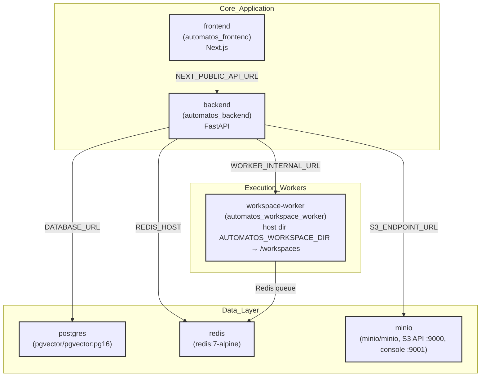
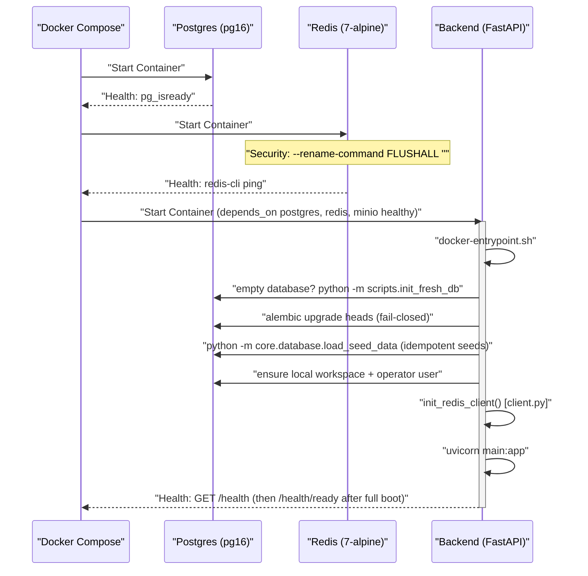

# Installation & Setup

<details>
<summary>Relevant source files</summary>

The following files were used as context for generating this wiki page:

- [docker-compose.yml](docker-compose.yml)
- [frontend/.dockerignore](frontend/.dockerignore)
- [frontend/Dockerfile](frontend/Dockerfile)
- [orchestrator/Dockerfile](orchestrator/Dockerfile)
- [orchestrator/api/cloud_documents.py](orchestrator/api/cloud_documents.py)
- [orchestrator/core/database/boot_lock.py](orchestrator/core/database/boot_lock.py)
- [orchestrator/core/redis/client.py](orchestrator/core/redis/client.py)
- [orchestrator/requirements.txt](orchestrator/requirements.txt)
- [railway.json](railway.json)

</details>


This page guides you through installing and running Automatos AI using Docker Compose. It covers cloning the repository, configuring environment variables, starting services, and verifying the installation.

> **[Self-hosting — the local edition](self-hosting.md) is the full reference** (every service and port, the worker's host directory, object storage, the optional Composio key, updating, resetting, troubleshooting). This page keeps to the install steps and the build details.

---

## Prerequisites

Before installing Automatos AI, ensure your system has:

- **Docker** with the **Compose v2** plugin (`docker compose`)
- **Git** for repository cloning
- **~10 GB disk space** for Docker images and persistent volumes
- **Port availability**: 3000 (frontend), 8000 (backend), 5432 (PostgreSQL), 6379 (Redis), 9000/9001 (MinIO API/console) — all overridable through `*_PORT` variables in `.env`

---

## Quick Start

### 1. Clone Repository

```bash
git clone https://github.com/AutomatosAI/automatos-ai.git
cd automatos-ai
```

### 2. Configure Environment Variables

A `.env` file is required for the stack to boot correctly [docker-compose.yml](). Copy the example file:

```bash
cp .env.example .env
```

Edit `.env` and set the following **required** variables — compose declares them as `${VAR:?…}` and refuses to start while any is unset or empty:

| Variable | Description | Source |
|----------|-------------|--------|
| `POSTGRES_PASSWORD` | PostgreSQL password (applied when the data volume is first initialised) | [docker-compose.yml]() |
| `REDIS_PASSWORD` | Redis authentication password | [docker-compose.yml]() |
| `API_KEY` | Backend API authentication key | [docker-compose.yml]() |

Optional but recommended: one LLM key (`OPENAI_API_KEY`, `ANTHROPIC_API_KEY` or `OPENROUTER_API_KEY`), or add one later under Settings → API Keys. `.env` is read by compose for substitution only; the committed local topology lives in `envs/api.defaults` and `envs/frontend.defaults` (`AUTH_EDITION=local`, MinIO wiring, worker URL), with `envs/api.local` as the gitignored override lane.

**Sources:** [docker-compose.yml](), [envs/api.defaults](), [envs/frontend.defaults]()

### 3. Start Services

```bash
# Default profile: postgres, redis, minio (+ minio-init), backend, frontend, workspace-worker
docker compose up

# Add Adminer (database GUI) and Gotenberg (DOCX/XLSX → PDF)
docker compose --profile all up
```

The workspace-worker runs in the default profile; the former `workers` profile no longer exists. Its files live in the host directory `AUTOMATOS_WORKSPACE_DIR` (default `./workspaces`, created on first boot).

**Sources:** [docker-compose.yml]()

---

## System Architecture & Component Map

The installation deploys a multi-tier architecture. The diagram below maps the service names to their specific code entities (Docker images, containers, and modules).

### Infrastructure Entity Map



**Sources:** [docker-compose.yml](), [envs/api.defaults](), [frontend/Dockerfile:111-115]()

---

## Service Initialization Sequence

The following diagram details the internal function calls and health checks that occur during the `docker compose up` lifecycle, including database migration handling.

### Startup & Code Logic Flow



**Key Initialization Logic:**
1. **Fresh database**: With no `alembic_version` table present, the entrypoint runs `python -m scripts.init_fresh_db` — the SQLAlchemy models plus a tolerant replay of the migration history, stamped at heads. No SQL snapshot is committed; the generator is the fresh path [docker-entrypoint.sh](), [orchestrator/scripts/init_fresh_db.py]().
2. **Migrations**: `alembic upgrade heads` runs on every boot and fails closed — a failing migration stops the backend rather than serving a half-built schema [docker-entrypoint.sh]().
3. **Seeds**: `core.database.load_seed_data` is idempotent (credential types, models, skills, personas, plugin categories, marketplace catalogue, and in the local edition the first-run content: Auto, the Researcher/Writer/Analyst roster, the *Two-minute brief* Playbook and a welcome Deliverable) [orchestrator/core/database/load_seed_data.py](), [orchestrator/core/seeds/seed_local_first_run.py]().
4. **Boot Locking**: On multi-worker startups, `boot_leader_lock` uses PostgreSQL advisory locks to ensure only one worker runs seed operations [orchestrator/core/database/boot_lock.py:25-40]().
5. **Redis Security**: Dangerous commands like `FLUSHDB` and `FLUSHALL` are disabled at the command line [docker-compose.yml]().
6. **Redis Client**: Initialized via `init_redis_client`, supporting both `REDIS_URL` and discrete host/port variables [orchestrator/core/redis/client.py:141-161]().

**Sources:** [docker-entrypoint.sh](), [orchestrator/scripts/init_fresh_db.py](), [orchestrator/core/database/boot_lock.py:1-21](), [orchestrator/core/redis/client.py:141-161]()

---

## Environment Variables Reference

The full list, with what each dial does, is in [Self-hosting](self-hosting.md) and [Environment Variables](../deployment-infrastructure/environment-variables.md). The ones an installer meets first:

### Core Service Variables
| Variable | Default | Purpose |
|----------|---------|---------|
| `DATABASE_URL` | `postgresql://...` | Primary SQLAlchemy connection string, assembled by compose [docker-compose.yml](). |
| `REDIS_HOST` | `redis` | Hostname for Redis connection [docker-compose.yml](). |
| `API_KEY` | **Required** | The backend's own API-key principal [docker-compose.yml](). |
| `AUTH_EDITION` | `local` (from `envs/api.defaults`) | The edition flag — `local` (no login) or `saas` (Clerk required) [orchestrator/config.py](). |
| `S3_ENDPOINT_URL` | `http://minio:9000` | Points the S3 client at MinIO; the store's credentials are mapped from `S3_ACCESS_KEY_ID` / `S3_SECRET_ACCESS_KEY` (default: the MinIO root credentials) [docker-compose.yml](). |
| `AUTOMATOS_WORKSPACE_DIR` | `./workspaces` | Host directory the workspace-worker acts in [docker-compose.yml](). |
| `COMPOSIO_API_KEY` | unset | Bring-your-own Composio key; without it integrations are disabled and native tools keep working [docker-compose.yml](). |
| `GOTENBERG_URL` | `http://gotenberg:3000` | PDF generation service for PRD-63 (`--profile all`) [docker-compose.yml](). |

### Frontend Variables
| Variable | Default | Purpose |
|----------|---------|---------|
| `NEXT_PUBLIC_API_URL` | `http://localhost:8000` | Backend API endpoint for the browser [envs/frontend.defaults](). |
| `NEXT_PUBLIC_AUTH_EDITION` | `local` | Frontend mirror of `AUTH_EDITION` [envs/frontend.defaults](). |
| `NODE_ENV` | `development` | Sets Next.js optimization level [frontend/Dockerfile:111](). |

**Sources:** [docker-compose.yml](), [envs/api.defaults](), [envs/frontend.defaults](), [frontend/Dockerfile:53-71]()

---

## Dependency Installation

The backend environment is built using a multi-stage Dockerfile to optimize image size and security.

### Backend Requirements
The `orchestrator/requirements.txt` file defines the core stack:
- **Web Framework**: `fastapi`, `uvicorn`, `websockets` [orchestrator/requirements.txt:2-4]().
- **Database**: `sqlalchemy`, `alembic`, `pgvector` [orchestrator/requirements.txt:7-11]().
- **AI/LLM**: `openai`, `anthropic`, `google-generativeai`, `tiktoken` [orchestrator/requirements.txt:72-75]().
- **Integrations**: `composio` (PRD-36), `boto3` (PRD-42), `graphifyy` (PRD-126) [orchestrator/requirements.txt:105-119]().

### Specialized Build Steps
The `orchestrator/Dockerfile` performs specific initialization:
1. **System Dependencies**: Installs `tesseract-ocr`, `libmagic1`, and `libpango` for document processing [orchestrator/Dockerfile:18-32]().
2. **FutureAGI**: Installed with `--no-deps` to avoid version conflicts with the core stack [orchestrator/Dockerfile:43]().
3. **NLTK Data**: Pre-downloads `punkt` and `stopwords` for memory tokenization [orchestrator/Dockerfile:49-50]().

**Sources:** [orchestrator/requirements.txt:1-120](), [orchestrator/Dockerfile:13-53]()

---

## Verification & Troubleshooting

After deployment, verify the stack is operational:

1. **Service Health**:
   ```bash
   docker compose ps
   ```
2. **Redis Connectivity**:
   The backend logs will show `✅ Redis connection test successful` upon initialization via `test_connection()` [orchestrator/core/redis/client.py:121-145]().
3. **API Connectivity**:
   Navigate to `http://localhost:8000/health`. The container `HEALTHCHECK` uses this endpoint to verify availability [orchestrator/Dockerfile:78-79](). `http://localhost:8000/health/ready` returns 200 only once the full boot has finished.
4. **Integrations**:
   `GET /api/tools/integrations/status` reports whether Composio integrations are available and why not when they are not (no `COMPOSIO_API_KEY` is the expected local answer) [orchestrator/api/tools.py](). Cloud-document connectors (`GET /api/cloud-documents/connections`) also run through Composio [orchestrator/api/cloud_documents.py:185-203]().

For "password authentication failed" after changing `POSTGRES_PASSWORD`, the required-variable errors, and the other common faults, see the [troubleshooting section of the self-hosting guide](self-hosting.md#12-troubleshooting).

**Sources:** [orchestrator/core/redis/client.py:121-145](), [orchestrator/Dockerfile:78-79](), [orchestrator/api/tools.py](), [orchestrator/api/cloud_documents.py:185-203]()

---