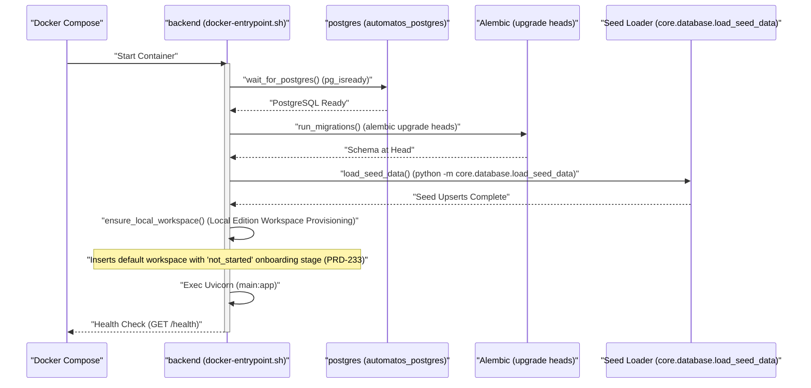

# Installation & Setup

<details>
<summary>Relevant source files</summary>

The following files were used as context for generating this wiki page:

- [.env.example](../../.env.example)
- [.github/workflows/test.yml](../../.github/workflows/test.yml)
- [docker-compose.yml](../../docker-compose.yml)
- [orchestrator/docker-entrypoint.sh](../../orchestrator/docker-entrypoint.sh)
- [frontend/.dockerignore](../../frontend/.dockerignore)
- [frontend/Dockerfile](../../frontend/Dockerfile)
- [frontend/components/activity/board/__tests__/blocked-reason.test.ts](../../frontend/components/activity/board/__tests__/blocked-reason.test.ts)
- [frontend/components/activity/board/__tests__/task-deliverables-panel.test.tsx](../../frontend/components/activity/board/__tests__/task-deliverables-panel.test.tsx)
- [frontend/components/activity/board/blocked-reason.ts](../../frontend/components/activity/board/blocked-reason.ts)
- [frontend/components/activity/board/task-deliverables-panel.tsx](../../frontend/components/activity/board/task-deliverables-panel.tsx)
- [infrastructure/.env.example](../../infrastructure/.env.example)
- [infrastructure/railway-manifest.json](../../infrastructure/railway-manifest.json)
- [orchestrator/Dockerfile](../../orchestrator/Dockerfile)
- [orchestrator/alembic/versions/prd222_veteran_skip_backfill.py](../../orchestrator/alembic/versions/prd222_veteran_skip_backfill.py)
- [orchestrator/core/redis/client.py](../../orchestrator/core/redis/client.py)
- [orchestrator/core/seeds/seed_local_first_run.py](../../orchestrator/core/seeds/seed_local_first_run.py)
- [orchestrator/requirements.txt](../../orchestrator/requirements.txt)
- [orchestrator/tests/test_dockerfile_prod_parity.py](../../orchestrator/tests/test_dockerfile_prod_parity.py)
- [orchestrator/tests/test_prd222_onboarding_reset.py](../../orchestrator/tests/test_prd222_onboarding_reset.py)
- [orchestrator/tests/test_prd233_fresh_install_starts_onboarding.py](../../orchestrator/tests/test_prd233_fresh_install_starts_onboarding.py)

</details>


## Purpose & Scope
This page guides developers and operators through the installation, configuration, and execution of Automatos AI using Docker Compose. It details the multi-service architecture, environment variables, database initialization via Alembic migrations, container dependency installations across multi-stage Dockerfiles, and runtime startup sequences.

---

## Prerequisites

Before installing Automatos AI, ensure your host environment satisfies the following requirements:
- **Docker Engine** (20.10+) and **Docker Compose** (2.0+)
- **Git** for repository cloning
- **Minimum 8GB RAM** (16GB recommended for running local workers, MinIO, and Qdrant)
- **10GB free disk space** for persistent volumes and container images
- **Port Availability**: `3000` (frontend), `8000` (backend), `5432` (PostgreSQL), `6379` (Redis), `9000`/`9001` (MinIO)

Sources for service ports: [docker-compose.yml:41-129](../../docker-compose.yml#L41-L129), [docker-compose.yml:293-370](../../docker-compose.yml#L293-L370)

---

## Quick Start

### 1. Clone Repository
```bash
git clone https://github.com/AutomatosAI/automatos-ai.git
cd automatos-ai
```

### 2. Configure Environment Variables
Copy the template environment file to the project root:
```bash
cp .env.example .env
```
Ensure required variables are populated in `.env`:
- `POSTGRES_PASSWORD`: PostgreSQL root password [docker-compose.yml:48](../../docker-compose.yml#L48)
- `REDIS_PASSWORD`: Redis authentication token [docker-compose.yml:74](../../docker-compose.yml#L74)
- `API_KEY`: Backend API access token [.env.example:28](../../.env.example#L28)

Sources: [docker-compose.yml:4-16](../../docker-compose.yml#L4-L16), [.env.example:1-30](../../.env.example#L1-L30)

### 3. Start Services
Launch the core stack using Docker Compose:
```bash
docker compose up --build -d
```
Access the web frontend at `http://localhost:3000`.

Sources: [docker-compose.yml:4-16](../../docker-compose.yml#L4-L16), [docker-compose.yml:329-370](../../docker-compose.yml#L329-L370)

---

## System Architecture & Component Map

The installation deploys a multi-container network. The diagram below bridges natural language subsystem descriptions to their concrete code entities (Docker images, container names, and build paths).

### Infrastructure Entity Map

```mermaid
graph TB
    subgraph "Data Persistence"
        pg["postgres<br/>(\"pgvector/pgvector:pg16\")"]
        rd["redis<br/>(\"redis:7-alpine\")"]
        mi["minio<br/>(\"cgr.dev/chainguard/minio:latest\")"]
    end
    
    subgraph "Application Services"
        be["backend<br/>(\"orchestrator/Dockerfile\")"]
        fe["frontend<br/>(\"frontend/Dockerfile\")"]
        wk["workspace-worker<br/>(\"services/workspace-worker/Dockerfile\")"]
    end

    fe -->|HTTP/WS| be
    be -->|SQL/pgvector| pg
    be -->|Cache/PubSub| rd
    be -->|S3 API| mi
    wk -->|Queue/IPC| rd
    wk -->|Workspace IO| be
    
    classDef default stroke:#333,stroke-width:2px;
```

Sources: [docker-compose.yml:41-459](../../docker-compose.yml#L41-L459), [infrastructure/railway-manifest.json:12-67](../../infrastructure/railway-manifest.json#L12-L67)

---

## Service Initialization Sequence & Entrypoint Lifecycle

When the backend container boots, it executes `docker-entrypoint.sh`, handling database connectivity checks, schema migrations, seed data installation, and local workspace provisioning.

### Startup & Lifecycle Code Flow


```mermaid
sequenceDiagram
    participant DC as "Docker Compose"
    participant BE as "backend (docker-entrypoint.sh)"
    participant PG as "postgres (automatos_postgres)"
    participant AL as "Alembic (upgrade heads)"
    participant SD as "Seed Loader (core.database.load_seed_data)"

    DC->>BE: "Start Container"
    activate BE
    BE->>PG: "wait_for_postgres() (pg_isready)"
    PG-->>BE: "PostgreSQL Ready"
    
    BE->>AL: "run_migrations() (alembic upgrade heads)"
    AL-->>BE: "Schema at Head"
    
    BE->>SD: "load_seed_data() (python -m core.database.load_seed_data)"
    SD-->>BE: "Seed Upserts Complete"
    
    BE->>BE: "ensure_local_workspace() (Local Edition Workspace Provisioning)"
    Note over BE: "Inserts default workspace with 'not_started' onboarding stage (PRD-233)"

    BE->>BE: "Exec Uvicorn (main:app)"
    BE-->>DC: "Health Check (GET /health)"
    deactivate BE
```

**Key Initialization Steps:**
1. **Postgres Readiness**: `wait_for_postgres()` polls `pg_isready` up to 30 attempts [orchestrator/docker-entrypoint.sh:76-93](../../orchestrator/docker-entrypoint.sh#L76-L93).
2. **Database Migrations**: `run_migrations()` executes `alembic upgrade heads` to bring the database schema to the latest revision, failing closed if any migration fails [orchestrator/docker-entrypoint.sh:149-159](../../orchestrator/docker-entrypoint.sh#L149-L159).
3. **Seed Data Loader**: Invokes `python -m core.database.load_seed_data` as a module to upsert core catalogs, agent personas, credential types, and marketplace items [orchestrator/docker-entrypoint.sh:164-190](../../orchestrator/docker-entrypoint.sh#L164-L190).
4. **Local Workspace Provisioning**: `ensure_local_workspace()` initializes `DEFAULT_WORKSPACE_ID` with an explicit `not_started` onboarding JSON document if running in `local` edition mode [orchestrator/docker-entrypoint.sh:199-232](../../orchestrator/docker-entrypoint.sh#L199-L232).

Sources: [orchestrator/docker-entrypoint.sh:1-276](../../orchestrator/docker-entrypoint.sh#L1-L276), [orchestrator/tests/test_prd233_fresh_install_starts_onboarding.py:1-57](../../orchestrator/tests/test_prd233_fresh_install_starts_onboarding.py#L1-L57)

---

## Environment Variables Reference

Configuration values are injected via `.env` and `envs/api.defaults`.

| Variable Name | Default Value | Description | Code Reference |
|---------------|---------------|-------------|----------------|
| `POSTGRES_DB` | `orchestrator_db` | PostgreSQL database name | [docker-compose.yml:46](../../docker-compose.yml#L46) |
| `POSTGRES_USER` | `postgres` | PostgreSQL connection user | [docker-compose.yml:47](../../docker-compose.yml#L47) |
| `POSTGRES_PASSWORD` | *Required* | PostgreSQL password secret | [docker-compose.yml:48](../../docker-compose.yml#L48) |
| `REDIS_PASSWORD` | *Required* | Redis auth password secret | [docker-compose.yml:74](../../docker-compose.yml#L74) |
| `API_KEY` | *Required* | Backend authentication key | [.env.example:28](../../.env.example#L28) |
| `S3_ENDPOINT_URL` | `http://minio:9000` | Local MinIO object store endpoint; the `.env.example` override is commented out | [docker-compose.yml:263](../../docker-compose.yml#L263), [.env.example:109](../../.env.example#L109) |
| `AUTH_EDITION` | `saas` (`local` in compose) | Edition mode gating authentication | [orchestrator/config.py:201-202](../../orchestrator/config.py#L201-L202), [envs/api.defaults:52](../../envs/api.defaults#L52) |
| `DEFAULT_WORKSPACE_ID` | Workspace UUID | Default tenant ID for local sessions | [test.yml: `orchestrator-tests-shard` job](../../.github/workflows/test.yml) |

Sources: [docker-compose.yml:41-321](../../docker-compose.yml#L41-L321), [.env.example:1-112](../../.env.example#L1-L112), [test.yml: `orchestrator-tests-shard` job](../../.github/workflows/test.yml)

---

## Dependency Installation & Container Build Architecture

Automatos AI uses multi-stage Docker builds to decouple build-time compilers and heavy development tools from lightweight production runtimes.

### Backend Multi-Stage Pipeline (`orchestrator/Dockerfile`)
1. **`pybuild` Stage**: Uses `python:3.11-slim` with `gcc`, `g++`, and `libffi-dev` installed to build Python wheels from `requirements.txt` into `/install`. Handles conditional graph extra compilation (`INSTALL_GRAPH_EXTRAS` build arg) [orchestrator/Dockerfile:20-59](../../orchestrator/Dockerfile#L20-L59).
2. **`base` Stage**: Slim runtime image containing system packages for document parsing and OCR (`tesseract-ocr`, `ghostscript`, `libmagic1`, `libpango-1.0-0`, `libcairo2`) [orchestrator/Dockerfile:64-87](../../orchestrator/Dockerfile#L64-L87).
3. **`development` & `production` Stages**: Installs application code, creates non-root user `automatos`, and exposes port `8000` running Uvicorn with reload in development or multiple workers in production [orchestrator/Dockerfile:95-189](../../orchestrator/Dockerfile#L95-L189).

### Frontend Container (`frontend/Dockerfile`)
- Uses `node:20-alpine` as base, supporting Next.js standalone output mode by copying traced dependencies into `/app` to minimize final image size [frontend/Dockerfile:14-132](../../frontend/Dockerfile#L14-L132).

Sources: [orchestrator/Dockerfile:1-189](../../orchestrator/Dockerfile#L1-L189), [frontend/Dockerfile:1-136](../../frontend/Dockerfile#L1-L136)

---

## Database Setup, Migrations & Veteran Backfill

Database schemas are managed exclusively through Alembic revision scripts.

### Migration Invariants & Veteran Backfill
- **Alembic Heads**: The repository requires exactly one Alembic head, as specified in [AGENTS.md](../../AGENTS.md) and guarded by [`test_prd209_exactly_one_head`](../../orchestrator/tests/test_prd209_alembic_single_head.py). The entrypoint retains `alembic upgrade heads` (plural): with a single head it upgrades to that head, and is a harmless no-op when the database is already current [orchestrator/docker-entrypoint.sh:145-159](../../orchestrator/docker-entrypoint.sh#L145-L159).
- **Veteran Backfilling**: `prd222_veteran_skip_backfill.py` marks pre-existing workspaces without onboarding stages as `skipped` while preserving new signups [orchestrator/alembic/versions/prd222_veteran_skip_backfill.py:1-50](../../orchestrator/alembic/versions/prd222_veteran_skip_backfill.py#L1-L50).
- **Fresh Install Boot**: Brand new local installations seed workspaces with `stage: not_started` so that the Auto-led onboarding chat triggers correctly [orchestrator/tests/test_prd233_fresh_install_starts_onboarding.py:1-40](../../orchestrator/tests/test_prd233_fresh_install_starts_onboarding.py#L1-L40).

Sources: [orchestrator/alembic/versions/prd222_veteran_skip_backfill.py:1-65](../../orchestrator/alembic/versions/prd222_veteran_skip_backfill.py#L1-L65), [orchestrator/tests/test_prd233_fresh_install_starts_onboarding.py:1-57](../../orchestrator/tests/test_prd233_fresh_install_starts_onboarding.py#L1-L57)

---

## Verification & Troubleshooting

After starting containers, verify operational status:

1. **Check Container Health**:
   ```bash
   docker compose ps
   ```
2. **Inspect Migration Logs**:
   Confirm that Alembic successfully applied revisions up to head:
   ```bash
   docker compose logs backend | grep "alembic upgrade heads"
   ```
3. **Test Redis Connectivity**:
   Execute a ping against the Redis client container:
   ```bash
   docker compose exec redis redis-cli -a "$REDIS_PASSWORD" ping
   ```
4. **Run Test Suites**:
   The test suite runs against an ephemeral PostgreSQL service configured in the GitHub Actions [`orchestrator-tests-shard` job](../../.github/workflows/test.yml):
   ```bash
   pytest tests --timeout=60 -v
   ```

Sources: [docker-compose.yml:41-91](../../docker-compose.yml#L41-L91), [docker-compose.yml:293-321](../../docker-compose.yml#L293-L321), [test.yml: `orchestrator-tests-shard` job](../../.github/workflows/test.yml)

---
