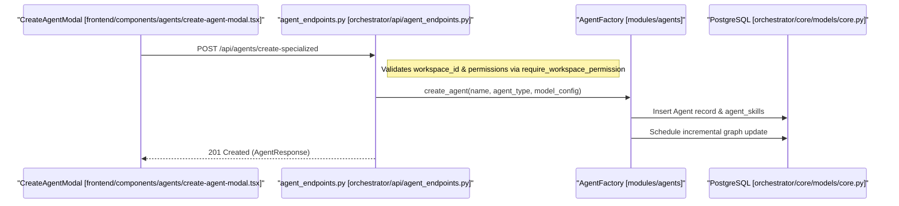

# Quick Start Tutorial

<details>
<summary>Relevant source files</summary>

The following files were used as context for generating this wiki page:

- [frontend/components/agents/agent-configuration-modal.tsx](frontend/components/agents/agent-configuration-modal.tsx)
- [frontend/components/agents/agent-configuration.tsx](frontend/components/agents/agent-configuration.tsx)
- [frontend/components/agents/agent-details-modal.tsx](frontend/components/agents/agent-details-modal.tsx)
- [frontend/components/agents/agent-performance.tsx](frontend/components/agents/agent-performance.tsx)
- [frontend/components/agents/agent-roster.tsx](frontend/components/agents/agent-roster.tsx)
- [frontend/components/agents/agent-skills.tsx](frontend/components/agents/agent-skills.tsx)
- [frontend/components/agents/agent-status-control-modal.tsx](frontend/components/agents/agent-status-control-modal.tsx)
- [frontend/components/agents/create-agent-modal.tsx](frontend/components/agents/create-agent-modal.tsx)
- [frontend/components/agents/create-skill-modal.tsx](frontend/components/agents/create-skill-modal.tsx)
- [frontend/components/agents/model-selector.tsx](frontend/components/agents/model-selector.tsx)
- [frontend/components/agents/skill-configuration-modal.tsx](frontend/components/agents/skill-configuration-modal.tsx)
- [frontend/hooks/use-agent-api.ts](frontend/hooks/use-agent-api.ts)
- [frontend/hooks/use-model-api.ts](frontend/hooks/use-model-api.ts)
- [frontend/lib/agent-constants.ts](frontend/lib/agent-constants.ts)
- [orchestrator/alembic/versions/add_job_title_to_agents.py](orchestrator/alembic/versions/add_job_title_to_agents.py)
- [orchestrator/api/agent_endpoints.py](orchestrator/api/agent_endpoints.py)
- [orchestrator/api/agents.py](orchestrator/api/agents.py)
- [orchestrator/core/models/__init__.py](orchestrator/core/models/__init__.py)
- [orchestrator/core/models/core.py](orchestrator/core/models/core.py)

</details>


This document provides a technical walkthrough for getting started with Automatos AI. You will learn how to navigate the platform, create your first agent, connect tools, and execute workflows using the core UI components and backend services.

---

## 1. Agent Creation & Configuration

Agents are the primary workers in Automatos AI. They are managed via the agent management components [frontend/components/agents/agent-roster.tsx:187](), which serve as the hub for the agent roster, org charts, and skill configuration.

### Agent Creation Flow
1.  **Modal Initiation**: The `CreateAgentModal` [frontend/components/agents/create-agent-modal.tsx:67]() is used to define the agent's identity, including name, category, and plugins [frontend/components/agents/create-agent-modal.tsx:69-79]().
2.  **Category & Persona**: Users select a category (e.g., Development, Analytics) which maps to database agent types and categories [frontend/lib/agent-constants.ts:25-42]().
3.  **Model Selection**: The `ModelSelector` [frontend/components/agents/model-selector.tsx]() allows assigning a specific LLM (via `useModels` and `useWorkspaceModels`) and configuring runtime parameters [frontend/hooks/use-model-api.ts:73-104]().
4.  **Backend Persistence**: The frontend calls `POST /api/agents/create-specialized` [orchestrator/api/agent_endpoints.py:41](). The `AgentFactory` [orchestrator/api/agent_endpoints.py:32]() then initializes the agent runtime and triggers a knowledge graph update for the new roster member [orchestrator/api/agent_endpoints.py:93-101]().

### Technical Data Flow: Agent Creation

**Sources:** [frontend/components/agents/create-agent-modal.tsx:67-186](), [orchestrator/api/agent_endpoints.py:41-107](), [orchestrator/core/models/core.py:31-41]()

---

## 2. Connecting Tools & Integrations

To interact with the outside world, agents use the **Tools** system, which integrates with Composio for third-party app access and workspace assignments.

### Tool Resolution & Discovery
When configuring tools for an agent, incoming tool IDs are resolved via `_resolve_tool_ids_to_app_names` [orchestrator/api/agents.py:139](), which checks the `EntityManager` [orchestrator/api/agents.py:149]() for active workspace entity connections and maps them against `ComposioAppCache` [orchestrator/api/agents.py:173]().

### Tool Connection Process
1.  **Initiation**: Users interact with tool management interfaces to authenticate or activate integrations.
2.  **Entity Management**: The backend checks allowed statuses (`active`, `added`, `pending`) for workspace app connections [orchestrator/api/agents.py:154]().
3.  **Agent Assignment**: Active tools are linked to agents via app assignments (`AgentAppAssignment`) and stored for tool execution context [orchestrator/api/agents.py:14]().

**Sources:** [orchestrator/api/agents.py:139-182](), [orchestrator/core/models/core.py:14-16]()

---

## 3. Knowledge Ingestion (RAG)

Unstructured data and documents are ingested into the platform to build durable context for agents through vector search and knowledge graphs.

### Ingestion Pipeline
-   **Upload & Parsing**: Documents are uploaded and processed by background workers to extract text and generate semantic embeddings.
-   **Vector Storage**: Chunks are stored in vector backends (such as pgvector or Qdrant) with strict team and workspace scoping.
-   **Graph Integration**: Roster updates and document ingestions trigger incremental updates in `get_graph_service()` to keep the knowledge graph synchronized [orchestrator/api/agent_endpoints.py:93-101]().

**Sources:** [orchestrator/api/agent_endpoints.py:93-101](), [orchestrator/core/models/__init__.py:1-31]()

---

## 4. Running a Chat & Workflow

Interaction occurs through the chat interface and agent roster, where agents execute tasks utilizing assigned skills, models, and tools.

### Execution Components
| Entity | Role | Code Pointer |
| :--- | :--- | :--- |
| `AgentRoster` | UI for managing, starting, and inspecting agents | [frontend/components/agents/agent-roster.tsx:200]() |
| `AgentConfigurationModal` | Modal interface for updating agent settings, plugins, and runtime parameters | [frontend/components/agents/agent-configuration-modal.tsx:98]() |
| `AgentFactory` | Backend factory initializing specialized agents and LLM bindings | [orchestrator/api/agent_endpoints.py:32]() |
| `LLMModel` | Core data model tracking provider metadata, context windows, and cost tiers | [orchestrator/core/models/core.py:47]() |

### Code Entity Space: Agent Execution & Management
```mermaid
graph TD
    "AgentRoster[AgentRoster]" --> "ConfigModal[AgentConfigurationModal]"
    "ConfigModal[AgentConfigurationModal]" --> "AgentAPI[useUpdateAgentConfig]"
    "AgentAPI[useUpdateAgentConfig]" --> "APIEndpoint[api/agents.py]"
    "APIEndpoint[api/agents.py]" --> "DB[Agent Model]"

    subgraph "Code Entities"
        "AgentRoster[AgentRoster]" --> "frontend/components/agents/agent-roster.tsx:200"
        "ConfigModal[AgentConfigurationModal]" --> "frontend/components/agents/agent-configuration-modal.tsx:98"
        "AgentAPI[useUpdateAgentConfig]" --> "frontend/hooks/use-agent-api.ts:45"
        "APIEndpoint[api/agents.py]" --> "orchestrator/api/agents.py:33"
        "DB[Agent Model]" --> "orchestrator/core/models/core.py"
    end
```

**Sources:** [frontend/components/agents/agent-roster.tsx:200-214](), [frontend/components/agents/agent-configuration-modal.tsx:98-116](), [frontend/hooks/use-agent-api.ts:43-46](), [orchestrator/api/agents.py:33-52]()

---