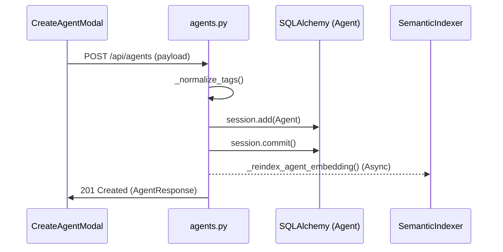

# Quick Start Tutorial

<details>
<summary>Relevant source files</summary>

The following files were used as context for generating this wiki page:

- [frontend/app/api/chat/route.ts](frontend/app/api/chat/route.ts)
- [frontend/components/agents/agent-configuration-modal.tsx](frontend/components/agents/agent-configuration-modal.tsx)
- [frontend/components/agents/agent-configuration.tsx](frontend/components/agents/agent-configuration.tsx)
- [frontend/components/agents/agent-details-modal.tsx](frontend/components/agents/agent-details-modal.tsx)
- [frontend/components/agents/agent-roster.tsx](frontend/components/agents/agent-roster.tsx)
- [frontend/components/agents/create-agent-modal.tsx](frontend/components/agents/create-agent-modal.tsx)
- [frontend/components/chatbot/chat.tsx](frontend/components/chatbot/chat.tsx)
- [frontend/components/chatbot/mission-suggestion-card.tsx](frontend/components/chatbot/mission-suggestion-card.tsx)
- [frontend/components/documents/analytics-tab.tsx](frontend/components/documents/analytics-tab.tsx)
- [frontend/components/documents/processing-tab.tsx](frontend/components/documents/processing-tab.tsx)
- [frontend/lib/agent-constants.ts](frontend/lib/agent-constants.ts)
- [frontend/lib/chat/hooks.ts](frontend/lib/chat/hooks.ts)
- [frontend/stores/mission-store.ts](frontend/stores/mission-store.ts)
- [orchestrator/alembic/versions/add_job_title_to_agents.py](orchestrator/alembic/versions/add_job_title_to_agents.py)
- [orchestrator/alembic/versions/agent_public_id_and_slug_fix.py](orchestrator/alembic/versions/agent_public_id_and_slug_fix.py)
- [orchestrator/alembic/versions/seed_auto_agents_existing_workspaces.py](orchestrator/alembic/versions/seed_auto_agents_existing_workspaces.py)
- [orchestrator/api/agents.py](orchestrator/api/agents.py)
- [orchestrator/api/chat.py](orchestrator/api/chat.py)
- [orchestrator/api/recipe_executor.py](orchestrator/api/recipe_executor.py)
- [orchestrator/consumers/chatbot/service.py](orchestrator/consumers/chatbot/service.py)
- [orchestrator/core/models/core.py](orchestrator/core/models/core.py)
- [orchestrator/core/utils/agent_resolver.py](orchestrator/core/utils/agent_resolver.py)
- [orchestrator/modules/agents/factory/agent_factory.py](orchestrator/modules/agents/factory/agent_factory.py)

</details>


This document provides a hands-on tutorial for getting started with Automatos AI. You will learn how to create an agent, connect tools, run a streaming chat, and execute a workflow.

**Prerequisites**: This tutorial assumes you have completed the installation described in [Installation & Setup](2.1) and have the application running.

---

## Step 1: Create Your First Agent

Agents are the primary workers in Automatos AI. Creating an agent involves defining its persona, selecting an LLM provider, and assigning capabilities.

### Implementation Detail: The Agent Creation Flow
When you use the `CreateAgentModal`, the frontend collects metadata and sends a POST request to `/api/agents`. The backend uses the `AgentFactory` to initialize the agent's runtime state.



**Key Actions**:
1.  **Identity**: Provide a `name` and `category` (e.g., "DevOps", "Data Analysis"). The UI maps these categories to internal `agent_type` values via `CATEGORY_TO_DB_MAP` [frontend/components/agents/create-agent-modal.tsx:196]().
2.  **Persona**: Choose a `PersonaMode`. You can select a predefined persona (e.g., "Code Architect") which injects a specific `system_prompt` [frontend/components/agents/create-agent-modal.tsx:144-152]().
3.  **Model Config**: Select a provider (OpenAI, Anthropic, etc.) and model. This is stored in the `agent_model_configs` table [orchestrator/core/models/core.py:176-180]().

**Sources**: [frontend/components/agents/create-agent-modal.tsx:176-210](), [orchestrator/api/agents.py:38-66](), [orchestrator/modules/agents/factory/agent_factory.py:105-146]()

---

## Step 2: Connect Tools and Skills

Tools allow agents to interact with the outside world (e.g., Slack, GitHub, Jira) via Composio.

### Tool Assignment Logic
Tools are assigned to agents through the `agent_app_assignments` table. When an agent is executed, the `ToolRouter` fetches these assignments to build the available toolset for the LLM.

| Entity | Role | Code Reference |
| :--- | :--- | :--- |
| `AgentAppAssignment` | Links an Agent to a specific Composio App | [orchestrator/core/models/composio_cache.py:13-28]() |
| `UnifiedToolExecutor` | Routes execution to Composio, Platform, or Workspace tools | [orchestrator/modules/agents/factory/agent_factory.py:42-45]() |
| `get_tools_for_agent` | Single source of truth for an agent's tool schemas | [orchestrator/modules/agents/factory/agent_factory.py:9-11]() |

**How to connect**:
- In the `AgentConfigurationModal`, navigate to the **Tools** tab.
- Toggle active tools. The frontend calls `_resolve_tool_ids_to_app_names` on the backend to validate that the tools are authenticated for the current workspace [orchestrator/api/agents.py:97-143]().

**Sources**: [orchestrator/api/agents.py:180-200](), [orchestrator/modules/agents/factory/agent_factory.py:171-172]()

---

## Step 3: Run a Streaming Chat

The Chat interface uses the `useChat` hook to manage a Server-Sent Events (SSE) stream between the frontend and the `StreamingChatService`.

### Data Flow: Chat Request to LLM Response
When you send a message, the system performs a complexity assessment (AutoBrain) to determine if it should route to a single agent or trigger a multi-agent workflow.

```mermaid
graph TD
    "UI[chat.tsx]" -- "sendMessage()" --> "API[/api/chat]"
    "API[/api/chat]" -- "Analyze" --> "AB[AutoBrain]"
    "AB[AutoBrain]" -- "Complexity: ATOM" --> "SCS[StreamingChatService]"
    "AB[AutoBrain]" -- "Complexity: ORGANISM" --> "WB[WorkflowBridge]"
    "SCS[StreamingChatService]" -- "Context" --> "CS[ContextService]"
    "CS[ContextService]" -- "Prompt" --> "LLM[LLMManager]"
    "LLM[LLMManager]" -- "Stream" --> "UI[chat.tsx]"

    subgraph "Code Entities"
        "AB[AutoBrain]" --> "orchestrator/consumers/chatbot/auto.py"
        "SCS[StreamingChatService]" --> "orchestrator/consumers/chatbot/service.py"
        "WB[WorkflowBridge]" --> "orchestrator/api/chat.py"
    end
```

**Key Features**:
- **Tool Loop Prevention**: The `ToolExecutionTracker` monitors tool calls in a single turn to prevent infinite loops (max 10 iterations) [orchestrator/consumers/chatbot/service.py:83-112]().
- **Routing Info**: The `UniversalRouter` attaches headers (e.g., `x-routing-agent-id`) to the response so the UI can display which agent is responding [frontend/lib/chat/hooks.ts:142-157]().

**Sources**: [frontend/lib/chat/hooks.ts:55-125](), [orchestrator/api/chat.py:37-100](), [orchestrator/consumers/chatbot/service.py:150-176]()

---

## Step 4: Execute a Workflow (Recipe)

Workflows (or "Recipes") are sequences of steps executed by one or more agents. For simple automation, the system uses the `RecipeDirectExecutor`.

### Workflow Execution Lifecycle
1.  **Context Assembly**: Uses `ContextService(RECIPE)` to build a system prompt containing the recipe's goal and current step instructions [orchestrator/api/recipe_executor.py:9-12]().
2.  **Scratchpad**: Agents use a `RecipeScratchpad` to pass data between steps without bloating the context window [orchestrator/api/recipe_executor.py:15-16]().
3.  **Notifications**: On completion, the `NotificationDispatcher` sends an event (e.g., `playbook_complete`) to the user's notification bell [orchestrator/api/recipe_executor.py:45-61]().

### Automated Reporting
Upon finishing a recipe, the `ReportService` generates a Markdown summary including:
- **Metrics**: Total tokens used, cost in USD, and duration [orchestrator/api/recipe_executor.py:113-131]().
- **Step Breakdown**: Status and output preview for every step [orchestrator/api/recipe_executor.py:159-168]().

**Sources**: [orchestrator/api/recipe_executor.py:1-37](), [orchestrator/api/recipe_executor.py:88-140]()

---

## Summary Table: Quick Start Entities

| Task | Key Class/Function | File Path |
| :--- | :--- | :--- |
| **Create Agent** | `AgentFactory.create_agent` | [orchestrator/modules/agents/factory/agent_factory.py]() |
| **Route Chat** | `UniversalRouter.route` | [orchestrator/core/routing/engine.py]() |
| **Execute Tool** | `UnifiedToolExecutor.execute` | [orchestrator/modules/tools/tool_router.py]() |
| **Run Workflow** | `execute_recipe_direct` | [orchestrator/api/recipe_executor.py]() |
| **Stream Response** | `StreamingChatService.stream` | [orchestrator/consumers/chatbot/service.py]() |

**Sources**: [orchestrator/api/agents.py:31](), [orchestrator/api/chat.py:30](), [orchestrator/api/recipe_executor.py:1]()

---