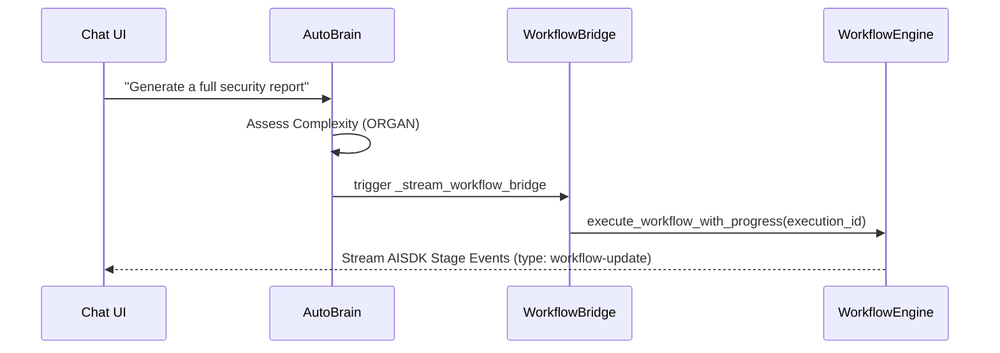

# Quick Start Tutorial

<details>
<summary>Relevant source files</summary>

The following files were used as context for generating this wiki page:

- [docs/reviews/COMPOSIO-TOOL-REGRESSION-REVIEW.md](docs/reviews/COMPOSIO-TOOL-REGRESSION-REVIEW.md)
- [frontend/components/agents/agent-configuration-modal.tsx](frontend/components/agents/agent-configuration-modal.tsx)
- [frontend/components/agents/agent-configuration.tsx](frontend/components/agents/agent-configuration.tsx)
- [frontend/components/agents/agent-details-modal.tsx](frontend/components/agents/agent-details-modal.tsx)
- [frontend/components/agents/agent-management.tsx](frontend/components/agents/agent-management.tsx)
- [frontend/components/agents/agent-performance.tsx](frontend/components/agents/agent-performance.tsx)
- [frontend/components/agents/agent-roster.tsx](frontend/components/agents/agent-roster.tsx)
- [frontend/components/agents/agent-skills.tsx](frontend/components/agents/agent-skills.tsx)
- [frontend/components/agents/agent-status-control-modal.tsx](frontend/components/agents/agent-status-control-modal.tsx)
- [frontend/components/agents/create-agent-modal.tsx](frontend/components/agents/create-agent-modal.tsx)
- [frontend/components/agents/create-skill-modal.tsx](frontend/components/agents/create-skill-modal.tsx)
- [frontend/components/agents/skill-configuration-modal.tsx](frontend/components/agents/skill-configuration-modal.tsx)
- [frontend/components/documents/analytics-tab.tsx](frontend/components/documents/analytics-tab.tsx)
- [frontend/components/documents/processing-tab.tsx](frontend/components/documents/processing-tab.tsx)
- [frontend/hooks/use-agent-api.ts](frontend/hooks/use-agent-api.ts)
- [frontend/hooks/use-document-api.ts](frontend/hooks/use-document-api.ts)
- [orchestrator/api/agents.py](orchestrator/api/agents.py)
- [orchestrator/api/chat.py](orchestrator/api/chat.py)
- [orchestrator/api/chat_voice.py](orchestrator/api/chat_voice.py)
- [orchestrator/consumers/chatbot/auto.py](orchestrator/consumers/chatbot/auto.py)
- [orchestrator/consumers/chatbot/intent_classifier.py](orchestrator/consumers/chatbot/intent_classifier.py)
- [orchestrator/consumers/chatbot/personality.py](orchestrator/consumers/chatbot/personality.py)
- [orchestrator/consumers/chatbot/service.py](orchestrator/consumers/chatbot/service.py)
- [orchestrator/consumers/chatbot/smart_tool_router.py](orchestrator/consumers/chatbot/smart_tool_router.py)
- [orchestrator/core/llm/manager.py](orchestrator/core/llm/manager.py)
- [orchestrator/core/models/__init__.py](orchestrator/core/models/__init__.py)
- [orchestrator/core/models/core.py](orchestrator/core/models/core.py)
- [orchestrator/core/routing/engine.py](orchestrator/core/routing/engine.py)
- [orchestrator/modules/orchestrator/service.py](orchestrator/modules/orchestrator/service.py)
- [orchestrator/modules/tools/discovery/actions_analytics_enhanced.py](orchestrator/modules/tools/discovery/actions_analytics_enhanced.py)
- [orchestrator/modules/tools/discovery/handlers_analytics_enhanced.py](orchestrator/modules/tools/discovery/handlers_analytics_enhanced.py)
- [orchestrator/modules/tools/discovery/handlers_search.py](orchestrator/modules/tools/discovery/handlers_search.py)
- [orchestrator/modules/tools/discovery/platform_actions.py](orchestrator/modules/tools/discovery/platform_actions.py)
- [orchestrator/modules/tools/discovery/platform_executor.py](orchestrator/modules/tools/discovery/platform_executor.py)
- [orchestrator/modules/tools/tool_router.py](orchestrator/modules/tools/tool_router.py)
- [orchestrator/services/heartbeat_service.py](orchestrator/services/heartbeat_service.py)

</details>


This document provides a hands-on tutorial for getting started with Automatos AI. You will learn how to create your first agent, connect tools and plugins, execute a multi-step mission, and interact with agents through the chat interface.

**Prerequisites**: This tutorial assumes you have completed the installation and setup described in [Installation & Setup](2.1) and have the application running. For detailed configuration options, see [Configuration Guide](2.2).

---

## Tutorial Overview

```mermaid
graph LR
    "Step1[Step 1: Create Agent]" --> "Step2[Step 2: Build Mission]"
    "Step2[Step 2: Build Mission]" --> "Step3[Step 3: Execute Workflow]"
    "Step3[Step 3: Execute Workflow]" --> "Step4[Step 4: Use Chat]"
    
    "Step1[Step 1: Create Agent]" -. "creates" .-> "AgentEntity[Agent Entity]"
    "Step2[Step 2: Build Mission]" -. "creates" .-> "MissionModel[Mission/Workflow Model]"
    "Step3[Step 3: Execute Workflow]" -. "runs" .-> "ExecutionRecord[WorkflowExecution]"
    "Step4[Step 4: Use Chat]" -. "interacts" .-> "ChatSession[Chat Session]"
```

**Sources**: [orchestrator/api/agents.py:174-230](), [orchestrator/api/chat.py:70-140](), [orchestrator/core/models/core.py:235-280]()

---

## Step 1: Create Your First Agent

Agents are the core execution units. They are defined by their persona, model configuration, and assigned capabilities (tools, plugins, and skills).

### Agent Creation Architecture

The following diagram bridges the frontend modal to the backend persistence layer.

```mermaid
graph TB
    subgraph "Frontend Space (React)"
        "CreateAgentModal[CreateAgentModal]" -- "POST /api/agents" --> "AgentAPI[Agent API Router]"
        "AgentRoster[AgentRoster]" -- "renders" --> "AgentCard[Agent Card]"
    end
    
    subgraph "Backend Space (FastAPI/SQLAlchemy)"
        "AgentAPI[Agent API Router]" -- "calls" --> "CreateAgentFn[create_agent]"
        "CreateAgentFn[create_agent]" -- "persists" --> "AgentModel[Agent DB Model]"
        "CreateAgentFn[create_agent]" -- "triggers" --> "SemanticIndexer[Semantic Indexer]"
    end
    
    subgraph "Data Space (Postgres/pgvector)"
        "AgentModel[Agent DB Model]" --> "AgentsTable[(agents)]"
        "SemanticIndexer[Semantic Indexer]" --> "AgentEmbeddings[(agent_embeddings)]"
    end
```

**Sources**: [frontend/components/agents/create-agent-modal.tsx:1-200](), [orchestrator/api/agents.py:38-66](), [orchestrator/api/agents.py:174-230]()

### Create Agent via UI

1. Open the **Agents** roster [frontend/components/agents/agent-management.tsx:136]().
2. Click **Create Agent** to open the `CreateAgentModal` [frontend/components/agents/agent-management.tsx:168-175]().
3. **Identity**: Set Name and Category. The frontend maps categories to a database `agent_type` [frontend/components/agents/agent-configuration-modal.tsx:93]().
4. **Persona**: Use the `AgentConfigurationModal` to select a predefined persona or enter a custom prompt [frontend/components/agents/agent-configuration-modal.tsx:136-149]().
5. **Model**: Configure the LLM via the `ModelSelector`. The backend stores this in `agent.model_config` [orchestrator/api/agents.py:176-178](), [frontend/components/agents/agent-configuration-modal.tsx:56]().
6. **Capabilities**:
    - **Tools**: Toggle connected apps. The system uses `_stable_tool_id` to match frontend selections to backend tool names [orchestrator/api/agents.py:68-78]().
    - **Plugins**: Assign workspace-enabled plugins via the `AgentAssignedPlugin` model [orchestrator/api/agents.py:15]().
7. Click **Save**. The backend triggers `_reindex_agent_embedding` to enable semantic routing [orchestrator/api/agents.py:38-66]().

---

## Step 2: Configure Heartbeats

Heartbeats allow agents to perform autonomous checks or status updates without user prompts.

1. Open the **Configuration** tab in `AgentConfigurationModal` [frontend/components/agents/agent-configuration-modal.tsx:156]().
2. Enable **Heartbeat** and set an `interval_minutes` [orchestrator/services/heartbeat_service.py:168]().
3. The `HeartbeatService` schedules this via `APScheduler` using a `CronTrigger` [orchestrator/services/heartbeat_service.py:129-161]().
4. When the heartbeat fires, it executes the agent's logic through the `AgentFactory` [orchestrator/services/heartbeat_service.py:26]().

**Sources**: [orchestrator/services/heartbeat_service.py:1-189](), [frontend/components/agents/agent-configuration-modal.tsx:156-171]()

---

## Step 3: Execute with Workflow Bridge

When a complex request is made in chat, the **Workflow Bridge** creates a transient workflow to handle the task.

### The Execution Pipeline

If triggered via chat (complexity assessment >= ORGAN), it follows the `_stream_workflow_bridge` path [orchestrator/api/chat.py:70-88]().



**Sources**: [orchestrator/api/chat.py:70-168](), [orchestrator/consumers/chatbot/auto.py:42-49]()

---

## Step 4: Run a Chat Session

The chat interface is the primary way to interact with agents. It uses `StreamingChatService` to manage responses and tool execution [orchestrator/consumers/chatbot/service.py:12]().

### Complexity Assessment (AutoBrain)

Every message is intercepted by `AutoBrain` to determine the execution strategy [orchestrator/api/chat.py:19]().

| Complexity | Logic | Action |
|---|---|---|
| **ATOM** | Simple greetings/chitchat [orchestrator/consumers/chatbot/auto.py:92-114]() | `Action.RESPOND` (Direct text) |
| **MOLECULE** | Needs a single tool [orchestrator/consumers/chatbot/auto.py:45]() | `Action.DELEGATE` (Tool call) |
| **ORGAN** | Multi-agent coordination [orchestrator/consumers/chatbot/auto.py:47]() | `Action.MISSION` or Workflow Bridge |

### Tool Loop Prevention

To prevent infinite loops during autonomous tool usage, the `ToolExecutionTracker` enforces limits [orchestrator/consumers/chatbot/service.py:78]().

- **Max Retries**: Tools like `composio_execute` or `query_database` are limited to 2-3 retries per turn [orchestrator/consumers/chatbot/service.py:93-104]().
- **Semantic Deduplication**: Prevents repeated search queries that are 75% similar [orchestrator/consumers/chatbot/service.py:57-66]().

### Code Entity Bridge: Chat to Platform Actions

```mermaid
graph LR
    subgraph "Natural Language Space"
        "Input[List my agents]"
    end

    subgraph "Code Entity Space"
        "Input[List my agents]" -- "Regex Match" --> "AutoBrain[_PLATFORM_KEYWORDS]"
        "AutoBrain[_PLATFORM_KEYWORDS]" -- "Inject Tool Hint" --> "SmartToolRouter[platform_list_agents]"
        "SmartToolRouter[platform_list_agents]" -- "Route to" --> "PlatformActionExecutor[list_agents handler]"
    end
```

**Sources**: [orchestrator/consumers/chatbot/auto.py:116-120](), [orchestrator/consumers/chatbot/smart_tool_router.py:64-73](), [orchestrator/modules/tools/discovery/platform_executor.py:175]()

---

## Summary of Key Components

| Component/Class | Role | File |
|---|---|---|
| `AgentConfigurationModal` | UI for agent settings, persona, and heartbeats | [frontend/components/agents/agent-configuration-modal.tsx:95]() |
| `StreamingChatService` | Orchestrates SSE streaming and tool execution loops | [orchestrator/consumers/chatbot/service.py:12]() |
| `ToolExecutionTracker` | Prevents redundant tool calls and infinite loops | [orchestrator/consumers/chatbot/service.py:78]() |
| `SmartToolRouter` | Filters and prioritizes tools based on detected intent | [orchestrator/consumers/chatbot/smart_tool_router.py:39]() |
| `PlatformActionExecutor` | Dispatches platform management commands to handlers | [orchestrator/modules/tools/discovery/platform_executor.py:164]() |
| `HeartbeatService` | Manages periodic autonomous agent ticks | [orchestrator/services/heartbeat_service.py:24]() |

**Sources**: [orchestrator/api/agents.py:38](), [orchestrator/consumers/chatbot/service.py:12](), [orchestrator/consumers/chatbot/smart_tool_router.py:39](), [orchestrator/api/chat.py:70](), [orchestrator/services/heartbeat_service.py:24]()

---