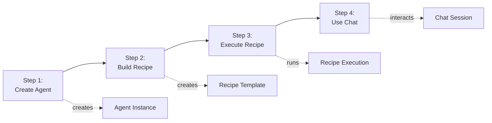
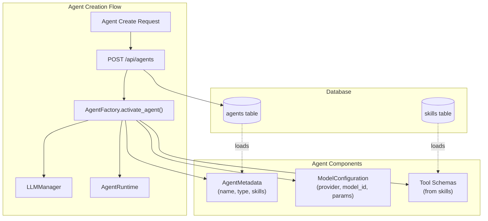
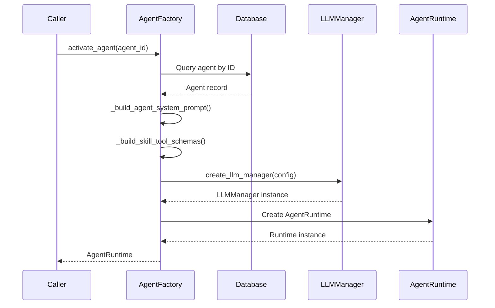
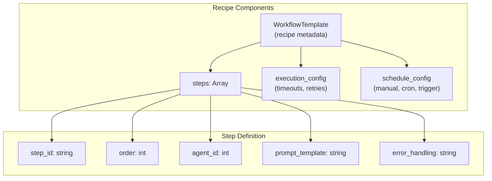
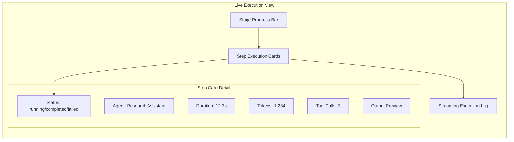
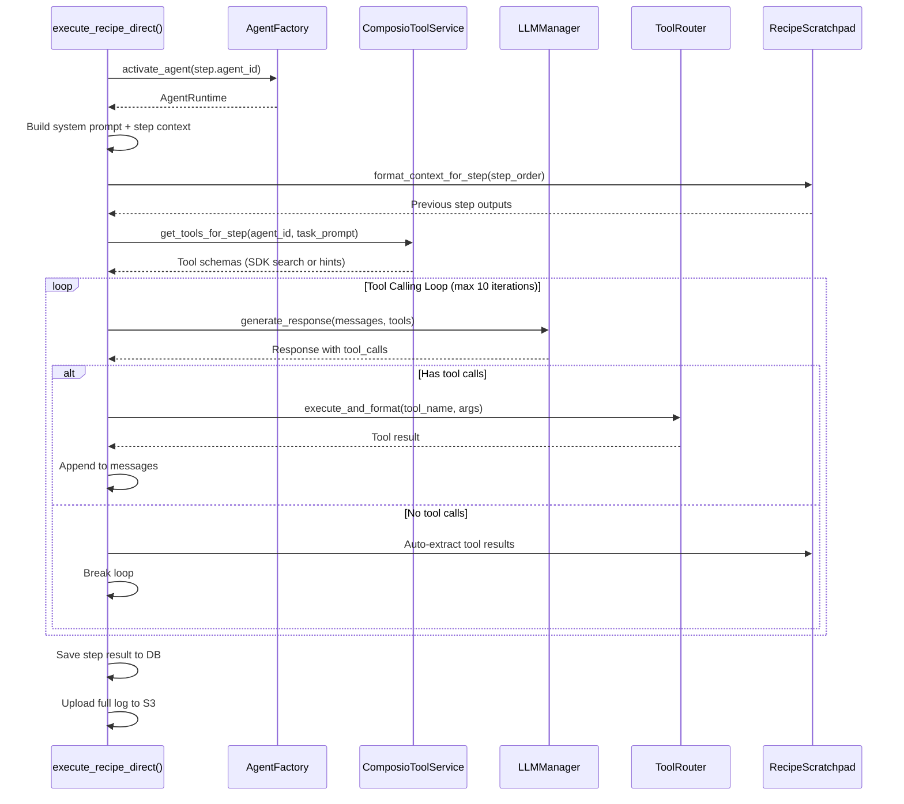
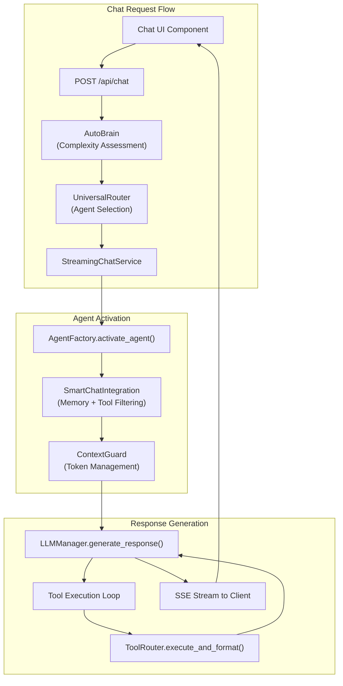
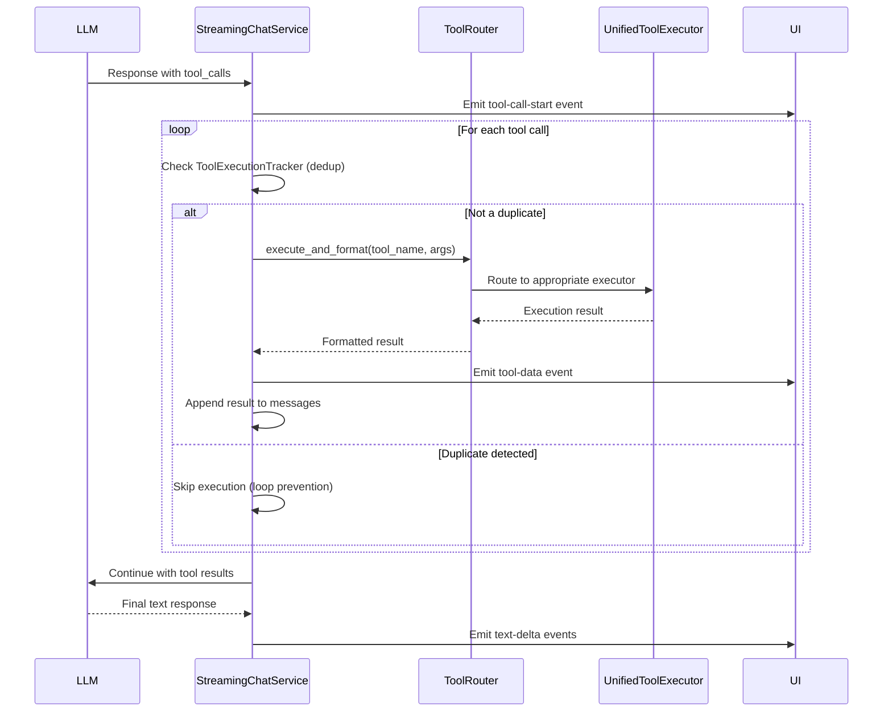

# Quick Start Tutorial

<details>
<summary>Relevant source files</summary>

The following files were used as context for generating this wiki page:

- [frontend/components/workflows/create-recipe-modal.tsx](frontend/components/workflows/create-recipe-modal.tsx)
- [frontend/components/workflows/execution-kitchen.tsx](frontend/components/workflows/execution-kitchen.tsx)
- [frontend/components/workflows/recipe-execution-config.tsx](frontend/components/workflows/recipe-execution-config.tsx)
- [frontend/components/workflows/recipe-preview-panel.tsx](frontend/components/workflows/recipe-preview-panel.tsx)
- [frontend/components/workflows/recipe-step-builder.tsx](frontend/components/workflows/recipe-step-builder.tsx)
- [frontend/components/workflows/recipes-tab.tsx](frontend/components/workflows/recipes-tab.tsx)
- [frontend/components/workflows/view-recipe-modal.tsx](frontend/components/workflows/view-recipe-modal.tsx)
- [frontend/hooks/use-recipe-form.ts](frontend/hooks/use-recipe-form.ts)
- [frontend/tsconfig.tsbuildinfo](frontend/tsconfig.tsbuildinfo)
- [orchestrator/alembic/versions/20260202_add_workspace_id_to_skills_patterns_models.py](orchestrator/alembic/versions/20260202_add_workspace_id_to_skills_patterns_models.py)
- [orchestrator/api/recipe_executor.py](orchestrator/api/recipe_executor.py)
- [orchestrator/api/workflow_recipes.py](orchestrator/api/workflow_recipes.py)
- [orchestrator/api/workflows.py](orchestrator/api/workflows.py)
- [orchestrator/consumers/chatbot/service.py](orchestrator/consumers/chatbot/service.py)
- [orchestrator/core/llm/manager.py](orchestrator/core/llm/manager.py)
- [orchestrator/core/models/core.py](orchestrator/core/models/core.py)
- [orchestrator/core/services/recipe_memory_service.py](orchestrator/core/services/recipe_memory_service.py)
- [orchestrator/core/services/workspace_manager.py](orchestrator/core/services/workspace_manager.py)
- [orchestrator/modules/agents/factory/agent_factory.py](orchestrator/modules/agents/factory/agent_factory.py)
- [orchestrator/modules/orchestrator/pipeline.py](orchestrator/modules/orchestrator/pipeline.py)
- [orchestrator/modules/orchestrator/service.py](orchestrator/modules/orchestrator/service.py)

</details>


This document provides a hands-on tutorial for getting started with Automatos AI. You will learn how to create your first agent, build and execute a multi-step recipe, and interact with agents through the chat interface.

**Prerequisites**: This tutorial assumes you have completed the installation and setup described in [Installation & Setup](#2.1) and have the application running locally. For detailed configuration options, see [Configuration Guide](#2.2).

**What You'll Build**: By the end of this tutorial, you will have created a custom agent, built a 2-step recipe that uses that agent to perform a task, and tested the agent through the chat interface.

---

## Tutorial Overview



**Sources**: Tutorial structure based on system capabilities from [orchestrator/modules/agents/factory/agent_factory.py:503-648](), [orchestrator/api/workflow_recipes.py:369-509](), [orchestrator/api/recipe_executor.py:572-868]()

---

## Step 1: Create Your First Agent

Agents are the core execution units in Automatos AI. Each agent has a model configuration, skills, and can be assigned tools.

### Agent Architecture Overview



**Sources**: [orchestrator/modules/agents/factory/agent_factory.py:503-648](), [orchestrator/core/models/core.py:172-225]()

### Create Agent via UI

1. Navigate to the **Agents** page
2. Click **Create Agent**
3. Fill in the agent details:

| Field | Value | Description |
|-------|-------|-------------|
| **Name** | "Research Assistant" | Display name for the agent |
| **Description** | "Searches knowledge base and summarizes findings" | What the agent does |
| **Agent Type** | "custom" | User-defined agent type |
| **Model Provider** | "openai" | LLM provider (openai, anthropic, etc.) |
| **Model ID** | "gpt-4" | Specific model to use |
| **Temperature** | 0.7 | Response creativity (0.0-2.0) |

4. Assign skills (optional):
   - Select "Research" skill to enable knowledge base searching
   - Select "Analysis" skill for data interpretation

5. Click **Save Agent**

The agent is now created and stored in the `agents` table with a unique ID.

**Sources**: [orchestrator/core/models/core.py:172-225](), [orchestrator/modules/agents/factory/agent_factory.py:522-648]()

### Create Agent via API

```bash
curl -X POST http://localhost:8000/api/agents \
  -H "Content-Type: application/json" \
  -H "X-Workspace-ID: <your-workspace-id>" \
  -d '{
    "name": "Research Assistant",
    "description": "Searches knowledge base and summarizes findings",
    "agent_type": "custom",
    "model_config": {
      "provider": "openai",
      "model_id": "gpt-4",
      "temperature": 0.7,
      "max_tokens": 2000
    },
    "skills": ["research", "analysis"]
  }'
```

**Response**:
```json
{
  "id": 42,
  "name": "Research Assistant",
  "status": "active",
  "created_at": "2024-01-15T10:30:00Z"
}
```

The agent ID (42 in this example) will be used in the next step to assign it to recipe steps.

**Sources**: Agent creation endpoint at [orchestrator/api/agents.py]() (referenced from main.py router mounting), model structure at [orchestrator/modules/agents/factory/agent_factory.py:376-448]()

### Understanding Agent Activation

When an agent is used (in chat or recipes), the `AgentFactory.activate_agent()` method creates an `AgentRuntime` instance:



**Sources**: [orchestrator/modules/agents/factory/agent_factory.py:641-732](), [orchestrator/modules/agents/factory/agent_factory.py:234-296]()

---

## Step 2: Build Your First Recipe

Recipes are multi-step workflows where each step is executed by an agent. Let's create a simple 2-step recipe that researches a topic and then summarizes the findings.

### Recipe Structure



**Sources**: [orchestrator/core/models/core.py:485-674](), [orchestrator/api/workflow_recipes.py:369-509]()

### Create Recipe via UI

1. Navigate to **Workflows → Recipes**
2. Click **Create Recipe**
3. **Basic Configuration** (Step 1/4):

| Field | Value |
|-------|-------|
| **Recipe Name** | "Research & Summarize" |
| **Description** | "Researches a topic and creates a summary" |
| **Input Schema** | `{"topic": "string"}` |
| **Output Schema** | `{"summary": "string"}` |

4. **Workflow Steps & Agents** (Step 2/4):

Click **Add Step** twice to create two steps:

**Step 1: Research Phase**
- **Agent**: Select "Research Assistant" (created in Step 1)
- **Prompt Template**: 
  ```
  Research the topic: {input.topic}
  
  Find relevant information from the knowledge base and 
  external sources. Focus on key facts, recent developments, 
  and authoritative sources.
  ```
- **Error Handling**: Stop

**Step 2: Summarization Phase**
- **Agent**: Select "Research Assistant" 
- **Prompt Template**:
  ```
  Based on the research findings from the previous step, 
  create a concise 3-paragraph summary of {input.topic}.
  
  Include: key facts, recent developments, and implications.
  ```
- **Error Handling**: Stop

5. **Execution Settings** (Step 3/4):

| Setting | Value |
|---------|-------|
| **Mode** | Sequential |
| **Max Retries** | 3 |
| **Timeout Per Step** | 120 seconds |
| **Total Timeout** | 600 seconds |
| **Auto Learning** | Enabled |
| **Memory Isolation** | Shared |

6. **Scheduling & Triggers** (Step 4/4):
   - **Type**: Manual (execute on demand)

7. Click **Save Recipe**

**Sources**: [frontend/components/workflows/create-recipe-modal.tsx:68-381](), [frontend/components/workflows/recipe-step-builder.tsx:1-382]()

### Create Recipe via API

```bash
curl -X POST http://localhost:8000/api/workflow-recipes \
  -H "Content-Type: application/json" \
  -H "X-Workspace-ID: <your-workspace-id>" \
  -d '{
    "template_id": "research-summarize-001",
    "name": "Research & Summarize",
    "description": "Researches a topic and creates a summary",
    "template_definition": {
      "steps": [
        {
          "step_id": "step-1",
          "order": 1,
          "agent_id": 42,
          "prompt_template": "Research the topic: {input.topic}...",
          "error_handling": "stop"
        },
        {
          "step_id": "step-2",
          "order": 2,
          "agent_id": 42,
          "prompt_template": "Based on research, summarize {input.topic}...",
          "error_handling": "stop"
        }
      ]
    },
    "steps": [
      {
        "step_id": "step-1",
        "order": 1,
        "agent_id": 42,
        "prompt_template": "Research the topic: {input.topic}...",
        "error_handling": "stop"
      },
      {
        "step_id": "step-2",
        "order": 2,
        "agent_id": 42,
        "prompt_template": "Based on research, summarize {input.topic}...",
        "error_handling": "stop"
      }
    ],
    "inputs": {"topic": "string"},
    "outputs": {"summary": "string"},
    "execution_config": {
      "mode": "sequential",
      "max_retries": 3,
      "per_step_timeout": 120,
      "total_timeout": 600,
      "auto_learning": true,
      "memory_isolation": "shared"
    },
    "schedule_config": {
      "type": "manual"
    }
  }'
```

**Sources**: [orchestrator/api/workflow_recipes.py:369-509](), [frontend/hooks/use-recipe-form.ts:12-102]()

---

## Step 3: Execute the Recipe

Now that your recipe is created, let's execute it with a sample topic.

### Recipe Execution Flow

```mermaid
graph TB
    subgraph "Execution Lifecycle"
        ExecuteAPI["POST /api/workflow-recipes/{id}/execute"]
        CreateExec["Create RecipeExecution record"]
        ExecuteDirect["execute_recipe_direct()"]
        
        subgraph "Per-Step Execution"
            LoadAgent["AgentFactory.activate_agent()"]
            BuildPrompt["Build prompt with input substitution"]
            ToolDiscovery["ComposioToolService.get_tools_for_step()"]
            LLMCall["LLMManager.generate_response()"]
            ToolLoop["Tool execution loop (max 10)"]
            ExtractResult["Extract step output"]
        end
        
        SaveResults["Store step_results in DB"]
        UploadLogs["Upload full logs to S3"]
        UpdateMemory["RecipeMemoryService.store_execution_memory()"]
    end
    
    ExecuteAPI --> CreateExec
    CreateExec --> ExecuteDirect
    ExecuteDirect --> LoadAgent
    LoadAgent --> BuildPrompt
    BuildPrompt --> ToolDiscovery
    ToolDiscovery --> LLMCall
    LLMCall --> ToolLoop
    ToolLoop --> ExtractResult
    ExtractResult --> LoadAgent
    ExtractResult --> SaveResults
    SaveResults --> UploadLogs
    UploadLogs --> UpdateMemory
```



**Sources**: [orchestrator/api/recipe_executor.py:572-868](), [orchestrator/api/recipe_executor.py:45-376]()

### Execute Recipe via UI

1. Navigate to **Workflows → Recipes**
2. Find "Research & Summarize" recipe
3. Click **Cook** button
4. In the input modal, provide:
   ```json
   {
     "topic": "Large Language Models in 2024"
   }
   ```
5. Click **Start Execution**

The **Execution Kitchen** view opens, showing real-time progress:



**Sources**: [frontend/components/workflows/execution-kitchen.tsx:1-583](), [frontend/components/workflows/recipe-step-progress.tsx]()

### Execute Recipe via API

```bash
curl -X POST http://localhost:8000/api/workflow-recipes/research-summarize-001/execute \
  -H "Content-Type: application/json" \
  -H "X-Workspace-ID: <your-workspace-id>" \
  -d '{
    "input": {
      "topic": "Large Language Models in 2024"
    }
  }'
```

**Response**:
```json
{
  "recipe_execution_id": "exec-a1b2c3d4e5f6",
  "status": "pending",
  "message": "Recipe execution started"
}
```

Track execution status:
```bash
curl http://localhost:8000/api/executions/exec-a1b2c3d4e5f6 \
  -H "X-Workspace-ID: <your-workspace-id>"
```

**Sources**: [orchestrator/api/workflow_recipes.py:707-865](), [orchestrator/core/models/core.py:730-795]()

### Understanding Step Execution

Each recipe step follows this execution pattern:



**Sources**: [orchestrator/api/recipe_executor.py:45-376](), [orchestrator/core/services/recipe_scratchpad.py]()

### Recipe Execution Monitoring

The execution creates several data artifacts:

| Artifact | Location | Contents |
|----------|----------|----------|
| **Execution Record** | PostgreSQL `recipe_executions` table | Status, timestamps, compact summaries |
| **Step Results** | `step_results` JSONB column | Per-step status, tool calls, output preview, duration |
| **Full Logs** | S3 `workspaces/{workspace_id}/logs/executions/{execution_id}/step_{N}.json` | Complete messages, tool calls, raw outputs |
| **Memories** | Mem0 (external service) | Execution learnings for future runs |

**Sources**: [orchestrator/api/recipe_executor.py:479-565](), [orchestrator/api/recipe_executor.py:524-565]()

---

## Step 4: Use the Chat Interface

The chat interface lets you interact with agents in real-time, with streaming responses and automatic tool execution.

### Chat Architecture



**Sources**: [orchestrator/consumers/chatbot/service.py:493-1027](), [orchestrator/api/chat.py]()

### Start a Chat Session via UI

1. Navigate to the **Chat** page
2. **Optional**: Select an agent from the dropdown
   - If you don't select one, the Universal Router will choose the best agent for your query
3. Type your message:
   ```
   Can you research and explain the latest developments in transformer architectures?
   ```
4. Press **Send**

The system will:
1. **Assess complexity** using AutoBrain (5 levels: ATOM to ORGANISM)
2. **Route to appropriate agent** (your Research Assistant in this case)
3. **Activate the agent** via AgentFactory
4. **Stream the response** with real-time updates

**Sources**: [frontend/components/chat/chat.tsx](), [orchestrator/consumers/chatbot/service.py:493-710]()

### Chat Response Streaming

The chat interface receives Server-Sent Events (SSE) with different event types:

| Event Type | Description | Example Data |
|------------|-------------|--------------|
| `chat-id` | Session identifier | `{"chat_id": "uuid"}` |
| `agent-info` | Selected agent details | `{"agent": {"id": 42, "name": "Research Assistant"}}` |
| `memory-injected` | Retrieved memories | `{"memories": [...], "total_matched": 5}` |
| `text-delta` | Response text chunk | `{"delta": "The latest..."}` |
| `tool-data` | Tool execution result | `{"name": "search_knowledge", "result": {...}}` |
| `finish` | Response complete | `{"finish_reason": "stop"}` |

**Sources**: [orchestrator/consumers/chatbot/service.py:843-1027](), [orchestrator/consumers/chatbot/streaming.py]()

### Understanding the Tool Execution Loop

When the agent decides to use tools, the chat service executes them automatically:



**Sources**: [orchestrator/consumers/chatbot/service.py:843-1027](), [orchestrator/consumers/chatbot/service.py:88-186](), [orchestrator/modules/tools/tool_router.py]()

### Chat via API

```bash
curl -X POST http://localhost:8000/api/chat \
  -H "Content-Type: application/json" \
  -H "X-Workspace-ID: <your-workspace-id>" \
  -H "Accept: text/event-stream" \
  -d '{
    "chat_id": "new",
    "messages": [
      {
        "role": "user",
        "content": "Research transformer architectures for me"
      }
    ],
    "agent_id": 42
  }'
```

The response is a stream of SSE events:

```
event: chat-id
data: {"chat_id": "550e8400-e29b-41d4-a716-446655440000"}

event: agent-info
data: {"agent": {"id": 42, "name": "Research Assistant"}}

event: text-delta
data: {"delta": "I'll research transformer architectures for you."}

event: tool-call-start
data: {"name": "search_knowledge", "id": "call_123"}

event: tool-data
data: {"name": "search_knowledge", "result": "Found 5 documents..."}

event: text-delta
data: {"delta": "Based on my research, transformer architectures..."}

event: finish
data: {"finish_reason": "stop", "usage": {"total_tokens": 1234}}
```

**Sources**: [orchestrator/api/chat.py](), [orchestrator/consumers/chatbot/streaming.py]()

---

## Next Steps

Now that you've completed the quick start tutorial, you can:

1. **Create specialized agents** with different skills and models - see [Creating Agents](#3.1)
2. **Build complex recipes** with parallel execution and error handling - see [Recipe Execution Engine](#4.2)
3. **Connect external tools** via Composio for real-world integrations - see [Composio Integration](#6.1)
4. **Upload documents** to enable RAG-powered knowledge retrieval - see [Document Management](#5.1)
5. **Set up triggers** for event-driven recipe execution - see [Scheduling & Triggers](#4.4)

### Key Concepts Covered

| Concept | What You Learned | Related Pages |
|---------|------------------|---------------|
| **Agents** | Creating agents with model configs and skills | [Agents](#3) |
| **Recipes** | Building multi-step workflows with sequential execution | [Workflows & Recipes](#4) |
| **Execution** | Running recipes with real-time monitoring | [Recipe Execution Engine](#4.2) |
| **Chat** | Streaming chat with automatic tool execution | [Chat Interface](#7) |
| **Tool Loop** | How agents call tools iteratively to complete tasks | [Tool Loop Prevention](#7.4) |

**Sources**: Tutorial structure based on core workflows from [orchestrator/modules/agents/factory/agent_factory.py:503-732](), [orchestrator/api/recipe_executor.py:572-868](), [orchestrator/consumers/chatbot/service.py:493-1027]()

---