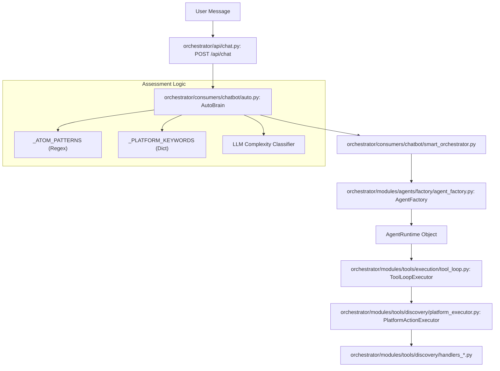
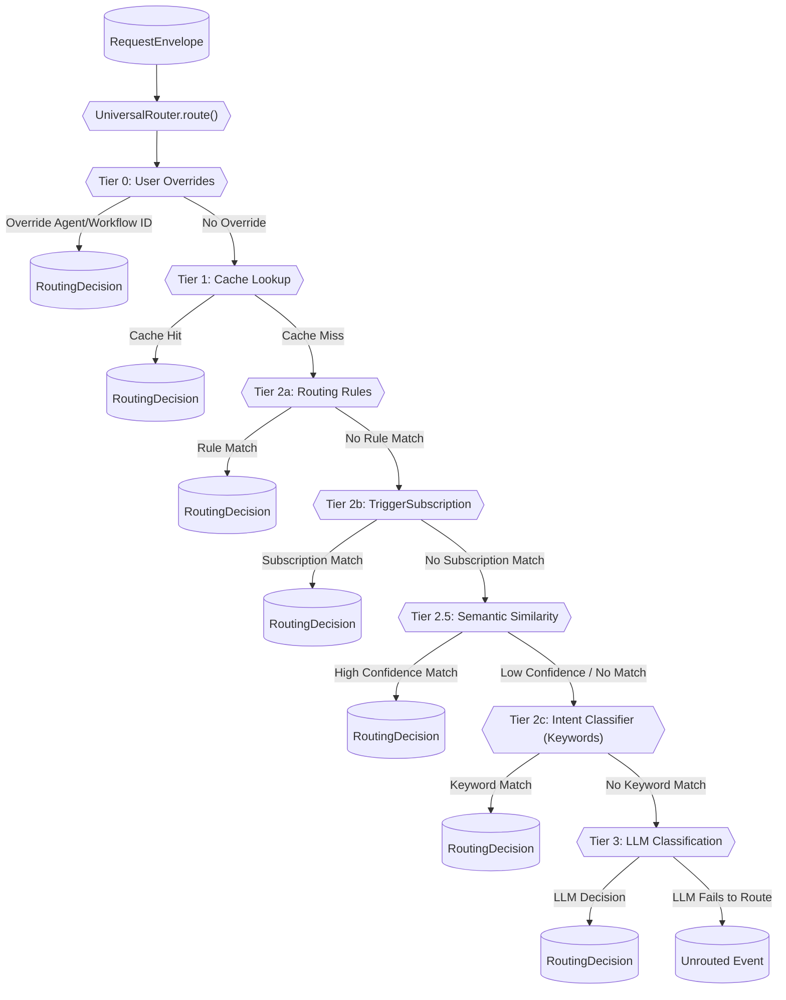

# Glossary

Relevant source files

The following files were used as context for generating this wiki page:

- [README.md](README.md)
- [docs/CONTRIBUTING.md](docs/CONTRIBUTING.md)
- [docs/README.md](docs/README.md)
- [frontend/components/missions/create-mission-modal.tsx](frontend/components/missions/create-mission-modal.tsx)
- [frontend/components/missions/index.ts](frontend/components/missions/index.ts)
- [frontend/components/missions/mission-card.tsx](frontend/components/missions/mission-card.tsx)
- [frontend/components/missions/mission-detail-page.tsx](frontend/components/missions/mission-detail-page.tsx)
- [frontend/components/missions/mission-field-inspector.tsx](frontend/components/missions/mission-field-inspector.tsx)
- [frontend/components/missions/mission-field-panel.tsx](frontend/components/missions/mission-field-panel.tsx)
- [frontend/components/missions/mission-field-viz.tsx](frontend/components/missions/mission-field-viz.tsx)
- [frontend/hooks/use-missions-api.ts](frontend/hooks/use-missions-api.ts)
- [frontend/types/missions.ts](frontend/types/missions.ts)
- [orchestrator/alembic/versions/prd123_checkpoint_count.py](orchestrator/alembic/versions/prd123_checkpoint_count.py)
- [orchestrator/api/chat.py](orchestrator/api/chat.py)
- [orchestrator/api/missions.py](orchestrator/api/missions.py)
- [orchestrator/api/routing.py](orchestrator/api/routing.py)
- [orchestrator/consumers/chatbot/auto.py](orchestrator/consumers/chatbot/auto.py)
- [orchestrator/consumers/chatbot/service.py](orchestrator/consumers/chatbot/service.py)
- [orchestrator/core/llm/manager.py](orchestrator/core/llm/manager.py)
- [orchestrator/core/models/orchestration.py](orchestrator/core/models/orchestration.py)
- [orchestrator/core/models/orchestration_enums.py](orchestrator/core/models/orchestration_enums.py)
- [orchestrator/core/routing/engine.py](orchestrator/core/routing/engine.py)
- [orchestrator/modules/agents/factory/agent_factory.py](orchestrator/modules/agents/factory/agent_factory.py)
- [orchestrator/modules/context/adapters/vector_field.py](orchestrator/modules/context/adapters/vector_field.py)
- [orchestrator/modules/coordination/dispatcher.py](orchestrator/modules/coordination/dispatcher.py)
- [orchestrator/modules/coordination/planner.py](orchestrator/modules/coordination/planner.py)
- [orchestrator/modules/coordination/primitive_heartbeat.py](orchestrator/modules/coordination/primitive_heartbeat.py)
- [orchestrator/modules/coordination/reconciler.py](orchestrator/modules/coordination/reconciler.py)
- [orchestrator/modules/coordination/verification.py](orchestrator/modules/coordination/verification.py)
- [orchestrator/modules/memory/durable_store.py](orchestrator/modules/memory/durable_store.py)
- [orchestrator/modules/tools/discovery/platform_actions.py](orchestrator/modules/tools/discovery/platform_actions.py)
- [orchestrator/modules/tools/discovery/platform_executor.py](orchestrator/modules/tools/discovery/platform_executor.py)
- [orchestrator/modules/tools/services/__init__.py](orchestrator/modules/tools/services/__init__.py)
- [orchestrator/scripts/setup_jira_trigger.py](orchestrator/scripts/setup_jira_trigger.py)
- [orchestrator/services/coordinator_service.py](orchestrator/services/coordinator_service.py)
- [orchestrator/services/gdpr_service.py](orchestrator/services/gdpr_service.py)
- [orchestrator/services/heartbeat_service.py](orchestrator/services/heartbeat_service.py)
- [orchestrator/services/page_context.py](orchestrator/services/page_context.py)
- [orchestrator/tests/test_dispatcher_parallel.py](orchestrator/tests/test_dispatcher_parallel.py)
- [orchestrator/tests/test_mission_final_output_promotion.py](orchestrator/tests/test_mission_final_output_promotion.py)
- [orchestrator/tests/test_mission_retry_feeds_critique.py](orchestrator/tests/test_mission_retry_feeds_critique.py)
- [orchestrator/tests/test_p2w2_gdpr_subject_tags.py](orchestrator/tests/test_p2w2_gdpr_subject_tags.py)
- [orchestrator/tests/test_prd181_gdpr.py](orchestrator/tests/test_prd181_gdpr.py)
- [orchestrator/tests/test_prd221_page_context.py](orchestrator/tests/test_prd221_page_context.py)
- [orchestrator/tests/test_prd221_page_prior_tools.py](orchestrator/tests/test_prd221_page_prior_tools.py)
- [orchestrator/tests/test_w1s1_hotpath_telemetry.py](orchestrator/tests/test_w1s1_hotpath_telemetry.py)

This page provides definitions and technical implementation details for codebase-specific terms, jargon, and domain concepts used throughout the Automatos AI platform.

## Core Concepts

### Agent
An autonomous entity capable of executing tasks using LLMs and tools. Agents are defined by their persona, model configuration, and assigned capabilities.
*   **Implementation**: Agents are managed via the `AgentFactory` which handles activation and runtime state [orchestrator/modules/agents/factory/agent_factory.py:1-11]().
*   **Runtime**: The `AgentRuntime` dataclass tracks an agent's lifecycle (`INITIALIZING`, `ACTIVE`, `BUSY`, etc.), execution metrics, and tool assignments [orchestrator/modules/agents/factory/agent_factory.py:160-177]().
*   **Activation**: The `activate_agent` method initializes the LLM manager and resolves API keys (BYOK vs. Platform) [orchestrator/modules/agents/factory/agent_factory.py:238-250]().
*   **System Agents**: Specialized agents like "Auto" that serve as default orchestrators for a workspace, typically backfilled during provisioning [orchestrator/api/chat.py:134-142]().

### Recipe (Workflow / Playbook)
A sequence of automated steps executed by one or more agents. Modern Recipes use a direct execution engine for high reliability, bypassing legacy pipelines for standard tasks [orchestrator/api/recipe_executor.py:5-19]().
*   **Execution**: Handled by `execute_recipe_direct`, which manages workspace semaphores to control concurrency [orchestrator/api/recipe_executor.py:42-59]().
*   **Data Sharing**: Uses the `RecipeScratchpad` to pass structured data between steps via `scratchpad_write` and `scratchpad_read` tools [orchestrator/api/recipe_executor.py:14-16]().
*   **Scheduling**: Playbooks can be scheduled via cron expressions or triggered by external events via `TriggerSubscription` [orchestrator/api/workflow_recipes.py:36-50]().

### Workspace
An isolated environment (filesystem and database scope) where agents operate. All data, memory, and tool executions are scoped to a `workspace_id` to ensure multi-tenant security [orchestrator/config.py:18-22]().
*   **Isolation**: Enforced at the database level via `workspace_id` filters and in the execution layer via `WorkspaceWorker` sandboxes [orchestrator/modules/tools/discovery/platform_executor.py:8-9]().
*   **Provisioning**: New workspaces are initialized with default settings and seeded notification preferences [orchestrator/api/chat.py:134-162]().

### Mission
A high-level goal decomposed into a Directed Acyclic Graph (DAG) of tasks. Missions involve multi-agent coordination, verification pipelines, and budget governance [orchestrator/services/coordinator_service.py:2-17]().
*   **Coordinator**: The `CoordinatorService` runs a 5-second tick loop to dispatch ready tasks and reconcile active runs [orchestrator/services/coordinator_service.py:5-13]().
*   **Power Modes**: Missions support `light`, `standard`, and `max` power modes, which scale tool iteration limits and timeouts [orchestrator/services/coordinator_service.py:91-95]().

---

## Intelligence & Memory

### Unified Memory Service
The centralized entry point for all memory operations, implementing a 5-layer stack (L0-L4). It replaces fragmented clients with a single shared service [orchestrator/config.py:82-83]().
*   **Memory Tiers**: 
    *   **L1 (Working)**: Redis session cache for active conversations [orchestrator/config.py:84-85]().
    *   **L2 (Short-term)**: Postgres-based storage with time-based Ebbinghaus decay [orchestrator/config.py:103-108]().
    *   **L3 (Long-term)**: Mem0 integration for fact extraction and cross-session persistence [orchestrator/config.py:111-118]().
*   **Promotion**: The process of moving high-signal memories from L2 to L3 based on importance and access frequency [orchestrator/config.py:111-125]().

### AutoBrain (Complexity Assessor)
A progressive complexity model (Atom → Organism) that receives every incoming message to determine the required processing depth [orchestrator/consumers/chatbot/auto.py:5-22]().
*   **Tiers**: 
    1.  **Tier 1**: Redis cache lookup (<5ms).
    2.  **Tier 2**: Regex fast-paths for greetings and platform commands defined in `_ATOM_PATTERNS` [orchestrator/consumers/chatbot/auto.py:97-119]().
    3.  **Tier 3**: LLM classification for complex reasoning [orchestrator/consumers/chatbot/auto.py:17-22]().

---

## System Architecture Diagrams

### From Natural Language to Code Execution
This diagram illustrates how a user's natural language input is transformed into specific code entities and executed.

**User Request Flow**

Sources: [orchestrator/consumers/chatbot/auto.py:5-22](), [orchestrator/modules/agents/factory/agent_factory.py:160-197](), [orchestrator/api/chat.py:55-70](), [orchestrator/modules/tools/discovery/platform_executor.py:1-9]()

### Universal Router Decision Flow
This diagram illustrates the tiered routing strategy of the `UniversalRouter` to determine the appropriate agent or workflow for a given request.

**Universal Router Decision Flow**

Sources: [orchestrator/core/routing/engine.py:1-16](), [orchestrator/core/routing/engine.py:95-163]()

---

## Technical Jargon & Abbreviations

| Term | Definition | Code Pointer |
| :--- | :--- | :--- |
| **BYOK** | "Bring Your Own Key" - User-provided LLM API keys that override platform defaults. | [orchestrator/modules/agents/factory/agent_factory.py:174-175]() |
| **L1-L4 Memory** | The 5-layer memory architecture (L0 Focus, L1 Working, L2 Short-term, L3 Long-term, L4 Knowledge). | [orchestrator/config.py:82-132]() |
| **SSE** | Server-Sent Events - The protocol used for streaming AI responses to the frontend. | [orchestrator/consumers/chatbot/service.py:12-13]() |
| **Tool Loop** | A failure state where an agent repeatedly calls the same tool. Prevented by `ToolExecutionTracker`. | [orchestrator/consumers/chatbot/service.py:155-162]() |
| **Platform Action** | Internal system capabilities (e.g., `list_agents`) exposed to agents as tools. | [orchestrator/modules/tools/discovery/platform_executor.py:5-9]() |
| **Scratchpad** | Ephemeral storage used during a playbook execution to pass data between agents. | [orchestrator/api/recipe_executor.py:14-16]() |
| **Hybrid Auth** | Authentication system supporting both Clerk JWT (frontend) and API Keys (external/internal). | [orchestrator/api/chat.py:6-7]() |
| **Primitive Check** | A health status check for core system components (chat, memory, rag, etc.) emitted during heartbeats. | [orchestrator/services/heartbeat_service.py:25-34]() |

---

## Tooling & Integration Terms

### Composio
The primary integration provider used to connect agents to external apps.
*   **Implementation**: Agents are assigned Composio apps via `AgentAppAssignment` [orchestrator/modules/agents/factory/agent_factory.py:28-29]().
*   **Triggers**: External events from Composio apps are handled via `TriggerSubscription` [orchestrator/api/workflow_recipes.py:52-60]().

### Business Graph (Graphify)
A knowledge graph representation of workspace entities and their relationships.
*   **Visualization**: Rendered in the frontend using `BusinessGraphVisualization` with D3-based force-directed layouts [frontend/components/knowledge/BusinessGraphPanel.tsx:11-13]().
*   **Extraction**: Entities and relations are extracted from documents and memories to build the graph [orchestrator/modules/tools/discovery/platform_executor.py:224-231]().

### Heartbeat Service
A background service that executes periodic checks and autonomous actions for agents and the orchestrator.
*   **Implementation**: Uses `APScheduler` with a `MemoryJobStore` (or Redis) to trigger ticks [orchestrator/services/heartbeat_service.py:126-133]().
*   **Findings**: Results are stored in `heartbeat_results` including `primitive_check` findings for system monitoring [orchestrator/services/heartbeat_service.py:53-66]().

Sources: [orchestrator/config.py:1-140](), [orchestrator/modules/agents/factory/agent_factory.py:1-200](), [orchestrator/consumers/chatbot/auto.py:1-120](), [orchestrator/api/recipe_executor.py:1-100](), [orchestrator/services/coordinator_service.py:1-110](), [orchestrator/services/heartbeat_service.py:1-150](), [frontend/components/knowledge/BusinessGraphPanel.tsx:1-66]()