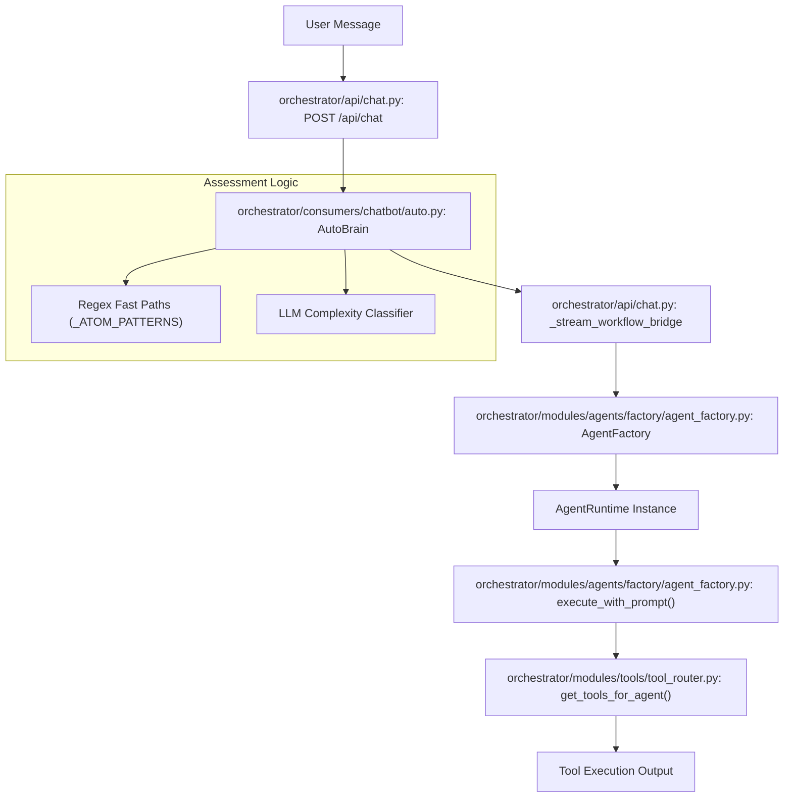
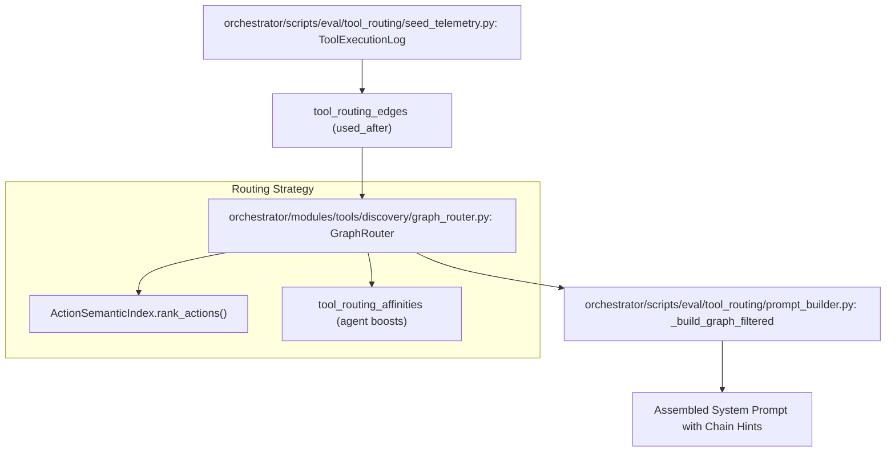

# Glossary

Relevant source files

The following files were used as context for generating this wiki page:

- [README.md](README.md)
- [docs/CONTRIBUTING.md](docs/CONTRIBUTING.md)
- [docs/README.md](docs/README.md)
- [frontend/app/api/chat/route.ts](frontend/app/api/chat/route.ts)
- [frontend/components/agents/agent-configuration-modal.tsx](frontend/components/agents/agent-configuration-modal.tsx)
- [frontend/components/agents/agent-configuration.tsx](frontend/components/agents/agent-configuration.tsx)
- [frontend/components/agents/agent-details-modal.tsx](frontend/components/agents/agent-details-modal.tsx)
- [frontend/components/agents/agent-roster.tsx](frontend/components/agents/agent-roster.tsx)
- [frontend/components/agents/create-agent-modal.tsx](frontend/components/agents/create-agent-modal.tsx)
- [frontend/components/chatbot/chat.tsx](frontend/components/chatbot/chat.tsx)
- [frontend/components/chatbot/mission-suggestion-card.tsx](frontend/components/chatbot/mission-suggestion-card.tsx)
- [frontend/components/documents/analytics-tab.tsx](frontend/components/documents/analytics-tab.tsx)
- [frontend/components/documents/processing-tab.tsx](frontend/components/documents/processing-tab.tsx)
- [frontend/components/missions/create-mission-modal.tsx](frontend/components/missions/create-mission-modal.tsx)
- [frontend/components/missions/human-review-panel.tsx](frontend/components/missions/human-review-panel.tsx)
- [frontend/components/missions/mission-results-panel.tsx](frontend/components/missions/mission-results-panel.tsx)
- [frontend/lib/agent-constants.ts](frontend/lib/agent-constants.ts)
- [frontend/lib/chat/hooks.ts](frontend/lib/chat/hooks.ts)
- [frontend/stores/mission-store.ts](frontend/stores/mission-store.ts)
- [frontend/tsconfig.tsbuildinfo](frontend/tsconfig.tsbuildinfo)
- [frontend/types/missions.ts](frontend/types/missions.ts)
- [orchestrator/alembic/versions/add_job_title_to_agents.py](orchestrator/alembic/versions/add_job_title_to_agents.py)
- [orchestrator/alembic/versions/agent_public_id_and_slug_fix.py](orchestrator/alembic/versions/agent_public_id_and_slug_fix.py)
- [orchestrator/alembic/versions/seed_auto_agents_existing_workspaces.py](orchestrator/alembic/versions/seed_auto_agents_existing_workspaces.py)
- [orchestrator/api/agents.py](orchestrator/api/agents.py)
- [orchestrator/api/chat.py](orchestrator/api/chat.py)
- [orchestrator/api/missions.py](orchestrator/api/missions.py)
- [orchestrator/api/recipe_executor.py](orchestrator/api/recipe_executor.py)
- [orchestrator/config.py](orchestrator/config.py)
- [orchestrator/consumers/__init__.py](orchestrator/consumers/__init__.py)
- [orchestrator/consumers/chatbot/__init__.py](orchestrator/consumers/chatbot/__init__.py)
- [orchestrator/consumers/chatbot/service.py](orchestrator/consumers/chatbot/service.py)
- [orchestrator/core/models/core.py](orchestrator/core/models/core.py)
- [orchestrator/core/services/mission_memory_service.py](orchestrator/core/services/mission_memory_service.py)
- [orchestrator/core/utils/agent_resolver.py](orchestrator/core/utils/agent_resolver.py)
- [orchestrator/main.py](orchestrator/main.py)
- [orchestrator/modules/agents/factory/agent_factory.py](orchestrator/modules/agents/factory/agent_factory.py)
- [orchestrator/modules/coordination/planner.py](orchestrator/modules/coordination/planner.py)
- [orchestrator/modules/coordination/reconciler.py](orchestrator/modules/coordination/reconciler.py)
- [orchestrator/modules/coordination/verification.py](orchestrator/modules/coordination/verification.py)
- [orchestrator/modules/memory/context_router.py](orchestrator/modules/memory/context_router.py)
- [orchestrator/modules/memory/unified_memory_service.py](orchestrator/modules/memory/unified_memory_service.py)
- [orchestrator/modules/tools/__init__.py](orchestrator/modules/tools/__init__.py)
- [orchestrator/modules/tools/services/__init__.py](orchestrator/modules/tools/services/__init__.py)
- [orchestrator/services/coordinator_service.py](orchestrator/services/coordinator_service.py)
- [orchestrator/services/orchestration_state.py](orchestrator/services/orchestration_state.py)
- [orchestrator/tests/test_unified_memory.py](orchestrator/tests/test_unified_memory.py)
- [scripts/ralph/IMPLEMENTATION_PLAN.md](scripts/ralph/IMPLEMENTATION_PLAN.md)
- [scripts/ralph/prd.json](scripts/ralph/prd.json)
- [scripts/ralph/progress.txt](scripts/ralph/progress.txt)

This page provides definitions and technical implementation details for codebase-specific terms, jargon, and domain concepts used throughout the Automatos AI platform.

## Core Concepts

### Agent
An autonomous entity capable of executing tasks using LLMs and tools. Agents are defined by their persona, model configuration, and assigned capabilities.
*   **Implementation**: Agents are managed via the `AgentFactory` which handles activation and runtime state [orchestrator/modules/agents/factory/agent_factory.py:1-11]().
*   **Runtime**: The `AgentRuntime` dataclass tracks an agent's lifecycle (INITIALIZING, ACTIVE, BUSY, etc.), execution metrics, and tool assignments [orchestrator/modules/agents/factory/agent_factory.py:159-175]().
*   **Activation**: The `activate_agent` method initializes the LLM manager and resolves API keys (BYOK vs. Platform) [orchestrator/modules/agents/factory/agent_factory.py:238-250]().
*   **System Agents**: Specialized agents like "Auto" that serve as default orchestrators for a workspace, typically backfilled during provisioning [orchestrator/alembic/versions/seed_auto_agents_existing_workspaces.py:42-59]().

Sources: [orchestrator/modules/agents/factory/agent_factory.py:1-175](), [orchestrator/alembic/versions/seed_auto_agents_existing_workspaces.py:42-59]()

### Recipe (Workflow / Playbook)
A sequence of automated steps executed by one or more agents. Modern Recipes use a direct execution engine for high reliability, bypassing legacy 9-stage pipelines for standard tasks [orchestrator/api/recipe_executor.py:5-19]().
*   **Execution**: Handled by `execute_recipe_direct`, which manages workspace semaphores to control concurrency [orchestrator/api/recipe_executor.py:21-38]().
*   **Data Sharing**: Uses the `RecipeScratchpad` to pass structured data between steps via `scratchpad_write` and `scratchpad_read` tools [orchestrator/api/recipe_executor.py:15-16]().
*   **Reporting**: Automatically generates a Markdown summary of the execution via `_auto_create_playbook_report` [orchestrator/api/recipe_executor.py:88-105]().

Sources: [orchestrator/api/recipe_executor.py:5-105]()

### Workspace
An isolated environment (filesystem and database scope) where agents operate. All data, memory, and tool executions are scoped to a `workspace_id` to ensure multi-tenant security [orchestrator/config.py:18-22]().
*   **Isolation**: Enforced at the database level via `workspace_id` filters and in the execution layer via `WorkspaceWorker` sandboxes [orchestrator/config.py:125-135]().
*   **Provisioning**: New workspaces are initialized with default settings and seeded notification preferences via `_provision_new_user_workspace` [orchestrator/main.py:131-145]().

Sources: [orchestrator/config.py:18-135](), [orchestrator/main.py:131-145]()

### Mission
A high-level goal decomposed into a Directed Acyclic Graph (DAG) of tasks. Missions involve multi-agent coordination, verification pipelines, and budget governance [orchestrator/services/coordinator_service.py:2-17]().
*   **Coordinator**: The `CoordinatorService` runs a 5-second tick loop to dispatch ready tasks and reconcile active runs [orchestrator/services/coordinator_service.py:5-13]().
*   **Synthesis**: Special "synthesis" tasks consolidate prior step outputs using fast, cheap models like Gemini Flash via `_resolve_synthesis_model` [orchestrator/services/coordinator_service.py:99-113]().

Sources: [orchestrator/services/coordinator_service.py:2-113]()

---

## Intelligence & Memory

### Unified Memory Service
The centralized entry point for all memory operations, implementing a 5-layer stack (L0-L4). It replaces fragmented Mem0 clients with a single shared service [orchestrator/config.py:82-124]().
*   **Memory Tiers**: 
    *   **L1 (Working)**: Redis session cache for active conversations [orchestrator/config.py:85-87]().
    *   **L2 (Short-term)**: Postgres-based storage with time-based Ebbinghaus decay [orchestrator/config.py:98-103]().
    *   **L3 (Long-term)**: Mem0 integration for fact extraction and cross-session persistence [orchestrator/config.py:104-109]().
*   **Graphify**: An archival process that folds aged L2/L3 memories into the workspace business knowledge graph [orchestrator/config.py:116-123]().

Sources: [orchestrator/config.py:82-124]()

### Tool Execution Tracker
A utility within the chat service that prevents infinite tool loops by tracking exact and semantic deduplication of tool calls [orchestrator/consumers/chatbot/service.py:83-90]().
*   **Search Deduplication**: Uses string similarity to prevent repeating identical search queries across different tools [orchestrator/consumers/chatbot/service.py:168-175]().
*   **Retry Limits**: Enforces hard caps on the number of times a specific tool can be called in a single turn [orchestrator/consumers/chatbot/service.py:98-111]().

Sources: [orchestrator/consumers/chatbot/service.py:83-175]()

---

## System Architecture Diagrams

### From Natural Language to Code Execution
This diagram illustrates how a user's natural language input is transformed into specific code entities and executed, highlighting the role of the `AutoBrain` and `AgentFactory`.

**User Request Flow**

Sources: [orchestrator/api/chat.py:30-46](), [orchestrator/api/chat.py:67-87](), [orchestrator/modules/agents/factory/agent_factory.py:1-20](), [orchestrator/consumers/chatbot/service.py:38-44]()

### Graph-Based Tool Routing (PRD-139)
This diagram shows how the system uses synthetic telemetry and semantic indexing to build a graph of tool affinities for more accurate routing.

**Graph Routing Architecture**

Sources: [scripts/ralph/progress.txt:92-112](), [scripts/ralph/progress.txt:59-75](), [scripts/ralph/progress.txt:137-143]()

---

## Technical Jargon & Abbreviations

| Term | Definition | Code Pointer |
| :--- | :--- | :--- |
| **BYOK** | "Bring Your Own Key" - User-provided LLM API keys that override platform defaults. | [orchestrator/modules/agents/factory/agent_factory.py:173-174]() |
| **L1-L4 Memory** | The 5-layer memory architecture (L1 Working, L2 Short-term, L3 Long-term, L4 Knowledge). | [orchestrator/config.py:82-115]() |
| **SSE** | Server-Sent Events - The protocol used for streaming AI responses to the frontend. | [orchestrator/consumers/chatbot/service.py:12-13]() |
| **Tool Loop** | A failure state where an agent repeatedly calls the same tool. Prevented by `ToolExecutionTracker`. | [orchestrator/consumers/chatbot/service.py:83-90]() |
| **Complexity Assessment** | The process of determining if a query is ATOM (simple) or ORGANISM (complex). | [orchestrator/api/chat.py:45-46]() |
| **Scratchpad** | Ephemeral storage used during a workflow to pass data between agents without bloating context. | [orchestrator/api/recipe_executor.py:15-16]() |
| **Hybrid Auth** | Authentication system supporting both Clerk JWT (frontend) and API Keys (external/internal). | [orchestrator/main.py:17-17]() |
| **Workflow Bridge** | Logic that converts complex chat messages into transient workflows for full pipeline execution. | [orchestrator/api/chat.py:37-55]() |

---

## Tooling & Integration Terms

### Composio
The primary integration provider used to connect agents to 500+ external apps.
*   **Implementation**: Wrapped by `EntityManager` for connection status and `ComposioAppCache` for performance optimization [orchestrator/api/agents.py:12-17]().

### Notification Dispatcher
A unified service for fanning out system events to multiple destinations (In-App, Telegram, Slack, etc.) based on user preferences.
*   **Non-blocking**: Designed so that notification failures never break the primary execution flow (e.g., mission completion) [orchestrator/api/recipe_executor.py:61-62]().

### LLM Manager
The core service responsible for interacting with LLM providers, handling model configurations, and token usage tracking [orchestrator/modules/agents/factory/agent_factory.py:163-164]().

Sources: [orchestrator/api/agents.py:12-17](), [orchestrator/api/recipe_executor.py:45-83](), [orchestrator/modules/agents/factory/agent_factory.py:159-197]()

---