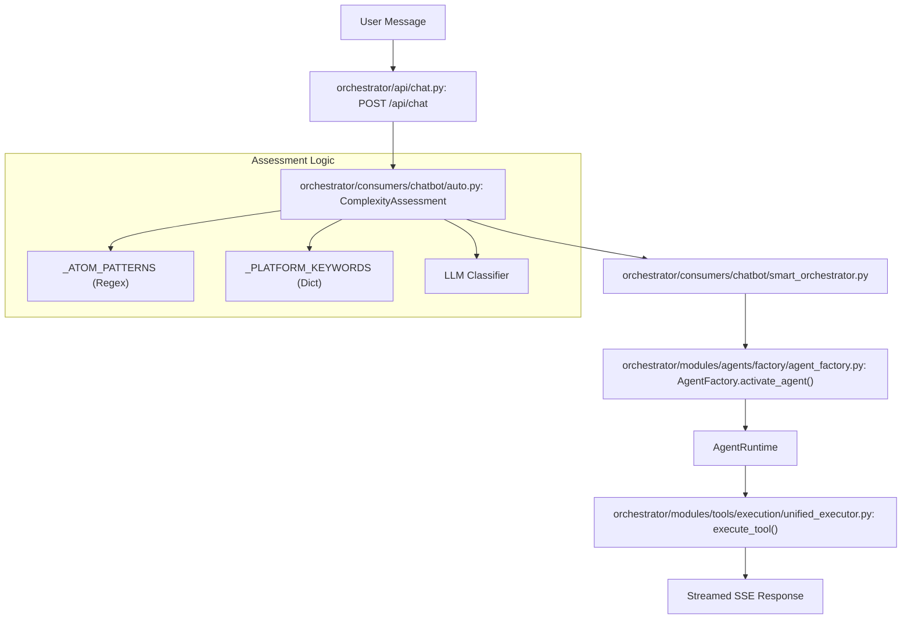
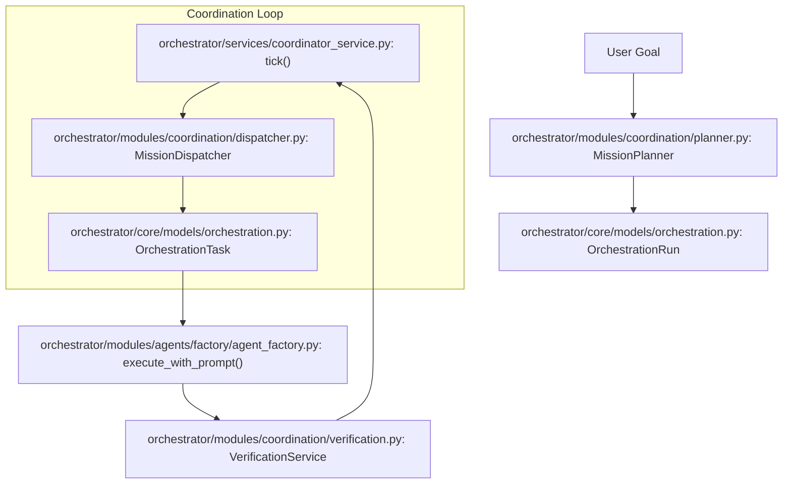

# Glossary

Relevant source files

The following files were used as context for generating this wiki page:

- [.env.example](.env.example)
- [docs/PRDS/55-AUTONOMOUS-ASSISTANT-PLATFORM.md](docs/PRDS/55-AUTONOMOUS-ASSISTANT-PLATFORM.md)
- [docs/reviews/COMPOSIO-TOOL-REGRESSION-REVIEW.md](docs/reviews/COMPOSIO-TOOL-REGRESSION-REVIEW.md)
- [frontend/components/auth/sign-up-form.tsx](frontend/components/auth/sign-up-form.tsx)
- [frontend/components/knowledge/BusinessGraphPanel.tsx](frontend/components/knowledge/BusinessGraphPanel.tsx)
- [frontend/components/knowledge/BusinessGraphVisualization.tsx](frontend/components/knowledge/BusinessGraphVisualization.tsx)
- [frontend/components/knowledge/GraphDiffBanner.tsx](frontend/components/knowledge/GraphDiffBanner.tsx)
- [frontend/components/marketplace/marketplace-agents-tab.tsx](frontend/components/marketplace/marketplace-agents-tab.tsx)
- [frontend/components/marketplace/marketplace-homepage.tsx](frontend/components/marketplace/marketplace-homepage.tsx)
- [frontend/components/marketplace/marketplace-tools-tab.tsx](frontend/components/marketplace/marketplace-tools-tab.tsx)
- [frontend/components/shared/stats-bar.tsx](frontend/components/shared/stats-bar.tsx)
- [frontend/components/tools/tools-dashboard.tsx](frontend/components/tools/tools-dashboard.tsx)
- [frontend/components/workflows/active-workflows-panel.tsx](frontend/components/workflows/active-workflows-panel.tsx)
- [frontend/components/workflows/execution-kitchen.tsx](frontend/components/workflows/execution-kitchen.tsx)
- [frontend/components/workflows/workflow-management.tsx](frontend/components/workflows/workflow-management.tsx)
- [frontend/lib/api-client.ts](frontend/lib/api-client.ts)
- [frontend/lib/tooltips.json](frontend/lib/tooltips.json)
- [infrastructure/.env.example](infrastructure/.env.example)
- [infrastructure/docker-compose.core.yml](infrastructure/docker-compose.core.yml)
- [infrastructure/docker-compose.data.yml](infrastructure/docker-compose.data.yml)
- [infrastructure/docker-compose.landing.yml](infrastructure/docker-compose.landing.yml)
- [infrastructure/docker-compose.memory.yml](infrastructure/docker-compose.memory.yml)
- [infrastructure/docker-compose.monitoring.yml](infrastructure/docker-compose.monitoring.yml)
- [infrastructure/docker-compose.voice.yml](infrastructure/docker-compose.voice.yml)
- [infrastructure/docker-compose.yml](infrastructure/docker-compose.yml)
- [infrastructure/railway-manifest.json](infrastructure/railway-manifest.json)
- [orchestrator/alembic/versions/20260215_add_heartbeat_and_channels.py](orchestrator/alembic/versions/20260215_add_heartbeat_and_channels.py)
- [orchestrator/alembic/versions/prd123_checkpoint_count.py](orchestrator/alembic/versions/prd123_checkpoint_count.py)
- [orchestrator/api/channels.py](orchestrator/api/channels.py)
- [orchestrator/api/chat.py](orchestrator/api/chat.py)
- [orchestrator/api/chat_voice.py](orchestrator/api/chat_voice.py)
- [orchestrator/api/heartbeat.py](orchestrator/api/heartbeat.py)
- [orchestrator/api/knowledge_graph.py](orchestrator/api/knowledge_graph.py)
- [orchestrator/api/missions.py](orchestrator/api/missions.py)
- [orchestrator/api/recipe_executor.py](orchestrator/api/recipe_executor.py)
- [orchestrator/api/tools.py](orchestrator/api/tools.py)
- [orchestrator/api/workflow_recipes.py](orchestrator/api/workflow_recipes.py)
- [orchestrator/channels/base.py](orchestrator/channels/base.py)
- [orchestrator/channels/discord_adapter.py](orchestrator/channels/discord_adapter.py)
- [orchestrator/channels/google_chat_adapter.py](orchestrator/channels/google_chat_adapter.py)
- [orchestrator/channels/line_adapter.py](orchestrator/channels/line_adapter.py)
- [orchestrator/channels/manager.py](orchestrator/channels/manager.py)
- [orchestrator/channels/slack_adapter.py](orchestrator/channels/slack_adapter.py)
- [orchestrator/config.py](orchestrator/config.py)
- [orchestrator/consumers/chatbot/auto.py](orchestrator/consumers/chatbot/auto.py)
- [orchestrator/consumers/chatbot/intent_classifier.py](orchestrator/consumers/chatbot/intent_classifier.py)
- [orchestrator/consumers/chatbot/personality.py](orchestrator/consumers/chatbot/personality.py)
- [orchestrator/consumers/chatbot/service.py](orchestrator/consumers/chatbot/service.py)
- [orchestrator/consumers/chatbot/smart_memory.py](orchestrator/consumers/chatbot/smart_memory.py)
- [orchestrator/consumers/chatbot/smart_tool_router.py](orchestrator/consumers/chatbot/smart_tool_router.py)
- [orchestrator/core/composio/client.py](orchestrator/core/composio/client.py)
- [orchestrator/core/composio/tool_executor.py](orchestrator/core/composio/tool_executor.py)
- [orchestrator/core/context_guard.py](orchestrator/core/context_guard.py)
- [orchestrator/core/llm/manager.py](orchestrator/core/llm/manager.py)
- [orchestrator/core/models/channels.py](orchestrator/core/models/channels.py)
- [orchestrator/core/models/orchestration.py](orchestrator/core/models/orchestration.py)
- [orchestrator/core/models/orchestration_enums.py](orchestrator/core/models/orchestration_enums.py)
- [orchestrator/core/routing/engine.py](orchestrator/core/routing/engine.py)
- [orchestrator/core/services/plugin_security_scanner.py](orchestrator/core/services/plugin_security_scanner.py)
- [orchestrator/main.py](orchestrator/main.py)
- [orchestrator/modules/agents/__init__.py](orchestrator/modules/agents/__init__.py)
- [orchestrator/modules/agents/factory/__init__.py](orchestrator/modules/agents/factory/__init__.py)
- [orchestrator/modules/agents/factory/agent_factory.py](orchestrator/modules/agents/factory/agent_factory.py)
- [orchestrator/modules/context/sections/graph_context.py](orchestrator/modules/context/sections/graph_context.py)
- [orchestrator/modules/coordination/dispatcher.py](orchestrator/modules/coordination/dispatcher.py)
- [orchestrator/modules/coordination/planner.py](orchestrator/modules/coordination/planner.py)
- [orchestrator/modules/coordination/reconciler.py](orchestrator/modules/coordination/reconciler.py)
- [orchestrator/modules/knowledge/__init__.py](orchestrator/modules/knowledge/__init__.py)
- [orchestrator/modules/knowledge/graph_extraction.py](orchestrator/modules/knowledge/graph_extraction.py)
- [orchestrator/modules/knowledge/graph_service.py](orchestrator/modules/knowledge/graph_service.py)
- [orchestrator/modules/learning/tests/conftest.py](orchestrator/modules/learning/tests/conftest.py)
- [orchestrator/modules/learning/tests/test_learning_system.py](orchestrator/modules/learning/tests/test_learning_system.py)
- [orchestrator/modules/memory/context_router.py](orchestrator/modules/memory/context_router.py)
- [orchestrator/modules/memory/integrations/mem0_client.py](orchestrator/modules/memory/integrations/mem0_client.py)
- [orchestrator/modules/memory/unified_memory_service.py](orchestrator/modules/memory/unified_memory_service.py)
- [orchestrator/modules/orchestrator/service.py](orchestrator/modules/orchestrator/service.py)
- [orchestrator/modules/tools/discovery/action_registry.py](orchestrator/modules/tools/discovery/action_registry.py)
- [orchestrator/modules/tools/discovery/actions_analytics_enhanced.py](orchestrator/modules/tools/discovery/actions_analytics_enhanced.py)
- [orchestrator/modules/tools/discovery/actions_graph.py](orchestrator/modules/tools/discovery/actions_graph.py)
- [orchestrator/modules/tools/discovery/handlers_analytics_enhanced.py](orchestrator/modules/tools/discovery/handlers_analytics_enhanced.py)
- [orchestrator/modules/tools/discovery/handlers_graph.py](orchestrator/modules/tools/discovery/handlers_graph.py)
- [orchestrator/modules/tools/discovery/handlers_search.py](orchestrator/modules/tools/discovery/handlers_search.py)
- [orchestrator/modules/tools/discovery/platform_actions.py](orchestrator/modules/tools/discovery/platform_actions.py)
- [orchestrator/modules/tools/discovery/platform_executor.py](orchestrator/modules/tools/discovery/platform_executor.py)
- [orchestrator/modules/tools/execution/concurrency.py](orchestrator/modules/tools/execution/concurrency.py)
- [orchestrator/modules/tools/services/composio_hint_service.py](orchestrator/modules/tools/services/composio_hint_service.py)
- [orchestrator/modules/tools/services/composio_tool_service.py](orchestrator/modules/tools/services/composio_tool_service.py)
- [orchestrator/modules/tools/tool_router.py](orchestrator/modules/tools/tool_router.py)
- [orchestrator/services/checkpoint_service.py](orchestrator/services/checkpoint_service.py)
- [orchestrator/services/coordinator_service.py](orchestrator/services/coordinator_service.py)
- [orchestrator/services/metadata_sync_service.py](orchestrator/services/metadata_sync_service.py)
- [orchestrator/services/orchestration_state.py](orchestrator/services/orchestration_state.py)
- [orchestrator/tests/test_budget_gate.py](orchestrator/tests/test_budget_gate.py)
- [orchestrator/tests/test_dispatcher_parallel.py](orchestrator/tests/test_dispatcher_parallel.py)
- [orchestrator/tests/test_unified_memory.py](orchestrator/tests/test_unified_memory.py)
- [scripts/ralph/IMPLEMENTATION_PLAN.md](scripts/ralph/IMPLEMENTATION_PLAN.md)
- [scripts/ralph/progress.txt](scripts/ralph/progress.txt)

This page provides definitions and technical implementation details for codebase-specific terms, jargon, and domain concepts used throughout the Automatos AI platform.

## Core Concepts

### Agent
An autonomous entity capable of executing tasks using LLMs and tools. Agents are defined by their persona, model configuration, and assigned capabilities.
*   **Implementation**: Agents are managed via the `AgentFactory` which handles activation and runtime state [orchestrator/modules/agents/factory/agent_factory.py:197-200]().
*   **Runtime**: The `AgentRuntime` dataclass tracks an agent's lifecycle (INITIALIZING, ACTIVE, BUSY, etc.), execution metrics, and tool assignments [orchestrator/modules/agents/factory/agent_factory.py:155-171]().
*   **Configuration**: Supports a 3-tier API key resolution (BYOK, platform, or environment) handled during activation [orchestrator/modules/agents/factory/agent_factory.py:146-153]().

### Recipe (Workflow)
A sequence of automated steps executed by one or more agents. Unlike complex legacy pipelines, modern Recipes use a direct execution engine for high reliability [orchestrator/api/recipe_executor.py:5-19]().
*   **Execution**: Handled by `_execute_step`, which uses the chatbot's exact component path for consistency [orchestrator/api/recipe_executor.py:66-79]().
*   **Concurrency**: Uses a per-workspace semaphore to control concurrent execution [orchestrator/api/recipe_executor.py:42-59]().
*   **Data Sharing**: Uses the `RecipeScratchpad` to pass structured data between steps without polluting the context window [orchestrator/api/recipe_executor.py:108-115]().

### Workspace
An isolated environment (filesystem and database scope) where agents operate. All data, memory, and tool executions are scoped to a `workspace_id` to ensure multi-tenant security [orchestrator/config.py:18-22]().

### Mission
A high-level goal decomposed into a Directed Acyclic Graph (DAG) of tasks. Missions involve multi-agent coordination, verification pipelines, and budget governance [orchestrator/services/coordinator_service.py:2-17]().
*   **Coordinator**: The `CoordinatorService` runs a 5-second tick loop to dispatch ready tasks and reconcile active runs [orchestrator/services/coordinator_service.py:78-86]().
*   **Shared Context**: Missions utilize a shared vector field (PRD-108) to provide inter-agent context during execution [orchestrator/services/coordinator_service.py:107-112]().

Sources: [orchestrator/modules/agents/factory/agent_factory.py:155-200](), [orchestrator/api/recipe_executor.py:5-59](), [orchestrator/services/coordinator_service.py:2-86]()

---

## Intelligence & Routing

### AutoBrain (Complexity Assessor)
A progressive complexity model (Atom → Organism) that receives every incoming message to determine the required processing depth.
*   **Tiers**: 
    1.  **Tier 1**: Redis cache lookup (<5ms).
    2.  **Tier 2**: Regex fast-paths for greetings and platform commands [orchestrator/consumers/chatbot/auto.py:91-113]().
    3.  **Tier 3**: LLM classification for complex reasoning [orchestrator/consumers/chatbot/auto.py:14-22]().
*   **Levels**: Ranges from `ATOM` (direct response) to `ORGANISM` (multi-agent neural swarm) [orchestrator/consumers/chatbot/auto.py:42-49]().

### Universal Router
The system component responsible for directing a `RequestEnvelope` to the correct agent or workflow based on intent, cache, or user overrides [orchestrator/api/chat.py:23-24]().

### Platform Actions
A set of specialized tools allowing agents to manage the platform (e.g., `platform_list_agents`, `platform_create_agent`). 
*   **Promotion**: High-value actions are "promoted" to first-class OpenAI tool schemas to improve reliability [scripts/ralph/IMPLEMENTATION_PLAN.md:1-7]().
*   **Permissions**: Enforced via `admin_only` flags in `ActionDefinition`, gating infrastructure tools from non-admin users [scripts/ralph/IMPLEMENTATION_PLAN.md:39-43]().
*   **Execution**: Routed via `PlatformActionExecutor` to domain-specific handlers [orchestrator/modules/tools/discovery/platform_executor.py:164-173]().

Sources: [orchestrator/consumers/chatbot/auto.py:5-113](), [scripts/ralph/IMPLEMENTATION_PLAN.md:1-43](), [orchestrator/modules/tools/discovery/platform_executor.py:5-173]()

---

## System Architecture Diagrams

### From Natural Language to Code Execution
This diagram illustrates how a user's natural language input is transformed into specific code entities and executed.

**User Request Flow**

Sources: [orchestrator/consumers/chatbot/auto.py:5-22](), [orchestrator/modules/agents/factory/agent_factory.py:155-197](), [orchestrator/api/chat.py:149-150]()

### Mission Orchestration Lifecycle
This diagram bridges the conceptual "Mission" with the underlying coordination and execution services.

**Mission Execution Flow**

Sources: [orchestrator/services/coordinator_service.py:78-86](), [orchestrator/modules/coordination/planner.py:49-53](), [orchestrator/modules/coordination/dispatcher.py:48-48]()

---

## Technical Jargon & Abbreviations

| Term | Definition | Code Pointer |
| :--- | :--- | :--- |
| **BYOK** | "Bring Your Own Key" - User-provided LLM API keys that override platform defaults. | [orchestrator/modules/agents/factory/agent_factory.py:146-153]() |
| **L1-L4 Memory** | The 5-layer memory architecture (L0 Focus, L1 Working, L2 Short-term, L3 Long-term, L4 Knowledge). | [orchestrator/config.py:82-117]() |
| **SSE** | Server-Sent Events - The protocol used for streaming AI responses to the frontend. | [orchestrator/consumers/chatbot/service.py:12-13]() |
| **Tool Loop** | A failure state where an agent repeatedly calls the same tool. Prevented by `ToolExecutionTracker`. | [orchestrator/consumers/chatbot/service.py:78-85]() |
| **Platform Promotion** | The process of turning internal platform actions into first-class tool schemas for agents. | [scripts/ralph/IMPLEMENTATION_PLAN.md:47-52]() |
| **Scratchpad** | Ephemeral storage used during a workflow to pass data between agents. | [orchestrator/api/recipe_executor.py:108-115]() |
| **Hybrid Auth** | Authentication system supporting both Clerk JWT (frontend) and API Keys (external/internal). | [orchestrator/core/auth/hybrid.py:17-17]() |
| **wsScope** | Frontend pattern for scoping React Query keys to the active workspace. | [frontend/lib/api-client.ts:94-99]() |

---

## Tooling & Integration Terms

### Composio
The primary integration provider used to connect agents to 500+ external apps.
*   **Implementation**: Wrapped by `ComposioToolService` for action discovery and `ComposioHintService` for prompt optimization [orchestrator/api/recipe_executor.py:103-106]().

### Tool Execution Tracker
A utility that monitors tool calls within a single conversation turn to prevent infinite loops and redundant executions.
*   **Logic**: Implements exact deduplication (hash of arguments) and semantic similarity checks for search queries [orchestrator/consumers/chatbot/service.py:114-140]().

### Workflow Bridge
A mechanism in `api/chat.py` that transforms high-complexity requests (ORGAN/ORGANISM) into transient workflows executed by the full pipeline [orchestrator/api/chat.py:70-88]().

Sources: [orchestrator/consumers/chatbot/service.py:78-156](), [orchestrator/api/recipe_executor.py:1-19](), [orchestrator/services/coordinator_service.py:1-30](), [scripts/ralph/IMPLEMENTATION_PLAN.md:1-20]()