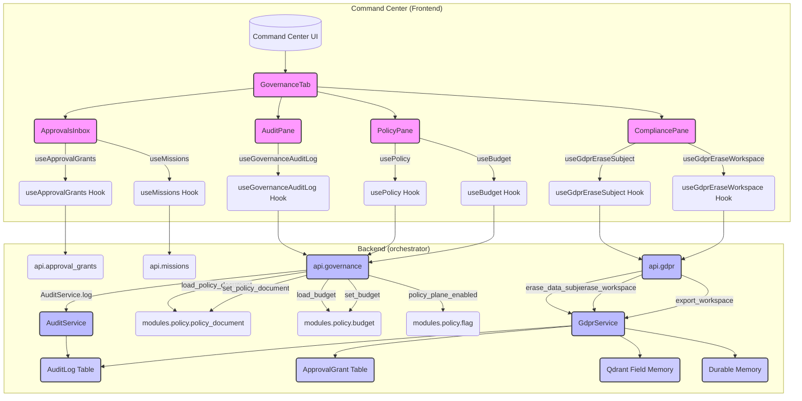

# Governance, Compliance & Security

Relevant source files

The following files were used as context for generating this wiki page:

- [docs/compliance/README.md](docs/compliance/README.md)
- [frontend/components/command-center/__tests__/governance-approvals-inbox.test.tsx](frontend/components/command-center/__tests__/governance-approvals-inbox.test.tsx)
- [frontend/components/command-center/__tests__/governance-compliance-pane.test.tsx](frontend/components/command-center/__tests__/governance-compliance-pane.test.tsx)
- [frontend/components/command-center/__tests__/governance-policy-pane.test.tsx](frontend/components/command-center/__tests__/governance-policy-pane.test.tsx)
- [frontend/components/command-center/__tests__/governance-policy-plane-tile.test.tsx](frontend/components/command-center/__tests__/governance-policy-plane-tile.test.tsx)
- [frontend/components/command-center/governance-tab.tsx](frontend/components/command-center/governance-tab.tsx)
- [frontend/components/command-center/governance/approvals-inbox.tsx](frontend/components/command-center/governance/approvals-inbox.tsx)
- [frontend/components/command-center/governance/audit-pane.tsx](frontend/components/command-center/governance/audit-pane.tsx)
- [frontend/components/command-center/governance/compliance-pane.tsx](frontend/components/command-center/governance/compliance-pane.tsx)
- [frontend/components/command-center/governance/policy-pane.tsx](frontend/components/command-center/governance/policy-pane.tsx)
- [frontend/hooks/use-approval-grants.ts](frontend/hooks/use-approval-grants.ts)
- [frontend/hooks/use-gdpr.ts](frontend/hooks/use-gdpr.ts)
- [frontend/hooks/use-governance.ts](frontend/hooks/use-governance.ts)
- [orchestrator/alembic/versions/prd196_s3_audit_logs_ws_created_index.py](orchestrator/alembic/versions/prd196_s3_audit_logs_ws_created_index.py)
- [orchestrator/api/gdpr.py](orchestrator/api/gdpr.py)
- [orchestrator/api/governance.py](orchestrator/api/governance.py)
- [orchestrator/tests/test_p2w2_gdpr_admin_dep.py](orchestrator/tests/test_p2w2_gdpr_admin_dep.py)
- [orchestrator/tests/test_p2w2_grants_oversight.py](orchestrator/tests/test_p2w2_grants_oversight.py)
- [orchestrator/tests/test_prd200_approval_renotify.py](orchestrator/tests/test_prd200_approval_renotify.py)

This page provides a high-level overview of the governance, compliance, and security features within the Automatos AI platform. It covers mechanisms for approvals, audit logging, data privacy (GDPR), adherence to the EU AI Act, and general security hardening practices. Each section briefly introduces the topic and links to dedicated child pages for in-depth technical details.

## Governance Dashboard & Approvals Inbox

The platform provides a centralized "Governance" tab within the Command Center, acting as the human-in-the-loop interface for oversight. This tab is accessible only to workspace administrators and consolidates several critical functions: an Approvals Inbox, an Audit Pane, a Policy Pane, and a Compliance Pane [frontend/components/command-center/governance-tab.tsx:3-14]().

The Approvals Inbox (`ApprovalsInbox`) is a key component, presenting pending approval grants and parked missions that require human review [frontend/components/command-center/governance/approvals-inbox.tsx:4-13](). It displays details such as the subject, tool involved, risk tier, rationale for oversight (e.g., Art.14 for external side-effects), and estimated cost [frontend/components/command-center/governance/approvals-inbox.tsx:81-92](). Users can `Grant`, `Deny`, or `Revoke` approvals, which trigger corresponding mutations via `useGrantApproval`, `useDenyApproval`, and `useRevokeApproval` hooks [frontend/components/command-center/governance/approvals-inbox.tsx:60-75]().

For details on the governance API, `use-governance` hooks, approval grant flows, and renotification mechanisms, see [Governance Dashboard & Approvals Inbox](#26.1).

### Governance Overview Diagram

Sources:
- [frontend/components/command-center/governance-tab.tsx:3-14]()
- [frontend/components/command-center/governance/approvals-inbox.tsx:4-13]()
- [frontend/components/command-center/governance/approvals-inbox.tsx:81-92]()
- [frontend/components/command-center/governance/approvals-inbox.tsx:60-75]()
- [orchestrator/api/governance.py:1-39]()
- [orchestrator/api/gdpr.py:1-30]()
- [orchestrator/services/gdpr_service.py]()
- [orchestrator/core/workspaces/audit.py]()
- [orchestrator/modules/policy/policy_document.py]()
- [orchestrator/modules/policy/budget.py]()
- [orchestrator/modules/policy/flag.py]()

## Audit, GDPR & AI Act Compliance

The platform implements robust auditing and compliance features. The `AuditPane` provides a filterable and paginated view of the workspace's audit log, capturing actions related to policy verdicts, GDPR operations, approval grants, and governance configuration [frontend/components/command-center/governance/audit-pane.tsx:4-8, 16-22](). This log is tenant-scoped and accessible only to workspace administrators, with the `workspace_id` filter applied from the request context to prevent cross-tenant data access [orchestrator/api/governance.py:126-130](). A composite index `ix_audit_logs_workspace_created` on `audit_logs` table (`workspace_id`, `created_at`) optimizes read and retention sweeps [orchestrator/alembic/versions/prd196_s3_audit_logs_ws_created_index.py:1-10]().

GDPR compliance is handled by the `GdprService`, which provides functionalities for data export and erasure with cascade effects across SQL, Qdrant field memory, and durable memory [orchestrator/api/gdpr.py:1-9](). The `CompliancePane` in the frontend allows administrators to initiate subject-level or workspace-level data erasure [frontend/components/command-center/governance-compliance-pane.test.tsx:63-77](). Subject erasure (`erase_data_subject`) reports what was and was not deleted, including "gaps" (e.g., SQL data being workspace-scoped, not subject-scoped) and "untagged history" (data written before subject tags existed) [frontend/components/command-center/governance-compliance-pane.test.tsx:49-61](). Workspace erasure (`erase_workspace`) requires explicit confirmation of the workspace ID to prevent accidental data loss [orchestrator/api/gdpr.py:57-67]().

For the EU AI Act, the platform includes a scaffold for Annex IV technical file documentation and maps Art.14 oversight to approval cards [docs/compliance/README.md:21-22](). The `modules/policy/ai_act` module is relevant here.

For detailed information on `audit_service` and retention, `audit_logs` indexes, `GdprService` erasure cascades, and the `gdpr` API/hooks, see [Audit, GDPR & AI Act Compliance](#26.2).

Sources:
- [frontend/components/command-center/governance/audit-pane.tsx:4-8]()
- [frontend/components/command-center/governance/audit-pane.tsx:16-22]()
- [orchestrator/api/governance.py:126-130]()
- [orchestrator/alembic/versions/prd196_s3_audit_logs_ws_created_index.py:1-10]()
- [orchestrator/api/gdpr.py:1-9]()
- [frontend/components/command-center/governance-compliance-pane.test.tsx:63-77]()
- [frontend/components/command-center/governance-compliance-pane.test.tsx:49-61]()
- [orchestrator/api/gdpr.py:57-67]()
- [docs/compliance/README.md:21-22]()
- [orchestrator/modules/policy/ai_act.py]()

## Security Hardening Practices

Security is a foundational aspect of the platform, with several practices implemented to harden the system against vulnerabilities. These include:

*   **Authorization Boundary Sweeps:** Regular reviews and enforcement of authorization boundaries ensure that access controls are correctly applied across the system, particularly for sensitive operations and data.
*   **CORS Boot Guard:** A robust Cross-Origin Resource Sharing (CORS) configuration is in place from the application's boot sequence to prevent unauthorized cross-origin requests.
*   **Fail-Closed Widget Authentication:** Widget authentication mechanisms are designed to "fail closed," meaning that in case of an authentication failure, access is denied by default, preventing potential bypasses.
*   **Webhook HMAC and Deduplication:** Webhooks are secured using HMAC (Hash-based Message Authentication Code) for signature verification, ensuring the integrity and authenticity of incoming requests. Deduplication mechanisms prevent replay attacks and ensure idempotent processing.
*   **Permission Bypass Audit:** The system includes auditing capabilities to detect and log any attempts at permission bypass, providing visibility into potential security breaches.
*   **Tenant Isolation Test Suites:** Comprehensive test suites are run to verify strict tenant isolation, ensuring that data and operations of one workspace cannot inadvertently or maliciously affect another.

For a detailed discussion of these and other security measures, see [Security Hardening Practices](#26.3).

Sources:
- [orchestrator/api/governance.py:1-39]() (Implicit in `require_workspace_admin` dependency)
- [orchestrator/api/gdpr.py:1-30]() (Implicit in `require_workspace_admin` dependency)

---