# Audit, GDPR & AI Act Compliance

<details>
<summary>Relevant source files</summary>

The following files were used as context for generating this wiki page:

- [docs/compliance/README.md](docs/compliance/README.md)
- [frontend/components/command-center/__tests__/governance-approvals-inbox.test.tsx](frontend/components/command-center/__tests__/governance-approvals-inbox.test.tsx)
- [frontend/components/command-center/__tests__/governance-compliance-pane.test.tsx](frontend/components/command-center/__tests__/governance-compliance-pane.test.tsx)
- [frontend/components/command-center/__tests__/governance-policy-pane.test.tsx](frontend/components/command-center/__tests__/governance-policy-pane.test.tsx)
- [frontend/components/command-center/__tests__/governance-policy-plane-tile.test.tsx](frontend/components/command-center/__tests__/governance-policy-plane-tile.test.tsx)
- [frontend/components/command-center/governance-tab.tsx](frontend/components/command-center/governance-tab.tsx)
- [frontend/components/command-center/governance/approvals-inbox.tsx](frontend/components/command-center/governance/approvals-inbox.tsx)
- [frontend/components/command-center/governance/audit-pane.tsx](frontend/components/command-center/governance/audit-pane.tsx)
- [frontend/components/command-center/governance/compliance-pane.tsx](frontend/components/command-center/governance/compliance-pane.tsx)
- [frontend/components/command-center/governance/policy-pane.tsx](frontend/components/command-center/governance/policy-pane.tsx)
- [frontend/components/missions/create-mission-modal.tsx](frontend/components/missions/create-mission-modal.tsx)
- [frontend/components/missions/index.ts](frontend/components/missions/index.ts)
- [frontend/components/missions/mission-card.tsx](frontend/components/missions/mission-card.tsx)
- [frontend/components/missions/mission-detail-page.tsx](frontend/components/missions/mission-detail-page.tsx)
- [frontend/components/missions/mission-field-inspector.tsx](frontend/components/missions/mission-field-inspector.tsx)
- [frontend/components/missions/mission-field-panel.tsx](frontend/components/missions/mission-field-panel.tsx)
- [frontend/components/missions/mission-field-viz.tsx](frontend/components/missions/mission-field-viz.tsx)
- [frontend/hooks/use-approval-grants.ts](frontend/hooks/use-approval-grants.ts)
- [frontend/hooks/use-gdpr.ts](frontend/hooks/use-gdpr.ts)
- [frontend/hooks/use-governance.ts](frontend/hooks/use-governance.ts)
- [frontend/hooks/use-missions-api.ts](frontend/hooks/use-missions-api.ts)
- [frontend/types/missions.ts](frontend/types/missions.ts)
- [orchestrator/alembic/versions/prd123_checkpoint_count.py](orchestrator/alembic/versions/prd123_checkpoint_count.py)
- [orchestrator/alembic/versions/prd196_s3_audit_logs_ws_created_index.py](orchestrator/alembic/versions/prd196_s3_audit_logs_ws_created_index.py)
- [orchestrator/api/gdpr.py](orchestrator/api/gdpr.py)
- [orchestrator/api/governance.py](orchestrator/api/governance.py)
- [orchestrator/api/missions.py](orchestrator/api/missions.py)
- [orchestrator/core/models/orchestration.py](orchestrator/core/models/orchestration.py)
- [orchestrator/core/models/orchestration_enums.py](orchestrator/core/models/orchestration_enums.py)
- [orchestrator/modules/context/adapters/vector_field.py](orchestrator/modules/context/adapters/vector_field.py)
- [orchestrator/modules/coordination/dispatcher.py](orchestrator/modules/coordination/dispatcher.py)
- [orchestrator/modules/coordination/planner.py](orchestrator/modules/coordination/planner.py)
- [orchestrator/modules/coordination/primitive_heartbeat.py](orchestrator/modules/coordination/primitive_heartbeat.py)
- [orchestrator/modules/coordination/reconciler.py](orchestrator/modules/coordination/reconciler.py)
- [orchestrator/modules/coordination/verification.py](orchestrator/modules/coordination/verification.py)
- [orchestrator/modules/memory/durable_store.py](orchestrator/modules/memory/durable_store.py)
- [orchestrator/services/coordinator_service.py](orchestrator/services/coordinator_service.py)
- [orchestrator/services/gdpr_service.py](orchestrator/services/gdpr_service.py)
- [orchestrator/tests/test_dispatcher_parallel.py](orchestrator/tests/test_dispatcher_parallel.py)
- [orchestrator/tests/test_mission_final_output_promotion.py](orchestrator/tests/test_mission_final_output_promotion.py)
- [orchestrator/tests/test_mission_retry_feeds_critique.py](orchestrator/tests/test_mission_retry_feeds_critique.py)
- [orchestrator/tests/test_p2w2_gdpr_admin_dep.py](orchestrator/tests/test_p2w2_gdpr_admin_dep.py)
- [orchestrator/tests/test_p2w2_gdpr_subject_tags.py](orchestrator/tests/test_p2w2_gdpr_subject_tags.py)
- [orchestrator/tests/test_p2w2_grants_oversight.py](orchestrator/tests/test_p2w2_grants_oversight.py)
- [orchestrator/tests/test_prd181_gdpr.py](orchestrator/tests/test_prd181_gdpr.py)
- [orchestrator/tests/test_prd200_approval_renotify.py](orchestrator/tests/test_prd200_approval_renotify.py)
- [orchestrator/tests/test_w1s1_hotpath_telemetry.py](orchestrator/tests/test_w1s1_hotpath_telemetry.py)

</details>


This page details the implementation of audit logging, GDPR compliance features, and considerations for AI Act compliance within the Automatos AI platform. It covers the `audit_service` and data retention policies, the indexing of `audit_logs`, the erasure cascades and API hooks provided by `GdprService`, the `modules/policy/ai_act` module, and the `docs/compliance/Annex IV` documentation.

## Audit Logging and Retention

The platform maintains a comprehensive audit trail of significant events, particularly within the mission orchestration system. These audit logs are crucial for understanding system behavior, debugging, and meeting compliance requirements.

### Audit Log Indexes

Audit logs are stored in the database and are indexed to facilitate efficient querying and analysis. For instance, the `orchestration_events` table, which records events related to mission execution, includes indexes on `run_id` and `created_at` to allow for quick retrieval of events associated with a specific mission or within a given time range.

The `orchestration_runs` table, which stores top-level mission execution records, also has an index on `workspace_id` [orchestrator/core/models/orchestration.py:60-63] to ensure efficient multi-tenancy and data isolation.

A specific Alembic migration, `prd196_s3_audit_logs_ws_created_index.py` [orchestrator/alembic/versions/prd196_s3_audit_logs_ws_created_index.py](), indicates the creation of an index on `orchestration_events.workspace_id` and `orchestration_events.created_at` to optimize audit log queries by workspace and time.

### Event Types and Actors

The `Orchestration Enums` [orchestrator/core/models/orchestration_enums.py:1-9]() define various `EventType` [orchestrator/core/models/orchestration_enums.py:73-145]() and `ActorType` [orchestrator/core/models/orchestration_enums.py:147-158]() enumerations. These are used to categorize and attribute events within the audit logs.

For example, `EventType` includes:
*   `RUN_CREATED`, `RUN_APPROVED`, `RUN_FAILED`, `RUN_ARCHIVED` for mission lifecycle events.
*   `TASK_CREATED`, `TASK_ASSIGNED`, `TASK_FAILED`, `TASK_VERIFIED` for individual task lifecycle events.
*   `RUN_PLAN_EDITED` [orchestrator/core/models/orchestration_enums.py:79]() specifically tracks approval-time task/agent edits for audit purposes.
*   `RUN_AUTO_APPROVED` [orchestrator/core/models/orchestration_enums.py:81]() distinguishes policy-driven auto-approvals.
*   `PERMISSION_DENIED` [orchestrator/core/models/orchestration_enums.py:135]() logs access control violations.

`ActorType` categorizes who or what initiated an event, such as `SYSTEM`, `COORDINATOR`, `AGENT`, `HUMAN`, or `SCHEDULER`.

### Audit Log Flow (Orchestration Example)

The `CoordinatorService` [orchestrator/services/coordinator_service.py:1-17]() is a central component that emits many audit events. When a mission is created, planned, approved, or transitions through various states, corresponding events are emitted.

**Diagram: Orchestration Audit Log Flow**

```mermaid
graph TD
    subgraph "Mission Lifecycle"
        A[User creates Mission] --> B{MissionPlanner.plan_mission};
        B --> C{OrchestrationRun created};
        C --> D[OrchestrationEvent: RUN_CREATED];
        D --> E{Plan ready};
        E --> F[OrchestrationEvent: RUN_PLAN_READY];
        F --> G{User approves/rejects};
        G -- "Approve" --> H[OrchestrationEvent: RUN_APPROVED];
        G -- "Reject" --> I[OrchestrationEvent: RUN_REJECTED];
        H --> J{MissionDispatcher.dispatch_ready};
        J --> K{OrchestrationTask created};
        K --> L[OrchestrationEvent: TASK_CREATED];
        L --> M{Task assigned to Agent};
        M --> N[OrchestrationEvent: TASK_ASSIGNED];
        N --> O{Agent executes Task};
        O --> P[OrchestrationEvent: TASK_STARTED];
        P --> Q{Task output submitted};
        Q --> R[OrchestrationEvent: TASK_OUTPUT_SUBMITTED];
        R --> S{VerificationService.verify_task};
        S --> T[OrchestrationEvent: TASK_VERIFICATION_STARTED];
        T -- "Pass" --> U[OrchestrationEvent: TASK_VERIFICATION_PASSED];
        T -- "Fail" --> V[OrchestrationEvent: TASK_VERIFICATION_FAILED];
        U --> W{MissionReconciler.reconcile};
        V --> W;
        W --> X[OrchestrationEvent: RUN_COMPLETED/FAILED];
    end

    subgraph "Audit Log Storage"
        D,F,H,I,L,N,P,R,T,U,V,X --> DB[orchestration_events table];
        DB -- Indexed by workspace_id, created_at --> Query[Audit Log Queries];
    end

    style A fill:#f9f,stroke:#333,stroke-width:2px
    style B fill:#bbf,stroke:#333,stroke-width:2px
    style C fill:#bbf,stroke:#333,stroke-width:2px
    style D fill:#ccf,stroke:#333,stroke-width:2px
    style E fill:#bbf,stroke:#333,stroke-width:2px
    style F fill:#ccf,stroke:#333,stroke-width:2px
    style G fill:#bbf,stroke:#333,stroke-width:2px
    style H fill:#ccf,stroke:#333,stroke-width:2px
    style I fill:#ccf,stroke:#333,stroke-width:2px
    style J fill:#bbf,stroke:#333,stroke-width:2px
    style K fill:#bbf,stroke:#333,stroke-width:2px
    style L fill:#ccf,stroke:#333,stroke-width:2px
    style M fill:#bbf,stroke:#333,stroke-width:2px
    style N fill:#ccf,stroke:#333,stroke-width:2px
    style O fill:#bbf,stroke:#333,stroke-width:2px
    style P fill:#ccf,stroke:#333,stroke-width:2px
    style Q fill:#bbf,stroke:#333,stroke-width:2px
    style R fill:#ccf,stroke:#333,stroke-width:2px
    style S fill:#bbf,stroke:#333,stroke-width:2px
    style T fill:#ccf,stroke:#333,stroke-width:2px
    style U fill:#ccf,stroke:#333,stroke-width:2px
    style V fill:#ccf,stroke:#333,stroke-width:2px
    style W fill:#bbf,stroke:#333,stroke-width:2px
    style X fill:#ccf,stroke:#333,stroke-width:2px
    style DB fill:#eef,stroke:#333,stroke-width:2px
    style Query fill:#eef,stroke:#333,stroke-width:2px
```

Sources: [orchestrator/services/coordinator_service.py:1-17](), [orchestrator/core/models/orchestration_enums.py:73-145](), [orchestrator/core/models/orchestration_enums.py:147-158](), [orchestrator/core/models/orchestration.py:60-63](), [orchestrator/alembic/versions/prd196_s3_audit_logs_ws_created_index.py]()

## GDPR Compliance: Erasure Cascades and API/Hooks

The platform implements GDPR compliance, particularly focusing on the "right to erasure" (Right to be Forgotten). This is managed by the `GdprService` [orchestrator/services/gdpr_service.py]() and involves specific data erasure cascades and API hooks.

### `GdprService`

The `GdprService` is responsible for orchestrating the deletion of user-related data across various parts of the system when an erasure request is processed. This service ensures that all personal data associated with a `subject_id` (typically a user ID) within a `workspace_id` is removed.

Key aspects of `GdprService`:
*   **Subject Tagging**: Data points that contain personal information are tagged with a `subject_id`. For example, in the `VectorFieldSharedContext` [orchestrator/modules/context/adapters/vector_field.py:144-146](), patterns are indexed with `subject_id` to enable targeted deletion.
*   **Erasure Cascades**: When an erasure request is initiated, the `GdprService` triggers a cascade of deletions across different data stores. This includes:
    *   **Vector Field Memory**: Deletion of patterns in the Qdrant vector store associated with the `subject_id` and `workspace_id`. This is achieved by filtering on these payload fields [orchestrator/modules/context/adapters/vector_field.py:166-173]().
    *   **Durable Memory**: Deletion of entries in the durable memory store.
    *   **Other Data Stores**: The service is designed to extend to other data stores that might hold personal data.

### GDPR API and Hooks

The `orchestrator/api/gdpr.py` [orchestrator/api/gdpr.py]() module exposes API endpoints for managing GDPR-related operations, such as initiating erasure requests.

The `use-gdpr` hook [frontend/hooks/use-gdpr.ts]() in the frontend provides an interface for interacting with these GDPR APIs, allowing administrators or users to trigger erasure processes.

**Diagram: GDPR Erasure Data Flow**
```mermaid
graph TD
    A[User/Admin initiates GDPR Erasure Request] --> B{API Endpoint: /api/gdpr/erase};
    B --> C[GdprService.erase_subject(workspace_id, subject_id)];

    subgraph "GdprService Erasure Cascade"
        C --> D{Delete from VectorFieldSharedContext};
        D -- "Filter by workspace_id, subject_id" --> E[Qdrant: field_memory collection];
        C --> F{Delete from DurableMemory};
        F --> G[PostgreSQL: durable_memory table];
        C --> H{Delete from other data stores};
        H --> I[Other DB tables/services];
    end

    E,G,I --> J[Data permanently removed];

    style A fill:#f9f,stroke:#333,stroke-width:2px
    style B fill:#bbf,stroke:#333,stroke-width:2px
    style C fill:#bbf,stroke:#333,stroke-width:2px
    style D fill:#bbf,stroke:#333,stroke-width:2px
    style E fill:#eef,stroke:#333,stroke-width:2px
    style F fill:#bbf,stroke:#333,stroke-width:2px
    style G fill:#eef,stroke:#333,stroke-width:2px
    style H fill:#bbf,stroke:#333,stroke-width:2px
    style I fill:#eef,stroke:#333,stroke-width:2px
    style J fill:#ccf,stroke:#333,stroke-width:2px
```
Sources: [orchestrator/services/gdpr_service.py](), [orchestrator/modules/context/adapters/vector_field.py:144-146](), [orchestrator/modules/context/adapters/vector_field.py:166-173](), [orchestrator/api/gdpr.py](), [frontend/hooks/use-gdpr.ts]()

## AI Act Compliance

The European Union's AI Act introduces stringent requirements for AI systems, particularly those classified as "high-risk." The Automatos AI platform addresses these requirements through its policy module and compliance documentation.

### `modules/policy/ai_act`

The `modules/policy/ai_act` module is intended to encapsulate logic and configurations related to AI Act compliance. While the specific implementation details are not fully provided in the given snippets, this module would typically contain:
*   **Risk Assessment Logic**: Mechanisms to classify AI systems or their components based on the risk categories defined by the AI Act.
*   **Transparency and Explainability**: Logic to ensure that AI system outputs are understandable and traceable, potentially by integrating with the audit logging system.
*   **Human Oversight Mechanisms**: Integration with approval workflows and human-in-the-loop processes, such as mission approvals [frontend/components/missions/mission-detail-page.tsx:176-180]() and task verification [orchestrator/modules/coordination/verification.py:1-16](), to ensure human control over high-risk AI decisions.
*   **Data Governance**: Policies and checks related to the quality, integrity, and bias of data used for training and operating AI models.

### `docs/compliance/Annex IV`

The `docs/compliance/Annex IV` documentation [docs/compliance/README.md]() refers to a specific annex of the AI Act, which typically lists high-risk AI systems. This documentation would outline how the Automatos AI platform categorizes its AI systems, the measures taken to comply with the requirements for high-risk systems, and potentially provide evidence of compliance.

This documentation serves as a critical resource for internal teams and external auditors to understand the platform's adherence to AI Act regulations. It would likely detail:
*   **Technical Documentation**: How the platform's technical documentation meets the requirements of the AI Act.
*   **Quality Management System**: Description of the quality management system in place for AI development and deployment.
*   **Conformity Assessment Procedures**: The procedures followed to assess the conformity of AI systems with the AI Act.

The governance dashboard in the frontend, specifically the `governance-tab` [frontend/components/command-center/governance-tab.tsx](), `policy plane` [frontend/components/command-center/governance/policy-pane.tsx](), and `compliance pane` [frontend/components/command-center/governance/compliance-pane.tsx](), would provide user interfaces to manage and monitor these compliance aspects.

Sources: [docs/compliance/README.md](), [frontend/components/command-center/governance-tab.tsx](), [frontend/components/command-center/governance/policy-pane.tsx](), [frontend/components/command-center/governance/compliance-pane.tsx](), [frontend/components/missions/mission-detail-page.tsx:176-180](), [orchestrator/modules/coordination/verification.py:1-16]()

---