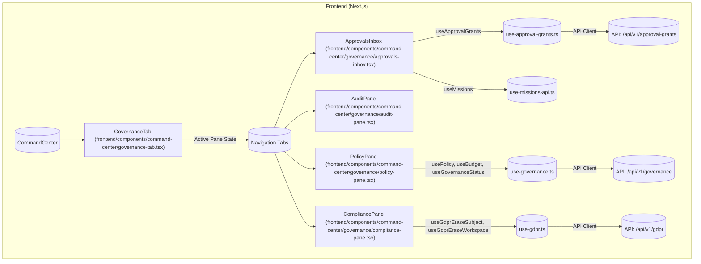

# Governance Dashboard & Approvals Inbox

<details>
<summary>Relevant source files</summary>

The following files were used as context for generating this wiki page:

- [docs/compliance/EU-AI-ACT-ANNEX-IV.md](docs/compliance/EU-AI-ACT-ANNEX-IV.md)
- [docs/compliance/README.md](docs/compliance/README.md)
- [frontend/components/command-center/__tests__/governance-approvals-inbox.test.tsx](frontend/components/command-center/__tests__/governance-approvals-inbox.test.tsx)
- [frontend/components/command-center/__tests__/governance-compliance-pane.test.tsx](frontend/components/command-center/__tests__/governance-compliance-pane.test.tsx)
- [frontend/components/command-center/__tests__/governance-policy-pane.test.tsx](frontend/components/command-center/__tests__/governance-policy-pane.test.tsx)
- [frontend/components/command-center/__tests__/governance-policy-plane-tile.test.tsx](frontend/components/command-center/__tests__/governance-policy-plane-tile.test.tsx)
- [frontend/components/command-center/governance-tab.tsx](frontend/components/command-center/governance-tab.tsx)
- [frontend/components/command-center/governance/approvals-inbox.tsx](frontend/components/command-center/governance/approvals-inbox.tsx)
- [frontend/components/command-center/governance/audit-pane.tsx](frontend/components/command-center/governance/audit-pane.tsx)
- [frontend/components/command-center/governance/compliance-pane.tsx](frontend/components/command-center/governance/compliance-pane.tsx)
- [frontend/components/command-center/governance/policy-pane.tsx](frontend/components/command-center/governance/policy-pane.tsx)
- [frontend/components/widgets/WidgetWrapper.tsx](frontend/components/widgets/WidgetWrapper.tsx)
- [frontend/components/widgets/__tests__/registration-manifest.test.ts](frontend/components/widgets/__tests__/registration-manifest.test.ts)
- [frontend/hooks/use-approval-grants.ts](frontend/hooks/use-approval-grants.ts)
- [frontend/hooks/use-gdpr.ts](frontend/hooks/use-gdpr.ts)
- [frontend/hooks/use-governance.ts](frontend/hooks/use-governance.ts)
- [orchestrator/alembic/versions/prd181_s2_approval_grants.py](orchestrator/alembic/versions/prd181_s2_approval_grants.py)
- [orchestrator/alembic/versions/prd196_s3_audit_logs_ws_created_index.py](orchestrator/alembic/versions/prd196_s3_audit_logs_ws_created_index.py)
- [orchestrator/api/approval_grants.py](orchestrator/api/approval_grants.py)
- [orchestrator/api/gdpr.py](orchestrator/api/gdpr.py)
- [orchestrator/api/governance.py](orchestrator/api/governance.py)
- [orchestrator/core/models/approval_grants.py](orchestrator/core/models/approval_grants.py)
- [orchestrator/core/services/approval_grants.py](orchestrator/core/services/approval_grants.py)
- [orchestrator/modules/policy/ai_act.py](orchestrator/modules/policy/ai_act.py)
- [orchestrator/services/board_approval.py](orchestrator/services/board_approval.py)
- [orchestrator/services/budget_ceiling.py](orchestrator/services/budget_ceiling.py)
- [orchestrator/tests/test_grant_approve_commit_ordering.py](orchestrator/tests/test_grant_approve_commit_ordering.py)
- [orchestrator/tests/test_human_directed_gate.py](orchestrator/tests/test_human_directed_gate.py)
- [orchestrator/tests/test_p2w2_gdpr_admin_dep.py](orchestrator/tests/test_p2w2_gdpr_admin_dep.py)
- [orchestrator/tests/test_p2w2_grant_mutation_admin_gate.py](orchestrator/tests/test_p2w2_grant_mutation_admin_gate.py)
- [orchestrator/tests/test_p2w2_grant_resume.py](orchestrator/tests/test_p2w2_grant_resume.py)
- [orchestrator/tests/test_p2w2_grants_oversight.py](orchestrator/tests/test_p2w2_grants_oversight.py)
- [orchestrator/tests/test_prd181_ai_act.py](orchestrator/tests/test_prd181_ai_act.py)
- [orchestrator/tests/test_prd200_approval_renotify.py](orchestrator/tests/test_prd200_approval_renotify.py)

</details>


This page details the implementation of the Governance Dashboard and Approvals Inbox, which provide a human-in-the-loop interface for managing AI agent actions. It covers the various panes within the governance tab (Policy Plane, Approvals Inbox, Audit Pane, Compliance Pane), the underlying governance API, frontend hooks, and the approval grant flows including renotification mechanisms.

## Governance Tab Panes

The `GovernanceTab` component [frontend/components/command-center/governance-tab.tsx:39-63]() serves as the entry point for the governance dashboard, organizing various functionalities into distinct panes. This tab is accessible only to workspace administrators, as all underlying API endpoints are gated by `require_workspace_admin` [orchestrator/api/approval_grants.py:8-11]().

The available panes are:
*   **Approvals Inbox**: Manages pending, granted, and denied approval requests for agent actions.
*   **Audit Pane**: Displays a log of all auditable actions within the workspace.
*   **Policy Pane**: Allows configuration of the workspace's AI policy and budget.
*   **Compliance Pane**: Provides tools for GDPR self-service, such as subject and workspace erasure.

### Approvals Inbox

The `ApprovalsInbox` component [frontend/components/command-center/governance/approvals-inbox.tsx:45]() is the primary interface for human-in-the-loop approvals. It displays `ApprovalGrant` records [orchestrator/core/models/approval_grants.py:64-114]() that gate various agent actions, such as board tasks, playbook runs, and tool calls.

Each approval grant displayed includes:
*   **Oversight Tier and Rationale**: Derived from the EU AI Act's Article 14, indicating why human intervention is required [orchestrator/api/approval_grants.py:42-53](). This is determined by the `oversight_for_risk` function [orchestrator/modules/policy/ai_act.py]().
*   **Actions**: Buttons to "Grant" or "Deny" pending requests, or "Revoke" previously granted ones [frontend/components/command-center/governance/approvals-inbox.test.tsx:109-141]().
*   **Cost Estimates**: `estimated_cost_usd` is displayed to inform the approver [orchestrator/core/models/approval_grants.py:90]().

The inbox also surfaces "parked missions" [frontend/components/command-center/governance/approvals-inbox.test.tsx:150-174](), which are missions in an `awaiting_approval` state, allowing users to approve, edit, or reject their plans.

#### Approval Grant Flow

1.  **Creation**: When an agent action (e.g., a board task [orchestrator/services/board_approval.py:70-166]()) requires human approval based on the workspace's policy, an `ApprovalGrant` record is created in the database [orchestrator/core/services/approval_grants.py:43-87](). This grant is initially in a `PENDING` status [orchestrator/core/models/approval_grants.py:45]().
2.  **Notification**: Upon creation of a pending grant, a notification is dispatched to workspace administrators [orchestrator/services/board_approval.py:151-157](). This ensures that blocked tasks do not wait silently. The `_dispatch_approval_pending` function [orchestrator/services/board_approval.py:168-185]() handles this asynchronous notification.
3.  **Decision**: A workspace administrator views the pending grant in the Approvals Inbox.
    *   **Grant**: If approved, the `grant_approval` API endpoint [orchestrator/api/approval_grants.py:138-166]() is called, which updates the grant's status to `GRANTED` [orchestrator/core/services/approval_grants.py:155-160]() and re-queues the blocked subject. The commit of the `GRANTED` status happens *before* the subject is resumed to ensure durability [orchestrator/api/approval_grants.py:160-166]().
    *   **Deny**: If denied, the `deny_approval` API endpoint [orchestrator/api/approval_grants.py:170-175]() is called, setting the status to `DENIED` [orchestrator/core/services/approval_grants.py:163-168](). The subject fails and is not retried.
    *   **Revoke**: A previously `GRANTED` approval can be `REVOKED` [orchestrator/api/approval_grants.py:177-182](), changing its status to `REVOKED` [orchestrator/core/services/approval_grants.py:170-176]() and immediately stopping its authorization.
4.  **Auditing**: Every state change of an `ApprovalGrant` is logged via the `AuditService` [orchestrator/api/approval_grants.py:82-102]().

#### Question-Kind Grants

Beyond simple approvals, the system supports "question-kind" grants [orchestrator/core/models/approval_grants.py:57-61](). These are free-text asks where the decision is words instead of a boolean yes/no. The status vocabulary is reused: `pending` means open, `granted` means answered, and `denied` means dismissed. The `_grant_payload` function [orchestrator/api/approval_grants.py:56-70]() enriches question-kind rows with details about their blocked cascade.

### Policy Pane

The `PolicyPane` component [frontend/components/command-center/governance/policy-pane.tsx:37]() allows workspace administrators to configure the AI policy and budget. It displays the current policy posture (e.g., "balanced", "strict") and allows setting overrides for specific risk tiers [frontend/components/command-center/governance/policy-pane.test.tsx:62-73]().

The policy plane can be "OFF" (not enforcing) or "ON" (enforcing) [frontend/components/command-center/__tests__/governance-policy-plane-tile.test.tsx:34-51](). When off, the UI honestly warns that settings are inert [frontend/components/command-center/governance/policy-pane.test.tsx:46-48](). Changes to the policy are round-tripped via `PUT /policy` [frontend/components/command-center/governance/policy-pane.test.tsx:52-60]().

### Audit Pane

The `AuditPane` component [frontend/components/command-center/governance/audit-pane.tsx]() displays the `audit_logs` [orchestrator/alembic/versions/prd196_s3_audit_logs_ws_created_index.py:1-19]() for the workspace. This log records every significant state change, including approval grant actions [orchestrator/api/approval_grants.py:82-102](). The `audit_logs` table has a composite index on `(workspace_id, created_at)` to optimize reads and retention sweeps [orchestrator/alembic/versions/prd196_s3_audit_logs_ws_created_index.py:31-35]().

### Compliance Pane

The `CompliancePane` component [frontend/components/command-center/governance/compliance-pane.tsx:26]() provides GDPR self-service functionalities. It allows users to erase subject data and entire workspaces. The erasure process generates an "honest erase report" that details what was and was not deleted, including gaps and untagged history [frontend/components/command-center/governance/compliance-pane.test.tsx:49-61](). Workspace erasure requires typing the exact workspace ID for confirmation [frontend/components/command-center/governance/compliance-pane.test.tsx:63-77]().

## Governance API

The backend API for managing approval grants is defined in `orchestrator/api/approval_grants.py` [orchestrator/api/approval_grants.py:39]().

Key endpoints include:
*   `GET /api/v1/approval-grants`: Lists approval grants for the current workspace, with optional filtering by `status` and `kind` [orchestrator/api/approval_grants.py:105-124]().
*   `POST /api/v1/approval-grants/{grant_id}/grant`: Approves a pending grant [orchestrator/api/approval_grants.py:138-166]().
*   `POST /api/v1/approval-grants/{grant_id}/deny`: Denies a pending grant [orchestrator/api/approval_grants.py:170-175]().
*   `POST /api/v1/approval-grants/{grant_id}/revoke`: Revokes an active grant [orchestrator/api/approval_grants.py:177-182]().
*   `POST /api/v1/approval-grants/{grant_id}/answer`: Answers a question-kind grant (not shown in provided snippets, but implied by `KIND_QUESTION` handling).

All these endpoints are protected by the `require_workspace_admin` dependency [orchestrator/api/approval_grants.py:109]().

## `use-governance` Hooks

The frontend interacts with the governance API using custom React hooks defined in `frontend/hooks/use-governance.ts` and `frontend/hooks/use-approval-grants.ts`.

*   `useApprovalGrants`: Fetches and manages the list of approval grants [frontend/hooks/use-approval-grants.ts]().
*   `useGrantApproval`, `useDenyApproval`, `useRevokeApproval`: Provide mutation functions for approving, denying, and revoking grants [frontend/hooks/use-approval-grants.ts]().
*   `useGovernanceStatus`: Retrieves the current status of the policy plane (enforcing or not) [frontend/hooks/use-governance.ts]().
*   `usePolicy`, `useBudget`, `useUpdatePolicy`, `useUpdateBudget`: Manage the workspace's AI policy and budget settings [frontend/hooks/use-governance.ts]().
*   `useGdprEraseSubject`, `useGdprEraseWorkspace`: Handle GDPR-related data erasure operations [frontend/hooks/use-gdpr.ts]().

## Approval Grant Flows and Renotification

The core of the approval system relies on the `ApprovalGrant` SQLAlchemy model [orchestrator/core/models/approval_grants.py:64-114](). This model stores durable, scoped, expiring, and revocable records for actions requiring human consent.

### Grant Lifecycle

The `core.services.approval_grants` module [orchestrator/core/services/approval_grants.py:1-12]() defines the lifecycle operations:
*   `create_grant`: Stages a new `PENDING` grant [orchestrator/core/services/approval_grants.py:43-87]().
*   `find_active_grant`: Retrieves a `GRANTED` and unexpired grant [orchestrator/core/services/approval_grants.py:96-127]().
*   `find_pending_grant`: Retrieves an existing `PENDING` grant for idempotency [orchestrator/core/services/approval_grants.py:130-149]().
*   `grant_grant`: Changes a grant's status to `GRANTED` [orchestrator/core/services/approval_grants.py:155-160]().
*   `deny_grant`: Changes a grant's status to `DENIED` [orchestrator/core/services/approval_grants.py:163-168]().
*   `revoke_grant`: Changes a grant's status to `REVOKED` [orchestrator/core/services/approval_grants.py:170-176]().
*   `is_authorising`: Checks if a grant is currently active (granted and not expired) [orchestrator/core/services/approval_grants.py:179-188]().

### Renotification

When a new `PENDING` grant is created, the system ensures that workspace administrators are notified. This is handled by the `_notify_approval_pending` function [orchestrator/services/board_approval.py:151-157](), which dispatches an `approval_pending` event through the `NotificationDispatcher` [orchestrator/services/board_approval.py:182-183](). This prevents blocked tasks from waiting silently and ensures timely human intervention.

## Diagrams

### Governance Dashboard Frontend Structure


Sources:
- [frontend/components/command-center/governance-tab.tsx:39-63]()
- [frontend/components/command-center/governance/approvals-inbox.tsx]()
- [frontend/components/command-center/governance/audit-pane.tsx]()
- [frontend/components/command-center/governance/policy-pane.tsx]()
- [frontend/components/command-center/governance/compliance-pane.tsx]()
- [frontend/hooks/use-approval-grants.ts]()
- [frontend/hooks/use-governance.ts]()
- [frontend/hooks/use-gdpr.ts]()
- [orchestrator/api/approval_grants.py]()
- [orchestrator/api/governance.py]()
- [orchestrator/api/gdpr.py]()

### Approval Grant Backend Flow

```mermaid
graph TD
    subgraph "Backend (FastAPI)"
        A[("Agent Action Trigger")] --> BTA[evaluate_board_task_approval (orchestrator/services/board_approval.py)]
        BTA -- "Policy Evaluation" --> AP[evaluate_approval (core.services.approval_policy)]
        AP -- "Requires Approval" --> CG[create_grant (core.services.approval_grants)]
        CG --> AG[ApprovalGrant (core/models/approval_grants.py)]
        AG -- "Status: PENDING" --> DB[(PostgreSQL Database)]
        CG --> AGov[AuditService.log (core/workspaces/audit.py)]
        CG --> AN[NotificationDispatcher (core/services/notification_dispatcher.py)]
        AN -- "approval_pending" --> AdminNotify[("Admin Notifications")]

        subgraph "Approvals API (orchestrator/api/approval_grants.py)"
            API_List["GET /api/v1/approval-grants"] --> DB
            API_Grant["POST /{id}/grant"] --> LoadGrant[load_grant]
            API_Deny["POST /{id}/deny"] --> LoadGrant
            API_Revoke["POST /{id}/revoke"] --> LoadGrant
            API_Answer["POST /{id}/answer"] --> LoadGrant

            LoadGrant --> AG
            AG -- "Update Status" --> GrantGrant[grant_grant (core.services.approval_grants)]
            AG -- "Update Status" --> DenyGrant[deny_grant (core.services.approval_grants)]
            AG -- "Update Status" --> RevokeGrant[revoke_grant (core.services.approval_grants)]
            GrantGrant --> DB
            DenyGrant --> DB
            RevokeGrant --> DB
            GrantGrant --> AGov
            DenyGrant --> AGov
            RevokeGrant --> AGov
            GrantGrant -- "Re-queue Subject" --> SubjectResume[("Blocked Subject Resumed")]
        end
    end
```
Sources:
- [orchestrator/services/board_approval.py:70-166]()
- [orchestrator/core/services/approval_grants.py:43-87]()
- [orchestrator/core/models/approval_grants.py:64-114]()
- [orchestrator/api/approval_grants.py:105-182]()
- [orchestrator/core/services/approval_grants.py:155-176]()
- [orchestrator/api/approval_grants.py:82-102]()
- [orchestrator/services/board_approval.py:168-185]()

---