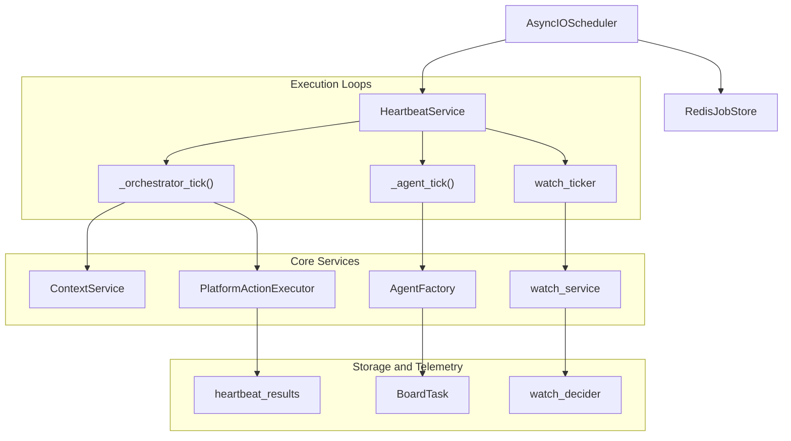

# Heartbeat & Proactive Assistant

Relevant source files

The following files were used as context for generating this wiki page:

- [orchestrator/api/chat.py](orchestrator/api/chat.py)
- [orchestrator/api/routing.py](orchestrator/api/routing.py)
- [orchestrator/consumers/chatbot/auto.py](orchestrator/consumers/chatbot/auto.py)
- [orchestrator/consumers/chatbot/service.py](orchestrator/consumers/chatbot/service.py)
- [orchestrator/core/llm/manager.py](orchestrator/core/llm/manager.py)
- [orchestrator/core/routing/engine.py](orchestrator/core/routing/engine.py)
- [orchestrator/modules/agents/factory/agent_factory.py](orchestrator/modules/agents/factory/agent_factory.py)
- [orchestrator/modules/tools/discovery/platform_actions.py](orchestrator/modules/tools/discovery/platform_actions.py)
- [orchestrator/modules/tools/discovery/platform_executor.py](orchestrator/modules/tools/discovery/platform_executor.py)
- [orchestrator/scripts/setup_jira_trigger.py](orchestrator/scripts/setup_jira_trigger.py)
- [orchestrator/services/heartbeat_service.py](orchestrator/services/heartbeat_service.py)
- [orchestrator/services/page_context.py](orchestrator/services/page_context.py)
- [orchestrator/tests/test_prd221_page_context.py](orchestrator/tests/test_prd221_page_context.py)
- [orchestrator/tests/test_prd221_page_prior_tools.py](orchestrator/tests/test_prd221_page_prior_tools.py)

## Purpose and Scope

The Heartbeat & Proactive Assistant system enables scheduled, autonomous checks for both workspace-level orchestrator health, individual agent task completion, and active watch monitors [orchestrator/services/heartbeat_service.py:1-10](). This system transforms Automatos from a purely reactive platform into a proactive operating system, allowing agents to execute assigned work, the orchestrator to perform periodic workspace health assessments, and the watch subsystem to trigger autonomous escalations [orchestrator/services/heartbeat_service.py:135-142]().

As a PARENT page, this document provides a high-level overview of the heartbeat and proactive subsystems. For deep technical details, implementation specifics, and API parameters, see the child pages:
- [Heartbeat Architecture](#11.1) — `HeartbeatService`, APScheduler with Redis job store, cron trigger conversion, active hours guard, primitive health probes.
- [Orchestrator Heartbeat](#11.2) — LLM-powered vs shallow mode, tool loop caps, proactive levels (`silent`, `notify`, `act_notify`, `autonomous`).
- [Agent Heartbeat](#11.3) — `BoardTask` integration, status transitions, task context injection.
- [Configuration & Scheduling](#11.4) — Heartbeat config storage, interval/cron setup, timezone handling, `UnifiedScheduler` locking.
- [Heartbeat API Reference](#11.5) — API endpoints for config, last result, history, run now, orchestrator tick.
- [Watches & Autonomous Monitoring](#11.6) — PRD-204 watch subsystem: `watch_service` registry, `watch_ticker`, `watch_decider` policy table, watch actions, rerun, `escalation_service`, watch notifications, and the watchlist UI tab.
- [Auto Reporting & Digests](#11.7) — `auto_reporting` service, auto-cadence, `digest_service` with feedback, `report_service`, and agent reports surfaced in Activity.

**Sources:** [orchestrator/services/heartbeat_service.py:1-10](), [orchestrator/services/heartbeat_service.py:135-142]()

---

## Architecture Overview

The heartbeat and proactive scheduling architecture relies on `APScheduler` managed centrally via `HeartbeatService` [orchestrator/services/heartbeat_service.py:135-147](). It coordinates periodic checks across multiple background channels, ensuring resource governance and multi-tenant isolation.

### System Topology: Natural Language to Code Entities

**Sources:** [orchestrator/services/heartbeat_service.py:135-184](), [orchestrator/modules/tools/discovery/platform_executor.py:1-10]()

---

## 11.1 Heartbeat Architecture

The `HeartbeatService` initializes within an asynchronous scheduler lifecycle, using either an in-memory job store or a persistent `RedisJobStore` [orchestrator/services/heartbeat_service.py:164-180](). It includes active hours guards to suppress notifications during off-hours and primitive health probes (`emit_primitive_finding`) that record the real-time operational status (`green`, `degraded`, `down`) of core system components like chat, memory, and RAG into `heartbeat_results` [orchestrator/services/heartbeat_service.py:44-123]().

For implementation details, see [Heartbeat Architecture](#11.1).

**Sources:** [orchestrator/services/heartbeat_service.py:44-123](), [orchestrator/services/heartbeat_service.py:164-180]()

---

## 11.2 Orchestrator Heartbeat

Orchestrator heartbeats run workspace-level health evaluations. Depending on configuration, they operate in an LLM-powered mode using `ContextService` (`HEARTBEAT` mode) or a shallow mode [orchestrator/services/heartbeat_service.py:382-546](). They enforce strict tool loop iteration caps and execute actions according to four proactive tiers: `silent`, `notify`, `act_notify`, and `autonomous`.

For details on configuration and execution modes, see [Orchestrator Heartbeat](#11.2).

**Sources:** [orchestrator/services/heartbeat_service.py:382-546]()

---

## 11.3 Agent Heartbeat

Agent heartbeats monitor the `BoardTask` table for items in an `assigned` status [orchestrator/services/heartbeat_service.py:591-735](). Upon pickup, they transition tasks to `in_progress`, inject task context into `AgentFactory.execute_with_prompt()`, and advance the task status to `done` upon completion without requiring interactive user chat sessions.

For execution flows and state transitions, see [Agent Heartbeat](#11.3).

**Sources:** [orchestrator/services/heartbeat_service.py:591-735]()

---

## 11.4 Configuration & Scheduling

Heartbeat rules, intervals, and cron expressions are stored within database settings (`workspaces.settings` and `agents.configuration`) [orchestrator/services/heartbeat_service.py:235-249](). The scheduling layer converts simple interval minutes into precise `CronTrigger` schedules, with timezone handling managed under the `UnifiedScheduler` locking mechanism.

For parameter schemas and setup instructions, see [Configuration & Scheduling](#11.4).

**Sources:** [orchestrator/services/heartbeat_service.py:235-249](), [orchestrator/services/heartbeat_service.py:333-366]()

---

## 11.5 Heartbeat API Reference

The backend exposes administrative and monitoring endpoints for managing heartbeat configuration, inspecting last execution results, viewing telemetry history, triggering immediate manual runs, and invoking orchestrator ticks [orchestrator/api/routing.py:1-40]().

For API routes and payload schemas, see [Heartbeat API Reference](#11.5).

**Sources:** [orchestrator/api/routing.py:1-40]()

---

## 11.6 Watches & Autonomous Monitoring

Introduced under PRD-204, the watch subsystem provides persistent autonomous monitoring of workspace assets and data conditions [orchestrator/modules/tools/discovery/platform_actions.py:49-50](). It consists of the `watch_service` registry, `watch_ticker`, the `watch_decider` policy table, automated rerun actions, `escalation_service` for alerts, and a dedicated watchlist tab in the user interface [orchestrator/modules/tools/discovery/platform_executor.py:204-209]().

For operational semantics and policy configuration, see [Watches & Autonomous Monitoring](#11.6).

**Sources:** [orchestrator/modules/tools/discovery/platform_actions.py:49-50](), [orchestrator/modules/tools/discovery/platform_executor.py:204-209]()

---

## 11.7 Auto Reporting & Digests

The auto-reporting service (`auto_reporting`) manages periodic summary generation and delivery cadences [orchestrator/modules/tools/discovery/platform_actions.py:39](). Working alongside `digest_service` (incorporating user feedback loops) and `report_service`, it aggregates agent execution reports and surfaces them directly within the Command Centre activity feed and notifications [orchestrator/modules/tools/discovery/platform_executor.py:154-160]().

For report formatting and cadence settings, see [Auto Reporting & Digests](#11.7).

**Sources:** [orchestrator/modules/tools/discovery/platform_actions.py:39](), [orchestrator/modules/tools/discovery/platform_executor.py:154-160]()

---