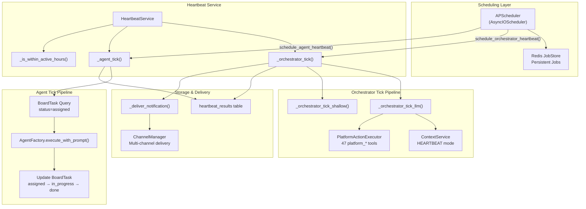
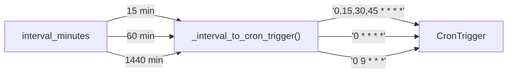
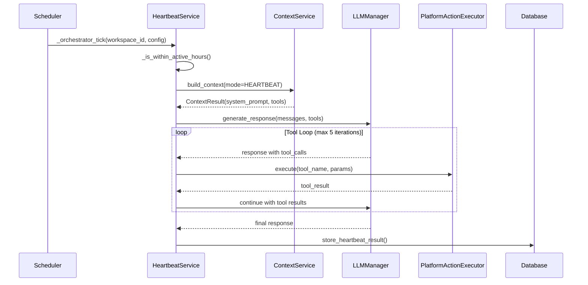
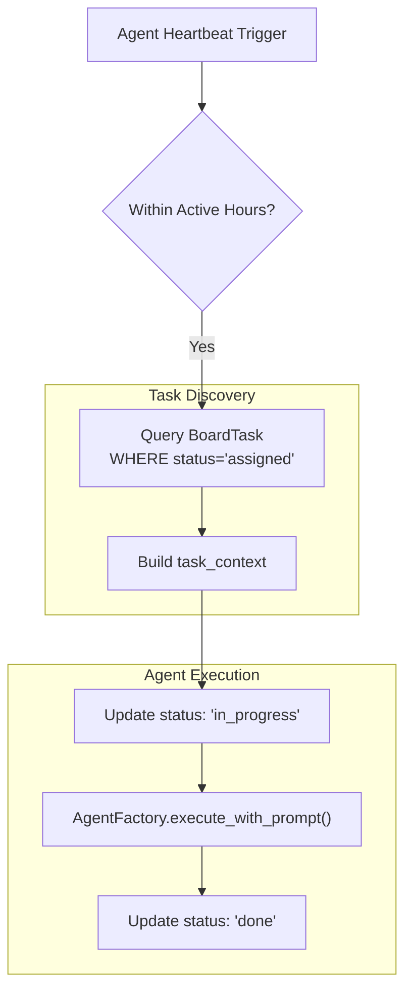
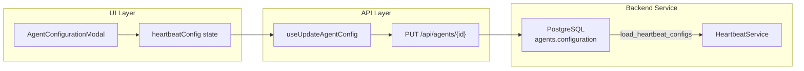

# Heartbeat & Proactive Assistant

Relevant source files

The following files were used as context for generating this wiki page:

- [docs/PRDS/55-AUTONOMOUS-ASSISTANT-PLATFORM.md](docs/PRDS/55-AUTONOMOUS-ASSISTANT-PLATFORM.md)
- [frontend/components/agents/agent-configuration-modal.tsx](frontend/components/agents/agent-configuration-modal.tsx)
- [frontend/components/agents/agent-configuration.tsx](frontend/components/agents/agent-configuration.tsx)
- [frontend/components/agents/agent-details-modal.tsx](frontend/components/agents/agent-details-modal.tsx)
- [frontend/components/agents/agent-management.tsx](frontend/components/agents/agent-management.tsx)
- [frontend/components/agents/agent-performance.tsx](frontend/components/agents/agent-performance.tsx)
- [frontend/components/agents/agent-roster.tsx](frontend/components/agents/agent-roster.tsx)
- [frontend/components/agents/agent-skills.tsx](frontend/components/agents/agent-skills.tsx)
- [frontend/components/agents/agent-status-control-modal.tsx](frontend/components/agents/agent-status-control-modal.tsx)
- [frontend/components/agents/create-agent-modal.tsx](frontend/components/agents/create-agent-modal.tsx)
- [frontend/components/agents/create-skill-modal.tsx](frontend/components/agents/create-skill-modal.tsx)
- [frontend/components/agents/skill-configuration-modal.tsx](frontend/components/agents/skill-configuration-modal.tsx)
- [frontend/components/auth/sign-up-form.tsx](frontend/components/auth/sign-up-form.tsx)
- [frontend/components/documents/analytics-tab.tsx](frontend/components/documents/analytics-tab.tsx)
- [frontend/components/documents/processing-tab.tsx](frontend/components/documents/processing-tab.tsx)
- [frontend/hooks/use-agent-api.ts](frontend/hooks/use-agent-api.ts)
- [frontend/hooks/use-document-api.ts](frontend/hooks/use-document-api.ts)
- [orchestrator/alembic/versions/20260215_add_heartbeat_and_channels.py](orchestrator/alembic/versions/20260215_add_heartbeat_and_channels.py)
- [orchestrator/api/agents.py](orchestrator/api/agents.py)
- [orchestrator/api/channels.py](orchestrator/api/channels.py)
- [orchestrator/api/heartbeat.py](orchestrator/api/heartbeat.py)
- [orchestrator/channels/base.py](orchestrator/channels/base.py)
- [orchestrator/channels/discord_adapter.py](orchestrator/channels/discord_adapter.py)
- [orchestrator/channels/google_chat_adapter.py](orchestrator/channels/google_chat_adapter.py)
- [orchestrator/channels/line_adapter.py](orchestrator/channels/line_adapter.py)
- [orchestrator/channels/manager.py](orchestrator/channels/manager.py)
- [orchestrator/channels/slack_adapter.py](orchestrator/channels/slack_adapter.py)
- [orchestrator/consumers/chatbot/smart_memory.py](orchestrator/consumers/chatbot/smart_memory.py)
- [orchestrator/core/models/__init__.py](orchestrator/core/models/__init__.py)
- [orchestrator/core/models/channels.py](orchestrator/core/models/channels.py)
- [orchestrator/core/models/core.py](orchestrator/core/models/core.py)
- [orchestrator/core/services/plugin_security_scanner.py](orchestrator/core/services/plugin_security_scanner.py)
- [orchestrator/modules/agents/__init__.py](orchestrator/modules/agents/__init__.py)
- [orchestrator/modules/agents/factory/__init__.py](orchestrator/modules/agents/factory/__init__.py)
- [orchestrator/modules/memory/integrations/mem0_client.py](orchestrator/modules/memory/integrations/mem0_client.py)
- [orchestrator/services/heartbeat_service.py](orchestrator/services/heartbeat_service.py)

## Purpose and Scope

The Heartbeat & Proactive Assistant system enables scheduled, autonomous checks for both workspace-level orchestrator health and individual agent task completion. This system transforms Automatos from reactive to proactive, allowing agents to monitor assigned work and the orchestrator to perform periodic workspace health assessments and autonomous actions.

For multi-channel message handling that enables heartbeat notifications, see [Channel Integrations](#12). For agent execution details, see [Agents](#5). For tool execution used during heartbeat ticks, see [Tools & Integrations](#8).

**Sources:** [orchestrator/services/heartbeat_service.py:1-10](), [docs/PRDS/55-AUTONOMOUS-ASSISTANT-PLATFORM.md:1-15]()

---

## Architecture Overview

The heartbeat system consists of two primary components: **orchestrator heartbeats** (workspace-level health checks) and **agent heartbeats** (task completion monitors). Both use `APScheduler` with cron triggers for precise scheduling and respect active-hours configurations to prevent off-hours resource consumption.

### System Topology

**Sources:** [orchestrator/services/heartbeat_service.py:24-91](), [orchestrator/services/heartbeat_service.py:163-222]()

---

## Heartbeat Service

The `HeartbeatService` class manages all heartbeat scheduling and execution. It initializes with a shared `AsyncIOScheduler` instance and loads active heartbeat configurations from the database on startup. It enforces rate limits, such as a maximum of 5 concurrent heartbeats per workspace.

### Initialization and Lifecycle

| Method | Purpose |
|--------|---------|
| `start(scheduler)` | Initialize scheduler, load configs, schedule daily summary [orchestrator/services/heartbeat_service.py:43-84]() |
| `stop()` | Remove heartbeat jobs, shutdown owned scheduler [orchestrator/services/heartbeat_service.py:85-91]() |
| `_load_heartbeat_configs()` | Query database for active heartbeat settings [orchestrator/services/heartbeat_service.py:96-123]() |

The service supports both standalone mode (creates its own scheduler with `RedisJobStore`) and shared mode where it integrates with a system-wide scheduler.

**Sources:** [orchestrator/services/heartbeat_service.py:24-91]()

### Cron Trigger Conversion

The service converts interval minutes to `CronTrigger` expressions for predictable execution at fixed times (e.g., top of the hour):

**Sources:** [orchestrator/services/heartbeat_service.py:129-162]()

---

## Orchestrator Heartbeat

Orchestrator heartbeats perform workspace-level health checks. They use `ContextService` in `HEARTBEAT` mode to build a system prompt and execute a tool loop (max 5 iterations) to analyze workspace health and perform maintenance tasks.

### LLM-Powered Tick

The orchestrator tick executes via `_orchestrator_tick_llm()`, which handles complex multi-turn interactions and context trimming to avoid token overflow while analyzing workspace state.

**Sources:** [orchestrator/services/heartbeat_service.py:382-546](), [orchestrator/core/llm/manager.py:39-41]()

### Tool Loop Implementation

The loop in `_orchestrator_tick_llm()` manages message accumulation and exchange boundary detection to keep the context window clean while allowing the orchestrator to call `platform_*` actions to inspect the system.

**Sources:** [orchestrator/services/heartbeat_service.py:461-537]()

---

## Agent Heartbeat

Agent heartbeats monitor the `BoardTask` table for work assigned to specific agents and execute tasks autonomously. This allows agents to work on long-running tasks without direct user interaction in a chat.

### Task Execution Flow

**Sources:** [orchestrator/services/heartbeat_service.py:591-735](), [orchestrator/modules/agents/factory/agent_factory.py:155-192]()

---

## Configuration & Scheduling

Heartbeat configurations are stored as JSON blobs within the `agents` and `workspaces` tables, allowing per-agent and per-workspace customization of intervals and prompts.

| Scope | Storage Location |
|-------|-----------------|
| Orchestrator | `workspaces.settings['orchestrator']['heartbeat']` [orchestrator/services/heartbeat_service.py:107-111]() |
| Agent | `agents.configuration['heartbeat']` [orchestrator/services/heartbeat_service.py:116-121]() |

### Frontend Integration

The `AgentConfigurationModal` provides a dedicated UI for managing these settings, including interval selection, active hours, and autonomous action toggles.

**Sources:** [frontend/components/agents/agent-configuration-modal.tsx:155-167](), [orchestrator/api/agents.py:382-410]()

### Scheduling API

The `HeartbeatService` provides methods to dynamically schedule or remove jobs when configurations change via the UI:
- `schedule_orchestrator_heartbeat(workspace_id, hb_config)` [orchestrator/services/heartbeat_service.py:163-189]()
- `schedule_agent_heartbeat(agent_id, workspace_id, hb_config)` [orchestrator/services/heartbeat_service.py:190-222]()

---

## Heartbeat API Reference

The heartbeat API (`/api/heartbeat`) provides endpoints for managing configurations, triggering manual runs, and monitoring execution history.

### Key Endpoints

| Endpoint | Method | Description |
|----------|--------|-------------|
| `/agents/{agent_id}/config` | GET/PUT | Manage agent heartbeat settings [orchestrator/api/heartbeat.py:58-126]() |
| `/agents/{agent_id}/last` | GET | Get most recent result for an agent [orchestrator/api/heartbeat.py:129-161]() |
| `/orchestrator/run` | POST | Trigger immediate orchestrator tick [orchestrator/api/heartbeat.py:165-178]() |
| `/orchestrator/history` | GET | List recent orchestrator results [orchestrator/api/heartbeat.py:180-205]() |

**Sources:** [orchestrator/api/heartbeat.py:1-205]()

---

## Results and Notifications

### Heartbeat Results

All executions store detailed telemetry in the `heartbeat_results` table, including `findings` (the LLM's analysis), `actions_taken` (tools called), and financial metrics like `cost` and `tokens_used`.

**Sources:** [orchestrator/api/heartbeat.py:138-160](), [orchestrator/alembic/versions/20260215_add_heartbeat_and_channels.py:13-50]()

### Notification Delivery

The `_deliver_notification()` method routes results to configured destinations. It supports internal orchestrator logging, direct webhooks, or external channels like Slack and Telegram via the `ChannelManager`.

**Sources:** [orchestrator/services/heartbeat_service.py:737-780](), [orchestrator/api/channels.py:24-42]()

---