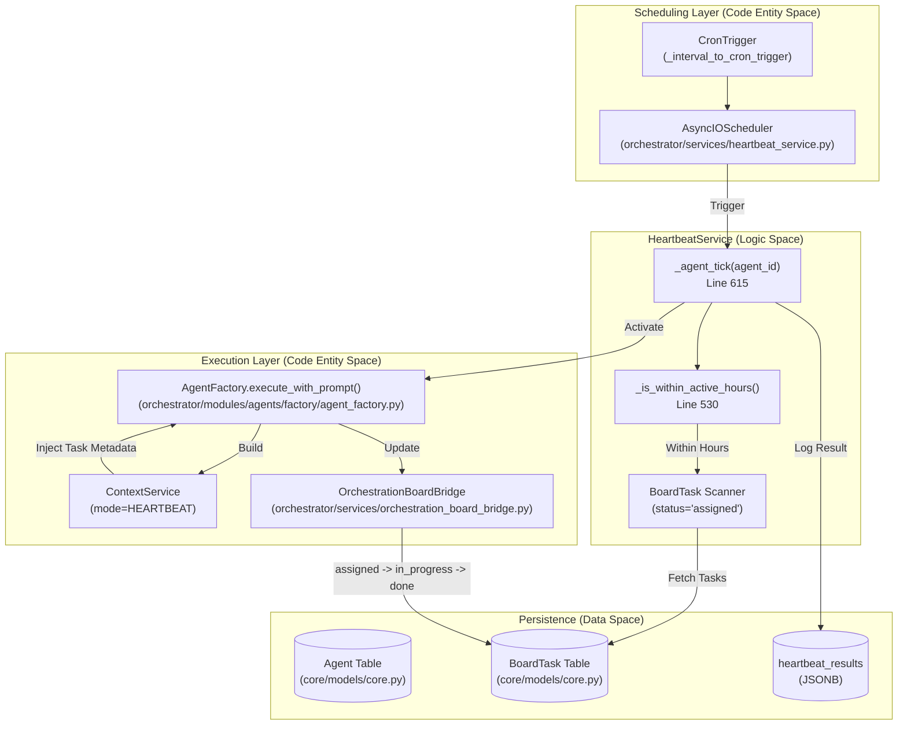
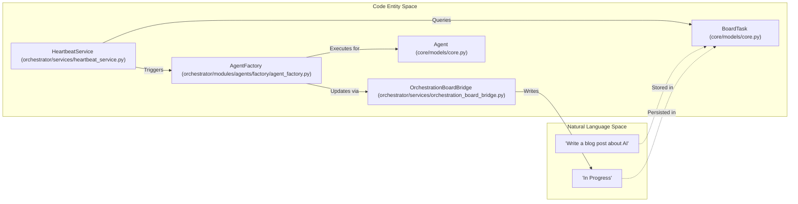

# Agent Heartbeat

Relevant source files

The following files were used as context for generating this wiki page:

- [frontend/components/activity/board/board-agent-sidebar.tsx](frontend/components/activity/board/board-agent-sidebar.tsx)
- [frontend/components/activity/board/board-card.tsx](frontend/components/activity/board/board-card.tsx)
- [frontend/components/activity/board/board-column.tsx](frontend/components/activity/board/board-column.tsx)
- [frontend/components/activity/board/board-filters.tsx](frontend/components/activity/board/board-filters.tsx)
- [frontend/components/activity/board/board-task-viewer.tsx](frontend/components/activity/board/board-task-viewer.tsx)
- [frontend/components/activity/board/board-view.tsx](frontend/components/activity/board/board-view.tsx)
- [frontend/components/activity/board/index.ts](frontend/components/activity/board/index.ts)
- [frontend/components/agents/agent-configuration-modal.tsx](frontend/components/agents/agent-configuration-modal.tsx)
- [frontend/components/agents/agent-configuration.tsx](frontend/components/agents/agent-configuration.tsx)
- [frontend/components/agents/agent-details-modal.tsx](frontend/components/agents/agent-details-modal.tsx)
- [frontend/components/agents/agent-management.tsx](frontend/components/agents/agent-management.tsx)
- [frontend/components/agents/agent-performance.tsx](frontend/components/agents/agent-performance.tsx)
- [frontend/components/agents/agent-roster.tsx](frontend/components/agents/agent-roster.tsx)
- [frontend/components/agents/agent-skills.tsx](frontend/components/agents/agent-skills.tsx)
- [frontend/components/agents/agent-status-control-modal.tsx](frontend/components/agents/agent-status-control-modal.tsx)
- [frontend/components/agents/create-agent-modal.tsx](frontend/components/agents/create-agent-modal.tsx)
- [frontend/components/agents/create-skill-modal.tsx](frontend/components/agents/create-skill-modal.tsx)
- [frontend/components/agents/skill-configuration-modal.tsx](frontend/components/agents/skill-configuration-modal.tsx)
- [frontend/components/documents/analytics-tab.tsx](frontend/components/documents/analytics-tab.tsx)
- [frontend/components/documents/processing-tab.tsx](frontend/components/documents/processing-tab.tsx)
- [frontend/hooks/use-agent-api.ts](frontend/hooks/use-agent-api.ts)
- [frontend/hooks/use-board-tasks.ts](frontend/hooks/use-board-tasks.ts)
- [frontend/hooks/use-document-api.ts](frontend/hooks/use-document-api.ts)
- [frontend/types/board.ts](frontend/types/board.ts)
- [orchestrator/api/agents.py](orchestrator/api/agents.py)
- [orchestrator/api/board_tasks.py](orchestrator/api/board_tasks.py)
- [orchestrator/core/models/__init__.py](orchestrator/core/models/__init__.py)
- [orchestrator/core/models/core.py](orchestrator/core/models/core.py)
- [orchestrator/services/board_task_bridge.py](orchestrator/services/board_task_bridge.py)
- [orchestrator/services/heartbeat_service.py](orchestrator/services/heartbeat_service.py)
- [orchestrator/services/orchestration_board_bridge.py](orchestrator/services/orchestration_board_bridge.py)

## Purpose and Scope

Agent Heartbeat is the scheduled proactive execution system that enables Automatos agents to act autonomously without waiting for direct user messages. It implements a specialized execution pipeline that integrates with the **BoardTask** system, allowing agents to function as always-on workers that pull, process, and complete tasks from a workspace board.

This page details the implementation of the `Agent Heartbeat` logic, its integration with `BoardTask` status transitions, and the context injection mechanism that provides agents with task-specific instructions during autonomous ticks.

---

## System Architecture

The heartbeat system is managed by the `HeartbeatService`, which uses `AsyncIOScheduler` (APScheduler) with a `RedisJobStore` for persistent, distributed scheduling [orchestrator/services/heartbeat_service.py:24-31](). It manages both workspace-level "Orchestrator Heartbeats" and agent-specific "Agent Heartbeats" [orchestrator/services/heartbeat_service.py:96-121]().

### Agent Heartbeat Data Flow

The diagram below maps the heartbeat lifecycle from the scheduling trigger to the final task status update in the database.

**Heartbeat to Code Entity Mapping**

**Sources:** [orchestrator/services/heartbeat_service.py:17-31](), [orchestrator/services/heartbeat_service.py:59-63](), [orchestrator/services/heartbeat_service.py:129-161](), [orchestrator/services/orchestration_board_bridge.py:49-57]()

---

## BoardTask Integration

The primary function of the Agent Heartbeat is to process tasks from the workspace board. The service identifies tasks where `assigned_agent_id` matches the current agent and the status is specifically `assigned` [orchestrator/services/heartbeat_service.py:646-660]().

### Task Status Transitions

The heartbeat logic enforces a strict state machine for tasks to ensure visibility in the UI and prevent double-processing. The `OrchestrationBoardBridge` handles the mapping between internal orchestration states and Kanban board statuses [orchestrator/services/orchestration_board_bridge.py:49-68]().

| Transition | Event | Implementation |
|:---|:---|:---|
| `assigned` → `in_progress` | Heartbeat selects task for execution. | Sets `started_at` timestamp and updates `BoardTask.status`. [orchestrator/services/heartbeat_service.py:680-685]() |
| `in_progress` → `done` | Agent execution completes successfully. | Sets `completed_at` and `result`. [orchestrator/services/heartbeat_service.py:700-708]() |
| `in_progress` → `failed` | Agent execution encounters an exception. | Sets `error_message` and status to `done` (terminal). [orchestrator/services/heartbeat_service.py:715-725]() |

### Selection Logic
The service scans for up to 3 tasks per tick, ordered by priority (Urgent to Low) and then by creation date (FIFO) [orchestrator/services/heartbeat_service.py:646-660]().

**Sources:** [orchestrator/api/board_tasks.py:28-30](), [orchestrator/services/orchestration_board_bridge.py:49-57](), [orchestrator/services/heartbeat_service.py:646-660]()

---

## Heartbeat Execution Pipeline

When a heartbeat tick occurs, the agent is provided with a specific execution context designed for autonomous work.

### Context Injection
The `HeartbeatService` constructs a specialized prompt that includes the task's `title`, `description`, and `planning_data`. This is passed to the `AgentFactory` using the `HEARTBEAT` context mode.

1. **Identity & Skills**: The agent's core persona and capabilities are loaded via the `AgentRuntime` [orchestrator/modules/agents/factory/agent_factory.py:155-172]().
2. **Task Context**: Specific `BoardTask` details are injected into the system prompt to focus the agent on the assigned work [orchestrator/services/heartbeat_service.py:663-675]().
3. **Tool Loop**: The agent enters an execution loop to complete the task using assigned tools or Composio-backed actions [orchestrator/modules/agents/factory/agent_factory.py:9-11]().

**Agent Heartbeat Code Entities**

**Sources:** [orchestrator/services/heartbeat_service.py:663-694](), [orchestrator/modules/agents/factory/agent_factory.py:102-115]()

---

## Configuration & Scheduling

Heartbeat behavior is controlled via the `agent.configuration` JSONB field in the `Agent` model [orchestrator/services/heartbeat_service.py:114-121]().

### Configuration Schema

| Field | Type | Description |
|:---|:---|:---|
| `enabled` | `bool` | Enables/disables the scheduler for this agent [orchestrator/services/heartbeat_service.py:118](). |
| `interval_minutes` | `int` | Frequency of ticks (converted to Cron via `_interval_to_cron_trigger`) [orchestrator/services/heartbeat_service.py:168](). |
| `active_hours_start` | `str` | HH:MM format for start of autonomous window [frontend/components/agents/agent-configuration-modal.tsx:160](). |
| `active_hours_end` | `str` | HH:MM format for end of autonomous window [frontend/components/agents/agent-configuration-modal.tsx:161](). |
| `timezone` | `str` | TZ identifier (e.g., "UTC", "America/New_York") [orchestrator/services/heartbeat_service.py:30](). |

**Sources:** [orchestrator/services/heartbeat_service.py:129-161](), [orchestrator/services/heartbeat_service.py:190-192](), [frontend/components/agents/agent-configuration-modal.tsx:156-167]()

### Interval to Cron Conversion
To ensure agents fire at predictable times, intervals are converted to fixed cron patterns using the `_interval_to_cron_trigger` helper [orchestrator/services/heartbeat_service.py:129-161]().

| Interval | Resulting Cron Logic |
|:---|:---|
| 15 min | `0,15,30,45 * * * *` (Sub-hour distribution) |
| 60 min | `0 * * * *` (Top of every hour) |
| 1440 min (Daily) | `0 9 * * *` (Fixed to 9 AM) |
| 10080 min (Weekly) | `0 9 * * 1` (Monday 9 AM) |

**Sources:** [orchestrator/services/heartbeat_service.py:145-161]()

---

## Monitoring and Results

Every heartbeat execution is logged to provide auditability for autonomous actions.

### UI Visualization and Polling
The frontend `BoardCard` and `BoardView` components provide real-time updates on autonomous actions. 

1. **Progress Tracking**: If the task includes `step_progress` in its `planning_data`, a progress bar is rendered in the `BoardCard` [frontend/components/activity/board/board-card.tsx:160-173]().
2. **SLA Monitoring**: The `SlaIndicator` component calculates time remaining against the `sla_deadline` set during task creation [frontend/components/activity/board/board-card.tsx:18-52]().
3. **Task Type Recognition**: The board differentiates between standard tasks, missions (orchestration), and playbooks (recipes) using the `source_type` field [frontend/hooks/use-board-tasks.ts:189-193]().

**Sources:** [frontend/components/activity/board/board-card.tsx:18-52](), [frontend/hooks/use-board-tasks.ts:184-210](), [orchestrator/api/board_tasks.py:119-120]()

---