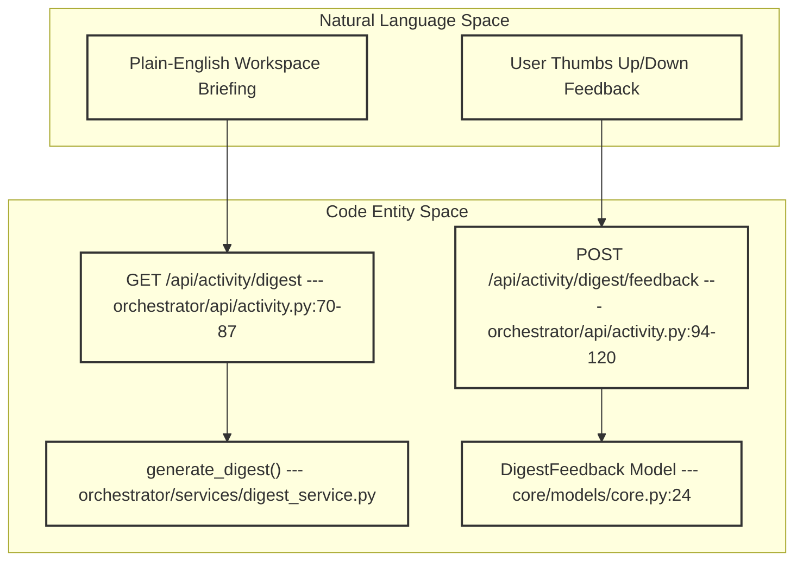
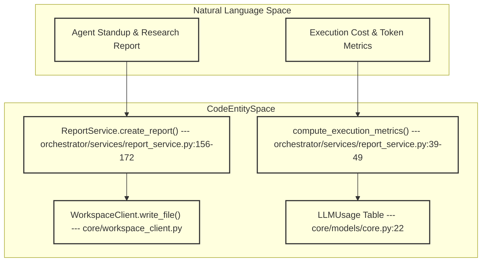

# Auto Reporting & Digests

Relevant source files

The following files were used as context for generating this wiki page:

- [docs/PRDS/76-AGENT-REPORTING-WORKSPACE.md](docs/PRDS/76-AGENT-REPORTING-WORKSPACE.md)
- [frontend/app/layout.tsx](frontend/app/layout.tsx)
- [frontend/components/activity/activity-reports.tsx](frontend/components/activity/activity-reports.tsx)
- [frontend/components/activity/report-grade-form.tsx](frontend/components/activity/report-grade-form.tsx)
- [frontend/components/activity/report-viewer.tsx](frontend/components/activity/report-viewer.tsx)
- [frontend/components/activity/widgets/command-centre-dashboard.tsx](frontend/components/activity/widgets/command-centre-dashboard.tsx)
- [frontend/components/activity/widgets/decisions-needed-widget.tsx](frontend/components/activity/widgets/decisions-needed-widget.tsx)
- [frontend/components/activity/widgets/playbook-metrics-widget.tsx](frontend/components/activity/widgets/playbook-metrics-widget.tsx)
- [frontend/components/activity/widgets/self-learning-health-widget.tsx](frontend/components/activity/widgets/self-learning-health-widget.tsx)
- [frontend/components/workspace/Canvas.tsx](frontend/components/workspace/Canvas.tsx)
- [frontend/components/workspace/WidgetTray.tsx](frontend/components/workspace/WidgetTray.tsx)
- [frontend/components/workspace/index.ts](frontend/components/workspace/index.ts)
- [frontend/hooks/use-kpi-api.ts](frontend/hooks/use-kpi-api.ts)
- [frontend/hooks/use-learning-api.ts](frontend/hooks/use-learning-api.ts)
- [orchestrator/alembic/versions/prd129_deliverables.py](orchestrator/alembic/versions/prd129_deliverables.py)
- [orchestrator/alembic/versions/prd133b_outputs_view.py](orchestrator/alembic/versions/prd133b_outputs_view.py)
- [orchestrator/alembic/versions/prd221_digest_feedback.py](orchestrator/alembic/versions/prd221_digest_feedback.py)
- [orchestrator/api/activity.py](orchestrator/api/activity.py)
- [orchestrator/api/kpi_api.py](orchestrator/api/kpi_api.py)
- [orchestrator/api/reports.py](orchestrator/api/reports.py)
- [orchestrator/core/services/auto_reporting.py](orchestrator/core/services/auto_reporting.py)
- [orchestrator/core/services/notification_dispatcher.py](orchestrator/core/services/notification_dispatcher.py)
- [orchestrator/modules/memory/tool_outcome_capture.py](orchestrator/modules/memory/tool_outcome_capture.py)
- [orchestrator/modules/tools/discovery/actions_auto_reporting.py](orchestrator/modules/tools/discovery/actions_auto_reporting.py)
- [orchestrator/modules/tools/discovery/handlers_auto_reporting.py](orchestrator/modules/tools/discovery/handlers_auto_reporting.py)
- [orchestrator/services/deliverable_service.py](orchestrator/services/deliverable_service.py)
- [orchestrator/services/digest_service.py](orchestrator/services/digest_service.py)
- [orchestrator/services/report_service.py](orchestrator/services/report_service.py)
- [orchestrator/tests/services/test_deliverable_service.py](orchestrator/tests/services/test_deliverable_service.py)
- [orchestrator/tests/test_ctx_actor_attribute.py](orchestrator/tests/test_ctx_actor_attribute.py)
- [orchestrator/tests/test_p2w2_ask_notification.py](orchestrator/tests/test_p2w2_ask_notification.py)
- [orchestrator/tests/test_prd221_digest_feedback.py](orchestrator/tests/test_prd221_digest_feedback.py)
- [orchestrator/tests/test_prd221_digest_service.py](orchestrator/tests/test_prd221_digest_service.py)
- [orchestrator/tests/test_tool_outcome_capture.py](orchestrator/tests/test_tool_outcome_capture.py)

## Purpose and Scope

Section 11.7 covers the autonomous reporting, workspace digests, and activity surfacing subsystem of Automatos AI. This architecture bridges asynchronous agent executions, periodic background tasks, and human-facing operational dashboards. The core subsystems include:
- **Digest Service (`digest_service.py`)**: Provides "Auto's Read," a cached, plain-English executive summary of workspace state changes, reinforced by user feedback ratings.
- **Report Service (`report_service.py`)**: Manages agent-generated markdown reports (`reports/`), integrating execution cost/token metrics via `llm_usage` rollups.
- **Deliverable Service (`deliverable_service.py`)**: Exposes a unified outputs view (`v_workspace_outputs`) combining blog posts, agent reports, and ad-hoc file deliverables.
- **Auto-Reporting Cadence (`auto_reporting.py`)**: Orchestrates scheduled and threshold-triggered reporting routines.
- **Notification Dispatcher (`notification_dispatcher.py`)**: Fans out completion events and report notifications across in-app activity feeds, webhooks, and external channels (`telegram`, `slack`).

---

## 1. Auto's Read & Workspace Digests

"Auto's Read" provides workspace operators with a synthesized, plain-English briefing summarizing recent agent activity, blocked tasks, and operational health. 

### Digest Implementation & Caching
Digests are generated dynamically by `generate_digest()` in `orchestrator/services/digest_service.py` and exposed via `GET /api/activity/digest` [orchestrator/api/activity.py:70-87](). To prevent redundant LLM generations, digests are cached per workspace and state hash. If an LLM backend degrades or fails, the service falls back to a deterministic summary rather than returning a `500` error [orchestrator/api/activity.py:75-80]().

Operators can submit thumbs up/down feedback on generated digests using `POST /api/activity/digest/feedback` [orchestrator/api/activity.py:94-120](). Feedback records are stored in the `digest_feedback` table, keyed by the digest's `state_hash` and constrained to ratings of `-1` or `1` [orchestrator/api/activity.py:109-119]().

### API Endpoints
| Endpoint | Method | Permission / Guard | Description |
| :--- | :--- | :--- | :--- |
| `/api/activity/digest` | `GET` | Hybrid Auth (`get_request_context_hybrid`) | Returns cached plain-English workspace digest for a given period (`1d`, `7d`, `30d`, `90d`) [orchestrator/api/activity.py:70-87](). |
| `/api/activity/digest/feedback` | `POST` | `agents:execute` scope | Records user rating (`-1` or `1`) linked to a digest's `state_hash` [orchestrator/api/activity.py:94-120](). |

Sources: [orchestrator/api/activity.py:70-120](), [orchestrator/services/digest_service.py](), [core/models/core.py:24]()

---

## 2. Agent Report Generation & Metrics Rollups

Agents produce structured reports (e.g., standups, research digests, incident assessments) via `ReportService` in `orchestrator/services/report_service.py` [orchestrator/services/report_service.py:149-155]().

### Report Persistence & Structure
When an agent submits a report, `ReportService.create_report()` performs two operations:
1. Writes the full markdown payload directly to the workspace storage path (e.g., `reports/{agent_dir}/{date_str}_{title_slug}.md`) using `WorkspaceClient` [orchestrator/services/report_service.py:181-196]().
2. Inserts a metadata record into the database `agent_reports` table, tracking `agent_id`, `report_type`, `status`, `summary`, and associated `heartbeat_result_id` [orchestrator/services/report_service.py:156-172]().

### Execution Metrics Rollup
Reports automatically aggregate model telemetry from the `llm_usage` table via `compute_execution_metrics()` [orchestrator/services/report_service.py:39-49](). By passing an `execution_id` or an `agent_id` paired with a time window, the function calculates total tokens, aggregated cost in USD, active models used, duration, and LLM error counts [orchestrator/services/report_service.py:57-146]().

Sources: [orchestrator/services/report_service.py:1-196](), [core/models/core.py:22]()

---

## 3. Unified Outputs & Deliverables Integration

Deliverables, agent reports, and blog posts are unified under a single abstraction layer managed by `DeliverableService` (`orchestrator/services/deliverable_service.py`) [orchestrator/services/deliverable_service.py:1-45]().

### The `v_workspace_outputs` SQL View
Rather than querying disjointed tables, read paths fetch data through the `v_workspace_outputs` database view, which `UNION`s three core artifact sources:
- `blog_posts` (managed by `BlogService`) [orchestrator/services/deliverable_service.py:5-6]()
- `agent_reports` (managed by `ReportService`) [orchestrator/services/deliverable_service.py:7]()
- `deliverables` (ad-hoc code, images, and documents produced by agents) [orchestrator/services/deliverable_service.py:8]()

Write operations enforce strict single write-path rules:
- Registering ad-hoc deliverables via `register()` is idempotent, utilizing `ON CONFLICT (workspace_id, file_path)` [orchestrator/services/deliverable_service.py:21-22]().
- Blog posts and core agent reports must be written through their respective domain services and cannot be directly registered as ad-hoc deliverables [orchestrator/services/deliverable_service.py:10-12]().

Sources: [orchestrator/services/deliverable_service.py:1-45]()

---

## 4. Auto-Reporting Cadence & Notification Dispatcher

Autonomous reports and heartbeat summaries interface directly with the platform-wide notification pipeline via `NotificationDispatcher` (`orchestrator/core/services/notification_dispatcher.py`) [orchestrator/core/services/notification_dispatcher.py:1-38]().

### Notification Fan-Out & Routing
When an agent completes a task, heartbeat, or report submission, the dispatcher executes the following flow:
1. **Preference Resolution**: Queries `notification_preferences` for the workspace and user, honoring user-specific overrides over workspace defaults [orchestrator/core/services/notification_dispatcher.py:14-22]().
2. **Auto-Reporting Override**: If `workspace.settings.auto_reporting` is enabled, routing rules override individual user preferences [orchestrator/core/services/notification_dispatcher.py:133-145]().
3. **Quiet Hours Enforcement**: Non-urgent traffic is funneled exclusively to `in_app` notifications during quiet hours, while `urgent` and `security` severities bypass restrictions [orchestrator/core/services/notification_dispatcher.py:168-181]().
4. **External Delivery**: Dispatches outbound webhooks, Telegram messages, or Slack alerts via `send_workspace_notification()` [orchestrator/core/services/notification_dispatcher.py:25-28]().

Sources: [orchestrator/core/services/notification_dispatcher.py:1-185](), [orchestrator/core/services/auto_reporting.py]()

---

## 5. Activity Surface & Frontend Dashboard Integration

Agent reports and automated digests surface directly in the frontend Command Center and Activity pages (`frontend/components/activity/`) [frontend/components/activity/activity-reports.tsx:1]().

### Key UI Components
- **`ActivityReports` (`activity-reports.tsx`)**: Renders paginated agent reports with filter bars supporting report type selection (`standup`, `research`, `incident`, `delivery`, `audit`), metric summaries, and Markdown file downloads [frontend/components/activity/activity-reports.tsx:108-147]().
- **`ReportStatsBar`**: Aggregates total reports, ungraded counts, average letter/star grades, and status breakdowns [frontend/components/activity/activity-reports.tsx:72-104]().
- **`CommandCentreDashboard` (`command-centre-dashboard.tsx`)**: Combines modular dashboard widgets, including `agent-reports`, `recent-activity`, `decisions-needed`, and `self-learning` health tiles on a customizable grid [frontend/components/activity/widgets/command-centre-dashboard.tsx:52-72]().

Sources: [frontend/components/activity/activity-reports.tsx:1-165](), [frontend/components/activity/widgets/command-centre-dashboard.tsx:1-72]()

---