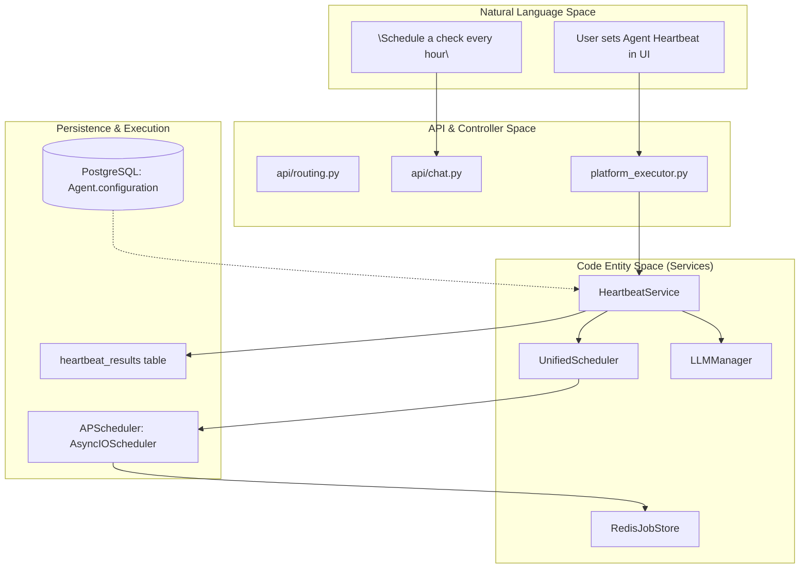
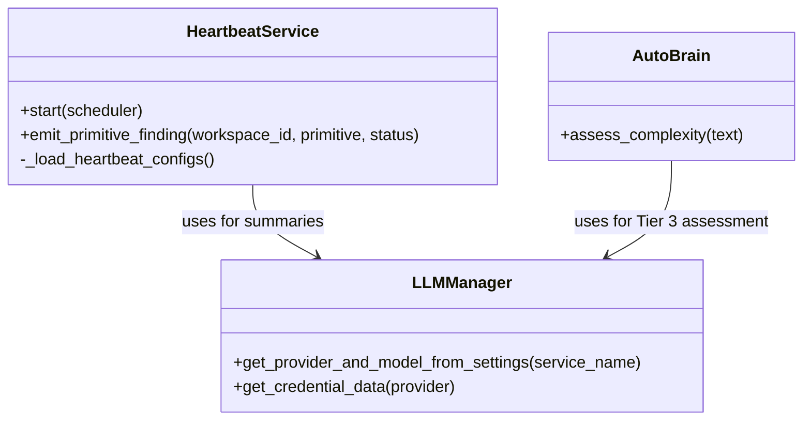

# Configuration & Scheduling

Relevant source files

The following files were used as context for generating this wiki page:

- [frontend/components/__tests__/prd197-substrate-tile.test.tsx](frontend/components/__tests__/prd197-substrate-tile.test.tsx)
- [frontend/components/command-center/is-it-working-strip.tsx](frontend/components/command-center/is-it-working-strip.tsx)
- [frontend/hooks/use-analytics-api.ts](frontend/hooks/use-analytics-api.ts)
- [frontend/lib/api-client.ts](frontend/lib/api-client.ts)
- [orchestrator/api/chat.py](orchestrator/api/chat.py)
- [orchestrator/api/routing.py](orchestrator/api/routing.py)
- [orchestrator/api/workflows.py](orchestrator/api/workflows.py)
- [orchestrator/config.py](orchestrator/config.py)
- [orchestrator/consumers/chatbot/auto.py](orchestrator/consumers/chatbot/auto.py)
- [orchestrator/consumers/chatbot/service.py](orchestrator/consumers/chatbot/service.py)
- [orchestrator/core/llm/manager.py](orchestrator/core/llm/manager.py)
- [orchestrator/core/models/substrate_metrics.py](orchestrator/core/models/substrate_metrics.py)
- [orchestrator/core/observability/substrate_metrics.py](orchestrator/core/observability/substrate_metrics.py)
- [orchestrator/core/routing/engine.py](orchestrator/core/routing/engine.py)
- [orchestrator/main.py](orchestrator/main.py)
- [orchestrator/modules/agents/factory/agent_factory.py](orchestrator/modules/agents/factory/agent_factory.py)
- [orchestrator/modules/tools/discovery/platform_actions.py](orchestrator/modules/tools/discovery/platform_actions.py)
- [orchestrator/modules/tools/discovery/platform_executor.py](orchestrator/modules/tools/discovery/platform_executor.py)
- [orchestrator/reports/route-manifest.json](orchestrator/reports/route-manifest.json)
- [orchestrator/router_manifest.py](orchestrator/router_manifest.py)
- [orchestrator/scripts/setup_jira_trigger.py](orchestrator/scripts/setup_jira_trigger.py)
- [orchestrator/services/heartbeat_service.py](orchestrator/services/heartbeat_service.py)
- [orchestrator/services/page_context.py](orchestrator/services/page_context.py)
- [orchestrator/tests/authz_sweep_probe.py](orchestrator/tests/authz_sweep_probe.py)
- [orchestrator/tests/test_p2w2_authz_boundary_sweep.py](orchestrator/tests/test_p2w2_authz_boundary_sweep.py)
- [orchestrator/tests/test_prd154_s5_missions.py](orchestrator/tests/test_prd154_s5_missions.py)
- [orchestrator/tests/test_prd221_page_context.py](orchestrator/tests/test_prd221_page_context.py)
- [orchestrator/tests/test_prd221_page_prior_tools.py](orchestrator/tests/test_prd221_page_prior_tools.py)
- [orchestrator/tests/test_prd222_w2s1_plan_tiers.py](orchestrator/tests/test_prd222_w2s1_plan_tiers.py)

This page documents how heartbeat and scheduling configurations are stored, validated, and managed in the Automatos system. It covers configuration schemas for agents and workspaces, integration with `APScheduler`, timezone handling, and the lifecycle of schedule updates across proactive heartbeats and automated workflows.

---

## Configuration Storage Model

Automatos stores scheduling configurations across several entities to support both proactive monitoring and automated task execution.

### 1. Heartbeat Configuration
Heartbeat settings are persisted in two primary locations within the PostgreSQL database:
- **Agent heartbeats**: Stored in the `Agent.configuration` JSONB field under the `heartbeat` key [orchestrator/modules/agents/factory/agent_factory.py:163-172](). Configuration updates are handled by the `configure_agent_heartbeat` handler [orchestrator/modules/tools/discovery/platform_executor.py:180]().
- **Orchestrator heartbeats**: Defined in the `Workspace.settings` JSONB field under `orchestrator.heartbeat`. These settings control the system-wide proactive checks managed by `HeartbeatService` [orchestrator/services/heartbeat_service.py:126-133]().

#### Heartbeat Configuration Schema
The system uses the following parameters for validating and storing heartbeat tasks:

| Field | Type | Default | Description |
|-------|------|---------|-------------|
| `enabled` | boolean | `false` | Activates the scheduled task. |
| `interval_minutes` | integer | `60` | Frequency in minutes [orchestrator/services/heartbeat_service.py:131](). |
| `active_hours_start` | string | `"08:00"`| Start of execution window. |
| `active_hours_end` | string | `"20:00"`| End of execution window. |
| `source_type` | string | `"orchestrator"`| Identity of the executor: `orchestrator` or `agent` [orchestrator/services/heartbeat_service.py:100-105](). |

### 2. Workspace & LLM Configuration
LLM settings are stored in the `system_settings` table, categorized by service (e.g., `orchestrator_llm`, `system_llm`). These settings include the provider, model, and credential mappings.

Sources: `orchestrator/services/heartbeat_service.py:126-133()`, `orchestrator/modules/tools/discovery/platform_executor.py:176-181()`

---

## Scheduling Architecture

Automatos utilizes a unified scheduling approach powered by `APScheduler`. The system bridges persistent database state with an active in-memory or Redis-backed job store.

### Logic Flow: Natural Language to Code Entity

Sources: `orchestrator/services/heartbeat_service.py:126-173()`, `orchestrator/modules/tools/discovery/platform_executor.py:141-181()`

---

## Implementation Details

### HeartbeatService Lifecycle
The `HeartbeatService` manages periodic ticks for the orchestrator and individual agents [orchestrator/services/heartbeat_service.py:126-133]().

- **Initialization**: On `start()`, it initializes the `AsyncIOScheduler`. If `REDIS_URL` is configured, it uses a `RedisJobStore` for persistence across restarts [orchestrator/services/heartbeat_service.py:160-173]().
- **Daily Summary**: Automatically schedules periodic tasks.
- **Health Probes**: Executes fixed-interval probes for primitives like `memory`, `rag`, and `chat`, storing results in the `heartbeat_results` table [orchestrator/services/heartbeat_service.py:100-125]().

### Primitive Status Reporting
The system tracks the health of core primitives (chat, memory, rag, nl2sql, graph, missions, playbooks, channels) [orchestrator/services/heartbeat_service.py:44-53]().
- **emit_primitive_finding**: A best-effort write function that inserts a finding into `heartbeat_results`. It maps statuses to `green`, `degraded`, or `down` [orchestrator/services/heartbeat_service.py:64-80]().
- **Findings Storage**: Data is stored in a JSONB `findings` column, allowing the UI to display health tiles without schema changes [orchestrator/services/heartbeat_service.py:100-123]().

### Interval to Cron Logic
Heartbeats use `CronTrigger` for predictable firing. The `HeartbeatService` handles timezone-aware scheduling, respecting active hours to ensure agents only act during defined windows [orchestrator/services/heartbeat_service.py:17-20]().

Sources: `orchestrator/services/heartbeat_service.py:35-133()`

---

## Routing Configuration & Rules

Scheduling often triggers routing mechanisms to determine which agent or workflow should handle a resulting event.

### Routing Tiers
The universal router resolves requests through a multi-tier strategy:
1. **Tier 0**: User overrides (`override_agent_id`).
2. **Tier 1**: Cache lookup for repeated queries.
3. **Tier 2**: Rule-based matching based on `source_pattern` or `intent_keywords`.
4. **Tier 2.5**: Semantic similarity using agent embeddings.
5. **Tier 3**: LLM classification fallback.

### Configuration API Reference

| Endpoint | Method | Purpose |
|----------|--------|---------|
| `/api/routing/rules` | `POST` | Creates a new routing rule for a workspace. |
| `/api/routing/decisions` | `GET` | Lists recent routing decisions for auditing. |
| `/api/chat` | `POST` | Main entry point for chat, which triggers complexity assessment and routing. |

Sources: `orchestrator/core/routing/engine.py:4-15()`, `orchestrator/api/routing.py`

---

## Code Entity Space: Key Classes

Sources: `orchestrator/services/heartbeat_service.py:126-133()`, `orchestrator/consumers/chatbot/auto.py:24-35()`

---