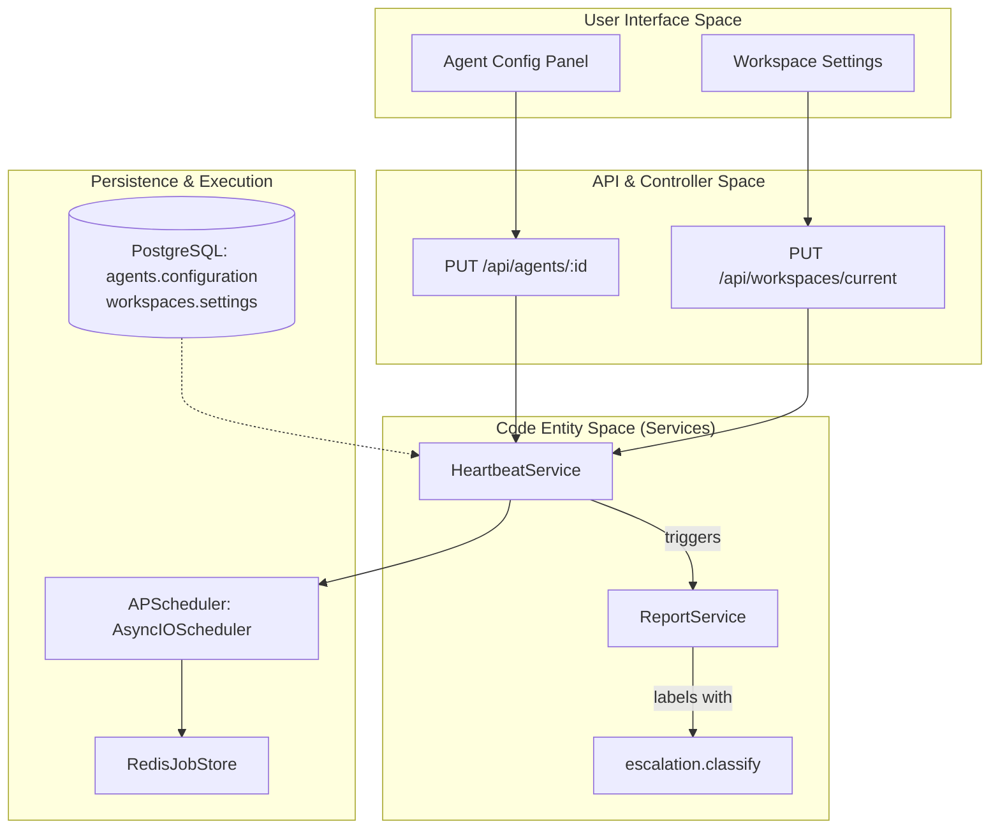

# Configuration & Scheduling

Relevant source files

The following files were used as context for generating this wiki page:

- [orchestrator/alembic/versions/wave3_escalation_level.py](orchestrator/alembic/versions/wave3_escalation_level.py)
- [orchestrator/core/services/escalation.py](orchestrator/core/services/escalation.py)
- [orchestrator/modules/tools/discovery/actions_reports.py](orchestrator/modules/tools/discovery/actions_reports.py)
- [orchestrator/modules/tools/discovery/actions_workspace.py](orchestrator/modules/tools/discovery/actions_workspace.py)
- [orchestrator/modules/tools/discovery/handlers_reports.py](orchestrator/modules/tools/discovery/handlers_reports.py)
- [orchestrator/modules/tools/discovery/handlers_workspace.py](orchestrator/modules/tools/discovery/handlers_workspace.py)
- [orchestrator/services/heartbeat_service.py](orchestrator/services/heartbeat_service.py)
- [orchestrator/services/report_service.py](orchestrator/services/report_service.py)

This page documents how heartbeat and scheduling configurations are stored, validated, and managed in the Automatos system. It covers configuration schemas for agents and workspaces, integration with `APScheduler`, timezone handling, and the lifecycle of schedule updates across proactive heartbeats and automated workflows.

---

## Configuration Storage Model

Automatos stores scheduling configurations across several entities to support both proactive monitoring and automated recipe execution.

### 1. Heartbeat Configuration
Heartbeat settings are persisted in two primary locations within the PostgreSQL database:
- **Agent heartbeats**: Stored in the `Agent.configuration` JSONB field under the `heartbeat` key [orchestrator/services/heartbeat_service.py:126-131]().
- **Orchestrator heartbeats**: Defined in the `Workspace.settings` JSONB field under `orchestrator.heartbeat` [orchestrator/services/heartbeat_service.py:117-121]().

#### Heartbeat Configuration Schema
The system uses the following schema for validating and storing heartbeat parameters:

| Field | Type | Default | Description |
|-------|------|---------|-------------|
| `enabled` | boolean | `false` | Activates the scheduled task [orchestrator/services/heartbeat_service.py:120](). |
| `interval_minutes` | integer | `30` | Frequency in minutes for the tick [orchestrator/services/heartbeat_service.py:178](). |
| `active_hours_start` | string | `"08:00"`| Start of execution window. |
| `active_hours_end` | string | `"20:00"`| End of execution window. |
| `auto_act` | boolean | `false` | Whether the agent can take autonomous actions during a tick. |

### 2. Escalation & Reporting Config
Configurations now include "Wave 3" escalation levels (L0-L4) which dictate how heartbeat results are reported.
- **Escalation Levels**: `FYI` (0), `TASK` (1), `APPROVAL` (2), `URGENT` (3), `SECURITY` (4) [orchestrator/core/services/escalation.py:26-31]().
- **Report Types**: Heartbeat ticks often trigger the creation of reports via `ReportService` with types like `standup`, `research`, or `incident` [orchestrator/services/report_service.py:162]().

**Sources:** [orchestrator/services/heartbeat_service.py:114-131](), [orchestrator/core/services/escalation.py:26-31](), [orchestrator/services/report_service.py:156-172]()

---

## Scheduling Architecture

Automatos utilizes a unified scheduling approach powered by `APScheduler`. The system bridges persistent database state with an active in-memory or Redis-backed job store.

### Logic Flow: Natural Language to Code Entity

**Sources:** [orchestrator/services/heartbeat_service.py:24-34](), [orchestrator/services/report_service.py:149-154](), [orchestrator/core/services/escalation.py:72-113]()

---

## Implementation Details

### HeartbeatService Lifecycle
The `HeartbeatService` manages all periodic tasks. It supports both standalone execution (using `MemoryJobStore`) and production-grade scheduling with `RedisJobStore` [orchestrator/services/heartbeat_service.py:55-63]().

- **Initialization**: On `start()`, it purges stale jobs (prefixed with `agent_hb_` or `orch_hb_`) to ensure disabled agents do not continue running after a system restart [orchestrator/services/heartbeat_service.py:108-111]().
- **Daily Summary**: Schedules a system-wide `_daily_summary_tick` at 01:00 UTC daily [orchestrator/services/heartbeat_service.py:73-83]().

### Interval to Cron Conversion
The system ensures heartbeats fire at predictable, aligned times by converting minute intervals into `CronTrigger` objects [orchestrator/services/heartbeat_service.py:139-172]().

| Interval (min) | Resulting Cron Expression | Logic |
|----------------|---------------------------|-------|
| < 60 | `0,15,30,45 * * * *` | Distributes evenly within the hour [orchestrator/services/heartbeat_service.py:155-159]() |
| 60 | `0 * * * *` | Fires at the top of every hour [orchestrator/services/heartbeat_service.py:170]() |
| 1440 | `0 9 * * *` | Daily at 9:00 AM [orchestrator/services/heartbeat_service.py:163-165]() |
| 10080 | `0 9 * * 1` | Weekly on Monday at 9:00 AM [orchestrator/services/heartbeat_service.py:160-162]() |

### Concurrency & Rate Limiting
The service enforces strict execution limits to prevent resource exhaustion:
- **Workspace Limit**: Maximum 5 concurrent heartbeat ticks per workspace [orchestrator/services/heartbeat_service.py:37]().
- **Agent Limit**: Maximum 1 concurrent heartbeat per agent [orchestrator/services/heartbeat_service.py:29]().

**Sources:** [orchestrator/services/heartbeat_service.py:43-83](), [orchestrator/services/heartbeat_service.py:139-172]()

---

## Escalation and Reporting Integration

When a heartbeat completes, it typically invokes the `ReportService` to persist findings.

### Report Submission Flow
Agents use the `platform_submit_report` action to save structured data [orchestrator/modules/tools/discovery/actions_reports.py:9-110]().
1. **Classification**: The `escalation.classify` function analyzes the report status and priority to assign an `EscalationLevel` [orchestrator/core/services/escalation.py:72-113]().
2. **Storage**: `ReportService.create_report` writes a markdown file to the workspace filesystem and inserts a metadata row in `agent_reports` [orchestrator/services/report_service.py:156-210]().
3. **Metrics Rollup**: The service aggregates LLM usage and costs associated with the heartbeat execution context to include in the report [orchestrator/services/report_service.py:39-69]().

### Wave 3 Escalation Ladder
The system uses an additive 5-level ladder to triage heartbeat events:
- **L0 FYI**: Informational, no action expected.
- **L2 APPROVAL**: Needs human intervention before proceeding.
- **L3 URGENT**: Immediate attention required (e.g., critical errors) [orchestrator/core/services/escalation.py:5-18]().

**Sources:** [orchestrator/services/report_service.py:39-146](), [orchestrator/modules/tools/discovery/actions_reports.py:9-110](), [orchestrator/core/services/escalation.py:5-31]()

---

## Timezone & Active Hours Handling

### Active Hours Guard
Heartbeats are subject to active hour constraints to prevent autonomous actions during "Quiet Hours". The `HeartbeatService` is designed to be timezone-aware [orchestrator/services/heartbeat_service.py:30]().

### Persistence and Migrations
The `escalation_level` field was added to `board_tasks`, `agent_reports`, and `orchestration_runs` to allow the system to query across all operating surfaces using a single severity abstraction [orchestrator/alembic/versions/wave3_escalation_level.py:19-24]().

**Sources:** [orchestrator/services/heartbeat_service.py:30-31](), [orchestrator/alembic/versions/wave3_escalation_level.py:19-39]()

---