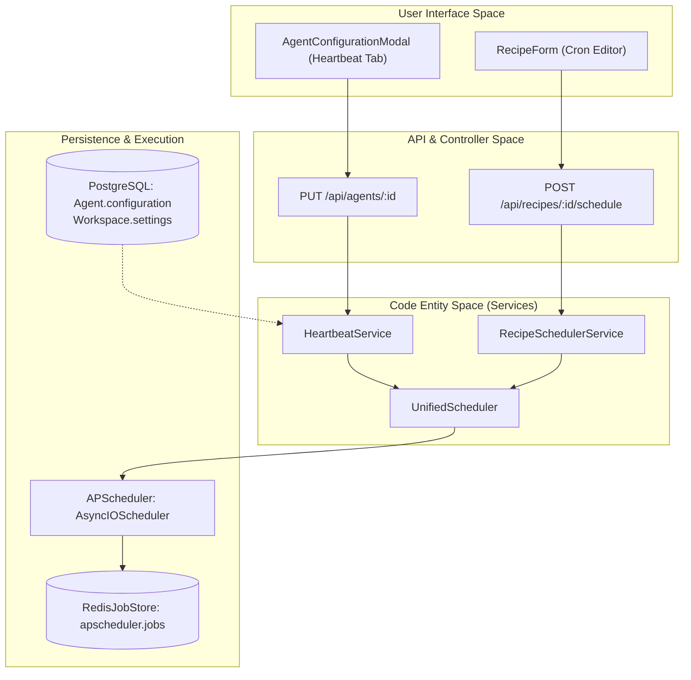
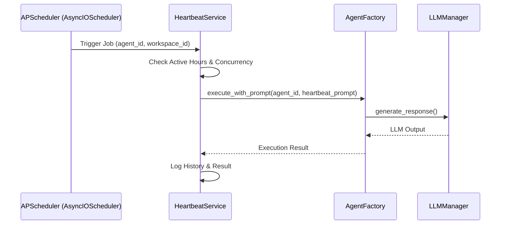

# Configuration & Scheduling

<details>
<summary>Relevant source files</summary>

The following files were used as context for generating this wiki page:

- [docs/PRDS/69-AGENT-INTELLIGENCE-LAYER.md](docs/PRDS/69-AGENT-INTELLIGENCE-LAYER.md)
- [docs/PRDS/70-SECURITY-HARDENING-PENTEST-REMEDIATION.md](docs/PRDS/70-SECURITY-HARDENING-PENTEST-REMEDIATION.md)
- [frontend/components/agents/agent-configuration-modal.tsx](frontend/components/agents/agent-configuration-modal.tsx)
- [frontend/components/agents/agent-configuration.tsx](frontend/components/agents/agent-configuration.tsx)
- [frontend/components/agents/agent-details-modal.tsx](frontend/components/agents/agent-details-modal.tsx)
- [frontend/components/agents/agent-management.tsx](frontend/components/agents/agent-management.tsx)
- [frontend/components/agents/agent-performance.tsx](frontend/components/agents/agent-performance.tsx)
- [frontend/components/agents/agent-roster.tsx](frontend/components/agents/agent-roster.tsx)
- [frontend/components/agents/agent-skills.tsx](frontend/components/agents/agent-skills.tsx)
- [frontend/components/agents/agent-status-control-modal.tsx](frontend/components/agents/agent-status-control-modal.tsx)
- [frontend/components/agents/create-agent-modal.tsx](frontend/components/agents/create-agent-modal.tsx)
- [frontend/components/agents/create-skill-modal.tsx](frontend/components/agents/create-skill-modal.tsx)
- [frontend/components/agents/skill-configuration-modal.tsx](frontend/components/agents/skill-configuration-modal.tsx)
- [frontend/components/documents/analytics-tab.tsx](frontend/components/documents/analytics-tab.tsx)
- [frontend/components/documents/processing-tab.tsx](frontend/components/documents/processing-tab.tsx)
- [frontend/hooks/use-agent-api.ts](frontend/hooks/use-agent-api.ts)
- [frontend/hooks/use-document-api.ts](frontend/hooks/use-document-api.ts)
- [orchestrator/api/agents.py](orchestrator/api/agents.py)
- [orchestrator/core/models/__init__.py](orchestrator/core/models/__init__.py)
- [orchestrator/core/models/core.py](orchestrator/core/models/core.py)
- [orchestrator/services/heartbeat_service.py](orchestrator/services/heartbeat_service.py)
- [orchestrator/services/scheduler.py](orchestrator/services/scheduler.py)
- [orchestrator/tests/test_recipe_scheduler.py](orchestrator/tests/test_recipe_scheduler.py)
- [orchestrator/tests/test_unified_scheduler.py](orchestrator/tests/test_unified_scheduler.py)

</details>


This page documents how heartbeat and recipe configurations are stored, validated, and scheduled in the Automatos AI system. It covers configuration schemas for agents and workspaces, the integration with `APScheduler`, timezone handling, and the lifecycle of schedule updates across both proactive heartbeats and automated workflows.

---

## Configuration Storage Model

Automatos stores scheduling configurations across several entities to support both proactive monitoring and automated recipe execution.

### 1. Heartbeat Configuration
Heartbeat settings are persisted in two primary locations within the PostgreSQL database:
- **Agent heartbeats**: Stored in the `Agent.configuration` JSONB field under the `heartbeat` key [orchestrator/services/heartbeat_service.py:116-117]().
- **Orchestrator heartbeats**: Stored in the `Workspace.settings` JSONB field under `orchestrator.heartbeat` [orchestrator/services/heartbeat_service.py:107-109]().

#### Heartbeat Configuration Schema
The system uses a unified configuration structure for periodic tasks, managed in the frontend via the `AgentConfigurationModal` [frontend/components/agents/agent-configuration-modal.tsx:156-167]().

| Field | Type | Default | Description |
|-------|------|---------|-------------|
| `enabled` | boolean | `false` | Activates the scheduled task [orchestrator/services/heartbeat_service.py:110](). |
| `interval_minutes` | integer | `60` | Frequency of execution in minutes [frontend/components/agents/agent-configuration-modal.tsx:158](). |
| `inherit_active_hours`| boolean | `true` | If true, uses workspace-level active hours [frontend/components/agents/agent-configuration-modal.tsx:159](). |
| `active_hours_start` | string | `"08:00"`| Start of execution window (HH:MM) [frontend/components/agents/agent-configuration-modal.tsx:160](). |
| `active_hours_end` | string | `"20:00"`| End of execution window (HH:MM) [frontend/components/agents/agent-configuration-modal.tsx:161](). |
| `auto_act` | boolean | `false` | Whether the agent can take autonomous actions during heartbeat [frontend/components/agents/agent-configuration-modal.tsx:163](). |

### 2. Recipe Scheduling Configuration
Recipes (Workflows) use a `schedule_config` field within the `WorkflowTemplate` model. The `RecipeSchedulerService` manages these triggers [orchestrator/services/recipe_scheduler.py:76-85]().

#### Recipe Schedule Schema
- **Type**: Currently supports `cron` [orchestrator/services/recipe_scheduler.py:90]().
- **Expression**: Standard 5-part crontab string (e.g., `0 9 * * 1-5`) [orchestrator/services/recipe_scheduler.py:92-95]().
- **Workspace Isolation**: Schedules are strictly scoped to the `workspace_id` to ensure multi-tenant data safety [orchestrator/services/recipe_scheduler.py:131]().

**Sources:** [orchestrator/services/heartbeat_service.py:96-124](), [orchestrator/services/recipe_scheduler.py:76-96](), [frontend/components/agents/agent-configuration-modal.tsx:156-167]()

---

## Scheduling Architecture

Automatos utilizes a unified scheduling approach powered by `APScheduler`. The system bridges persistent database state with an active in-memory or Redis-backed scheduler.

### Logic Flow: Natural Language to Code Entity



**Sources:** [orchestrator/services/scheduler.py:23-55](), [orchestrator/services/heartbeat_service.py:43-68](), [orchestrator/services/recipe_scheduler.py:108-135](), [frontend/components/agents/agent-configuration-modal.tsx:112-113]()

---

## Scheduler Implementation Details

### UnifiedScheduler Singleton
The `UnifiedScheduler` class acts as a central manager for the `AsyncIOScheduler` instance [orchestrator/services/scheduler.py:23-24](). It ensures that only one scheduler runs across the application, preventing duplicate job execution in multi-worker environments.

- **Locking**: Uses `fcntl` file locking to ensure one worker holds the scheduler instance [orchestrator/services/scheduler.py:9]().
- **Job Store**: Supports `MemoryJobStore` for development and `RedisJobStore` for production persistence [orchestrator/services/scheduler.py:39-47]().

### Heartbeat Interval to Cron Conversion
To maintain precision, the `HeartbeatService` converts minute-based intervals into `CronTrigger` objects [orchestrator/services/heartbeat_service.py:129-130]().

| Interval (min) | Resulting Cron Expression | Logic |
|----------------|---------------------------|-------|
| 15 | `0,15,30,45 * * * *` | Distributes evenly within the hour [orchestrator/services/heartbeat_service.py:147-149](). |
| 60 | `0 * * * *` | Fires at the top of every hour [orchestrator/services/heartbeat_service.py:160](). |
| 1440 | `0 9 * * *` | Daily at 9:00 AM [orchestrator/services/heartbeat_service.py:153-155](). |
| 10080 | `0 9 * * 1` | Weekly on Monday at 9:00 AM [orchestrator/services/heartbeat_service.py:150-152](). |

### Recipe Cron Handling
The `RecipeSchedulerService` validates cron expressions using a `CronTrigger` [orchestrator/services/recipe_scheduler.py:119-122]().

```python
# Internal scheduling logic in RecipeSchedulerService
def schedule_recipe(self, recipe):
    job_id = f"recipe_cron_{recipe.id}"
    expr = recipe.schedule_config.get("cron_expression")
    trigger = CronTrigger.from_crontab(expr)
    
    self._scheduler.add_job(
        self._fire_recipe,
        trigger,
        id=job_id,
        args=[recipe.id, str(recipe.workspace_id)],
        replace_existing=True
    )
```

**Sources:** [orchestrator/services/scheduler.py:23-61](), [orchestrator/services/heartbeat_service.py:129-161](), [orchestrator/services/recipe_scheduler.py:108-135]()

---

## Timezone & Active Hours Handling

### Active Hours Guard
Heartbeats include an "Active Hours" check to avoid disturbing users or consuming LLM tokens during off-hours. This is enforced within the `HeartbeatService` [orchestrator/services/heartbeat_service.py:29-30]().

- **Rate Limiting**: The service enforces a maximum of 1 concurrent heartbeat per agent and 5 per workspace [orchestrator/services/heartbeat_service.py:29]().
- **Daily Summary**: A system-wide daily summary is scheduled at 01:00 UTC regardless of individual agent settings [orchestrator/services/heartbeat_service.py:73-82]().

### Cron Timezones
Recipe cron jobs are scheduled using the `apscheduler.triggers.cron.CronTrigger`. By default, these operate in the system timezone (UTC) [orchestrator/services/recipe_scheduler.py:39]().

---

## Lifecycle & Synchronization

### Startup Synchronization
On system startup (via the `lifespan` manager), the `UnifiedScheduler` is initialized, and individual services load their configurations from the database [orchestrator/services/heartbeat_service.py:43-52]().

1. **Load Workspaces**: `HeartbeatService` iterates through all workspaces to schedule orchestrator heartbeats [orchestrator/services/heartbeat_service.py:105-111]().
2. **Load Agents**: Iterates through all agents to schedule agent-specific heartbeats [orchestrator/services/heartbeat_service.py:114-121]().
3. **Load Recipes**: `RecipeSchedulerService` loads all `WorkflowTemplate` entries with active cron configurations [orchestrator/services/recipe_scheduler.py:81-85]().

### Runtime Updates
When a configuration is updated via the API, the corresponding service reschedules the job:
- **Rescheduling**: The service calls `remove_job` followed by `add_job` (or uses `replace_existing=True`) to update the trigger [orchestrator/services/heartbeat_service.py:170-182]().
- **Deletion**: When an agent or recipe is deleted, the `unschedule_recipe` or equivalent method removes the job from the `APScheduler` instance [orchestrator/services/recipe_scheduler.py:137-142]().

### Data Flow: Schedule to Execution



**Sources:** [orchestrator/services/heartbeat_service.py:43-83](), [orchestrator/services/scheduler.py:33-55](), [orchestrator/modules/agents/factory/agent_factory.py:197-210]()

---

## Configuration API Reference

### Heartbeat Config Endpoints
- **GET** `/api/heartbeat/config`: Returns current scheduling status and last results for the workspace.
- **POST** `/api/heartbeat/run-now`: Manually triggers a heartbeat tick for an agent or orchestrator.

### Agent Configuration Endpoints
- **GET** `/api/agents/{id}/configuration`: Retrieves the full configuration JSON for a specific agent [frontend/hooks/use-agent-api.ts:42]().
- **PUT** `/api/agents/{id}`: Updates agent configuration, including heartbeat settings [frontend/hooks/use-agent-api.ts:28]().

### Recipe Scheduling Endpoints
- **POST** `/api/recipes/{id}/schedule`: Updates the `schedule_config` for a recipe and synchronizes the scheduler.
- **DELETE** `/api/recipes/{id}/schedule`: Removes the schedule and stops the associated background job.

**Sources:** [orchestrator/services/heartbeat_service.py:163-200](), [orchestrator/services/recipe_scheduler.py:108-142](), [frontend/hooks/use-agent-api.ts:21-59]()

---