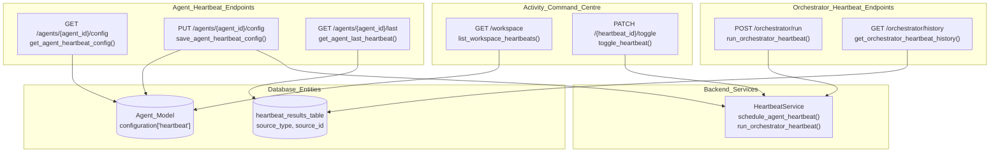
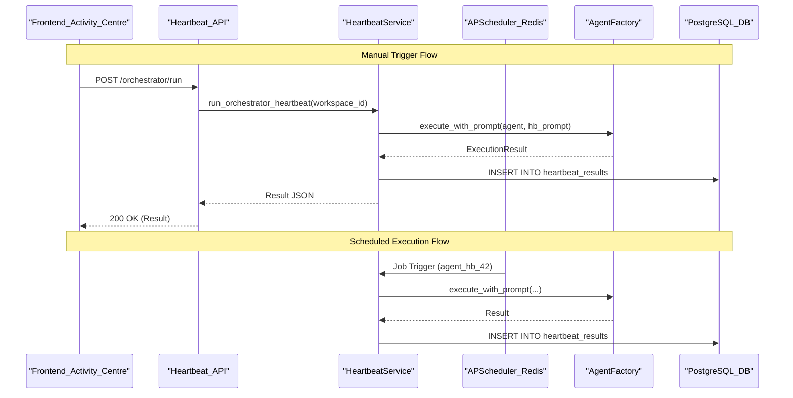

# Heartbeat API Reference

<details>
<summary>Relevant source files</summary>

The following files were used as context for generating this wiki page:

- [docs/PRDS/55-AUTONOMOUS-ASSISTANT-PLATFORM.md](docs/PRDS/55-AUTONOMOUS-ASSISTANT-PLATFORM.md)
- [orchestrator/alembic/versions/20260215_add_heartbeat_and_channels.py](orchestrator/alembic/versions/20260215_add_heartbeat_and_channels.py)
- [orchestrator/api/channels.py](orchestrator/api/channels.py)
- [orchestrator/api/heartbeat.py](orchestrator/api/heartbeat.py)
- [orchestrator/channels/base.py](orchestrator/channels/base.py)
- [orchestrator/channels/manager.py](orchestrator/channels/manager.py)
- [orchestrator/channels/telegram_adapter.py](orchestrator/channels/telegram_adapter.py)
- [orchestrator/core/models/channels.py](orchestrator/core/models/channels.py)

</details>


This document provides a complete reference for the Heartbeat API endpoints, which manage proactive agent and orchestrator monitoring. The heartbeat system enables scheduled background checks where agents and the orchestrator can autonomously monitor their domains, identify issues, and optionally take corrective actions.

For conceptual information about the heartbeat architecture and configuration, see [Heartbeat Architecture](#11.1). For the backend service implementation, see [Orchestrator Heartbeat](#11.2) and [Agent Heartbeat](#11.3).

---

## Overview

The Heartbeat API provides endpoints for:

- **Configuration Management**: Create, read, and update heartbeat schedules for agents and the orchestrator [orchestrator/api/heartbeat.py:58-127]().
- **Manual Execution**: Trigger immediate heartbeat ticks for testing or on-demand checks [orchestrator/api/heartbeat.py:165-178]().
- **History & Analytics**: Query past heartbeat results and aggregate statistics [orchestrator/api/heartbeat.py:180-210]().
- **Workspace Management**: List and toggle all heartbeats across a workspace (Activity Command Centre) [orchestrator/api/heartbeat.py:349-484]().

All endpoints require authentication via the hybrid auth system (Clerk JWT or API key) and are workspace-scoped [orchestrator/api/heartbeat.py:21, 61]().

**Base Path**: `/api/heartbeat`

**Router Definition**: [orchestrator/api/heartbeat.py:26]()

Sources: [orchestrator/api/heartbeat.py:1-27](), [docs/PRDS/55-AUTONOMOUS-ASSISTANT-PLATFORM.md:130-152]()

---

## API Endpoint Map

The following diagram maps the API routes to their underlying data entities and backend services.

### API to Code Entity Map

Sources: [orchestrator/api/heartbeat.py:58-484](), [orchestrator/alembic/versions/20260215_add_heartbeat_and_channels.py:21-37]()

---

## Agent Heartbeat Configuration

### Get Agent Heartbeat Config

**Endpoint**: `GET /api/heartbeat/agents/{agent_id}/config` [orchestrator/api/heartbeat.py:58]()

**Description**: Retrieves the current heartbeat configuration for a specific agent from the `configuration` JSONB field [orchestrator/api/heartbeat.py:64-73]().

**Path Parameters**:
| Parameter | Type | Description |
|-----------|------|-------------|
| `agent_id` | `integer` | The agent's numeric ID |

**Response Schema**:
```json
{
  "enabled": false,
  "interval_minutes": 60,
  "inherit_active_hours": true,
  "active_hours_start": "08:00",
  "active_hours_end": "20:00",
  "prompt": "",
  "auto_act": false,
  "report_to": "orchestrator",
  "webhook_url": null,
  "channel_id": null
}
```

**Storage Location**: `agents.configuration['heartbeat']` [orchestrator/api/heartbeat.py:73]()

Sources: [orchestrator/api/heartbeat.py:58-86]()

---

### Save Agent Heartbeat Config

**Endpoint**: `PUT /api/heartbeat/agents/{agent_id}/config` [orchestrator/api/heartbeat.py:88]()

**Description**: Updates the heartbeat configuration for an agent and reschedules the APScheduler job if enabled [orchestrator/api/heartbeat.py:95, 113-125]().

**Request Body Schema** (`HeartbeatConfigPayload`): [orchestrator/api/heartbeat.py:31-42]()
- `interval_minutes`: ge=5, le=1440 [orchestrator/api/heartbeat.py:33]().
- `report_to`: `orchestrator`, `direct`, `channel:<id>`, or `webhook` [orchestrator/api/heartbeat.py:39]().

**Side Effects**:
1. Updates `agents.configuration` in DB [orchestrator/api/heartbeat.py:107-111]().
2. Calls `service.schedule_agent_heartbeat()` if `enabled` is true [orchestrator/api/heartbeat.py:118-120]().
3. Calls `service.unschedule_heartbeat()` if `enabled` is false [orchestrator/api/heartbeat.py:122]().

**Job ID Format**: `agent_hb_{agent_id}` [orchestrator/api/heartbeat.py:122]().

Sources: [orchestrator/api/heartbeat.py:31-42, 88-127]()

---

### Get Last Heartbeat Result

**Endpoint**: `GET /api/heartbeat/agents/{agent_id}/last` [orchestrator/api/heartbeat.py:129]()

**Description**: Retrieves the most recent execution record from the `heartbeat_results` table for a specific agent [orchestrator/api/heartbeat.py:135-147]().

**Response Fields**:
| Field | Type | Description |
|-------|------|-------------|
| `findings` | `jsonb` | List of checks performed [orchestrator/alembic/versions/20260215_add_heartbeat_and_channels.py:28]() |
| `actions_taken` | `jsonb` | Actions executed by the agent [orchestrator/alembic/versions/20260215_add_heartbeat_and_channels.py:29]() |
| `tokens_used` | `integer` | LLM usage [orchestrator/alembic/versions/20260215_add_heartbeat_and_channels.py:30]() |

Sources: [orchestrator/api/heartbeat.py:129-161](), [orchestrator/alembic/versions/20260215_add_heartbeat_and_channels.py:21-37]()

---

## Orchestrator Heartbeat

### Run Orchestrator Heartbeat

**Endpoint**: `POST /api/heartbeat/orchestrator/run` [orchestrator/api/heartbeat.py:165]()

**Description**: Triggers an immediate orchestrator heartbeat tick via `HeartbeatService.run_orchestrator_heartbeat()` [orchestrator/api/heartbeat.py:172-173]().

**Backend Flow**:
1. Service checks workspace settings for active hours.
2. Executes proactive check loop.
3. Writes result to `heartbeat_results` with `source_type='orchestrator'` [orchestrator/alembic/versions/20260215_add_heartbeat_and_channels.py:24]() and `source_id` as the workspace ID [orchestrator/alembic/versions/20260215_add_heartbeat_and_channels.py:25]().

Sources: [orchestrator/api/heartbeat.py:165-178](), [docs/PRDS/55-AUTONOMOUS-ASSISTANT-PLATFORM.md:106-114]()

---

## Activity Command Centre Endpoints

### List Workspace Heartbeats

**Endpoint**: `GET /api/heartbeat/workspace` [orchestrator/api/heartbeat.py:349]()

**Description**: Lists all agent heartbeat configurations and their current status for the Routine tab in the Activity Command Centre [orchestrator/api/heartbeat.py:350-360]().

**Data Aggregation**:
- Queries `agents` to extract heartbeat configurations [orchestrator/api/heartbeat.py:372-385]().
- Joins with the latest record from `heartbeat_results` to show last execution status [orchestrator/api/heartbeat.py:375-380]().

Sources: [orchestrator/api/heartbeat.py:349-427]()

---

### Toggle Heartbeat

**Endpoint**: `PATCH /api/heartbeat/{heartbeat_id}/toggle` [orchestrator/api/heartbeat.py:429]()

**Description**: Pauses or resumes a heartbeat schedule by flipping the `enabled` flag in the agent's configuration [orchestrator/api/heartbeat.py:448-460]().

**Implementation**:
1. Performs an immutable update on the `Agent.configuration` JSONB field [orchestrator/api/heartbeat.py:456-460]().
2. Synchronizes the scheduler by calling `schedule_agent_heartbeat` or `unschedule_heartbeat` [orchestrator/api/heartbeat.py:465-472]().

Sources: [orchestrator/api/heartbeat.py:429-484]()

---

## Data Flow & Architecture

The following diagram illustrates the lifecycle of a heartbeat request from the API through the background scheduler.

### Heartbeat Execution Sequence

Sources: [orchestrator/api/heartbeat.py:165-178](), [orchestrator/api/heartbeat.py:113-125](), [orchestrator/alembic/versions/20260215_add_heartbeat_and_channels.py:21-37]()

---

## Database Schema: heartbeat_results

Execution logs are persisted in the `heartbeat_results` table [orchestrator/alembic/versions/20260215_add_heartbeat_and_channels.py:21]().

| Column | Type | Description |
|--------|------|-------------|
| `id` | `Integer` | Primary Key [orchestrator/alembic/versions/20260215_add_heartbeat_and_channels.py:23]() |
| `source_type` | `String(20)` | 'agent' or 'orchestrator' [orchestrator/alembic/versions/20260215_add_heartbeat_and_channels.py:24]() |
| `source_id` | `String(255)` | agent_id or workspace_id [orchestrator/alembic/versions/20260215_add_heartbeat_and_channels.py:25]() |
| `workspace_id` | `UUID` | Workspace ownership [orchestrator/alembic/versions/20260215_add_heartbeat_and_channels.py:26]() |
| `status` | `String(20)` | 'success' or 'error' [orchestrator/alembic/versions/20260215_add_heartbeat_and_channels.py:27]() |
| `findings` | `JSONB` | Structured results of checks [orchestrator/alembic/versions/20260215_add_heartbeat_and_channels.py:28]() |
| `actions_taken` | `JSONB` | List of tools/actions executed [orchestrator/alembic/versions/20260215_add_heartbeat_and_channels.py:29]() |
| `tokens_used` | `Integer` | Token consumption count [orchestrator/alembic/versions/20260215_add_heartbeat_and_channels.py:30]() |
| `cost` | `Float` | Estimated USD cost [orchestrator/alembic/versions/20260215_add_heartbeat_and_channels.py:31]() |

Sources: [orchestrator/alembic/versions/20260215_add_heartbeat_and_channels.py:21-37]()

---