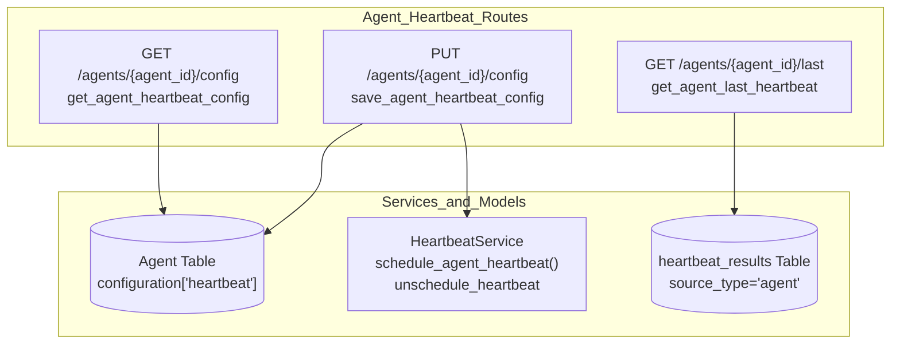
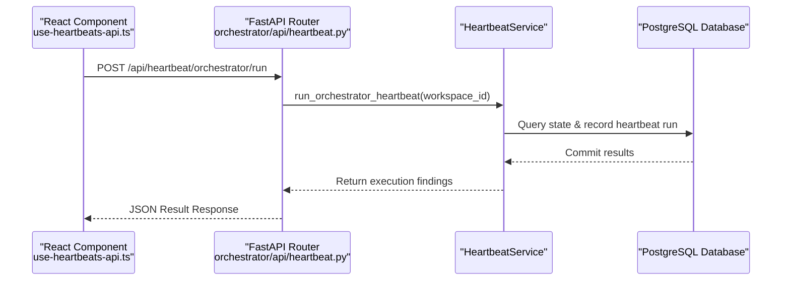

# Heartbeat API Reference

Relevant source files

The following files were used as context for generating this wiki page:

- [frontend/app/sign-in/[[...rest]]/page.tsx](frontend/app/sign-in/[[...rest]]/page.tsx)
- [frontend/app/sign-up/[[...rest]]/page.tsx](frontend/app/sign-up/[[...rest]]/page.tsx)
- [frontend/app/tools/callback/page.tsx](frontend/app/tools/callback/page.tsx)
- [frontend/components/__tests__/prd175-auth-edition.test.tsx](frontend/components/__tests__/prd175-auth-edition.test.tsx)
- [frontend/components/activity/board/board-card.tsx](frontend/components/activity/board/board-card.tsx)
- [frontend/components/activity/board/board-column.tsx](frontend/components/activity/board/board-column.tsx)
- [frontend/components/activity/board/board-task-viewer.tsx](frontend/components/activity/board/board-task-viewer.tsx)
- [frontend/components/activity/board/board-view.tsx](frontend/components/activity/board/board-view.tsx)
- [frontend/components/activity/board/index.ts](frontend/components/activity/board/index.ts)
- [frontend/components/auth/sign-up-form.tsx](frontend/components/auth/sign-up-form.tsx)
- [frontend/components/command-center/__tests__/calendar-actions.test.ts](frontend/components/command-center/__tests__/calendar-actions.test.ts)
- [frontend/components/command-center/__tests__/calendar-tab-feed.test.tsx](frontend/components/command-center/__tests__/calendar-tab-feed.test.tsx)
- [frontend/components/command-center/__tests__/calendar-tab-scope.test.tsx](frontend/components/command-center/__tests__/calendar-tab-scope.test.tsx)
- [frontend/components/command-center/board-tab.tsx](frontend/components/command-center/board-tab.tsx)
- [frontend/components/command-center/calendar-actions.ts](frontend/components/command-center/calendar-actions.ts)
- [frontend/components/local-auth-provider.tsx](frontend/components/local-auth-provider.tsx)
- [frontend/hooks/use-board-tasks.ts](frontend/hooks/use-board-tasks.ts)
- [frontend/hooks/use-heartbeats-api.ts](frontend/hooks/use-heartbeats-api.ts)
- [frontend/lib/auth-edition.ts](frontend/lib/auth-edition.ts)
- [frontend/types/board.ts](frontend/types/board.ts)
- [orchestrator/api/board_tasks.py](orchestrator/api/board_tasks.py)
- [orchestrator/api/heartbeat.py](orchestrator/api/heartbeat.py)
- [orchestrator/channels/discord_adapter.py](orchestrator/channels/discord_adapter.py)
- [orchestrator/channels/slack_adapter.py](orchestrator/channels/slack_adapter.py)
- [orchestrator/core/composio/entity_manager.py](orchestrator/core/composio/entity_manager.py)
- [orchestrator/services/orchestration_board_bridge.py](orchestrator/services/orchestration_board_bridge.py)
- [orchestrator/tests/test_prd175_auth_edition.py](orchestrator/tests/test_prd175_auth_edition.py)

This page documents the API endpoints, schemas, and client-side React Query integration for the Heartbeat subsystem (`/api/heartbeat`), which manages scheduled proactive checks for agents and the orchestrator.

For architectural details on how heartbeats are scheduled via APScheduler, see [Heartbeat Architecture]() (Section 11.1). For orchestrator and agent background execution loops, see [Orchestrator Heartbeat]() (Section 11.2) and [Agent Heartbeat]() (Section 11.3).

---

## 1. Overview & Authentication

The Heartbeat REST API exposes endpoints under the `/api/heartbeat` prefix [orchestrator/api/heartbeat.py:28-32](). Routes are secured via hybrid authentication (`get_request_context_hybrid`) and super-admin dependency gates (`require_super_admin`) to protect administrative heartbeat configurations and manual trigger actions [orchestrator/api/heartbeat.py:20-32]().

Sources: [orchestrator/api/heartbeat.py:20-32]()

---

## 2. Agent Heartbeat Configuration & Results

Agents maintain individual heartbeat configurations embedded within their `configuration` JSON column (`configuration['heartbeat']`) [orchestrator/api/heartbeat.py:73-91]().

### Endpoints
- **`GET /api/heartbeat/agents/{agent_id}/config`** (`get_agent_heartbeat_config`): Retrieves the active heartbeat configuration (enabled state, interval, active hours, prompt, auto-act flags, and reporting targets) for a specific agent after verifying workspace ownership [orchestrator/api/heartbeat.py:64-91]().
- **`PUT /api/heartbeat/agents/{agent_id}/config`** (`save_agent_heartbeat_config`): Validates against `HeartbeatConfigPayload`, updates `agent.configuration.heartbeat`, and calls `HeartbeatService.schedule_agent_heartbeat()` or `unschedule_heartbeat()` depending on the `enabled` boolean [orchestrator/api/heartbeat.py:37-48, 94-132]().
- **`GET /api/heartbeat/agents/{agent_id}/last`** (`get_agent_last_heartbeat`): Queries the `heartbeat_results` table for the most recent execution record where `source_type = 'agent'` and `source_id = :agent_id` [orchestrator/api/heartbeat.py:135-166]().

### API to Code Entity Map

Sources: [orchestrator/api/heartbeat.py:64-166](), [orchestrator/services/heartbeat_service.py:120-131]()

---

## 3. Orchestrator Heartbeat Endpoints

The orchestrator heartbeat manages system-wide checks and proactive orchestration sweeps.

### Endpoints
- **`POST /api/heartbeat/orchestrator/run`** (`run_orchestrator_heartbeat`): Manually triggers an immediate orchestrator heartbeat tick via `HeartbeatService.run_orchestrator_heartbeat()` [orchestrator/api/heartbeat.py:171-184]().
- **`GET /api/heartbeat/orchestrator/history`** (`get_orchestrator_heartbeat_history`): Retrieves a paginated list of recent orchestrator heartbeat results constrained by the `limit` query parameter [orchestrator/api/heartbeat.py:186-192]().

Sources: [orchestrator/api/heartbeat.py:171-192]()

---

## 4. Frontend Hooks & React Query Integration

The frontend interacts with the heartbeat API through typed React Query hooks defined in `frontend/hooks/use-heartbeats-api.ts`.

### Key Hooks
- **`useHeartbeats()`**: Fetches all heartbeat configurations for the current workspace from `/api/heartbeat/workspace` [frontend/hooks/use-heartbeats-api.ts:81-88]().
- **`useHeartbeatExecutions(heartbeatId)`**: Retrieves execution history for a specific agent heartbeat from `/api/heartbeat/{heartbeatId}/executions` [frontend/hooks/use-heartbeats-api.ts:94-107]().
- **`useToggleHeartbeat()`**: Issues a `PATCH` request to `/api/heartbeat/{heartbeatId}/toggle` to pause or resume routine schedules [frontend/hooks/use-heartbeats-api.ts:115-136]().
- **`useOrchestratorHeartbeatHistory(limit)`**: Fetches orchestrator history entries via `/api/heartbeat/orchestrator/history` [frontend/hooks/use-heartbeats-api.ts:161-171]().
- **`useRunOrchestratorHeartbeat()`**: Sends a `POST` request to `/api/heartbeat/orchestrator/run` to execute an on-demand orchestrator tick [frontend/hooks/use-heartbeats-api.ts:176-193]().

### Frontend-to-Backend Execution Flow

Sources: [frontend/hooks/use-heartbeats-api.ts:176-193](), [orchestrator/api/heartbeat.py:171-184]()

---