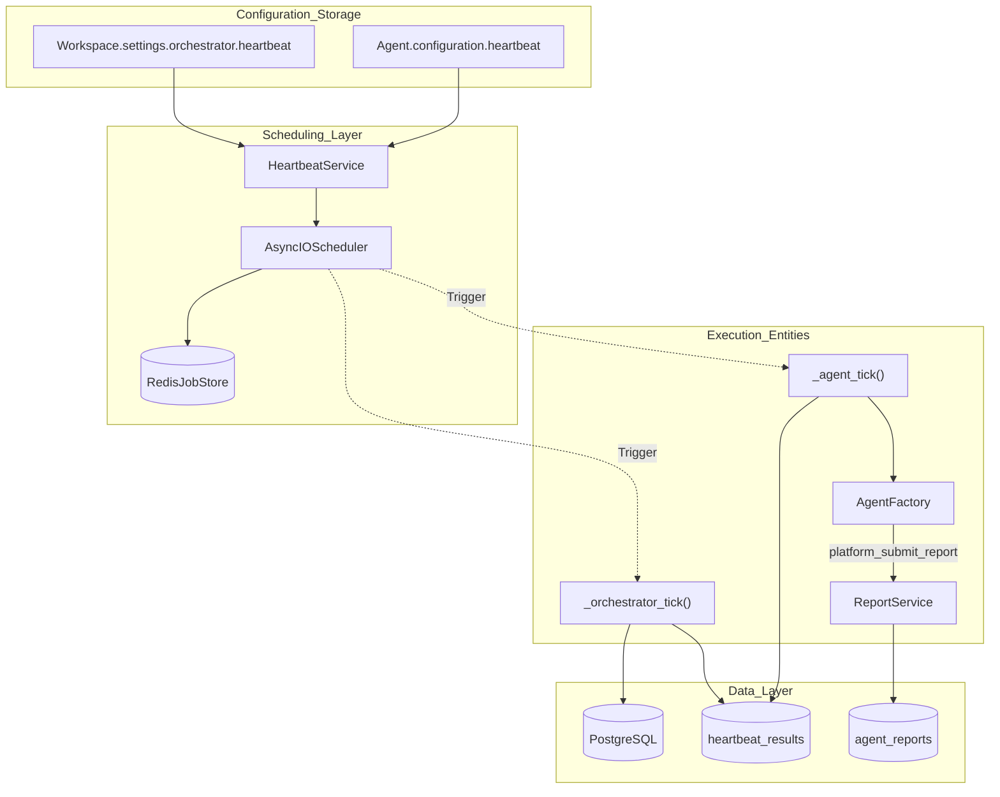
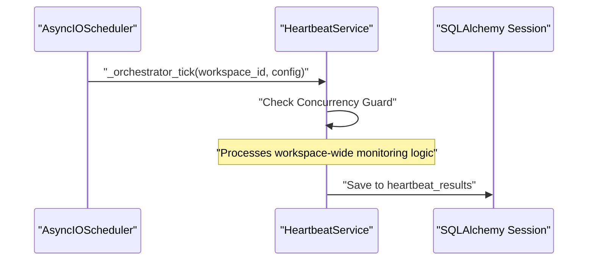

# Heartbeat Architecture

Relevant source files

The following files were used as context for generating this wiki page:

- [orchestrator/alembic/versions/wave3_escalation_level.py](orchestrator/alembic/versions/wave3_escalation_level.py)
- [orchestrator/core/services/escalation.py](orchestrator/core/services/escalation.py)
- [orchestrator/modules/tools/discovery/actions_reports.py](orchestrator/modules/tools/discovery/actions_reports.py)
- [orchestrator/modules/tools/discovery/actions_workspace.py](orchestrator/modules/tools/discovery/actions_workspace.py)
- [orchestrator/modules/tools/discovery/handlers_reports.py](orchestrator/modules/tools/discovery/handlers_reports.py)
- [orchestrator/modules/tools/discovery/handlers_workspace.py](orchestrator/modules/tools/discovery/handlers_workspace.py)
- [orchestrator/services/heartbeat_service.py](orchestrator/services/heartbeat_service.py)
- [orchestrator/services/report_service.py](orchestrator/services/report_service.py)

## Purpose and Scope

The Heartbeat Architecture provides **proactive assistant capabilities** that allow both workspace-level orchestrators and individual agents to run scheduled checks and take autonomous actions without user intervention [orchestrator/services/heartbeat_service.py:1-9](). This system transforms Automatos from a reactive platform into an always-on autonomous assistant.

This document covers the heartbeat scheduling system, the use of `APScheduler` with Redis for job persistence, configuration models, and the integration with the `AgentFactory` for autonomous execution.

---

## System Overview

The heartbeat system consists of two distinct types of proactive checks managed by the `HeartbeatService` [orchestrator/services/heartbeat_service.py:24-31]():

1.  **Orchestrator Heartbeat**: Workspace-level monitoring that checks agent health, reviews pending tasks, and summarizes daily activity.
2.  **Agent Heartbeat**: Per-agent proactive checks that scan for domain-specific issues (e.g., security vulnerabilities, unread emails, or task board updates).

### Architecture Diagram: Heartbeat System Components

**Sources:** [orchestrator/services/heartbeat_service.py:24-38](), [orchestrator/services/heartbeat_service.py:59-63](), [orchestrator/services/heartbeat_service.py:114-131](), [orchestrator/modules/tools/discovery/handlers_reports.py:64-80]()

---

## HeartbeatService Implementation

The `HeartbeatService` is a singleton that manages the lifecycle of the `AsyncIOScheduler`. It is responsible for loading configurations from the database and maintaining the job store [orchestrator/services/heartbeat_service.py:43-52]().

### Job Persistence with Redis
While the service supports a `MemoryJobStore` for testing, production environments utilize `RedisJobStore`. This ensures that if the orchestrator container restarts, scheduled heartbeats are not lost and resume according to their defined triggers [orchestrator/services/heartbeat_service.py:59-63]().

### Cron Trigger Conversion
The system converts user-friendly minute intervals into `CronTrigger` objects using `_interval_to_cron_trigger`. This ensures heartbeats fire at predictable intervals (e.g., exactly at the top of the hour) rather than drifting based on execution time [orchestrator/services/heartbeat_service.py:140-151]().

| Interval (min) | Cron Expression Logic | Code Implementation |
| :--- | :--- | :--- |
| < 60 | Distribute within the hour | `CronTrigger(minute=minute_field)` [orchestrator/services/heartbeat_service.py:155-159]() |
| 60 | Top of every hour | `CronTrigger(minute="0")` [orchestrator/services/heartbeat_service.py:170]() |
| 1440 (Daily) | Daily at 9:00 AM | `CronTrigger(minute="0", hour="9")` [orchestrator/services/heartbeat_service.py:163-165]() |
| 10080 (Weekly) | Monday at 9:00 AM | `CronTrigger(minute="0", hour="9", day_of_week="mon")` [orchestrator/services/heartbeat_service.py:160-162]() |

---

## Execution Pipelines

### Orchestrator Tick
The orchestrator tick monitors the workspace. It performs high-level checks across all agents and resources within a specific workspace context [orchestrator/services/heartbeat_service.py:173-190]().

**Natural Language to Code Entity: Orchestrator Heartbeat Flow**

**Sources:** [orchestrator/services/heartbeat_service.py:185-200](), [orchestrator/services/heartbeat_service.py:96-113]()

### Agent Heartbeat & Proactive Reporting
Agent heartbeats execute through the `AgentFactory`. This allows the heartbeat to leverage the agent's specific tools and persona. A critical outcome of a heartbeat is the submission of a status report via `platform_submit_report` [orchestrator/modules/tools/discovery/actions_reports.py:10-15]().

The `ReportService` handles the storage of these heartbeat artifacts, saving a markdown file to the workspace filesystem and an entry in the `agent_reports` table [orchestrator/services/report_service.py:156-173](). These reports are often tagged with an `escalation_level` (L0-L4) to triage findings [orchestrator/core/services/escalation.py:26-32]().

### Active Hours Guard
The `HeartbeatService` implements an **Active Hours Guard**. Before triggering a tick, the service validates the current time against the workspace's timezone-aware active hours. If the current time is outside the window, the heartbeat is skipped to prevent off-hours notifications or resource usage [orchestrator/services/heartbeat_service.py:30-31]().

---

## Configuration & Guardrails

### Configuration Storage
Heartbeat settings are stored as JSONB fields within the `Workspace` and `Agent` models.

*   **Workspace Level**: `Workspace.settings['orchestrator']['heartbeat']` [orchestrator/services/heartbeat_service.py:118-121]()
*   **Agent Level**: `Agent.configuration['heartbeat']` [orchestrator/services/heartbeat_service.py:126-131]()

### Concurrency Limits
To prevent resource exhaustion, the service enforces hard limits on concurrent executions:
*   **Per-Agent**: Max 1 concurrent tick tracked via `_running_ticks`. Subsequent triggers are dropped if the previous one is still running [orchestrator/services/heartbeat_service.py:28-29]().
*   **Per-Workspace**: Max 5 concurrent heartbeats across all agents in a workspace [orchestrator/services/heartbeat_service.py:37]().

---

## Daily Summary Job
In addition to user-defined heartbeats, the `HeartbeatService` schedules a system-level `daily_summary` job at **01:00 UTC** every day [orchestrator/services/heartbeat_service.py:73-83](). This job aggregates activity across the platform, providing a high-level overview of agent performance and workspace health.

**Sources:** [orchestrator/services/heartbeat_service.py:73-83]()

---