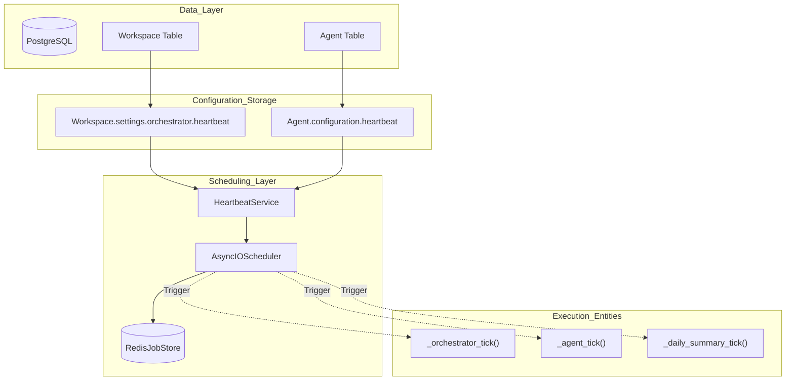
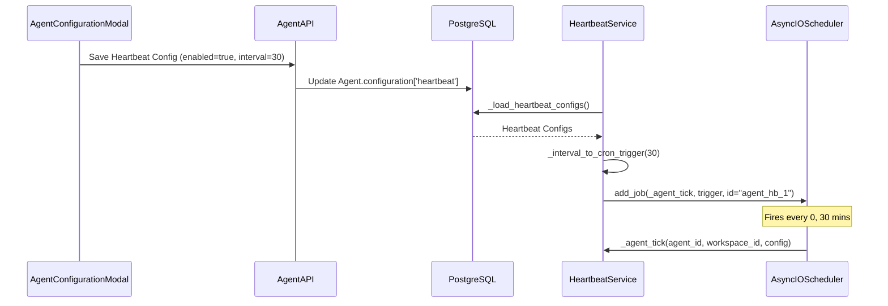

# Heartbeat Architecture

Relevant source files

The following files were used as context for generating this wiki page:

- [frontend/components/agents/agent-configuration-modal.tsx](frontend/components/agents/agent-configuration-modal.tsx)
- [frontend/components/agents/agent-configuration.tsx](frontend/components/agents/agent-configuration.tsx)
- [frontend/components/agents/agent-details-modal.tsx](frontend/components/agents/agent-details-modal.tsx)
- [frontend/components/agents/agent-management.tsx](frontend/components/agents/agent-management.tsx)
- [frontend/components/agents/agent-performance.tsx](frontend/components/agents/agent-performance.tsx)
- [frontend/components/agents/agent-roster.tsx](frontend/components/agents/agent-roster.tsx)
- [frontend/components/agents/agent-skills.tsx](frontend/components/agents/agent-skills.tsx)
- [frontend/components/agents/agent-status-control-modal.tsx](frontend/components/agents/agent-status-control-modal.tsx)
- [frontend/components/agents/create-agent-modal.tsx](frontend/components/agents/create-agent-modal.tsx)
- [frontend/components/agents/create-skill-modal.tsx](frontend/components/agents/create-skill-modal.tsx)
- [frontend/components/agents/skill-configuration-modal.tsx](frontend/components/agents/skill-configuration-modal.tsx)
- [frontend/components/documents/analytics-tab.tsx](frontend/components/documents/analytics-tab.tsx)
- [frontend/components/documents/processing-tab.tsx](frontend/components/documents/processing-tab.tsx)
- [frontend/hooks/use-agent-api.ts](frontend/hooks/use-agent-api.ts)
- [frontend/hooks/use-document-api.ts](frontend/hooks/use-document-api.ts)
- [orchestrator/api/agents.py](orchestrator/api/agents.py)
- [orchestrator/core/models/__init__.py](orchestrator/core/models/__init__.py)
- [orchestrator/core/models/core.py](orchestrator/core/models/core.py)
- [orchestrator/services/heartbeat_service.py](orchestrator/services/heartbeat_service.py)

## Purpose and Scope

The Heartbeat Architecture provides **proactive assistant capabilities** that allow both workspace-level orchestrators and individual agents to run scheduled checks and take autonomous actions without user intervention [orchestrator/services/heartbeat_service.py:1-9](). This system transforms Automatos AI from a reactive platform into an always-on autonomous assistant.

This document covers the heartbeat scheduling system, the use of `APScheduler` with Redis for job persistence, cron trigger conversion logic, and the integration with the `Agent` configuration models.

---

## System Overview

The heartbeat system consists of two distinct types of proactive checks managed by the `HeartbeatService` [orchestrator/services/heartbeat_service.py:24-31]():

1.  **Orchestrator Heartbeat**: Workspace-level monitoring that checks agent health, reviews pending tasks, and summarizes daily activity [orchestrator/services/heartbeat_service.py:104-111]().
2.  **Agent Heartbeat**: Per-agent proactive checks that scan for domain-specific issues (e.g., security vulnerabilities, task board updates) using the agent's specific configuration [orchestrator/services/heartbeat_service.py:113-121]().

**Architecture Diagram: Heartbeat System Components**

**Sources:** [orchestrator/services/heartbeat_service.py:24-38](), [orchestrator/services/heartbeat_service.py:59-63](), [orchestrator/services/heartbeat_service.py:96-123]()

---

## HeartbeatService Implementation

The `HeartbeatService` is a management layer for periodic ticks. It initializes the scheduler and loads all active heartbeat configurations from the database [orchestrator/services/heartbeat_service.py:43-49]().

### Job Persistence with Redis
While the service supports a `MemoryJobStore` for testing, production environments utilize `RedisJobStore` when `REDIS_URL` is provided in the application configuration. This ensures that if the orchestrator container restarts, scheduled heartbeats are not lost and resume according to their defined triggers [orchestrator/services/heartbeat_service.py:55-63]().

### Cron Trigger Conversion
The system converts user-friendly minute intervals into `CronTrigger` objects. This ensures heartbeats fire at predictable times rather than drifting based on execution latency [orchestrator/services/heartbeat_service.py:129-141]().

| Interval (min) | Cron Expression Logic | Code Implementation |
| :--- | :--- | :--- |
| < 60 | Distribute within the hour | `CronTrigger(minute=minute_field)` [orchestrator/services/heartbeat_service.py:145-149]() |
| 60 | Top of every hour | `CronTrigger(minute="0")` [orchestrator/services/heartbeat_service.py:160]() |
| 1440 (Daily) | Daily at 9:00 AM | `CronTrigger(minute="0", hour="9")` [orchestrator/services/heartbeat_service.py:153-155]() |
| 10080 (Weekly) | Monday at 9:00 AM | `CronTrigger(minute="0", hour="9", day_of_week="mon")` [orchestrator/services/heartbeat_service.py:150-152]() |

**Sources:** [orchestrator/services/heartbeat_service.py:129-162]()

---

## Execution and Guardrails

### Active Hours Guard
The system supports timezone-aware scheduling that respects active hours [orchestrator/services/heartbeat_service.py:30-31](). On the frontend, users can configure `active_hours_start` and `active_hours_end` (e.g., "08:00" to "20:00") to ensure agents only perform proactive tasks during business hours [frontend/components/agents/agent-configuration-modal.tsx:156-167]().

### Concurrency Limits
To prevent resource exhaustion, the service enforces hard limits on concurrent executions:
*   **Per-Agent**: Max 1 concurrent tick tracked via `_running_ticks` [orchestrator/services/heartbeat_service.py:29, 36]().
*   **Per-Workspace**: Max 5 concurrent heartbeats across all agents in a workspace [orchestrator/services/heartbeat_service.py:37]().

**Natural Language to Code Entity: Heartbeat Scheduling Flow**

**Sources:** [orchestrator/services/heartbeat_service.py:129-162](), [orchestrator/services/heartbeat_service.py:190-202](), [frontend/components/agents/agent-configuration-modal.tsx:155-167]()

---

## Frontend Configuration

Users manage heartbeat settings through the `AgentConfigurationModal`. The interface allows toggling proactive capabilities and defining the operational parameters for the agent's autonomous behavior [frontend/components/agents/agent-configuration-modal.tsx:155-167]().

Key UI parameters include:
*   **Interval**: How often the agent "wakes up" to check for tasks.
*   **Auto Act**: Whether the agent can execute tools autonomously or must only report findings [frontend/components/agents/agent-configuration-modal.tsx:163]().
*   **Report To**: Destination for heartbeat findings (Orchestrator, Webhook, or specific Channel) [frontend/components/agents/agent-configuration-modal.tsx:164-166]().

**Sources:** [frontend/components/agents/agent-configuration-modal.tsx:155-167]()

---

## Daily Summary Job
The `HeartbeatService` schedules a mandatory system-level `daily_summary` job at **01:00 UTC** every day [orchestrator/services/heartbeat_service.py:73-83](). This job aggregates activity across the platform, providing a high-level overview of workspace health and performance metrics.

**Sources:** [orchestrator/services/heartbeat_service.py:73-83]()

---