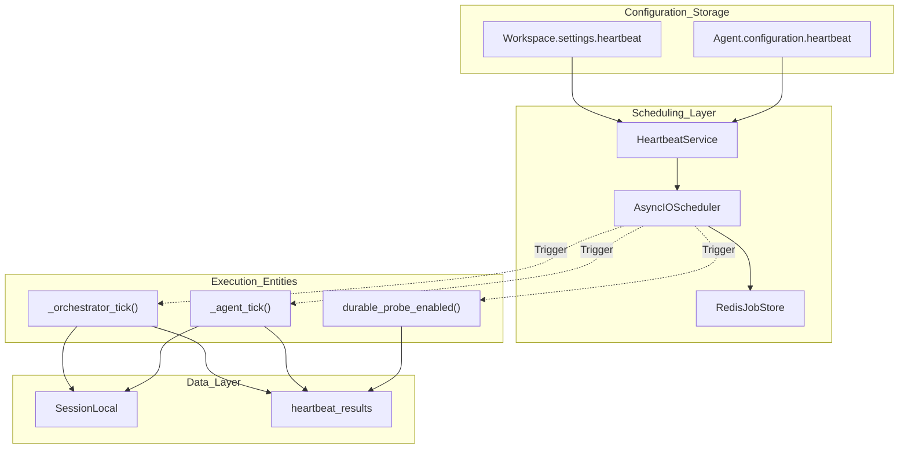
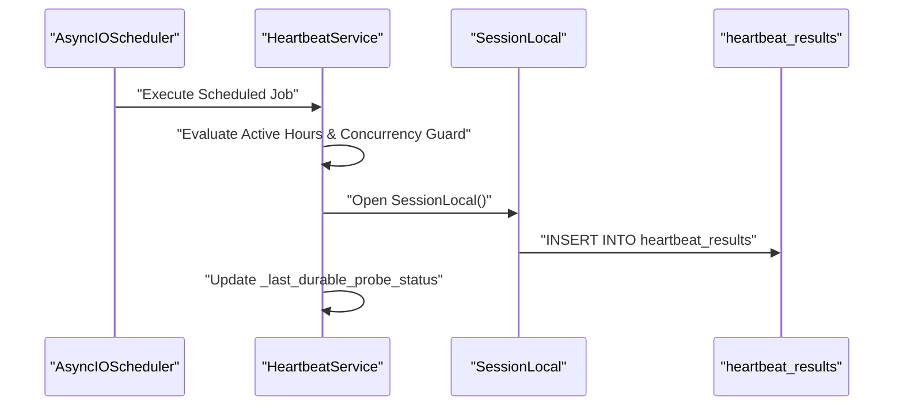

# Heartbeat Architecture

Relevant source files

The following files were used as context for generating this wiki page:

- [orchestrator/api/chat.py](orchestrator/api/chat.py)
- [orchestrator/api/routing.py](orchestrator/api/routing.py)
- [orchestrator/consumers/chatbot/auto.py](orchestrator/consumers/chatbot/auto.py)
- [orchestrator/consumers/chatbot/service.py](orchestrator/consumers/chatbot/service.py)
- [orchestrator/core/llm/manager.py](orchestrator/core/llm/manager.py)
- [orchestrator/core/routing/engine.py](orchestrator/core/routing/engine.py)
- [orchestrator/modules/agents/factory/agent_factory.py](orchestrator/modules/agents/factory/agent_factory.py)
- [orchestrator/modules/tools/discovery/platform_actions.py](orchestrator/modules/tools/discovery/platform_actions.py)
- [orchestrator/modules/tools/discovery/platform_executor.py](orchestrator/modules/tools/discovery/platform_executor.py)
- [orchestrator/scripts/setup_jira_trigger.py](orchestrator/scripts/setup_jira_trigger.py)
- [orchestrator/services/heartbeat_service.py](orchestrator/services/heartbeat_service.py)
- [orchestrator/services/page_context.py](orchestrator/services/page_context.py)
- [orchestrator/tests/test_prd221_page_context.py](orchestrator/tests/test_prd221_page_context.py)
- [orchestrator/tests/test_prd221_page_prior_tools.py](orchestrator/tests/test_prd221_page_prior_tools.py)

## Purpose and Scope

The Heartbeat Architecture provides **proactive assistant capabilities** that allow both workspace-level orchestrators and individual agents to run scheduled checks and take autonomous actions without user intervention [orchestrator/services/heartbeat_service.py:1-4](). This system transforms Automatos from a reactive platform into an always-on autonomous assistant capable of background monitoring, primitive health checks, and scheduled workflow execution.

This document covers the heartbeat scheduling system, the use of `APScheduler` with Redis for job persistence, cron trigger conversion, active hours guards, and primitive health probes.

Sources: [orchestrator/services/heartbeat_service.py:1-4]()

---

## System Overview

The heartbeat system consists of periodic ticks managed by the `HeartbeatService` [orchestrator/services/heartbeat_service.py:135-143](). It also serves as the primary health monitoring loop for system "primitives" (Chat, Memory, RAG, etc.), emitting status updates to the Command Centre [orchestrator/services/heartbeat_service.py:34-42]().

### Architecture Diagram: Heartbeat System Components

Sources: [orchestrator/services/heartbeat_service.py:135-143](), [orchestrator/services/heartbeat_service.py:164-182](), [orchestrator/services/heartbeat_service.py:24-27]()

---

## HeartbeatService & APScheduler Integration

The `HeartbeatService` manages the lifecycle of the `AsyncIOScheduler` instance [orchestrator/services/heartbeat_service.py:135-146](). 

### Job Persistence with Redis
While the service supports a `MemoryJobStore` for testing and standalone mode, production environments leverage `RedisJobStore` connected via `config.REDIS_URL` [orchestrator/services/heartbeat_service.py:169-180](). This ensures scheduled heartbeats survive container restarts and resume automatically.

### Cron Trigger Conversion
User-defined frequencies are parsed and converted into `CronTrigger` instances to ensure predictable execution windows:

| Interval / Schedule | Cron Logic | Code Implementation / Trigger Mapping |
| :--- | :--- | :--- |
| **Sub-hourly** | Every N minutes | `CronTrigger(minute=f"*/{interval}")` |
| **Hourly** | Top of every hour | `CronTrigger(minute=0)` |
| **Daily** | Daily at a specific hour | `CronTrigger(hour=9, minute=0)` |

Sources: [orchestrator/services/heartbeat_service.py:164-182](), [orchestrator/services/heartbeat_service.py:19-20]()

---

## Primitive Health Probes & Findings

The heartbeat mechanism continuously evaluates system health via `emit_primitive_finding` [orchestrator/services/heartbeat_service.py:62-80](). This records structured findings into the `heartbeat_results` table without breaking the broader execution loop if a probe fails.

### Tracked Primitives and Statuses
*   **Primitives (`PRIMITIVE_NAMES`)**: `chat`, `memory`, `rag`, `nl2sql`, `graph`, `missions`, `playbooks`, `channels` [orchestrator/services/heartbeat_service.py:44-53]().
*   **Statuses (`PRIMITIVE_STATUSES`)**: `green`, `degraded`, `down` [orchestrator/services/heartbeat_service.py:54]().

Each evaluation writes a `primitive_check` finding payload into the JSONB `findings` column of `heartbeat_results` [orchestrator/services/heartbeat_service.py:100-123]().

Sources: [orchestrator/services/heartbeat_service.py:44-132]()

---

## Execution Pipelines & Data Flow

### Orchestrator and Agent Tick Execution

**Natural Language to Code Entity: Heartbeat Execution Flow**

Sources: [orchestrator/services/heartbeat_service.py:135-152](), [orchestrator/services/heartbeat_service.py:95-125]()

### Active Hours Guard
Before triggering an agent or orchestrator tick, the service verifies whether the current local time falls within the workspace's configured active hours window, preventing off-hours notifications or resource spikes [orchestrator/services/heartbeat_service.py:140-142]().

Sources: [orchestrator/services/heartbeat_service.py:135-143]()

---

## Configuration & Guardrails

### Configuration Storage
Heartbeat parameters are serialized and stored as JSONB attributes within the `Workspace` settings and `Agent.configuration` models [orchestrator/services/heartbeat_service.py:240-265]().

### Concurrency and Rate Limiting
To protect against runaway loops and resource starvation, the service enforces strict limits:
*   **Per-Agent Concurrency**: Maximum 1 concurrent tick per individual agent, tracked via `self._running_ticks` [orchestrator/services/heartbeat_service.py:147]().
*   **Per-Workspace Concurrency**: Maximum 5 concurrent heartbeat executions across all sources within a single workspace [orchestrator/services/heartbeat_service.py:151]().

Sources: [orchestrator/services/heartbeat_service.py:135-152]()

---