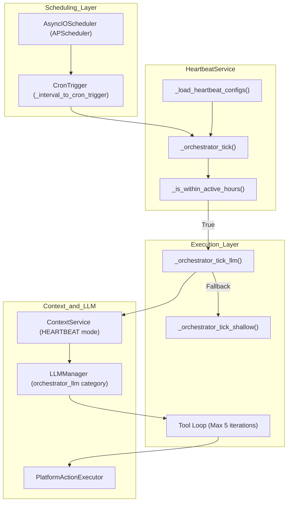
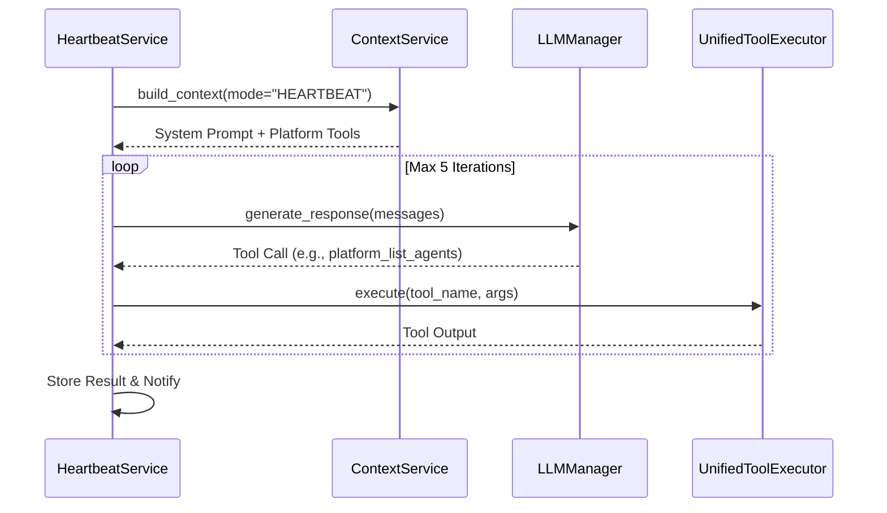

# Orchestrator Heartbeat

Relevant source files

The following files were used as context for generating this wiki page:

- [frontend/components/agents/agent-configuration-modal.tsx](frontend/components/agents/agent-configuration-modal.tsx)
- [frontend/components/agents/agent-configuration.tsx](frontend/components/agents/agent-configuration.tsx)
- [frontend/components/agents/agent-details-modal.tsx](frontend/components/agents/agent-details-modal.tsx)
- [frontend/components/agents/agent-management.tsx](frontend/components/agents/agent-management.tsx)
- [frontend/components/agents/agent-performance.tsx](frontend/components/agents/agent-performance.tsx)
- [frontend/components/agents/agent-roster.tsx](frontend/components/agents/agent-roster.tsx)
- [frontend/components/agents/agent-skills.tsx](frontend/components/agents/agent-skills.tsx)
- [frontend/components/agents/agent-status-control-modal.tsx](frontend/components/agents/agent-status-control-modal.tsx)
- [frontend/components/agents/create-agent-modal.tsx](frontend/components/agents/create-agent-modal.tsx)
- [frontend/components/agents/create-skill-modal.tsx](frontend/components/agents/create-skill-modal.tsx)
- [frontend/components/agents/skill-configuration-modal.tsx](frontend/components/agents/skill-configuration-modal.tsx)
- [frontend/components/documents/analytics-tab.tsx](frontend/components/documents/analytics-tab.tsx)
- [frontend/components/documents/processing-tab.tsx](frontend/components/documents/processing-tab.tsx)
- [frontend/hooks/use-agent-api.ts](frontend/hooks/use-agent-api.ts)
- [frontend/hooks/use-document-api.ts](frontend/hooks/use-document-api.ts)
- [orchestrator/api/agents.py](orchestrator/api/agents.py)
- [orchestrator/core/models/__init__.py](orchestrator/core/models/__init__.py)
- [orchestrator/core/models/core.py](orchestrator/core/models/core.py)
- [orchestrator/services/heartbeat_service.py](orchestrator/services/heartbeat_service.py)

The Orchestrator Heartbeat is an LLM-powered scheduled monitoring system that performs periodic workspace health checks, enabling proactive platform management and autonomous workspace maintenance. This document covers the workspace-level orchestrator heartbeat tick implementation. For agent-level heartbeat ticks that complete assigned tasks, see [Agent Heartbeat](11.3). For the shared scheduling infrastructure, see [Heartbeat Architecture](11.1).

## Purpose and Scope

The orchestrator heartbeat provides **workspace-wide health monitoring** through scheduled LLM-powered ticks that can:
- Analyze workspace state using platform action tools.
- Detect anomalies, errors, or optimization opportunities.
- Take corrective action based on proactive level settings.
- Generate health reports and deliver notifications.

Unlike agent heartbeats which focus on task completion, orchestrator heartbeats provide **platform-wide situational awareness** for workspace administrators.

Sources: [orchestrator/services/heartbeat_service.py:24-31](), [orchestrator/services/heartbeat_service.py:104-112]()

## System Architecture

### Orchestrator Heartbeat Components

The heartbeat system bridges the scheduling layer with the LLM execution layer, utilizing a specialized context mode to restrict the model's focus to platform management.

**Orchestrator Heartbeat Logic Flow**

**Key Code Entities:**

| Component | File Path | Role |
|-----------|-----------|------|
| `HeartbeatService` | [orchestrator/services/heartbeat_service.py:24-31]() | Singleton managing `AsyncIOScheduler` jobs and tick routing. |
| `_orchestrator_tick_llm` | [orchestrator/services/heartbeat_service.py:382-390]() | High-fidelity execution using LLM and platform tools. |
| `_orchestrator_tick_shallow` | [orchestrator/services/heartbeat_service.py:547-550]() | Low-fidelity fallback using direct DB queries (agent counts). |
| `LLMManager` | [orchestrator/core/llm/manager.py:27-41]() | Provides the model configured for the `orchestrator` service. |
| `UnifiedToolExecutor` | [orchestrator/modules/agents/factory/agent_factory.py:42-44]() | Routed via `get_unified_tool_executor` to handle tool calls. |

Sources: [orchestrator/services/heartbeat_service.py:24-545](), [orchestrator/core/llm/manager.py:30-41](), [orchestrator/modules/agents/factory/agent_factory.py:168-171]()

## Configuration Structure

Orchestrator heartbeat configuration is stored in the workspace settings JSONB field under `settings.orchestrator.heartbeat`. The UI for managing these settings is integrated into the `AgentConfigurationModal` and `AgentConfiguration` components.

### Proactive Levels
The `proactive_level` (often mapped to `auto_act` in the frontend) determines the tool permissions granted to the LLM during the tick:

| Level | Behavior | Tool Access |
|-------|----------|-------------|
| `silent` | Report findings only. | Read-only (`platform_list_*`) |
| `notify` | Report findings and send alerts. | Read-only (`platform_list_*`) |
| `act_notify` | Take corrective actions and notify. | Read + Write (`platform_create_*`, `platform_restart_*`) |
| `autonomous` | Full independence. | All (including destructive `platform_delete_*`) |

Sources: [orchestrator/services/heartbeat_service.py:107-111](), [orchestrator/services/heartbeat_service.py:399-410](), [frontend/components/agents/agent-configuration-modal.tsx:156-167]()

## Tick Execution Flow

### LLM-Powered Tick Pipeline
The heartbeat utilizes a standard agentic loop but is constrained to a **maximum of 5 iterations** to prevent runaway costs and infinite loops during background monitoring.

**Sequence: Heartbeat Tool Loop**

### Context Assembly for Heartbeat Mode
The `HEARTBEAT` mode in `ContextService` assembles a specialized prompt. It ignores user-specific memory (L3/L4) to maintain a stateless "system administrator" persona. It injects:
1. **Identity**: Defined as "Automatos Orchestrator".
2. **Platform Tools**: Tools defined in `PlatformActionExecutor`.
3. **Task Description**: Built from the `checklist` and `proactive_level` instructions.

Sources: [orchestrator/services/heartbeat_service.py:426-444](), [orchestrator/services/heartbeat_service.py:466-470]()

## Tool Loop and Deduplication

To prevent looping on the same health check, the heartbeat leverages logic similar to the `ToolExecutionTracker` found in the Chat Service, though strictly limited by the iteration counter.

**Context Trimming Logic:**
If the message history exceeds 10 messages during the 5-iteration loop, the system performs "Exchange Trimming":
- It preserves the first 2 messages (System Prompt and Initial Task).
- It identifies "Exchange Starts" (messages with `role: assistant`).
- It keeps only the last 2 complete assistant-tool exchanges.

This ensures the LLM does not exceed token limits while maintaining the immediate context of its recent actions.

Sources: [orchestrator/services/heartbeat_service.py:488-500]()

## Shallow Mode Fallback

When LLM providers are unavailable or credentials fail, the system executes `_orchestrator_tick_shallow`. This method:
1. Directly queries the `Agent` table for the `workspace_id`. [orchestrator/services/heartbeat_service.py:557-562]()
2. Counts active vs. inactive agents. [orchestrator/services/heartbeat_service.py:563-568]()
3. Parses the raw `checklist` string from the config and marks items as "Reviewed (Shallow Mode)". [orchestrator/services/heartbeat_service.py:575-585]()

This ensures that "Heartbeat Skipped" events are minimized, providing at least basic connectivity and status data.

Sources: [orchestrator/services/heartbeat_service.py:547-589]()

## Active Hours Guard

The heartbeat respects the workspace's active hours to avoid processing (and potentially notifying) during off-hours.

- **Timezone Awareness**: Uses `pytz` to localize the current time based on the `timezone` string in the config. [orchestrator/services/heartbeat_service.py:270-272]()
- **Window Comparison**: Converts "HH:MM" strings to total minutes from midnight for robust comparison, even for windows that cross the midnight boundary. [orchestrator/services/heartbeat_service.py:275-294]()

Sources: [orchestrator/services/heartbeat_service.py:227-240]()

## Result Storage and Reporting

Every tick results in a record in the `heartbeat_results` table (managed via `_store_heartbeat_result`).

| Field | Description |
|-------|-------------|
| `status` | `success`, `error`, or `skipped`. |
| `findings` | JSON array of observations (e.g., "Agent X is offline"). |
| `actions_taken` | JSON array of tool executions performed. |
| `tokens_used` | Total tokens consumed by the LLM tick. |

Sources: [orchestrator/services/heartbeat_service.py:607-620](), [orchestrator/services/heartbeat_service.py:630-644]()

## Security and Permissions

The heartbeat is restricted to `platform_*` tools. These tools are executed via the `PlatformActionExecutor` and routed through the `UnifiedToolExecutor`.

- **Registry Source**: Tools are registered within the `ActionRegistry` (referenced in [orchestrator/core/composio/tool_executor.py:185-191]()).
- **Validation**: Before execution, the `ComposioToolExecutor` validates the action against the agent's allowed features to ensure the heartbeat does not exceed its workspace boundaries. [orchestrator/core/composio/tool_executor.py:66-82]()

Sources: [orchestrator/core/composio/tool_executor.py:141-162](), [orchestrator/modules/agents/factory/agent_factory.py:42-44]()

---