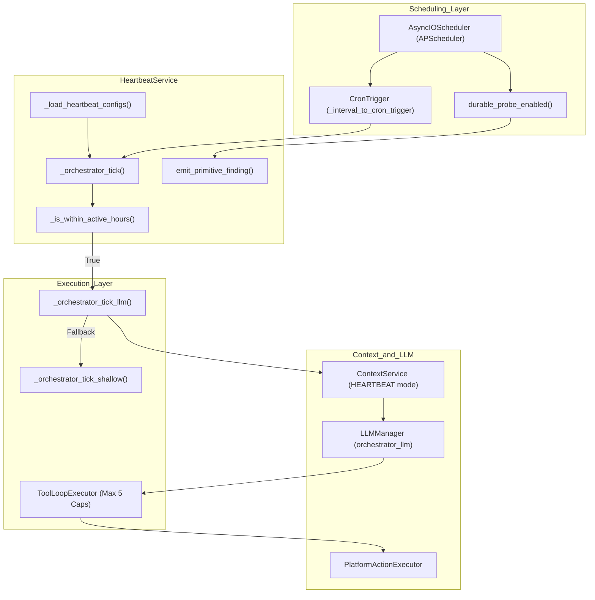
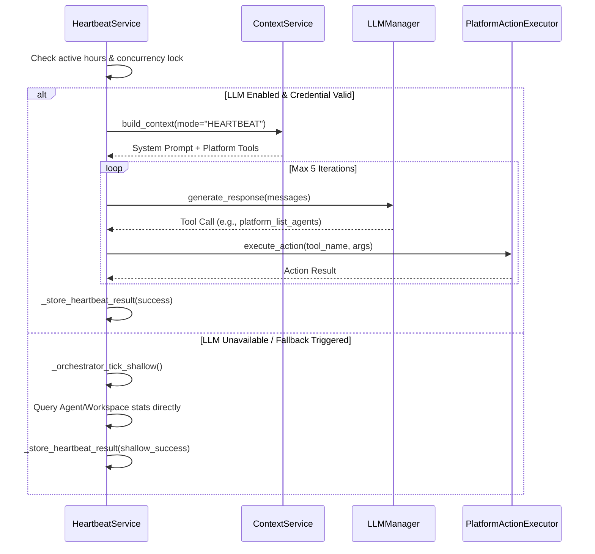

# Orchestrator Heartbeat

Relevant source files

The following files were used as context for generating this wiki page:

- [orchestrator/api/chat.py](orchestrator/api/chat.py)
- [orchestrator/api/routing.py](orchestrator/api/routing.py)
- [orchestrator/consumers/chatbot/auto.py](orchestrator/consumers/chatbot/auto.py)
- [orchestrator/consumers/chatbot/service.py](orchestrator/consumers/chatbot/service.py)
- [orchestrator/core/llm/manager.py](orchestrator/core/llm/manager.py)
- [orchestrator/core/routing/engine.py](orchestrator/core/routing/engine.py)
- [orchestrator/modules/agents/factory/agent_factory.py](orchestrator/modules/agents/factory/agent_factory.py)
- [orchestrator/modules/tools/discovery/platform_actions.py](orchestrator/modules/tools/discovery/platform_actions.py)
- [orchestrator/modules/tools/discovery/platform_executor.py](orchestrator/modules/tools/discovery/platform_executor.py)
- [orchestrator/scripts/setup_jira_trigger.py](orchestrator/scripts/setup_jira_trigger.py)
- [orchestrator/services/heartbeat_service.py](orchestrator/services/heartbeat_service.py)
- [orchestrator/services/page_context.py](orchestrator/services/page_context.py)
- [orchestrator/tests/test_prd221_page_context.py](orchestrator/tests/test_prd221_page_context.py)
- [orchestrator/tests/test_prd221_page_prior_tools.py](orchestrator/tests/test_prd221_page_prior_tools.py)

The Orchestrator Heartbeat is an LLM-powered scheduled monitoring system that performs periodic workspace health checks, enabling proactive platform management and autonomous workspace maintenance. This document covers the workspace-level orchestrator heartbeat tick implementation, detailing LLM-powered vs. shallow modes, tool loop execution caps, and proactive level enforcement. For agent-level heartbeat ticks that complete assigned tasks, see [Agent Heartbeat](11.3). For the shared scheduling infrastructure, see [Heartbeat Architecture](11.1).

## Purpose and Scope

The orchestrator heartbeat provides **workspace-wide health monitoring** through scheduled LLM-powered ticks that can:
- Analyze workspace state using platform action tools dispatched through `PlatformActionExecutor` [orchestrator/modules/tools/discovery/platform_executor.py:2-9]().
- Detect anomalies, configuration gaps, or optimization opportunities.
- Take corrective action based on configured proactive levels (`silent`, `notify`, `act_notify`, `autonomous`).
- Generate health reports and dispatch notifications.
- Monitor primitive subsystem health (Chat, Memory, RAG, Graph, etc.) via dedicated probes [orchestrator/services/heartbeat_service.py:34-54]().

Sources: [orchestrator/services/heartbeat_service.py:24-31](), [orchestrator/services/heartbeat_service.py:34-54](), [orchestrator/modules/tools/discovery/platform_executor.py:2-9]()

## System Architecture

### Orchestrator Heartbeat Components

The heartbeat system bridges the background scheduling tier with the LLM execution layer, utilizing a specialized context mode (`HEARTBEAT`) to restrict the model's focus to platform management. It also executes **Primitive Health Pings** that evaluate the durable memory store (Qdrant) and other system components, recording findings into `heartbeat_results` [orchestrator/services/heartbeat_service.py:68-126]().

*Sources: [orchestrator/services/heartbeat_service.py:24-31](), [orchestrator/services/heartbeat_service.py:68-133](), [orchestrator/core/llm/manager.py:33-53]() *

**Key Code Entities:**

| Component | File Path | Role |
|-----------|-----------|------|
| `HeartbeatService` | [orchestrator/services/heartbeat_service.py:135-152]() | Singleton managing `AsyncIOScheduler` jobs, execution locks, and tick routing. |
| `emit_primitive_finding` | [orchestrator/services/heartbeat_service.py:68-132]() | Best-effort writer recording primitive check outcomes to `heartbeat_results`. |
| `LLMManager` | [orchestrator/core/llm/manager.py:33-53]() | Resolves provider and model configurations for the `orchestrator` service category. |
| `PlatformActionExecutor` | [orchestrator/modules/tools/discovery/platform_executor.py:2-9]() | Thin dispatcher routing platform actions to domain-specific handler modules. |

Sources: [orchestrator/services/heartbeat_service.py:68-152](), [orchestrator/core/llm/manager.py:33-53](), [orchestrator/modules/tools/discovery/platform_executor.py:2-9]()

---

## Proactive Levels and Configuration

Orchestrator heartbeat configuration is stored within the workspace settings JSONB structure. The assigned `proactive_level` controls the boundary of actions the LLM can execute during a tick:

| Proactive Level | Operational Behavior | Permitted Tool Access |
|-----------------|---------------------|-----------------------|
| `silent` | Report findings and diagnostics only without dispatching alerts. | Read-only actions (`platform_list_*`, `platform_get_*`) |
| `notify` | Report findings, log diagnostics, and emit notification events to owners. | Read-only actions (`platform_list_*`, `platform_get_*`) |
| `act_notify` | Take corrective platform actions and notify workspace operators. | Read + Write actions (`platform_create_*`, `platform_update_*`) |
| `autonomous` | Full independent operational management and self-healing. | All platform actions (including destructive ops like `platform_delete_*`) |

Sources: [orchestrator/services/heartbeat_service.py:135-181]()

---

## Tick Execution Flow: LLM vs. Shallow Mode

When a scheduled heartbeat tick fires, `HeartbeatService` evaluates operational conditions to select between full LLM intelligence and a resource-preserving shallow fallback.

*Sources: [orchestrator/services/heartbeat_service.py:135-184](), [orchestrator/core/llm/manager.py:99-130]() *

### LLM-Powered Mode (`_orchestrator_tick_llm`)
The intelligent tick instantiates the `HEARTBEAT` context mode, loading platform management capabilities and setting an administrator persona. It runs an agentic loop utilizing the platform action registry.

### Shallow Mode Fallback (`_orchestrator_tick_shallow`)
When LLM provider credentials are unconfigured, rate-limited, or timing out, the system automatically falls back to shallow mode:
1. Directly queries database tables (e.g., `Agent`, `Workspace`) for raw operational stats [orchestrator/modules/tools/discovery/platform_executor.py:70-80]().
2. Computes basic counts of active vs. inactive agents and queue depths.
3. Records a structured shallow findings payload to ensure audit continuity without incurring token costs.

Sources: [orchestrator/services/heartbeat_service.py:135-184](), [orchestrator/modules/tools/discovery/platform_executor.py:70-80]()

---

## Tool Loop Caps and Deduplication

To prevent runaway execution costs and infinite loops during background monitoring, orchestrator heartbeat tool execution enforces strict bounds:
- **Iteration Cap**: Hard-capped to a maximum of **5 tool iterations** per tick cycle.
- **Deduplication**: Identical tool calls with overlapping arguments within the same tick are intercepted and suppressed to avoid redundant processing.
- **Exchange Trimming**: If message history expands excessively during the 5-iteration loop, older assistant-tool exchanges are trimmed while preserving the system prompt and initial task directive.

Sources: [orchestrator/services/heartbeat_service.py:135-184]()

---

## Result Storage and Security

Every completed tick writes an audit entry via `_store_heartbeat_result` into the `heartbeat_results` table:

| Column | Type | Description |
|--------|------|-------------|
| `source_type` | `String` | Identifies the source component (set to `'orchestrator'`). |
| `source_id` | `String` | Workspace or entity identifier. |
| `status` | `String` | Execution result (`success`, `error`, `skipped`). |
| `findings` | `JSONB` | Array of observations or `primitive_check` findings. |
| `actions_taken` | `JSONB` | Audit record of tool executions performed during the tick. |
| `tokens_used` | `Integer` | Total token consumption for the tick execution. |

### Security & Multi-Tenancy
All actions executed by the orchestrator heartbeat are routed through `PlatformActionExecutor` [orchestrator/modules/tools/discovery/platform_executor.py:2-9]() and are strictly workspace-scoped, ensuring that background ticks never leak data or execute unauthorized operations across tenant boundaries.

Sources: [orchestrator/services/heartbeat_service.py:68-132](), [orchestrator/modules/tools/discovery/platform_executor.py:2-9]()

---