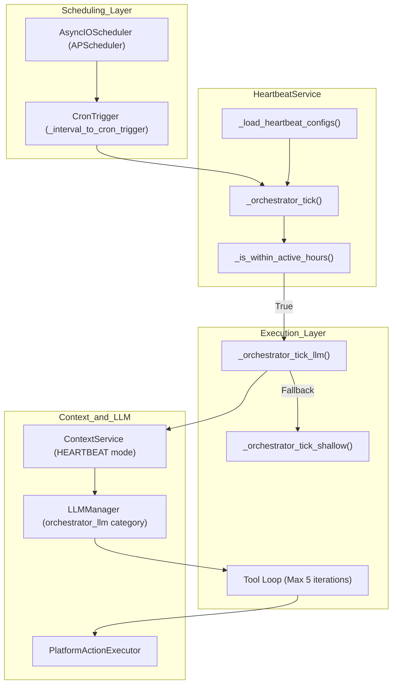
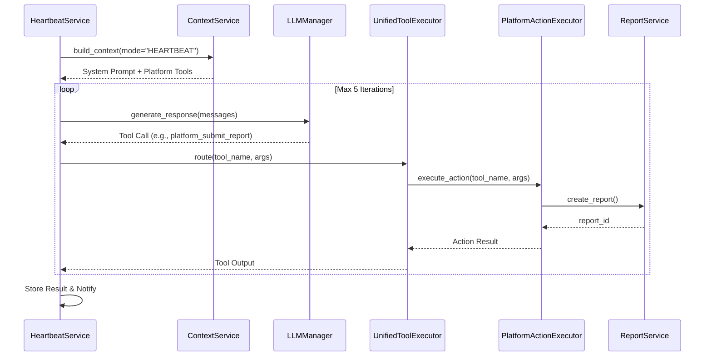

# Orchestrator Heartbeat

Relevant source files

The following files were used as context for generating this wiki page:

- [orchestrator/alembic/versions/wave3_escalation_level.py](orchestrator/alembic/versions/wave3_escalation_level.py)
- [orchestrator/core/services/escalation.py](orchestrator/core/services/escalation.py)
- [orchestrator/modules/tools/discovery/actions_reports.py](orchestrator/modules/tools/discovery/actions_reports.py)
- [orchestrator/modules/tools/discovery/actions_workspace.py](orchestrator/modules/tools/discovery/actions_workspace.py)
- [orchestrator/modules/tools/discovery/handlers_reports.py](orchestrator/modules/tools/discovery/handlers_reports.py)
- [orchestrator/modules/tools/discovery/handlers_workspace.py](orchestrator/modules/tools/discovery/handlers_workspace.py)
- [orchestrator/services/heartbeat_service.py](orchestrator/services/heartbeat_service.py)
- [orchestrator/services/report_service.py](orchestrator/services/report_service.py)

The Orchestrator Heartbeat is an LLM-powered scheduled monitoring system that performs periodic workspace health checks, enabling proactive platform management and autonomous workspace maintenance. This document covers the workspace-level orchestrator heartbeat tick implementation. For agent-level heartbeat ticks that complete assigned tasks, see [Agent Heartbeat](11.3). For the shared scheduling infrastructure, see [Heartbeat Architecture](11.1).

## Purpose and Scope

The orchestrator heartbeat provides **workspace-wide health monitoring** through scheduled LLM-powered ticks that can:
- Analyze workspace state using platform action tools.
- Detect anomalies, errors, or optimization opportunities.
- Take corrective action based on proactive level settings.
- Generate health reports and deliver notifications.

Unlike agent heartbeats which focus on task completion, orchestrator heartbeats provide **platform-wide situational awareness** for workspace administrators.

Sources: [orchestrator/services/heartbeat_service.py:24-31](), [orchestrator/services/heartbeat_service.py:114-122]()

## System Architecture

### Orchestrator Heartbeat Components

The heartbeat system bridges the scheduling layer with the LLM execution layer, utilizing a specialized context mode to restrict the model's focus to platform management.

**Orchestrator Heartbeat Logic Flow**

**Key Code Entities:**

| Component | File Path | Role |
|-----------|-----------|------|
| `HeartbeatService` | [orchestrator/services/heartbeat_service.py:24-31]() | Singleton managing `AsyncIOScheduler` jobs and tick routing. |
| `_orchestrator_tick_llm` | [orchestrator/services/heartbeat_service.py:382-390]() | High-fidelity execution using LLM and platform tools. |
| `_orchestrator_tick_shallow` | [orchestrator/services/heartbeat_service.py:547-550]() | Low-fidelity fallback using direct DB queries (agent counts). |
| `ReportService` | [orchestrator/services/report_service.py:149-155]() | Handles report creation and persistence for heartbeat findings. |
| `EscalationLevel` | [orchestrator/core/services/escalation.py:26-31]() | L0-L4 ladder (FYI, TASK, APPROVAL, URGENT, SECURITY) for triaging heartbeat findings. |

Sources: [orchestrator/services/heartbeat_service.py:24-545](), [orchestrator/services/heartbeat_service.py:382-390](), [orchestrator/services/heartbeat_service.py:547-550](), [orchestrator/services/report_service.py:149-155]()

## Configuration Structure

Orchestrator heartbeat configuration is stored in the workspace settings JSONB field under `settings.orchestrator.heartbeat`.

### Proactive Levels
The `proactive_level` determines the tool permissions granted to the LLM during the tick:

| Level | Behavior | Tool Access |
|-------|----------|-------------|
| `silent` | Report findings only. | Read-only (`platform_list_*`, `platform_browse_*`) |
| `notify` | Report findings and send alerts. | Read-only (`platform_list_*`) |
| `act_notify` | Take corrective actions and notify. | Read + Write (`platform_submit_report`, `platform_store_memory`) |
| `autonomous` | Full independence. | All (including destructive `platform_delete_memory`) |

Sources: [orchestrator/services/heartbeat_service.py:117-121](), [orchestrator/services/heartbeat_service.py:399-410](), [orchestrator/modules/tools/discovery/actions_reports.py:9-110](), [orchestrator/modules/tools/discovery/actions_workspace.py:60-108]()

## Tick Execution Flow

### LLM-Powered Tick Pipeline
The heartbeat utilizes a standard agentic loop but is constrained to a **maximum of 5 iterations** to prevent runaway costs and infinite loops during background monitoring.

**Sequence: Heartbeat Tool Loop**

### Context Assembly for Heartbeat Mode
The `HEARTBEAT` mode in `ContextService` assembles a specialized prompt. It ignores user-specific memory (L3/L4) to maintain a stateless "system administrator" persona. It injects:
1. **Identity**: Defined as "Automatos Orchestrator".
2. **Platform Tools**: Tools defined in `PlatformActionExecutor`, such as `platform_submit_report` [orchestrator/modules/tools/discovery/actions_reports.py:9-16]() and `platform_get_memory_stats` [orchestrator/modules/tools/discovery/actions_workspace.py:38-44]().
3. **Task Description**: Built from the `checklist` and `proactive_level` instructions.

Sources: [orchestrator/services/heartbeat_service.py:426-444](), [orchestrator/services/heartbeat_service.py:466-470](), [orchestrator/modules/tools/discovery/actions_reports.py:9-16]()

## Tool Loop and Deduplication

To prevent looping on the same health check, the heartbeat leverages logic limited by the iteration counter.

**Tool Loop Constraints:**
- **Max Iterations**: Hard-coded to 5 in `_orchestrator_tick_llm`. [orchestrator/services/heartbeat_service.py:472-475]()
- **Deduplication**: Prevents identical tool calls within the same tick to avoid redundant processing.

**Context Trimming Logic:**
If the message history grows too large during the 5-iteration loop, the system performs "Exchange Trimming":
- It preserves the first 2 messages (System Prompt and Initial Task).
- It keeps only the last 2 complete assistant-tool exchanges.

This ensures the LLM does not exceed token limits while maintaining the immediate context of its recent actions.

Sources: [orchestrator/services/heartbeat_service.py:472-475](), [orchestrator/services/heartbeat_service.py:488-500]()

## Shallow Mode Fallback

When LLM providers are unavailable or credentials fail, the system executes `_orchestrator_tick_shallow`. This method provides basic monitoring without intelligence.

1. **Agent Inventory**: Directly queries the `Agent` table for the `workspace_id`. [orchestrator/services/heartbeat_service.py:557-562]()
2. **Status Count**: Counts active vs. inactive agents. [orchestrator/services/heartbeat_service.py:563-568]()
3. **Checklist Processing**: Parses the raw `checklist` string from the config and marks items as "Reviewed (Shallow Mode)". [orchestrator/services/heartbeat_service.py:575-585]()

Sources: [orchestrator/services/heartbeat_service.py:547-589]()

## Active Hours Guard

The heartbeat respects the workspace's active hours to avoid processing (and potentially notifying) during off-hours.

- **Timezone Awareness**: Localizes the current time based on the `timezone` string in the config. [orchestrator/services/heartbeat_service.py:270-272]()
- **Window Comparison**: Converts "HH:MM" strings to total minutes from midnight for robust comparison, even for windows that cross the midnight boundary. [orchestrator/services/heartbeat_service.py:275-294]()

Sources: [orchestrator/services/heartbeat_service.py:227-240]()

## Result Storage and Reporting

Every tick results in a record in the `heartbeat_results` table (managed via `_store_heartbeat_result`). Additionally, the orchestrator often uses `platform_submit_report` to persist detailed findings.

| Field | Description |
|-------|-------------|
| `status` | `success`, `error`, or `skipped`. |
| `findings` | JSON array of observations (e.g., "Agent X is offline"). |
| `actions_taken` | JSON array of tool executions performed. |
| `escalation_level` | L0-L4 severity assigned to the findings [orchestrator/core/services/escalation.py:72-85](). |

Reports generated during heartbeats are handled by `ReportService.create_report` [orchestrator/services/report_service.py:156-172](), which writes a markdown file to the workspace and creates a DB entry in `agent_reports` [orchestrator/alembic/versions/wave3_escalation_level.py:20-24]().

Sources: [orchestrator/services/heartbeat_service.py:607-620](), [orchestrator/services/report_service.py:156-172](), [orchestrator/core/services/escalation.py:72-85]()

## Security and Permissions

The heartbeat is restricted to `platform_*` tools. These tools are executed via the `PlatformActionExecutor` and routed through the `UnifiedToolExecutor`.

- **Registry Source**: Tools are registered within the `ActionRegistry`.
- **Dispatcher**: `PlatformActionExecutor` routes calls to specific handlers like `submit_report` [orchestrator/modules/tools/discovery/handlers_reports.py:14-16]() or `get_memory_stats` [orchestrator/modules/tools/discovery/handlers_workspace.py:40-42]().
- **Multi-Tenancy**: Every platform action handler is strictly workspace-scoped, ensuring the orchestrator only sees data for its own workspace. [orchestrator/modules/tools/discovery/handlers_workspace.py:14-18]()

Sources: [orchestrator/modules/tools/discovery/handlers_reports.py:14-92](), [orchestrator/modules/tools/discovery/handlers_workspace.py:14-142](), [orchestrator/modules/tools/discovery/actions_reports.py:9-110]()

---