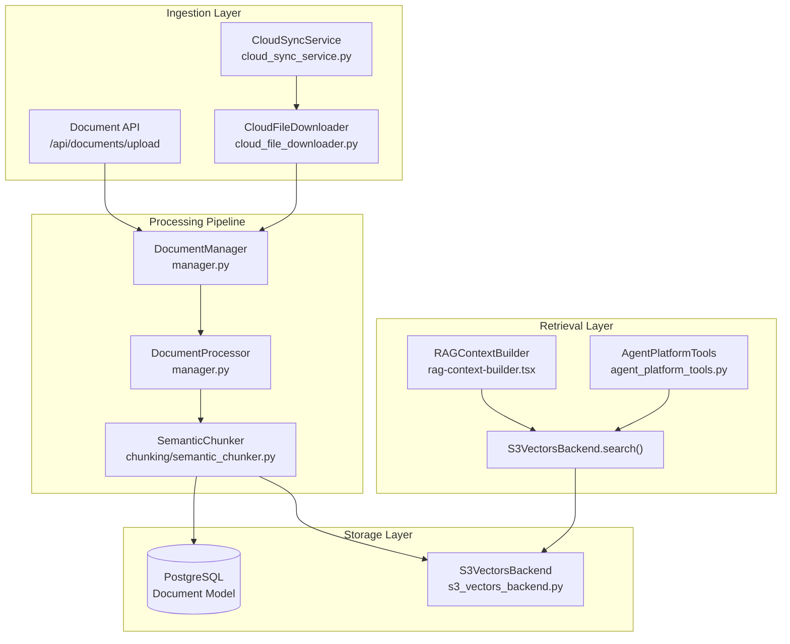
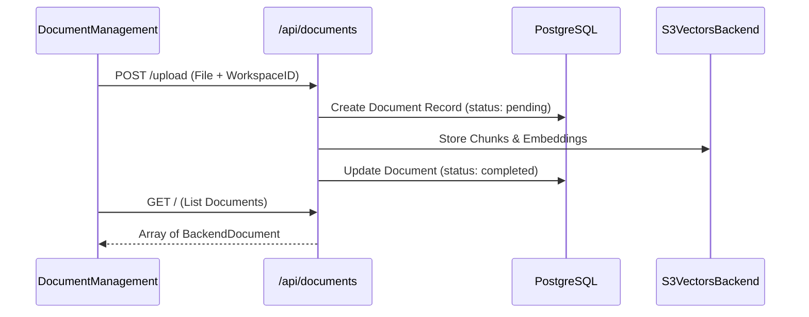

# Knowledge Base & RAG

Relevant source files

The following files were used as context for generating this wiki page:

- [frontend/components/documents/document-management.tsx](frontend/components/documents/document-management.tsx)
- [frontend/components/documents/local-storage-browser.tsx](frontend/components/documents/local-storage-browser.tsx)
- [orchestrator/api/documents.py](orchestrator/api/documents.py)
- [orchestrator/api/knowledge_multimodal.py](orchestrator/api/knowledge_multimodal.py)
- [orchestrator/api/widgets/docs.py](orchestrator/api/widgets/docs.py)
- [orchestrator/core/database/migrations/010_vector_dimensions_4096.sql](orchestrator/core/database/migrations/010_vector_dimensions_4096.sql)
- [orchestrator/core/models/cloud_sync.py](orchestrator/core/models/cloud_sync.py)
- [orchestrator/core/team_access.py](orchestrator/core/team_access.py)
- [orchestrator/modules/agents/services/agent_platform_tools.py](orchestrator/modules/agents/services/agent_platform_tools.py)
- [orchestrator/modules/rag/chunking/semantic_chunker.py](orchestrator/modules/rag/chunking/semantic_chunker.py)
- [orchestrator/modules/rag/ingestion/manager.py](orchestrator/modules/rag/ingestion/manager.py)
- [orchestrator/modules/rag/service.py](orchestrator/modules/rag/service.py)
- [orchestrator/modules/rag/services/cloud_file_downloader.py](orchestrator/modules/rag/services/cloud_file_downloader.py)
- [orchestrator/modules/rag/services/cloud_sync_service.py](orchestrator/modules/rag/services/cloud_sync_service.py)
- [orchestrator/modules/search/services/entity_extractor.py](orchestrator/modules/search/services/entity_extractor.py)
- [orchestrator/modules/search/vector_store/__init__.py](orchestrator/modules/search/vector_store/__init__.py)
- [orchestrator/modules/search/vector_store/backends/s3_vectors_backend.py](orchestrator/modules/search/vector_store/backends/s3_vectors_backend.py)
- [orchestrator/modules/tools/formatting/result_formatter.py](orchestrator/modules/tools/formatting/result_formatter.py)
- [orchestrator/scripts/recreate_s3_index.py](orchestrator/scripts/recreate_s3_index.py)

The Knowledge Base & RAG (Retrieval-Augmented Generation) system provides document management, semantic search, and intelligent context retrieval for AI agents. This system enables agents to access uploaded documents, cloud-synced files, and extracted knowledge through optimized vector search and cloud-native storage backends.

**Scope**: This page covers document ingestion, chunking strategies, vector storage, and cloud integration. For the unified memory architecture (L0-L4), see [Memory System](#3). For document management UI details, see [Document Management](#7.1).

---

## System Architecture

The RAG system follows a pipeline architecture: documents are ingested → chunked using semantic strategies → embedded → stored in workspace-isolated S3 vector stores → retrieved via multi-query search.

### RAG Pipeline Overview

**Sources**: [orchestrator/api/documents.py:77-86](), [orchestrator/modules/rag/ingestion/manager.py:113-130](), [orchestrator/modules/rag/services/cloud_sync_service.py:38-54](), [orchestrator/modules/search/vector_store/backends/s3_vectors_backend.py:24-37](), [orchestrator/modules/agents/services/agent_platform_tools.py:32-43]()

---

## Document Ingestion Pipeline

The `DocumentManager` and `DocumentProcessor` handle multimodal document processing with support for PDFs, DOCX, Markdown, and tabular data.

### Text Extraction
The system uses specialized libraries to ensure high-fidelity text extraction:
- **PDF**: `pdfplumber` for high quality, with a `PyPDF2` fallback [orchestrator/modules/rag/ingestion/manager.py:157-194]().
- **DOCX**: `DocxDocument` from `python-docx` [orchestrator/modules/rag/ingestion/manager.py:196-203]().
- **Code/Text**: `RecursiveCharacterTextSplitter` and `PythonCodeTextSplitter` for language-aware chunking [orchestrator/modules/rag/ingestion/manager.py:117-129]().

### Semantic Chunking Strategies
The `SemanticChunker` (available via `modules.rag.chunking.semantic_chunker`) provides advanced strategies to preserve semantic boundaries. Chunks are stored with metadata including `chunk_index`, `content`, and optional `parent_content` for context expansion [orchestrator/modules/rag/ingestion/manager.py:94-111]().

**Sources**: [orchestrator/modules/rag/ingestion/manager.py:44-51](), [orchestrator/modules/rag/ingestion/manager.py:131-156]()

---

## Cloud Storage & S3 Vectors

### Cloud Sync Integration
The `CloudSyncService` orchestrates syncing from Google Drive, Dropbox, OneDrive, and Box [orchestrator/modules/rag/services/cloud_sync_service.py:30-35](). 
- **Navigation**: `list_folders` and `list_files` use the `ComposioToolExecutor` to browse remote filesystems with local caching [orchestrator/modules/rag/services/cloud_sync_service.py:59-76]().
- **Downloading**: `CloudFileDownloader` handles provider-specific quirks, such as Google Drive's content truncation, by falling back to SDK-based downloads [orchestrator/modules/rag/services/cloud_file_downloader.py:99-107]().

### S3 Vectors Backend
The `S3VectorsBackend` implements workspace-isolated vector storage using the AWS S3 Vectors API [orchestrator/modules/search/vector_store/backends/s3_vectors_backend.py:24-37](). 
- **Multi-tenancy**: Buckets are scoped by workspace ID as `automatos-vectors-{workspace_id}` [orchestrator/modules/search/vector_store/backends/s3_vectors_backend.py:43-46]().
- **Metric**: Uses `COSINE` similarity for ranking. The `search` method converts S3 distance scores to similarity scores [orchestrator/modules/search/vector_store/backends/s3_vectors_backend.py:147-153]().
- **Persistence**: Metadata like `external_file_id`, `chunk_index`, and `app_name` are stored alongside vectors to enable source attribution [orchestrator/modules/search/vector_store/backends/s3_vectors_backend.py:155-166]().

**Sources**: [orchestrator/modules/rag/services/cloud_sync_service.py:116-140](), [orchestrator/modules/search/vector_store/backends/s3_vectors_backend.py:8-10]()

---

## RAG Retrieval System

The `RAGService` provides a high-level interface for retrieval, utilizing the `ContextOptimizer` for mathematical optimization of results (Knapsack, MMR, and Entropy) [orchestrator/modules/rag/service.py:5-10]().

### Retrieval Capabilities
| Tool Name | Description | Source |
|-----------|-------------|--------|
| `search_knowledge` | Searches platform documentation and guides | [orchestrator/modules/agents/services/agent_platform_tools.py:60-77]() |
| `semantic_search` | Finds similar content across all documents | [orchestrator/modules/agents/services/agent_platform_tools.py:79-96]() |
| `search_codebase` | Queries the `CodeGraph` for symbols and structures | [orchestrator/modules/agents/services/agent_platform_tools.py:98-135]() |

Results are formatted consistently using the `ToolResultFormatter`, which handles cleaning filenames and extracting useful content excerpts [orchestrator/modules/tools/formatting/result_formatter.py:18-67]().

**Sources**: [orchestrator/modules/rag/service.py:142-162](), [orchestrator/modules/agents/services/agent_platform_tools.py:26-43]()

---

## Frontend Management

The `DocumentManagement` component provides the primary interface for managing knowledge [frontend/components/documents/document-management.tsx:4-65]().

### Key UI Components
| Component | Responsibility | Source |
|-----------|----------------|--------|
| `SemanticSearch` | Interactive similarity search against the vector store | [frontend/components/documents/document-management.tsx:55]() |
| `ProviderCards` | Connection management for cloud storage providers | [frontend/components/documents/document-management.tsx:62]() |
| `RAGContextBuilder` | UI for configuring retrieval parameters (top_k, thresholds) | [frontend/components/documents/document-management.tsx:56]() |
| `SchemaBrowser` | Inspection of connected database structures | [frontend/components/documents/document-management.tsx:106-152]() |
| `LocalStorageBrowser` | View and manage documents stored directly in Automatos | [frontend/components/documents/local-storage-browser.tsx:62-69]() |

### Data Flow (UI to Backend)

**Sources**: [frontend/components/documents/document-management.tsx:68-82](), [orchestrator/api/documents.py:106-164]()

---

## Knowledge Graph & Entity Extraction

The system includes a `CodeGraphPanel` and `SemanticLayerBuilder` for advanced entity extraction and structural knowledge representation [frontend/components/documents/document-management.tsx:42-48](). 

The `EntityExtractor` service identifies key concepts and relationships within ingested documents to build a semantic layer over the raw text [orchestrator/modules/search/services/entity_extractor.py:1-10](). For detailed graph retrieval strategies, see [Knowledge Graph & Entity Extraction](#7.6).

**Sources**: [frontend/components/documents/document-management.tsx:42-50](), [orchestrator/core/database/migrations/010_vector_dimensions_4096.sql:22-31]()

---