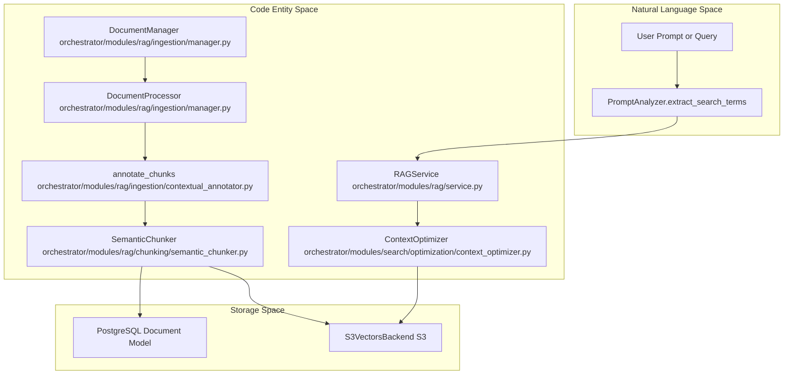
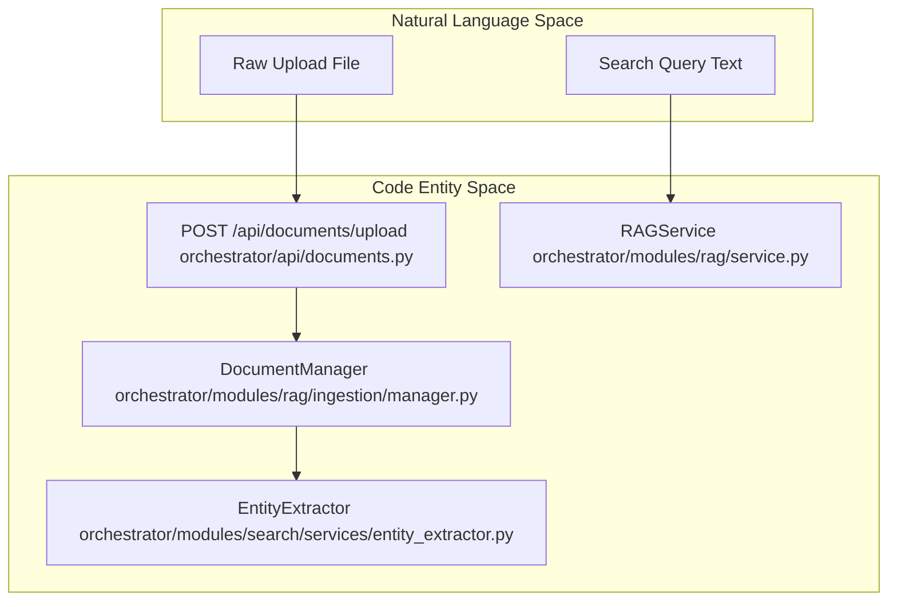

# Knowledge Base & RAG

Relevant source files

The following files were used as context for generating this wiki page:

- [orchestrator/api/context.py](orchestrator/api/context.py)
- [orchestrator/api/documents.py](orchestrator/api/documents.py)
- [orchestrator/api/github_webhooks.py](orchestrator/api/github_webhooks.py)
- [orchestrator/api/system.py](orchestrator/api/system.py)
- [orchestrator/modules/rag/ingestion/contextual_annotator.py](orchestrator/modules/rag/ingestion/contextual_annotator.py)
- [orchestrator/modules/rag/ingestion/manager.py](orchestrator/modules/rag/ingestion/manager.py)
- [orchestrator/modules/rag/service.py](orchestrator/modules/rag/service.py)
- [orchestrator/modules/search/services/entity_extractor.py](orchestrator/modules/search/services/entity_extractor.py)
- [orchestrator/tests/security/test_s5_closures.py](orchestrator/tests/security/test_s5_closures.py)
- [orchestrator/tests/test_entity_extractor_no_vendor_key.py](orchestrator/tests/test_entity_extractor_no_vendor_key.py)
- [orchestrator/tests/test_p2w1_contextual_annotations.py](orchestrator/tests/test_p2w1_contextual_annotations.py)

The Knowledge Base & RAG (Retrieval-Augmented Generation) system provides document ingestion, semantic chunking, vector search, cloud synchronization, and deliverable rendering. This system enables AI agents to access uploaded files, cloud-synced documents, and structured knowledge through optimized retrieval pipelines and workspace-isolated storage.

**Scope**: This is a parent page providing a high-level overview of the knowledge and RAG subsystems. For granular technical implementation details, refer to the child pages:
- [Document Management](#7.1) — DocumentManagement component, upload flow, provider cards, document details, team scoping, pinned documents
- [Document Ingestion Pipeline](#7.2) — Text extraction, chunking, contextual annotation, embedding generation, storage to vector database
- [Semantic Chunking Strategies](#7.3) — Chunk size, overlap, parent-child expansion, adaptive/topic-coherence strategies, multi-modal chunking
- [RAG Retrieval System](#7.4) — Hybrid dense/sparse search, RRF fusion, retrieval filters, feedback penalties, fail-closed team scoping, retrieval recall evals
- [Cloud Storage Integration](#7.5) — CloudSyncService, cloud file downloader, CloudDocument model, folder selection, sync jobs, S3 Vectors backend
- [Documents API Reference](#7.6) — API endpoints for document upload, search, download, delete, analytics, cloud connections, multimodal knowledge
- [Document Generation & Deliverables Rendering](#7.7) — generation_service, template_service, HTML templates (report, invoice, executive summary), Gotenberg PDF rendering, and template security

---

## System Architecture

The RAG system bridges natural language queries to processed document fragments stored in vector databases. It follows a multi-stage pipeline: ingestion → extraction → contextual annotation → semantic chunking → embedding → storage → retrieval.

### RAG Pipeline & Entity Mapping

**Sources**: [orchestrator/modules/rag/service.py:5-10](), [orchestrator/modules/rag/ingestion/manager.py:113-130](), [orchestrator/modules/rag/ingestion/contextual_annotator.py:111-136]()

### Ingestion & Extraction Flow

**Sources**: [orchestrator/api/documents.py:111-121](), [orchestrator/modules/rag/ingestion/manager.py:113-130](), [orchestrator/modules/search/services/entity_extractor.py:39-70](), [orchestrator/modules/rag/service.py:54-65]()

---

## 7.1 Document Management
The document management subsystem provides file upload workflows, provider cards, document metadata details, pinned documents, and strict team scoping within workspaces. For details, see [Document Management](#7.1).
**Sources**: [orchestrator/api/documents.py:111-121]()

## 7.2 Document Ingestion Pipeline
The ingestion pipeline handles multi-format text extraction (PDF, DOCX, Markdown, etc.), MIME validation via `python-magic`, contextual annotation via `annotate_chunks`, embedding generation, and vector database persistence. For details, see [Document Ingestion Pipeline](#7.2).
**Sources**: [orchestrator/modules/rag/ingestion/manager.py:113-194](), [orchestrator/modules/rag/ingestion/contextual_annotator.py:1-28]()

## 7.3 Semantic Chunking Strategies
Chunking strategies include adaptive chunking, token size and overlap boundaries, parent-child context expansion, and topic-coherence parsing to maintain structural context. For details, see [Semantic Chunking Strategies](#7.3).
**Sources**: [orchestrator/modules/rag/service.py:156-157](), [orchestrator/modules/rag/ingestion/manager.py:94-102]()

## 7.4 RAG Retrieval System
The retrieval subsystem combines hybrid dense and sparse search legs, Reciprocal Rank Fusion (RRF), retrieval filters, feedback penalties, and fail-closed team access checks. For details, see [RAG Retrieval System](#7.4).
**Sources**: [orchestrator/modules/rag/service.py:128-160]()

## 7.5 Cloud Storage Integration
Cloud synchronization manages external file sources via `CloudSyncService`, cloud file downloaders, folder selection interfaces, background sync jobs, and S3 Vectors backends. For details, see [Cloud Storage Integration](#7.5).
**Sources**: [orchestrator/api/documents.py:78-87]()

## 7.6 Documents API Reference
Provides REST endpoints for document upload, semantic search, download, deletion, analytics tracking, and cloud provider connections. For details, see [Documents API Reference](#7.6).
**Sources**: [orchestrator/api/documents.py:111-121](), [orchestrator/api/context.py:54-108]()

## 7.7 Document Generation & Deliverables Rendering
Manages generation and template services, HTML templates for reports, invoices, and summaries, Gotenberg PDF rendering pipelines, and security validation. For details, see [Document Generation & Deliverables Rendering](#7.7).
**Sources**: [orchestrator/api/documents.py:1-15]()

---