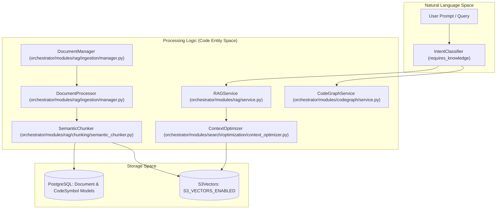
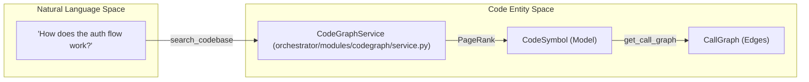

# Knowledge Base & RAG

Relevant source files

The following files were used as context for generating this wiki page:

- [frontend/components/agents/agent-management.tsx](frontend/components/agents/agent-management.tsx)
- [frontend/components/agents/skills/skill-editor-modal.tsx](frontend/components/agents/skills/skill-editor-modal.tsx)
- [frontend/components/agents/skills/workspace-skills-tab.tsx](frontend/components/agents/skills/workspace-skills-tab.tsx)
- [frontend/components/documents/document-management.tsx](frontend/components/documents/document-management.tsx)
- [frontend/components/documents/local-storage-browser.tsx](frontend/components/documents/local-storage-browser.tsx)
- [frontend/components/knowledge/memory-tab.tsx](frontend/components/knowledge/memory-tab.tsx)
- [frontend/components/tools/tools-dashboard.tsx](frontend/components/tools/tools-dashboard.tsx)
- [frontend/hooks/use-skills-api.ts](frontend/hooks/use-skills-api.ts)
- [orchestrator/api/documents.py](orchestrator/api/documents.py)
- [orchestrator/api/knowledge_multimodal.py](orchestrator/api/knowledge_multimodal.py)
- [orchestrator/api/workspace_skills.py](orchestrator/api/workspace_skills.py)
- [orchestrator/modules/agents/services/agent_platform_tools.py](orchestrator/modules/agents/services/agent_platform_tools.py)
- [orchestrator/modules/rag/chunking/semantic_chunker.py](orchestrator/modules/rag/chunking/semantic_chunker.py)
- [orchestrator/modules/rag/ingestion/manager.py](orchestrator/modules/rag/ingestion/manager.py)
- [orchestrator/modules/rag/service.py](orchestrator/modules/rag/service.py)
- [orchestrator/modules/rag/services/cloud_file_downloader.py](orchestrator/modules/rag/services/cloud_file_downloader.py)
- [orchestrator/modules/rag/services/cloud_sync_service.py](orchestrator/modules/rag/services/cloud_sync_service.py)
- [orchestrator/modules/search/services/entity_extractor.py](orchestrator/modules/search/services/entity_extractor.py)
- [orchestrator/modules/tools/formatting/result_formatter.py](orchestrator/modules/tools/formatting/result_formatter.py)

The Knowledge Base & RAG (Retrieval-Augmented Generation) system provides document ingestion, semantic chunking, vector search, cloud synchronization, and codebase indexing. This system enables AI agents to access uploaded files, cloud-synced documents, and structured knowledge through optimized retrieval pipelines and workspace-isolated storage.

**Scope**: This page covers high-level ingestion flows, chunking, and storage backends. For granular document UI details, see [Document Management](#7.1). For the 5-layer memory architecture, see [Memory System](#3).

---

## System Architecture

The RAG system bridges natural language queries to processed document fragments and code entities stored in vector databases and graph stores. It follows a multi-stage pipeline: ingestion → extraction → semantic chunking → embedding → storage → retrieval.

### RAG Pipeline & Entity Mapping

**Sources**: [orchestrator/modules/rag/service.py:142-162](), [orchestrator/modules/rag/ingestion/manager.py:113-130](), [orchestrator/modules/rag/service.py:5-10](), [orchestrator/modules/agents/services/agent_platform_tools.py:32-43]()

---

## Document Ingestion & Chunking

The ingestion pipeline transforms raw files into searchable vectors. The `DocumentManager` acts as the entry point, coordinating with the `DocumentProcessor` for multi-format support and workspace isolation.

### Extraction & Processing
- **Multimodal Support**: Supports PDF, DOCX, Markdown, TXT, Python, JSON, XLSX, and CSV [orchestrator/modules/rag/ingestion/manager.py:62-71]().
- **High-Fidelity PDF**: Uses `pdfplumber` for text extraction with a `PyPDF2` fallback to handle complex encodings [orchestrator/modules/rag/ingestion/manager.py:157-194]().
- **MIME Validation**: The API performs strict MIME type detection using `python-magic` to prevent extension spoofing, mapped in `ALLOWED_MIME_TYPES` [orchestrator/api/documents.py:88-104](), [orchestrator/api/documents.py:130-150]().
- **Semantic Chunking**: The `SemanticChunker` uses strategies like `ADAPTIVE` to split text at semantic boundaries. It supports parent-child expansion to provide broader context to agents [orchestrator/modules/rag/service.py:118-120](), [orchestrator/modules/rag/ingestion/manager.py:94-102]().

### Context Optimization
The `RAGService` utilizes a `ContextOptimizer` to rank and select the most relevant chunks using mathematical models like Knapsack, MMR (Maximal Marginal Relevance), and Entropy to ensure high information gain and diversity in the retrieved context [orchestrator/modules/rag/service.py:5-10](), [orchestrator/modules/rag/service.py:170-174]().

**Sources**: [orchestrator/modules/rag/ingestion/manager.py:131-156](), [orchestrator/api/documents.py:106-166](), [orchestrator/modules/rag/service.py:99-140]()

---

## Cloud Storage & S3 Vectors

### Cloud Synchronization
The system integrates with major cloud providers via the `CloudSyncService` and `CloudFileDownloader` using the Composio API [orchestrator/modules/rag/services/cloud_file_downloader.py:29-35]().
- **Provider Support**: Google Drive, Dropbox, OneDrive, and Box.
- **Truncation Handling**: `CloudFileDownloader` detects truncated API responses (common in Google Drive) and falls back to SDK-based downloads to ensure full file content is ingested [orchestrator/modules/rag/services/cloud_file_downloader.py:99-117]().

### Vector Storage (S3 Vectors)
The system supports a cloud-native alternative to traditional vector databases.
- **Multi-Tenancy**: Each workspace is isolated at the storage level, with configuration toggled via `config.S3_VECTORS_ENABLED` [orchestrator/api/documents.py:79-86]().
- **Full Content Recovery**: The `ToolResultFormatter` can reassemble original document text from S3 or database chunks (via `document_chunks` table) to provide full context when similarity search is insufficient [orchestrator/modules/tools/formatting/result_formatter.py:118-171]().

**Sources**: [orchestrator/modules/rag/services/cloud_file_downloader.py:60-78](), [orchestrator/modules/tools/formatting/result_formatter.py:24-42]()

---

## CodeGraph — Repository Indexing

The `CodeGraphService` enables agents to understand codebase structure by indexing GitHub repositories and extracting symbols like functions and classes.

### Code Symbol Mapping

- **Structural Importance**: Results are ranked by structural importance using a PageRank-style algorithm [orchestrator/modules/agents/services/agent_platform_tools.py:98-100]().
- **Traversal**: Agents can traverse code dependencies using `get_call_graph` to understand what a function calls and what calls it [orchestrator/modules/agents/services/agent_platform_tools.py:137-164]().

**Sources**: [orchestrator/modules/agents/services/agent_platform_tools.py:98-135](), [orchestrator/api/documents.py:41-47]()

---

## Knowledge Graph & Entity Extraction

Beyond flat vector search, the platform builds a structured representation of relationships between concepts and entities.

- **LLM Extraction**: Uses specialized prompts to extract entities and relationships from documents.
- **Incremental Updates**: New data triggers incremental graph updates to maintain a fresh semantic layer.
- **Visualization**: The `BusinessGraphPanel` and `CodeGraphPanel` provide visual interfaces for exploring these relationships [frontend/components/documents/document-management.tsx:41-42]().

**Sources**: [frontend/components/documents/document-management.tsx:44-50](), [orchestrator/modules/agents/services/agent_platform_tools.py:166-180]()

---

## Retrieval & RAG Tools

Agents access the knowledge base through a unified toolset defined in `AgentPlatformTools` [orchestrator/modules/agents/services/agent_platform_tools.py:26-43]().

| Tool Name | Responsibility |
|:---|:---|
| `search_knowledge` | Search the Automatos knowledge base for documentation and guides [orchestrator/modules/agents/services/agent_platform_tools.py:60-77](). |
| `semantic_search` | Find semantically similar content across all platform documents [orchestrator/modules/agents/services/agent_platform_tools.py:79-96](). |
| `search_codebase` | Query indexed codebase for symbols (functions, classes) using `CodeGraphService` [orchestrator/modules/agents/services/agent_platform_tools.py:98-135](). |
| `get_call_graph` | Traverse code dependencies to understand symbol relationships [orchestrator/modules/agents/services/agent_platform_tools.py:137-164](). |

**Sources**: [orchestrator/modules/agents/services/agent_platform_tools.py:56-59](), [orchestrator/modules/tools/formatting/result_formatter.py:18-22]()

---

## Child Pages

- [Document Management](#7.1) — DocumentManagement component, upload flow, provider cards, document details
- [Document Ingestion Pipeline](#7.2) — Text extraction, chunking, embedding generation, storage to vector database
- [Semantic Chunking Strategies](#7.3) — Chunk size, overlap, parent-child expansion, multi-modal chunking
- [RAG Retrieval System](#7.4) — Similarity, hybrid, semantic strategies; top_k; similarity_threshold; RAG context builder
- [Cloud Storage Integration](#7.5) — CloudSyncService, CloudDocument model, folder selection, sync jobs, S3 Vectors backend
- [Knowledge Graph & Entity Extraction](#7.6) — Entity extraction, knowledge graph retrieval, semantic layer
- [CodeGraph — Code Repository Indexing](#7.7) — CodeGraphService for indexing GitHub repositories, extracting code symbols, and building relationship graphs
- [Documents API Reference](#7.8) — API endpoints for document upload, search, download, delete, cloud connections

---