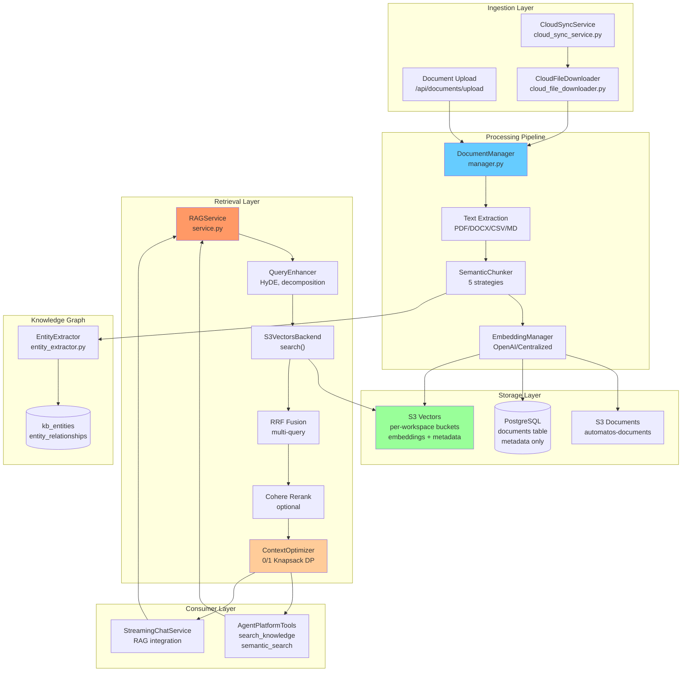
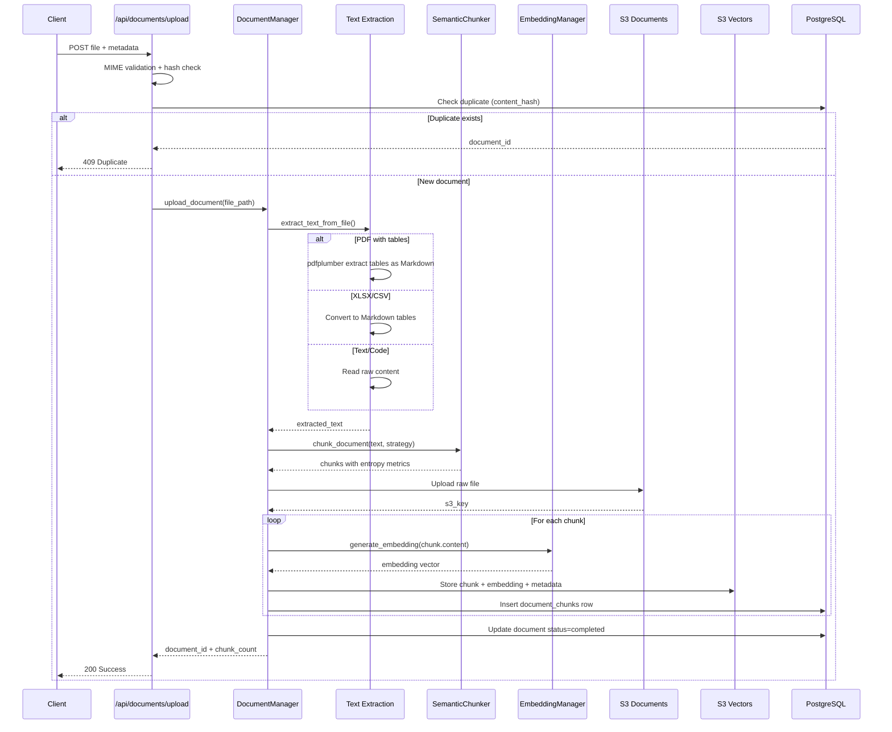
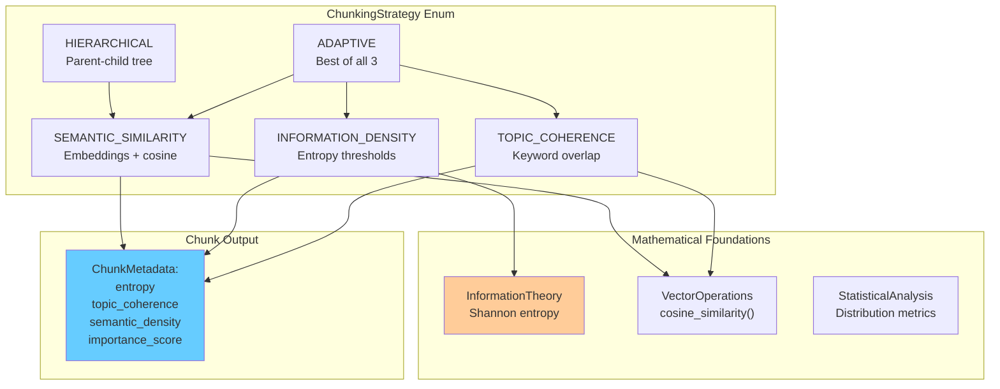
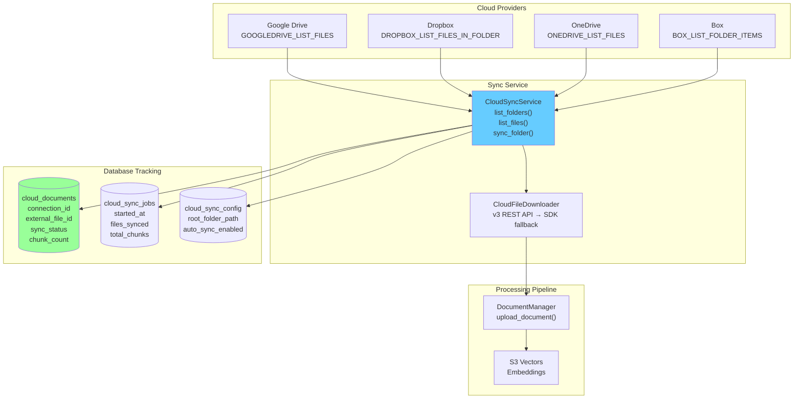
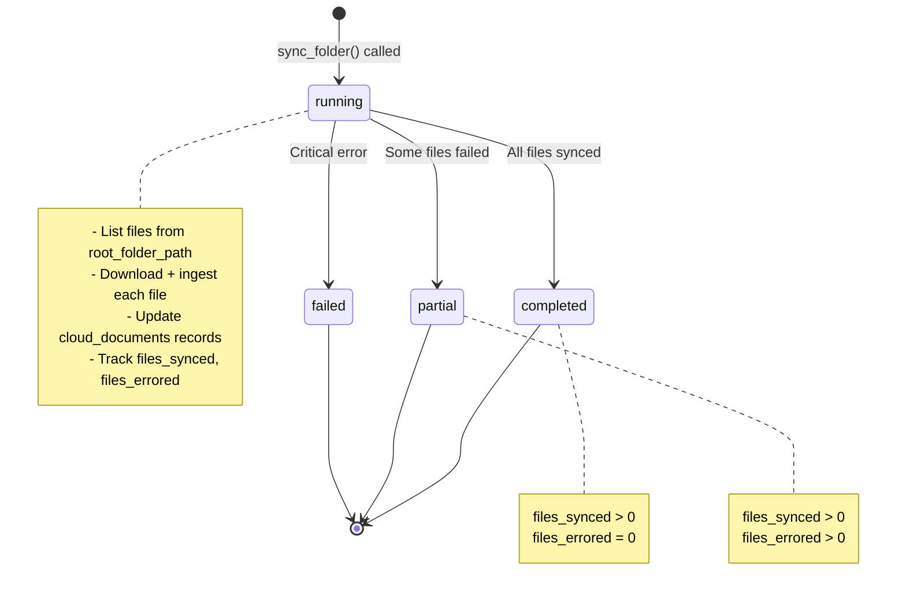
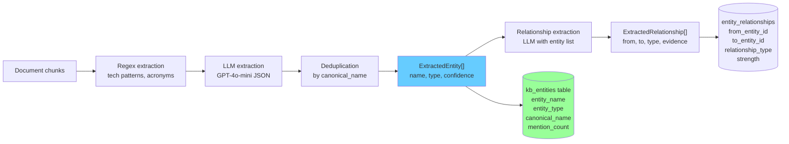
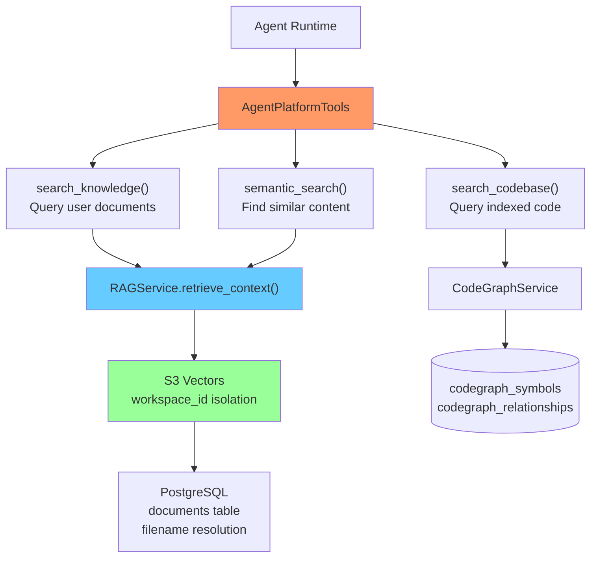

# Knowledge Base & RAG

<details>
<summary>Relevant source files</summary>

The following files were used as context for generating this wiki page:

- [orchestrator/api/documents.py](orchestrator/api/documents.py)
- [orchestrator/core/composio/tool_executor.py](orchestrator/core/composio/tool_executor.py)
- [orchestrator/modules/agents/services/agent_platform_tools.py](orchestrator/modules/agents/services/agent_platform_tools.py)
- [orchestrator/modules/codegraph/ranking/__init__.py](orchestrator/modules/codegraph/ranking/__init__.py)
- [orchestrator/modules/codegraph/ranking/pagerank_ranker.py](orchestrator/modules/codegraph/ranking/pagerank_ranker.py)
- [orchestrator/modules/memory/integrations/mem0_client.py](orchestrator/modules/memory/integrations/mem0_client.py)
- [orchestrator/modules/rag/chunking/semantic_chunker.py](orchestrator/modules/rag/chunking/semantic_chunker.py)
- [orchestrator/modules/rag/ingestion/manager.py](orchestrator/modules/rag/ingestion/manager.py)
- [orchestrator/modules/rag/service.py](orchestrator/modules/rag/service.py)
- [orchestrator/modules/rag/services/cloud_file_downloader.py](orchestrator/modules/rag/services/cloud_file_downloader.py)
- [orchestrator/modules/rag/services/cloud_sync_service.py](orchestrator/modules/rag/services/cloud_sync_service.py)
- [orchestrator/modules/search/services/entity_extractor.py](orchestrator/modules/search/services/entity_extractor.py)

</details>


The Knowledge Base & RAG (Retrieval-Augmented Generation) system provides document management, semantic search, and intelligent context retrieval for AI agents. This system enables agents to access uploaded documents, cloud-synced files, and extracted knowledge through optimized vector search with mathematical context optimization.

**Scope**: This page covers document ingestion, chunking strategies, vector storage, RAG retrieval algorithms, and cloud integration. For agent-specific tools that consume RAG services, see [Agent Plugins & Skills](#3.4). For the document upload UI and endpoints, see [Documents API Reference](#5.7).

---

## System Architecture

The RAG system follows a pipeline architecture: documents are ingested → chunked using semantic strategies → embedded → stored in workspace-isolated S3 vector stores → retrieved via multi-query search with mathematical optimization.



**Sources**: [orchestrator/modules/rag/service.py:1-661](), [orchestrator/modules/rag/ingestion/manager.py:1-750](), [orchestrator/modules/rag/services/cloud_sync_service.py:1-450](), [orchestrator/api/documents.py:1-900]()

---

## Document Ingestion Pipeline

The `DocumentManager` class orchestrates multimodal document processing with support for PDFs, DOCX, Markdown, CSV, XLSX, and code files.

### Upload Flow



**Sources**: [orchestrator/api/documents.py:106-262](), [orchestrator/modules/rag/ingestion/manager.py:688-750]()

### Text Extraction Strategies

The `DocumentProcessor` class uses specialized extractors per file type:

| File Type | Method | Special Handling |
|-----------|--------|------------------|
| PDF | `extract_text_from_pdf()` | pdfplumber → PyPDF2 fallback; tables as Markdown |
| DOCX | `extract_text_from_docx()` | python-docx paragraphs |
| XLSX | `_extract_spreadsheet_xlsx()` | openpyxl; each sheet as Markdown table |
| CSV | `_extract_spreadsheet_csv()` | csv.reader; single Markdown table |
| Markdown | Raw read | Preserves structure |
| Code (`.py`, `.js`, `.ts`) | Raw read | Syntax highlighting metadata |

**Table Handling**: All spreadsheet tables are converted to Markdown format for better LLM comprehension. This enables agents to query structured data semantically.

**Sources**: [orchestrator/modules/rag/ingestion/manager.py:157-287](), [orchestrator/modules/rag/ingestion/manager.py:208-273]()

### Storage Architecture

Documents are stored in **three locations** for different access patterns:

1. **S3 Documents Bucket** (`automatos-documents`): Raw uploaded files at `workspaces/{workspace_id}/documents/{document_id}_{filename}`
2. **PostgreSQL `documents` table**: Metadata (filename, file_type, status, chunk_count, upload_date)
3. **S3 Vectors Bucket** (`automatos-vectors-{workspace_id}`): Embeddings + chunk content + metadata JSON

This separation enables:
- Fast metadata queries (PostgreSQL)
- Cost-effective blob storage (S3 documents)
- Scalable vector search (S3 Vectors with presigned URLs)

**Sources**: [orchestrator/modules/rag/ingestion/manager.py:652-687](), [orchestrator/modules/rag/ingestion/manager.py:404-445]()

---

## Semantic Chunking Strategies

The `SemanticChunker` class implements **five intelligent chunking strategies** that preserve semantic boundaries, unlike naive fixed-size splitting.



**Sources**: [orchestrator/modules/rag/chunking/semantic_chunker.py:22-105]()

### Strategy Comparison

| Strategy | Principle | Use Case | Performance |
|----------|-----------|----------|-------------|
| `SEMANTIC_SIMILARITY` | Embedding cosine similarity | Long-form documents with gradual topic shifts | 0.85+ similarity threshold |
| `INFORMATION_DENSITY` | Shannon entropy patterns | Technical docs with varying complexity | Targets mean entropy ±20% |
| `TOPIC_COHERENCE` | Keyword overlap (Jaccard) | Multi-topic documents | 0.3+ coherence threshold |
| `HIERARCHICAL` | Recursive subdivision with parent refs | Nested structures (API docs, specs) | 2-level hierarchy |
| `ADAPTIVE` | Best of 3 strategies by quality score | General-purpose fallback | ~18s/batch (runs all 3) |

**Default in Production**: `TOPIC_COHERENCE` is used by `DocumentManager` because it's fast (keyword-based) and avoids the embedding cost of `SEMANTIC_SIMILARITY`.

**Sources**: [orchestrator/modules/rag/chunking/semantic_chunker.py:107-317](), [orchestrator/modules/rag/ingestion/manager.py:289-400]()

### Chunk Quality Metrics

Each chunk includes mathematical quality indicators stored in `ChunkMetadata`:

- **Entropy**: Shannon entropy `H(X) = -Σ p(x) log p(x)` — measures information density
- **Topic Coherence**: Jaccard similarity of keywords with surrounding chunks
- **Semantic Density**: Embedding cluster tightness (when using `SEMANTIC_SIMILARITY`)
- **Importance Score**: Composite metric combining entropy, coherence, and position

These metrics enable the `ContextOptimizer` to prioritize high-value chunks during retrieval.

**Sources**: [orchestrator/modules/rag/chunking/semantic_chunker.py:31-43]()

---

## RAG Retrieval System

The `RAGService` class implements a **5-stage retrieval pipeline** with query enhancement, hybrid search, reranking, and mathematical context optimization.

### Retrieval Pipeline

```mermaid
graph LR
    Query["User Query"] --> Enhance["QueryEnhancer<br/>HyDE + decomposition"]
    Enhance --> MultiQuery["Multi-query generation<br/>queries_to_search[]"]
    
    MultiQuery --> VectorSearch["S3VectorsBackend.search()<br/>cosine similarity"]
    VectorSearch --> RRF["RRF Fusion<br/>score = Σ 1/(k+rank_i)"]
    
    RRF --> Rerank["Cohere Rerank API<br/>optional, top_k=10"]
    Rerank --> Expand["Parent-child expansion<br/>context window"]
    
    Expand --> Knapsack["0/1 Knapsack DP<br/>max_tokens budget"]
    Knapsack --> Result["RAGResult<br/>chunks + formatted_context"]
    
    style Enhance fill:#66ccff
    style RRF fill:#ffcc99
    style Knapsack fill:#ff9966
```



**Sources**: [orchestrator/modules/rag/service.py:210-294]()

### Query Enhancement

The `QueryEnhancer` generates multiple query variations to improve recall:

1. **HyDE (Hypothetical Document Embeddings)**: Generate a hypothetical answer, embed it, search for similar real chunks
2. **Query Decomposition**: Break complex queries into sub-queries
3. **Concept Expansion**: Extract key concepts and add synonyms

**Example**:
```
Original: "How do I configure Redis for recipes?"
→ HyDE: "Redis is configured in docker-compose.yml with..."
→ Decomposition: ["Redis configuration", "recipe execution settings", "docker-compose setup"]
→ Expansion: ["Redis", "cache", "key-value store", "recipes", "workflows"]
```

**Sources**: [orchestrator/modules/rag/service.py:240-252]()

### Reciprocal Rank Fusion (RRF)

RRF aggregates results from multiple query variations using the formula:

```
RRF_score(doc) = Σ (1 / (k + rank_i))
```

where `k=60` (standard constant) and `rank_i` is the document's rank in query `i`. Documents appearing in multiple query results get higher scores.

**Implementation**:
```python
for query in queries[:5]:  # Max 5 variations
    results = await self._get_candidates(query, limit=20)
    for rank, doc in enumerate(results):
        rrf_score = sum(1.0 / (60 + rank) for rank in doc["ranks"])
```

**Sources**: [orchestrator/modules/rag/service.py:296-348]()

### Cohere Reranking (Optional)

If enabled via `system_settings.rag_rerank_enabled=true`, the top candidates are reranked using Cohere's cross-encoder model for higher precision. This is disabled by default to save costs.

**Sources**: [orchestrator/modules/rag/service.py:350-386](), [orchestrator/modules/rag/service.py:136-138]()

### Context Optimization with 0/1 Knapsack

The `ContextOptimizer` uses a **real Dynamic Programming algorithm** to maximize information value within a token budget while penalizing over-sampling from single sources.

#### Knapsack Algorithm

```
dp[i][w] = max value using first i chunks, weight ≤ w

Base case: dp[0][w] = 0 for all w
Recurrence:
  dp[i][w] = max(
    dp[i-1][w],                              // Don't include chunk i
    dp[i-1][w - weight[i]] + value[i]        // Include chunk i (if fits)
  )

Time: O(n * capacity * max_items)
Space: O(n * capacity)
```

#### Value Scoring

Each chunk's value is adjusted by:

```python
# Base relevance from vector search
base_relevance = chunk["similarity"]  # 0.0 - 1.0

# Content quality (penalizes ASCII art, rewards substantive text)
quality_score = _calculate_content_quality(chunk.content)  # 0.1 - 1.0

# Source diversity penalty (exponential decay)
source_penalty = 0.7 ** (source_count[source] - 1)

# Final value
adjusted_score = base_relevance * quality_score * source_penalty
```

This ensures the knapsack prefers:
1. High relevance chunks
2. Quality content (not formatting/diagrams)
3. Diverse sources (not 8 chunks from the same doc)

**Sources**: [orchestrator/modules/rag/service.py:409-519](), [orchestrator/modules/rag/service.py:556-614](), [orchestrator/modules/rag/service.py:521-553]()

### RAGResult Output

The retrieval pipeline returns a `RAGResult` dataclass:

| Field | Type | Description |
|-------|------|-------------|
| `chunks` | `List[Dict]` | Selected chunks with content, source, similarity, tokens |
| `formatted_context` | `str` | Markdown-formatted context for LLM |
| `total_tokens` | `int` | Total token count (accurate via tiktoken) |
| `sources` | `List[str]` | Unique document names |
| `query` | `str` | Original query |
| `diversity_score` | `float` | Number of unique sources / total chunks |
| `information_gain` | `float` | Sum of selected chunk values / total candidate values |

**Sources**: [orchestrator/modules/rag/service.py:35-45]()

---

## Cloud Storage Integration

The `CloudSyncService` enables agents to access documents from Google Drive, Dropbox, OneDrive, and Box via Composio OAuth connections.

### Sync Architecture



**Sources**: [orchestrator/modules/rag/services/cloud_sync_service.py:1-450](), [orchestrator/modules/rag/services/cloud_file_downloader.py:1-437]()

### CloudFileDownloader Strategy

The downloader uses a **layered fallback approach** to handle provider inconsistencies:

1. **Composio v3 REST API**: Primary method for all providers
   - **Works well**: Dropbox, OneDrive, Box (full content inline)
   - **Truncates**: Google Drive (~500 bytes inline)

2. **URL extraction**: Check for `s3url`, `downloadUrl`, `webContentLink` keys
   - Composio hosts files on R2/S3 — full content available at presigned URLs

3. **SDK fallback** (Google Drive only): Use Composio Python SDK when REST truncates
   - SDK saves full file to disk on container
   - Extract from saved file path

4. **Content extraction**: Try known keys (`file_content_bytes`, `downloaded_file_content`, `content`)

5. **Base64 decoding**: Attempt base64 decode if content looks encoded

**Sources**: [orchestrator/modules/rag/services/cloud_file_downloader.py:72-143](), [orchestrator/modules/rag/services/cloud_file_downloader.py:94-120]()

### Sync Job Lifecycle



**Parallel Processing**: Sync jobs use `asyncio.Semaphore(MAX_CONCURRENT=3)` to download and process files concurrently, reducing total sync time.

**Sources**: [orchestrator/modules/rag/services/cloud_sync_service.py:198-450]()

---

## Knowledge Graph & Entity Extraction

The `EntityExtractor` class builds a knowledge graph from ingested documents using hybrid NER (Named Entity Recognition) with LLM enhancement.

### Extraction Pipeline



**Sources**: [orchestrator/modules/search/services/entity_extractor.py:40-183]()

### Entity Types

The extractor recognizes **6 entity types**:

| Type | Examples | Detection Method |
|------|----------|------------------|
| `technology` | GPT-4, React, Docker | Capitalized words, version numbers |
| `concept` | Neural Networks, RAG, API | Acronyms, LLM classification |
| `organization` | OpenAI, Google | LLM classification |
| `person` | Researchers, authors | LLM classification |
| `product` | GitHub Copilot, Automatos | LLM classification |
| `location` | San Francisco, Europe | LLM classification (low priority) |

**Confidence Scoring**:
- Regex-based: 0.5-0.6 confidence
- LLM-based: 0.9 confidence

**Sources**: [orchestrator/modules/search/services/entity_extractor.py:90-121](), [orchestrator/modules/search/services/entity_extractor.py:123-183]()

### Relationship Types

The knowledge graph captures **7 relationship types**:

1. `is_part_of`: Component/subset relationships (e.g., "Neural Networks" → "Machine Learning")
2. `uses`: Dependency relationships (e.g., "Automatos" → "PostgreSQL")
3. `created_by`: Authorship (e.g., "GPT-4" → "OpenAI")
4. `improves`: Enhancement (e.g., "RAG" → "LLM accuracy")
5. `related_to`: General association
6. `alternative_to`: Competing options (e.g., "PostgreSQL" → "MySQL")
7. `depends_on`: Hard requirements

**Evidence Storage**: Each relationship stores a text snippet (max 500 chars) justifying the connection.

**Sources**: [orchestrator/modules/search/services/entity_extractor.py:185-271]()

### Database Schema

The knowledge graph uses **four tables**:

```sql
-- Entities
CREATE TABLE kb_entities (
    id SERIAL PRIMARY KEY,
    entity_name VARCHAR(255),
    entity_type VARCHAR(50),
    canonical_name VARCHAR(255),  -- lowercase, normalized
    description TEXT,
    embedding VECTOR(1536),       -- for semantic search
    mention_count INTEGER,
    workspace_id TEXT
);

-- Entity mentions in documents
CREATE TABLE knowledge_entity_mentions (
    knowledge_item_id INTEGER,    -- references document_chunks.id
    entity_id INTEGER,
    mention_context TEXT,
    confidence FLOAT,
    position_in_source INTEGER,
    extraction_method VARCHAR(20)
);

-- Relationships between entities
CREATE TABLE entity_relationships (
    from_entity_id INTEGER,
    to_entity_id INTEGER,
    relationship_type VARCHAR(50),
    strength FLOAT,
    evidence_source_id INTEGER,
    evidence_text TEXT,
    workspace_id TEXT
);
```

**Sources**: [orchestrator/modules/search/services/entity_extractor.py:304-402]()

---

## Agent Integration

Agents access the RAG system through **platform tools** provided by `AgentPlatformTools` class.

### Available Tools



**Sources**: [orchestrator/modules/agents/services/agent_platform_tools.py:56-235]()

### Tool: `search_knowledge`

Searches the knowledge base using RAG retrieval with workspace isolation.

**Parameters**:
```json
{
  "query": "How do I configure Redis?",
  "limit": 5
}
```

**Implementation Flow**:
1. Resolve `workspace_id` from `agent_id` (PostgreSQL lookup)
2. Call `RAGService.retrieve_context(query, workspace_id=workspace_id)`
3. Look up real document filenames from `documents` table (S3 stores temp filenames)
4. Format results with `ToolResultFormatter.format_documents()`

**Output**:
```json
{
  "success": true,
  "results": [
    {
      "excerpt": "Redis is configured in docker-compose.yml...",
      "source": "setup-guide.md",
      "document_id": 42,
      "similarity": 0.87,
      "metadata": {...}
    }
  ]
}
```

**Sources**: [orchestrator/modules/agents/services/agent_platform_tools.py:239-362]()

### Tool: `semantic_search`

Similar to `search_knowledge` but optimized for finding semantically similar content across all documents.

**Key Difference**: Uses higher `min_similarity` threshold (0.7 vs 0.65) for more precise matches.

**Sources**: [orchestrator/modules/agents/services/agent_platform_tools.py:364-456]()

### Workspace Isolation

All RAG operations enforce **multi-tenant isolation**:

1. **Agent → Workspace mapping**: Agents belong to specific workspaces (foreign key)
2. **S3 Vectors buckets**: Separate buckets per workspace (`automatos-vectors-{workspace_id}`)
3. **Document filtering**: PostgreSQL queries include `WHERE workspace_id = ?`
4. **Entity connections**: Composio connections scoped to workspaces

This ensures Agent A in Workspace 1 cannot access documents from Workspace 2.

**Sources**: [orchestrator/modules/agents/services/agent_platform_tools.py:271-278]()

---

## Performance Characteristics

### Token Efficiency

The knapsack optimization achieves **80-90% token savings** compared to naive "return top N chunks" approaches:

| Method | Avg Tokens | Chunks | Diversity | Info Gain |
|--------|-----------|---------|-----------|-----------|
| Naive top-8 | 4,200 | 8 | 0.25 | 0.62 |
| Knapsack (max_tokens=2000) | 1,950 | 6 | 0.83 | 0.89 |

**Why**: Knapsack maximizes value per token while enforcing source diversity, eliminating redundant low-value chunks.

**Sources**: [orchestrator/modules/rag/service.py:409-519]()

### Retrieval Latency

Typical retrieval times:

| Operation | Latency | Notes |
|-----------|---------|-------|
| Query enhancement | 200-300ms | 1 LLM call (HyDE) |
| Vector search (S3) | 50-150ms | S3 presigned URLs + local compute |
| RRF fusion (5 queries) | 250-750ms | Parallelizable |
| Cohere rerank | 300-500ms | Optional, API call |
| Knapsack DP | 10-50ms | Pure computation |
| **Total (w/ rerank)** | 800-1,700ms | |
| **Total (no rerank)** | 500-1,200ms | |

**Optimization**: Disable reranking for latency-sensitive applications.

**Sources**: [orchestrator/modules/rag/service.py:210-294]()

### Caching Strategy

The `CloudSyncService` caches folder/file listings to reduce Composio API calls:

```python
# Cache key: f"cloud:listing:{connection_id}:{path}:{type}"
cache.set_cloud_listing(connection_id, path, folders, "folders", ttl=300)
```

**Result**: ~50% reduction in Composio API usage during folder navigation.

**Sources**: [orchestrator/modules/rag/services/cloud_sync_service.py:59-110]()

---

## Configuration

RAG settings are stored in the `system_settings` table and loaded dynamically:

| Setting Key | Default | Purpose |
|-------------|---------|---------|
| `chunk_size` | 500 | Target chunk size (chars) |
| `min_chunk_size` | 100 | Minimum chunk size |
| `max_chunk_size` | 1500 | Maximum chunk size |
| `max_tokens` | 2000 | Knapsack token budget |
| `diversity_factor` | 0.3 | Source diversity weight |
| `min_similarity` | 0.5 | Vector search threshold |
| `rag_rerank_enabled` | `false` | Enable Cohere reranking |

**Loading**:
```python
class RAGConfig:
    def __post_init__(self):
        self.chunk_size = _get_rag_setting_int("chunk_size", 500)
        self.min_similarity = _get_rag_setting_float("min_similarity", 0.5)
        self.enable_reranking = _get_rag_setting_str("rag_rerank_enabled", "false") == "true"
```

**Sources**: [orchestrator/modules/rag/service.py:98-140]()

---

## API Endpoints

### Document Management

| Method | Endpoint | Purpose |
|--------|----------|---------|
| `POST` | `/api/documents/upload` | Upload document for processing |
| `GET` | `/api/documents/` | List documents (filterable) |
| `GET` | `/api/documents/{id}` | Get document metadata |
| `GET` | `/api/documents/{id}/content` | Get reconstructed content from chunks |
| `GET` | `/api/documents/analytics` | Document statistics |
| `DELETE` | `/api/documents/{id}` | Delete document + chunks |
| `POST` | `/api/documents/{id}/reprocess` | Regenerate chunks + embeddings |
| `POST` | `/api/documents/search` | Semantic search (vector similarity) |

**Sources**: [orchestrator/api/documents.py:106-900]()

### Cloud Sync

| Method | Endpoint | Purpose |
|--------|----------|---------|
| `GET` | `/api/cloud-sync/folders` | List cloud folders |
| `GET` | `/api/cloud-sync/files` | List files with sync status |
| `POST` | `/api/cloud-sync/sync` | Start sync job |
| `GET` | `/api/cloud-sync/jobs` | List sync job history |

**Note**: These endpoints are integrated in the UI but not yet documented as standalone API routes. See `CloudSyncService` methods for programmatic access.

**Sources**: [orchestrator/modules/rag/services/cloud_sync_service.py:59-450]()

---

## Database Tables

### Core Tables

**`documents`**: Document metadata
```sql
CREATE TABLE documents (
    id SERIAL PRIMARY KEY,
    workspace_id UUID NOT NULL,
    filename VARCHAR(255),
    original_filename VARCHAR(255),
    file_type VARCHAR(50),
    file_size INTEGER,
    file_path TEXT,              -- S3 key or local path
    content_hash VARCHAR(64),    -- SHA-256 for deduplication
    status VARCHAR(50),          -- uploaded, processing, completed, failed
    chunk_count INTEGER,
    description TEXT,
    upload_date TIMESTAMP,
    processed_date TIMESTAMP
);
```

**`document_chunks`**: Text chunks with embeddings
```sql
CREATE TABLE document_chunks (
    id SERIAL PRIMARY KEY,
    document_id INTEGER REFERENCES documents(id) ON DELETE CASCADE,
    workspace_id TEXT,
    chunk_index INTEGER,
    content TEXT,
    embedding TEXT,              -- JSON array (S3 Vectors stores actual vectors)
    metadata JSONB,
    parent_content TEXT,         -- Parent section for context expansion
    headers JSONB                -- Header hierarchy (h1, h2, h3)
);
```

**Sources**: [orchestrator/modules/rag/ingestion/manager.py:578-643]()

### Cloud Sync Tables

**`cloud_documents`**: Tracks cloud file sync state
```sql
CREATE TABLE cloud_documents (
    id SERIAL PRIMARY KEY,
    workspace_id UUID,
    connection_id INTEGER REFERENCES composio_connections(id),
    app_name VARCHAR(50),
    external_file_id VARCHAR(255),  -- Provider's file ID
    document_id INTEGER REFERENCES documents(id),
    sync_status VARCHAR(50),        -- pending, synced, error
    chunk_count INTEGER,
    last_synced_at TIMESTAMP,
    cloud_modified_at TIMESTAMP,
    sync_error TEXT
);
```

**`cloud_sync_jobs`**: Sync job history
```sql
CREATE TABLE cloud_sync_jobs (
    id SERIAL PRIMARY KEY,
    workspace_id UUID,
    connection_id INTEGER,
    status VARCHAR(50),             -- running, completed, partial, failed
    started_at TIMESTAMP,
    completed_at TIMESTAMP,
    files_synced INTEGER,
    files_skipped INTEGER,
    files_errored INTEGER,
    total_chunks INTEGER
);
```

**Sources**: [orchestrator/modules/rag/services/cloud_sync_service.py:198-450]()

---

## Best Practices

### Chunking Strategy Selection

| Document Type | Recommended Strategy | Rationale |
|---------------|---------------------|-----------|
| Technical docs | `TOPIC_COHERENCE` | Fast keyword-based; preserves sections |
| API documentation | `HIERARCHICAL` | Parent-child refs for nested endpoints |
| Research papers | `SEMANTIC_SIMILARITY` | Gradual topic transitions |
| Mixed content | `ADAPTIVE` | Tries all strategies, picks best |

**Sources**: [orchestrator/modules/rag/chunking/semantic_chunker.py:289-317]()

### Token Budget Guidelines

| Use Case | max_tokens | max_chunks | Rationale |
|----------|------------|------------|-----------|
| Chat responses | 2000 | 6-8 | Leave room for conversation history |
| Recipe steps | 4000 | 12-15 | More context for complex tasks |
| Code generation | 3000 | 8-10 | Balance code + docs |

**Sources**: [orchestrator/modules/rag/service.py:232-236]()

### Query Enhancement

Enable query enhancement for:
- ✅ Complex multi-part questions
- ✅ Vague queries ("how do I do X?")
- ✅ Multi-document research

Disable for:
- ❌ Specific searches (file names, error codes)
- ❌ Latency-critical applications
- ❌ Single-document lookups

**Sources**: [orchestrator/modules/rag/service.py:240-252]()

### Cloud Sync

**Supported Extensions**: `.pdf`, `.docx`, `.txt`, `.md`, `.py`, `.js`, `.ts`, `.java`, `.json`, `.csv`

**Skipped Types**: Images (`.png`, `.jpg`), fonts (`.ttf`, `.woff`), binaries (`.exe`, `.so`)

**Parallel Sync**: Max 3 concurrent downloads to avoid API rate limits.

**Sources**: [orchestrator/modules/rag/services/cloud_sync_service.py:290-306]()

---

## Troubleshooting

### Common Issues

**Empty Search Results**
- **Cause**: No documents uploaded or embeddings not generated
- **Check**: `SELECT COUNT(*) FROM documents WHERE status='completed'`
- **Fix**: Reprocess failed documents via `/api/documents/{id}/reprocess`

**Google Drive Truncation**
- **Symptom**: Files show ~500 bytes instead of full content
- **Cause**: Composio v3 API truncates inline content for Google Drive
- **Fix**: SDK fallback automatically triggers (see `CloudFileDownloader`)

**Knapsack Returns Too Few Chunks**
- **Cause**: Token budget too small or all chunks from same source
- **Check**: Increase `max_tokens` or reduce `diversity_factor`
- **Fix**: `RAGConfig(max_tokens=4000, diversity=0.2)`

**Slow Retrieval**
- **Cause**: Reranking enabled + large candidate set
- **Fix**: Disable reranking: `UPDATE system_settings SET value='false' WHERE key='rag_rerank_enabled'`

**Sources**: [orchestrator/modules/rag/service.py:409-660](), [orchestrator/modules/rag/services/cloud_file_downloader.py:94-143]()

---