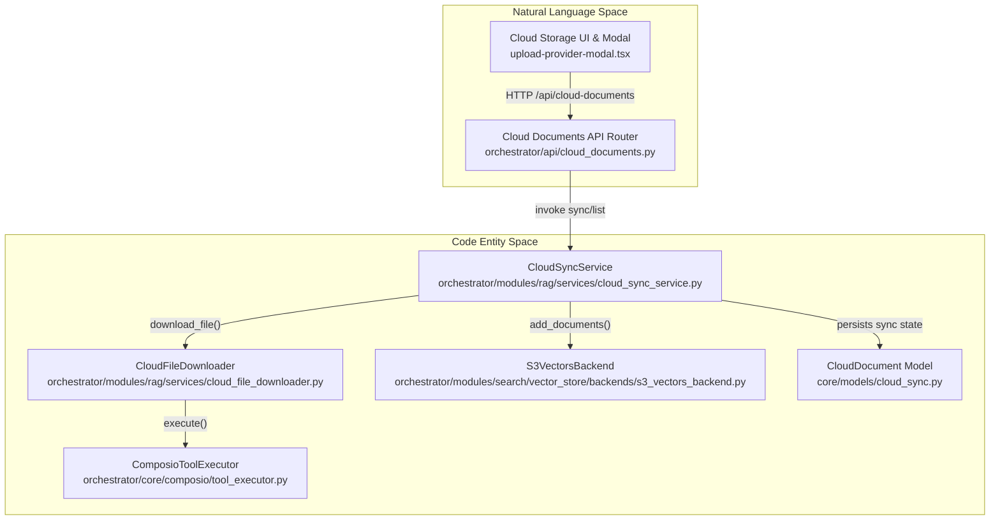
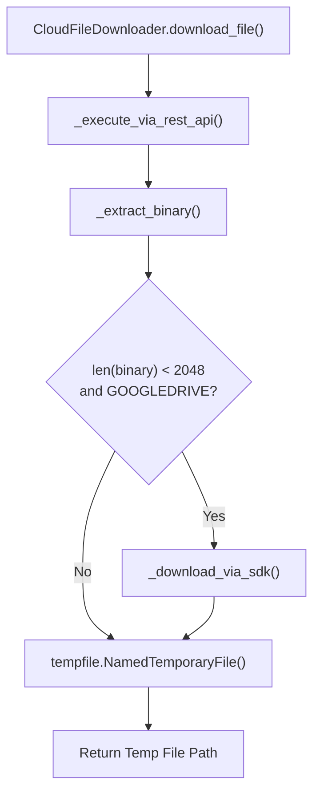
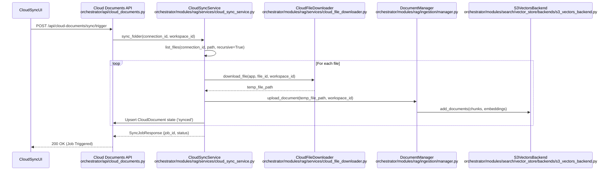

# Cloud Storage Integration

Relevant source files

The following files were used as context for generating this wiki page:

- [frontend/components/context/configure-rag-modal.tsx](frontend/components/context/configure-rag-modal.tsx)
- [frontend/components/documents/delete-confirmation-modal.tsx](frontend/components/documents/delete-confirmation-modal.tsx)
- [frontend/components/documents/document-details-modal.tsx](frontend/components/documents/document-details-modal.tsx)
- [frontend/components/documents/team-multi-select.tsx](frontend/components/documents/team-multi-select.tsx)
- [frontend/components/documents/upload-provider-modal.tsx](frontend/components/documents/upload-provider-modal.tsx)
- [frontend/hooks/use-context-management-api.ts](frontend/hooks/use-context-management-api.ts)
- [frontend/hooks/use-document-api.ts](frontend/hooks/use-document-api.ts)
- [frontend/hooks/use-notifications-api.ts](frontend/hooks/use-notifications-api.ts)
- [frontend/hooks/use-teams.ts](frontend/hooks/use-teams.ts)
- [frontend/hooks/use-template-api.ts](frontend/hooks/use-template-api.ts)
- [orchestrator/alembic/versions/prd158_cloud_default_team.py](orchestrator/alembic/versions/prd158_cloud_default_team.py)
- [orchestrator/api/cloud_documents.py](orchestrator/api/cloud_documents.py)
- [orchestrator/core/database/migrations/010_vector_dimensions_4096.sql](orchestrator/core/database/migrations/010_vector_dimensions_4096.sql)
- [orchestrator/core/models/cloud_sync.py](orchestrator/core/models/cloud_sync.py)
- [orchestrator/evals/retrieval_recall.py](orchestrator/evals/retrieval_recall.py)
- [orchestrator/modules/rag/chunking/semantic_chunker.py](orchestrator/modules/rag/chunking/semantic_chunker.py)
- [orchestrator/modules/rag/ingestion/pipeline.py](orchestrator/modules/rag/ingestion/pipeline.py)
- [orchestrator/modules/rag/ingestion/processor.py](orchestrator/modules/rag/ingestion/processor.py)
- [orchestrator/modules/rag/services/cloud_file_downloader.py](orchestrator/modules/rag/services/cloud_file_downloader.py)
- [orchestrator/modules/rag/services/cloud_sync_service.py](orchestrator/modules/rag/services/cloud_sync_service.py)
- [orchestrator/modules/search/__init__.py](orchestrator/modules/search/__init__.py)
- [orchestrator/modules/search/vector_store/__init__.py](orchestrator/modules/search/vector_store/__init__.py)
- [orchestrator/modules/search/vector_store/backends/pgvector_local_backend.py](orchestrator/modules/search/vector_store/backends/pgvector_local_backend.py)
- [orchestrator/modules/search/vector_store/backends/s3_vectors_backend.py](orchestrator/modules/search/vector_store/backends/s3_vectors_backend.py)
- [orchestrator/scripts/eval/retrieval_recall/corpus.jsonl](orchestrator/scripts/eval/retrieval_recall/corpus.jsonl)
- [orchestrator/scripts/eval/retrieval_recall/gold_set.jsonl](orchestrator/scripts/eval/retrieval_recall/gold_set.jsonl)
- [orchestrator/scripts/recreate_s3_index.py](orchestrator/scripts/recreate_s3_index.py)
- [orchestrator/scripts/test_cloud_sync.py](orchestrator/scripts/test_cloud_sync.py)
- [orchestrator/tests/test_p2w1_retrieval_recall.py](orchestrator/tests/test_p2w1_retrieval_recall.py)

## Purpose and Scope

This page documents Automatos AI's cloud storage integration system (PRD-42), which enables automatic synchronization of documents from cloud storage providers (Google Drive, Dropbox, OneDrive, Box) into the RAG knowledge base. The subsystem leverages Composio for OAuth connection management and file access, downloads files via a multi-strategy downloader (`CloudFileDownloader`), processes files through the multimodal ingestion pipeline (`DocumentManager`), and stores resulting vector embeddings in a workspace-scoped AWS S3 Vectors backend (`S3VectorsBackend`).

Sources: `[orchestrator/modules/rag/services/cloud_sync_service.py:1-12]()`, `[orchestrator/modules/rag/services/cloud_file_downloader.py:1-11]()`, `[orchestrator/modules/search/vector_store/backends/s3_vectors_backend.py:1-13]()`

---

## System Architecture & Component Mapping

The cloud integration architecture coordinates between user-facing React components, FastAPI router endpoints, background sync orchestrators, and external cloud storage provider APIs.

### Architecture-to-Code Mapping

Sources: `[frontend/components/documents/upload-provider-modal.tsx:1-43]()`, `[orchestrator/api/cloud_documents.py:26-27]()`, `[orchestrator/modules/rag/services/cloud_sync_service.py:38-54]()`, `[orchestrator/modules/rag/services/cloud_file_downloader.py:59-71]()`, `[orchestrator/modules/search/vector_store/backends/s3_vectors_backend.py:36-50]()`

---

## Supported Cloud Providers & API Routing

The system automatically discovers file storage tools via Composio categories (`document & file management`, `storage`, `cloud storage`, `file sharing`, `productivity`) or known application identifiers (`GOOGLEDRIVE`, `DROPBOX`, `ONEDRIVE`, `BOX`) [orchestrator/api/cloud_documents.py:206-227]().

| Cloud Provider | List Action (`_LIST_ACTIONS`) | Download Action (`_DOWNLOAD_ACTIONS`) | File ID / Path Identifier |
|----------------|-------------------------------|---------------------------------------|---------------------------|
| **GOOGLEDRIVE** | `GOOGLEDRIVE_LIST_FILES` | `GOOGLEDRIVE_DOWNLOAD_FILE` | `fileId` |
| **DROPBOX** | `DROPBOX_LIST_FILES_IN_FOLDER` | `DROPBOX_READ_FILE` | `path` |
| **ONEDRIVE** | `ONEDRIVE_LIST_FILES` | `ONEDRIVE_DOWNLOAD_FILE` | `path` |
| **BOX** | `BOX_LIST_FOLDER_ITEMS` | `BOX_DOWNLOAD_FILE` | `id` |

Sources: `[orchestrator/api/cloud_documents.py:206-227]()`, `[orchestrator/modules/rag/services/cloud_file_downloader.py:29-34]`, `[orchestrator/modules/rag/services/cloud_sync_service.py:29-35]()`

---

## CloudFileDownloader Implementation & Multi-Layer Extraction

`CloudFileDownloader` (`orchestrator/modules/rag/services/cloud_file_downloader.py`) handles provider-specific payload anomalies. Specifically, the Composio v3 REST API truncates Google Drive inline content to ~500 bytes [orchestrator/modules/rag/services/cloud_file_downloader.py:7-11]().

### Download Execution Flow

Sources: `[orchestrator/modules/rag/services/cloud_file_downloader.py:71-143]()`

### Extraction Priority
1. **URL Keys**: Checked first (`s3url`, `s3Url`, `downloadUrl`, `url`, `webContentLink`, `temporary_link`) where full files are hosted on presigned S3/R2 URIs [orchestrator/modules/rag/services/cloud_file_downloader.py:46-53]().
2. **Content Keys**: Checked second (`file_content_bytes`, `downloaded_file_content`, `content`, `file_content`) [orchestrator/modules/rag/services/cloud_file_downloader.py:36-44]().
3. **SDK Fallback**: Triggered if Google Drive content size is below `_MIN_EXPECTED_SIZE` (2048 bytes), saving the full payload directly via the Composio SDK [orchestrator/modules/rag/services/cloud_file_downloader.py:55-56]`, `[orchestrator/modules/rag/services/cloud_file_downloader.py:98-118]().

Sources: `[orchestrator/modules/rag/services/cloud_file_downloader.py:36-118]()`

---

## CloudSyncService Orchestration & Folder Sync Flow

`CloudSyncService` (`orchestrator/modules/rag/services/cloud_sync_service.py`) manages folder listing with caching (`CacheService`), incremental sync state tracking, and document ingestion triggers [orchestrator/modules/rag/services/cloud_sync_service.py:38-76]().

### Sync Pipeline Data Flow

Sources: `[orchestrator/api/cloud_documents.py:77-94]()`, `[orchestrator/modules/rag/services/cloud_sync_service.py:38-54]()`, `[orchestrator/modules/rag/services/cloud_file_downloader.py:71-77]()`

---

## S3 Vectors Backend & Dimension Security

Vector embeddings generated during cloud synchronization are stored via `S3VectorsBackend` (`orchestrator/modules/search/vector_store/backends/s3_vectors_backend.py`) [orchestrator/modules/search/vector_store/backends/s3_vectors_backend.py:36-49]().

- **Bucket Layout**: Supports shared buckets or per-workspace buckets via the `{workspace_id}` template placeholder [orchestrator/modules/search/vector_store/backends/s3_vectors_backend.py:54-67]().
- **Tenant Isolation**: Enforced at query-time via fail-closed metadata checks on `workspace_id` [orchestrator/modules/search/vector_store/backends/s3_vectors_backend.py:8-13]().
- **Dimension Protection**: `_assert_index_dimension()` raises `IndexDimensionMismatchError` if an existing S3 index dimension does not match `S3_VECTORS_DIMENSION` (e.g., 4096 dimensions under Migration `010_vector_dimensions_4096.sql`), refusing to query or write mismatched geometry without auto-deleting stored indices [orchestrator/modules/search/vector_store/backends/s3_vectors_backend.py:130-161]`, `[orchestrator/core/database/migrations/010_vector_dimensions_4096.sql:1-13]().

Sources: `[orchestrator/modules/search/vector_store/backends/s3_vectors_backend.py:8-161]()`, `[orchestrator/core/database/migrations/010_vector_dimensions_4096.sql:1-13]()`

---

## Team Access & Frontend Integration

Synced documents support team-based access scoping via PRD-158 integration [orchestrator/api/cloud_documents.py:63-68]().

- **Team Selection**: Users pick authorized teams during folder selection using the `TeamMultiSelect` component (`frontend/components/documents/team-multi-select.tsx`), which normalizes team references against `/api/teams` [frontend/components/documents/team-multi-select.tsx:1-35]().
- **Metadata Persistence**: Selected teams persist in the `team_access` field of the `CloudDocument` and propagate to resulting `Document` records [orchestrator/api/cloud_documents.py:63-68]`.

Sources: `[frontend/components/documents/team-multi-select.tsx:1-35]()`, `[orchestrator/api/cloud_documents.py:63-68]()`

---